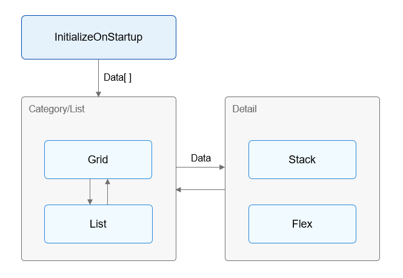

# Introduction

This guide aims to build a diet application that allows you to view nutritional information about food. The details are as follows:

1.  **Food Detail**:  [Build a food basic information page](ui-ts-creating-simple-page.md).
2.  **Food Category/List**:  [Build food list and category pages](ui-ts-building-data-model.md).

You will be able to design and develop applications on your own after learning about components, layouts, animations, and data state management from project creation and common view construction. Development has never so easy.

