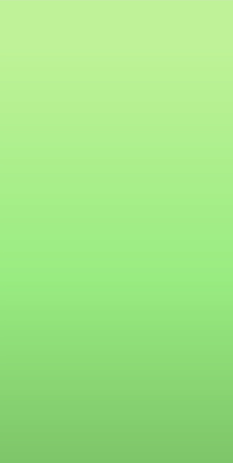
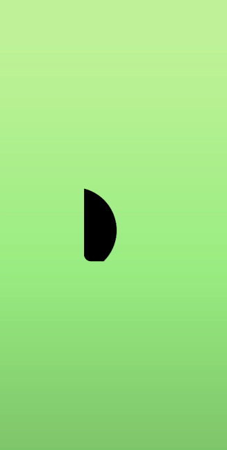
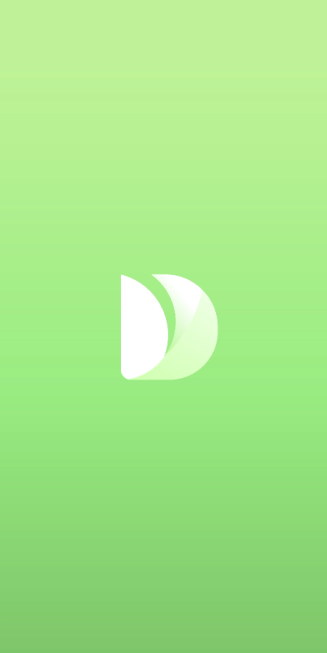
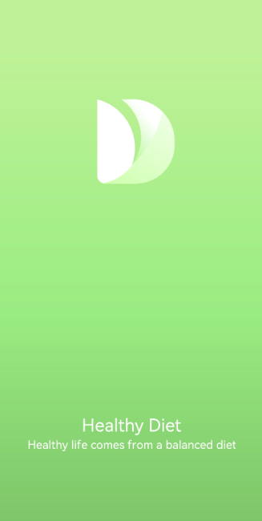

# Using the Drawing Feature

The drawing feature is provided by the drawing component in the framework, with support for the SVG standard drawing commands.

This section describes how to use the drawing component to draw food composition labels (basic geometric shapes) and apply logos (custom graphics) on the details page.

## Drawing Basic Geometric Shapes

The drawing component encapsulates some common basic geometric shapes, such as rectangles, circles, and ellipses, eliminating the need to calculate routes.

In the food component table on the **FoodDetail** page, each food group is labeled with a round icon.

1. Create a **Circle** component and add a round icon before each food group as a label. Set the circle diameter to 6vp. Modify the **IngredientItem** method in the **ContentTable** component on the **FoodDetail** page by adding **Circle** before the food group name.

   ```ts
   // FoodDetail.ets
   @Component
   struct ContentTable {
     private foodItem: FoodData
   
     @Builder IngredientItem(title:string, colorValue: string, name: string, value: string) {
       Flex() {
         Text(title)
           .fontSize(17.4)
           .fontWeight(FontWeight.Bold)
           .layoutWeight(1)
         Flex({ alignItems: ItemAlign.Center }) {
           Circle({width: 6, height: 6})
             .margin({right: 12})
             .fill(colorValue)
           Text(name)
             .fontSize(17.4)
             .flexGrow(1)
           Text(value)
             .fontSize(17.4)
         }
         .layoutWeight(2)
       }
     }
   
     build() {
       ......
     }
   }
   ```

2. To use different label colors for different food groups, call **IngredientItem** in the **build** method to fill the circles with different colors.

   ```ts
   // FoodDetail.ets
   @Component
   struct ContentTable {
     private foodItem: FoodData
   
     @Builder IngredientItem(title:string, colorValue: string, name: string, value: string) {
       Flex() {
         Text(title)
           .fontSize(17.4)
           .fontWeight(FontWeight.Bold)
           .layoutWeight(1)
         Flex({ alignItems: ItemAlign.Center }) {
           Circle({width: 6, height: 6})
             .margin({right: 12})
             .fill(colorValue)
           Text(name)
             .fontSize(17.4)
             .flexGrow(1)
           Text(value)
             .fontSize(17.4)
         }
         .layoutWeight(2)
       }
     }
   
     build() {
       Flex({ direction: FlexDirection.Column, justifyContent: FlexAlign.SpaceBetween, alignItems: ItemAlign.Start }) {
         this.IngredientItem('Calories', '#FFf54040', 'Calories', this.foodItem.calories + 'kcal')
         this.IngredientItem('Nutrition', '#FFcccccc', 'Protein', this.foodItem.protein + 'g')
         this.IngredientItem(' ', '#FFf5d640', 'Fat', this.foodItem.fat + 'g')
         this.IngredientItem(' ', '#FF9e9eff', 'Carbohydrates', this.foodItem.carbohydrates + 'g')
         this.IngredientItem(' ', '#FF53f540', 'VitaminC', this.foodItem.vitaminC + 'mg')
       }
       .height(280)
       .padding({ top: 30, right: 30, left: 30 })
     }
   }
   ```

   

## Drawing Custom Graphs

In addition to drawing basic geometric shapes, you can also use the **\<Path>** component to draw a custom path. The following describes how to draw an application logo.

1. Create a page **Logo.ets** in the **pages** folder.

   

2. Delete the template code from **Logo.ets** and create a logo component.

   ```ts
   @Entry
   @Component
   struct Logo {
     build() {
     }
   }
   ```
   
3. Create a **\<Flex>** component as the root node, set the width and height to 100%, set the alignment mode on the main axis and cross axis to **Center**, and create a **\<Shape>** component as a child component of **\<Flex>**.

   The **\<Shape>** component is the parent component of all drawing components. To combine multiple drawing components into a whole, create a **\<Shape>** as their parent component.

   Draw a logo with the size of 630 px x 630 px. The declarative development paradigm supports multiple length units. In the preceding sections, **number** is used as a parameter, which means that the default length unit – virtual pixel (vp) is used. The virtual pixel count is related to the device resolution and screen density. For example, if the device resolution is 1176 x 2400 and the reference screen resolution is 3, with the formula of vp = px/resolution, the width of the device screen is 392 vp.

   The drawing components follow the SVG standard and use px as the unit by default. Therefore, to facilitate consistency, px is also used as the unit of the logo. The declarative development framework also supports the px unit, with the input parameter of the string type. For example, to set the width to 630px (210vp), use **width('*630px*')** or **width(*210*)**.

   ```ts
   @Entry
   @Component
   struct Logo {
     build() {
       Flex({ alignItems: ItemAlign.Center, justifyContent: FlexAlign.Center }) {
         Shape() {
   
         }
         .height('630px')
         .width('630px')
       }
       .width('100%')
       .height('100%')
     }
   }
   ```

4. Fill the page with gradient colors. Set the gradient mode to linear gradient, the offset angle to 180 degrees, and the color stops to #BDE895 -> 95DE7F -> #7AB967 in the ranges of [0, 0.1], (0.1, 0.6], and (0.6, 1], respectively.

   ```ts
   .linearGradient(
     {
       angle: 180,
       colors: [['#BDE895', 0.1], ["#95DE7F", 0.6],  ["#7AB967", 1]]
   })
   ```

   

   ```ts
   @Entry
   @Component
   struct Logo {
     build() {
       Flex({ alignItems: ItemAlign.Center, justifyContent: FlexAlign.Center }) {
         Shape() {
   
         }
         .height('630px')
         .width('630px')
       }
       .width('100%')
       .height('100%')
       .linearGradient(
       {
         angle: 180,
         colors: [['#BDE895', 0.1], ["#95DE7F", 0.6],  ["#7AB967", 1]]
       })
     }
   }
   ```

   

5. Set the drawing command to draw the first path.

   ```ts
   Path()
     .commands('M162 128.7 a222 222 0 0 1 100.8 374.4 H198 a36 36 0 0 3 -36 -36')
   ```

   The **Path** drawing commands comply with the SVG standard. The preceding command can be divided into the following:

   ```ts
   M162 128.7
   ```

   Start a new subpath at point (162, 128.7).

   ```ts
   a222 222 0 0 1 100.8 374.4
   ```

   Draw an elliptical arc, setting **rx** and **ry** to **222**, **x-axis-rotation** to **0**, **large-arc-flag** to **0**, and **sweep-flag** to **1** (which means to draw the arc counterclockwise). The lowercase **a** indicates a relative position. In this example, the end point coordinate is (162 + 100.8 = 262.8, 128.7 + 374.4 = 503.1).

   ```ts
   H198
   ```

   Draw a horizontal line from point (262.8, 503.1) to point (198, 503.1).

   ```ts
   a36 36 0 0 3 -36 -36
   ```

   Draw a circular arc. The input parameters are the same as those in drawing an elliptical arc. The end point is (198 - 36 = 162, 503.1 - 36 = 467.1).

   ```ts
   V128.7
   ```

   Draw a vertical line from point (162, 467.1) to point (162, 128.7).

   ```ts
   z
   ```

   Close the current subpath.

   

   In the sample code, the fill color is white.

   ```ts
   .fill(Color.White)
   ```

   ```ts
   @Entry
   @Component
   struct Logo {
     build() {
       Flex({ alignItems: ItemAlign.Center, justifyContent: FlexAlign.Center }) {
         Shape() {
           Path()
             .commands('M162 128.7 a222 222 0 0 1 100.8 374.4 H198 a36 36 0 0 3 -36 -36')
             .fill(Color.White)
         }
         .height('630px')
         .width('630px')
       }
       .width('100%')
       .height('100%')
       .linearGradient(
         {
           angle: 180,
           colors: [['#BDE895', 0.1], ["#95DE7F", 0.6],  ["#7AB967", 1]]
         })
     }
   }
   ```

   

6. Draw the second path. Fill the shape background with gradient colors. Because the gradient colors fill the entire box, you must use the **clip** method with the **Shape** as the input parameter so that the path is clipped.

   ```ts
   Path()
     .commands('M319.5 128.1 c103.5 0 187.5 84 187.5 187.5 v15 a172.5 172.5 0 0 3 -172.5 172.5 H198 a36 36 0 0 3 -13.8 -1 207 207 0 0 0 87 -372 h48.3 z')
     .fill('none')
     .linearGradient(
     {
       angle: 30,
       colors: [["#C4FFA0", 0],  ["#ffffff", 1]]
     })
     .clip(new Path().commands('M319.5 128.1 c103.5 0 187.5 84 187.5 187.5 v15 a172.5 172.5 0 0 3 -172.5 172.5 H198 a36 36 0 0 3 -13.8 -1 207 207 0 0 0 87 -372 h48.3 z'))
   ```

   The path drawing command is long. You can call the command by using it as a member variable of the component through **this**.

   ```ts
   @Entry
   @Component
   struct Logo {
     private pathCommands1:string = 'M319.5 128.1 c103.5 0 187.5 84 187.5 187.5 v15 a172.5 172.5 0 0 3 -172.5 172.5 H198 a36 36 0 0 3 -13.8 -1 207 207 0 0 0 87 -372 h48.3 z'
     build() {
       ......
           Path()
             .commands(this.pathCommands1)
             .fill('none')
             .linearGradient(
             {
               angle: 30,
               colors: [["#C4FFA0", 0],  ["#ffffff", 1]]
             })
             .clip(new Path().commands(this.pathCommands1))
        ......
     }
   }
   ```

   

7. Draw the third path.

   ```ts
   @Entry
   @Component
   struct Logo {
     private pathCommands1:string = 'M319.5 128.1 c103.5 0 187.5 84 187.5 187.5 v15 a172.5 172.5 0 0 3 -172.5 172.5 H198 a36 36 0 0 3 -13.8 -1 207 207 0 0 0 87 -372 h48.3 z'
     private pathCommands2:string = 'M270.6 128.1 h48.6 c51.6 0 98.4 21 132.3 54.6 a411 411 0 0 3 -45.6 123 c-25.2 45.6 -56.4 84 -87.6 110.4 a206.1 206.1 0 0 0 -47.7 -288 z'
     build() {
       Flex({ alignItems: ItemAlign.Center, justifyContent: FlexAlign.Center }) {
         Shape() {
           Path()
             .commands('M162 128.7 a222 222 0 0 1 100.8 374.4 H198 a36 36 0 0 3 -36 -36')
             .fill(Color.White)
   
           Path()
             .commands(this.pathCommands1)
             .fill('none')
             .linearGradient(
             {
               angle: 30,
               colors: [["#C4FFA0", 0],  ["#ffffff", 1]]
             })
             .clip(new Path().commands(this.pathCommands1))
   
           Path()
             .commands(this.pathCommands2)
             .fill('none')
             .linearGradient(
             {
               angle: 50,
               colors: [['#8CC36A', 0.1], ["#B3EB90", 0.4],  ["#ffffff", 0.7]]
             })
             .clip(new Path().commands(this.pathCommands2))
         }
         .height('630px')
         .width('630px')
       }
       .width('100%')
       .height('100%')
       .linearGradient(
         {
           angle: 180,
           colors: [['#BDE895', 0.1], ["#95DE7F", 0.6],  ["#7AB967", 1]]
         })
     }
   }
   ```

   

   The drawing of the application logo is now completed. This logo combines three **\<Path>** components through SVG commands and takes the shape of an artistic leaf.

8. Add the application title and slogan.

   ```ts
   @Entry
   @Component
   struct Logo {
     private pathCommands1:string = 'M319.5 128.1 c103.5 0 187.5 84 187.5 187.5 v15 a172.5 172.5 0 0 3 -172.5 172.5 H198 a36 36 0 0 3 -13.8 -1 207 207 0 0 0 87 -372 h48.3 z'
     private pathCommands2:string = 'M270.6 128.1 h48.6 c51.6 0 98.4 21 132.3 54.6 a411 411 0 0 3 -45.6 123 c-25.2 45.6 -56.4 84 -87.6 110.4 a206.1 206.1 0 0 0 -47.7 -288 z'
     build() {
       Flex({ direction: FlexDirection.Column, alignItems: ItemAlign.Center, justifyContent: FlexAlign.Center }) {
         Shape() {
           Path()
             .commands('M162 128.7 a222 222 0 0 1 100.8 374.4 H198 a36 36 0 0 3 -36 -36')
             .fill(Color.White)
   
           Path()
             .commands(this.pathCommands1)
             .fill('none')
             .linearGradient(
             {
               angle: 30,
               colors: [["#C4FFA0", 0],  ["#ffffff", 1]]
             })
             .clip(new Path().commands(this.pathCommands1))
   
           Path()
             .commands(this.pathCommands2)
             .fill('none')
             .linearGradient(
             {
               angle: 50,
               colors: [['#8CC36A', 0.1], ["#B3EB90", 0.4],  ["#ffffff", 0.7]]
             })
             .clip(new Path().commands(this.pathCommands2))
         }
         .height('630px')
         .width('630px')
   
         Text('Healthy Diet')
           .fontSize(26)
           .fontColor(Color.White)
           .margin({ top:300 })
   
         Text('Healthy life comes from a balanced diet')
           .fontSize(17)
           .fontColor(Color.White)
           .margin({ top:4 })
       }
       .width('100%')
       .height('100%')
       .linearGradient(
         {
           angle: 180,
           colors: [['#BDE895', 0.1], ["#95DE7F", 0.6],  ["#7AB967", 1]]
         })
     }
   }
   ```

   
