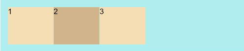
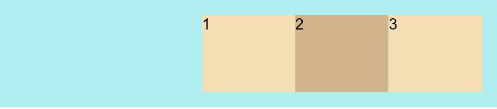
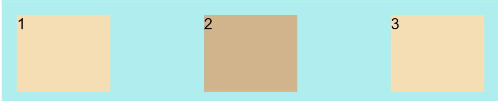
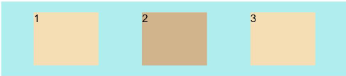
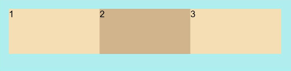

# Flex Layout


The **\<Flex>** component is used to create a flex layout. In a flex container created using the **Flex** API, child components can be laid out flexibly. For example, if there are three child components in a flex container, they can be horizontally centered and vertically equally spaced.


## Creating a Flex Layout

The available API is as follows:

Flex(options?: { direction?: FlexDirection, wrap?: FlexWrap,  justifyContent?: FlexAlign, alignItems?: ItemAlign, alignContent?: FlexAlign })
The **direction** parameter defines the flex layout direction. The **justifyContent** parameter defines the alignment mode of child components in the flex layout direction. The **alignContent** parameter defines the alignment mode of child components in the vertical direction. The **wrap** parameter defines whether the content can wrap onto multiple lines.

## Flex Layout Direction

The flex layout has two directions, following two axes. The main axis is the axis along which the child components follow each other. The cross axis is the axis perpendicular to the main axis. The **direction** parameter establishes the main axis. The available options are as follows:

- **FlexDirection.Row** (default value): The main axis runs along the row horizontally, and the child components start from the start edge of the main axis.
  
  ```
  Flex({ direction: FlexDirection.Row }) {
    Text('1').width('33%').height(50).backgroundColor(0xF5DEB3)
    Text('2').width('33%').height(50).backgroundColor(0xD2B48C)
    Text('3').width('33%').height(50).backgroundColor(0xF5DEB3)
  }
  .height(70)
  .width('90%')
  .padding(10)
  .backgroundColor(0xAFEEEE)
  ```

  

- **FlexDirection.RowReverse**: The main axis runs along the row horizontally, and the child components start from the end edge of the main axis, in a direction opposite to **FlexDirection.Row**.
  
  ```
  Flex({ direction: FlexDirection.RowReverse }) {
    Text('1').width('33%').height(50).backgroundColor(0xF5DEB3)
    Text('2').width('33%').height(50).backgroundColor(0xD2B48C)
    Text('3').width('33%').height(50).backgroundColor(0xF5DEB3)
  }
  .height(70)
  .width('90%')
  .padding(10)
  .backgroundColor(0xAFEEEE)
  ```

  

- **FlexDirection.Column**: The main axis runs along the column vertically, and the child components start from the start edge of the main axis.
  
  ```
  Flex({ direction: FlexDirection.Column }) {
    Text('1').width('100%').height(50).backgroundColor(0xF5DEB3)
    Text('2').width('100%').height(50).backgroundColor(0xD2B48C)
    Text('3').width('100%').height(50).backgroundColor(0xF5DEB3)
  }
  .height(70)
  .width('90%')
  .padding(10)
  .backgroundColor(0xAFEEEE)
  ```

  

- **FlexDirection.ColumnReverse**: The main axis runs along the column vertically, and the child components start from the end edge of the main axis, in a direction opposite to **FlexDirection.Column**.
  
  ```
  Flex({ direction: FlexDirection.ColumnReverse }) {
    Text('1').width('100%').height(50).backgroundColor(0xF5DEB3)
    Text('2').width('100%').height(50).backgroundColor(0xD2B48C)
    Text('3').width('100%').height(50).backgroundColor(0xF5DEB3)
  }
  .height(70)
  .width('90%')
  .padding(10)
  .backgroundColor(0xAFEEEE)
  ```

  


## Wrapping in the Flex Layout

By default, child components are laid out on a single line (also called an axis) in the flex container. Use the **wrap** parameter to set whether child components can wrap onto multiple lines. The available options are as follows:

- **FlexWrap.NoWrap**: Child components are laid out on a single line. This may cause the child components to shrink to fit the container when the total width of the child components is greater than the width of the container.
  
  ```
  Flex({ wrap: FlexWrap.NoWrap }) {
    Text('1').width('50%').height(50).backgroundColor(0xF5DEB3)
    Text('2').width('50%').height(50).backgroundColor(0xD2B48C)
    Text('3').width('50%').height(50).backgroundColor(0xF5DEB3)
  } 
  .width('90%')
  .padding(10)
  .backgroundColor(0xAFEEEE)
  ```

  

- **FlexWrap.Wrap**: Child components can break into multiple lines.
  
  ```
  Flex({ wrap: FlexWrap.Wrap }) {
    Text('1').width('50%').height(50).backgroundColor(0xF5DEB3)
    Text('2').width('50%').height(50).backgroundColor(0xD2B48C)
    Text('3').width('50%').height(50).backgroundColor(0xD2B48C)
  } 
  .width('90%')
  .padding(10)
  .backgroundColor(0xAFEEEE)
  ```

  

- **FlexWrap.WrapReverse**: Child components can break into multiple lines in the reverse order to the row.
  
  ```
  Flex({ wrap: FlexWrap.WrapReverse}) {
    Text('1').width('50%').height(50).backgroundColor(0xF5DEB3)
    Text('2').width('50%').height(50).backgroundColor(0xD2B48C)
    Text('3').width('50%').height(50).backgroundColor(0xF5DEB3)
  }
  .width('90%')
  .padding(10)
  .backgroundColor(0xAFEEEE)
  ```

  


## Alignment in the Flex Layout


### Alignment on the Main Axis

Use the **justifyContent** parameter to set alignment of items on the main axis. The available options are as follows:

- **FlexAlign.Start**: The items are aligned with each other toward the start edge of the container along the main axis.
  
  ```
  Flex({ justifyContent: FlexAlign.Start }) {  
    Text('1').width('20%').height(50).backgroundColor(0xF5DEB3)  
    Text('2').width('20%').height(50).backgroundColor(0xD2B48C)   
    Text('3').width('20%').height(50).backgroundColor(0xF5DEB3)
  }
  .width('90%')
  .padding(10)
  .backgroundColor(0xAFEEEE)
  ```

  

- **FlexAlign.Center**: The items are aligned with each other toward the center of the container along the main axis. The space between the first component and the main-start is the same as that between the last component and the main-end.
  
  ```
  Flex({ justifyContent: FlexAlign.Center }) {  
    Text('1').width('20%').height(50).backgroundColor(0xF5DEB3)  
    Text('2').width('20%').height(50).backgroundColor(0xD2B48C)   
    Text('3').width('20%').height(50).backgroundColor(0xF5DEB3)
  }
  .width('90%')
  .padding(10)
  .backgroundColor(0xAFEEEE)
  ```

  

- **FlexAlign.End**: The items are aligned with each other toward the end edge of the container along the main axis.
  
  ```
  Flex({ justifyContent: FlexAlign.End }) {  
    Text('1').width('20%').height(50).backgroundColor(0xF5DEB3)  
    Text('2').width('20%').height(50).backgroundColor(0xD2B48C)   
    Text('3').width('20%').height(50).backgroundColor(0xF5DEB3)
  }
  .width('90%')
  .padding(10)
  .backgroundColor(0xAFEEEE)
  ```

  

- **FlexAlign.SpaceBetween**: The items are evenly distributed within the container along the main axis. The first item is aligned with the main-start, the last item is aligned with the main-end, and the remaining items are distributed so that the space between any two adjacent items is the same.
  
  ```
  Flex({ justifyContent: FlexAlign.SpaceBetween }) {  
    Text('1').width('20%').height(50).backgroundColor(0xF5DEB3)  
    Text('2').width('20%').height(50).backgroundColor(0xD2B48C)   
    Text('3').width('20%').height(50).backgroundColor(0xF5DEB3)
  }
  .width('90%')
  .padding(10)
  .backgroundColor(0xAFEEEE)
  ```

  

- **FlexAlign.SpaceAround**: The items are evenly distributed within the container along the main axis. The space between the first item and main-start, and that between the last item and cross-main are both half the size of the space between two adjacent items.
  
  ```
  Flex({ justifyContent: FlexAlign.SpaceAround }) {  
    Text('1').width('20%').height(50).backgroundColor(0xF5DEB3)  
    Text('2').width('20%').height(50).backgroundColor(0xD2B48C)   
    Text('3').width('20%').height(50).backgroundColor(0xF5DEB3)
  }
  .width('90%')
  .padding(10)
  .backgroundColor(0xAFEEEE)
  ```

  

- **FlexAlign.SpaceEvenly**: The items are equally distributed along the main axis. The space between the first item and main-start, the space between the last item and main-end, and the space between two adjacent items are the same.
  
  ```
  Flex({ justifyContent: FlexAlign.SpaceEvenly }) {  
    Text('1').width('20%').height(50).backgroundColor(0xF5DEB3)  
    Text('2').width('20%').height(50).backgroundColor(0xD2B48C)   
    Text('3').width('20%').height(50).backgroundColor(0xF5DEB3)
  }
  .width('90%')
  .padding(10)
  .backgroundColor(0xAFEEEE)
  ```

  


### Alignment on the Cross Axis

Use the **alignItems** parameter to set alignment of items on the cross axis. The available options are as follows:

- **ItemAlign.Auto**: The items are automatically aligned in the flex container.
  
  ```
  Flex({ alignItems: ItemAlign.Auto }) {  
    Text('1').width('33%').height(30).backgroundColor(0xF5DEB3)  
    Text('2').width('33%').height(40).backgroundColor(0xD2B48C)  
    Text('3').width('33%').height(50).backgroundColor(0xF5DEB3)
  }
  .size({width: '90%', height: 80})
  .padding(10)
  .backgroundColor(0xAFEEEE)
  ```

  

- **ItemAlign.Start**: The items are aligned with the start edge of the container along the cross axis.
  
  ```
  Flex({ alignItems: ItemAlign.Start }) {  
    Text('1').width('33%').height(30).backgroundColor(0xF5DEB3)  
    Text('2').width('33%').height(40).backgroundColor(0xD2B48C)  
    Text('3').width('33%').height(50).backgroundColor(0xF5DEB3)
  }
  .size({width: '90%', height: 80})
  .padding(10)
  .backgroundColor(0xAFEEEE)
  ```

  

- **ItemAlign.Start**: The items are aligned with the center of the container along the cross axis.
  
  ```
  Flex({ alignItems: ItemAlign.Center }) {  
    Text('1').width('33%').height(30).backgroundColor(0xF5DEB3)  
    Text('2').width('33%').height(40).backgroundColor(0xD2B48C)  
    Text('3').width('33%').height(50).backgroundColor(0xF5DEB3)
  }
  .size({width: '90%', height: 80})
  .padding(10)
  .backgroundColor(0xAFEEEE)
  ```

  

- **ItemAlign.End**: The items are aligned with the end edge of the container along the cross axis.
  
  ```
  Flex({ alignItems: ItemAlign.End }) {  
    Text('1').width('33%').height(30).backgroundColor(0xF5DEB3)  
    Text('2').width('33%').height(40).backgroundColor(0xD2B48C)  
    Text('3').width('33%').height(50).backgroundColor(0xF5DEB3)
  }
  .size({width: '90%', height: 80})
  .padding(10)
  .backgroundColor(0xAFEEEE)
  ```

  

- **ItemAlign.Stretch**: The items are stretched along the cross axis. If no constraints are set, the items are stretched to fill the size of the container on the cross axis.
  
  ```
  Flex({ alignItems: ItemAlign.Stretch }) {  
    Text('1').width('33%').height(30).backgroundColor(0xF5DEB3)  
    Text('2').width('33%').height(40).backgroundColor(0xD2B48C)  
    Text('3').width('33%').height(50).backgroundColor(0xF5DEB3)
  }
  .size({width: '90%', height: 80})
  .padding(10)
  .backgroundColor(0xAFEEEE)
  ```

  

- **ItemAlign.Baseline**: The items are aligned at the baseline of the cross axis.
  
  ```
  Flex({ alignItems: ItemAlign.Baseline }) {  
    Text('1').width('33%').height(30).backgroundColor(0xF5DEB3)  
    Text('2').width('33%').height(40).backgroundColor(0xD2B48C)  
    Text('3').width('33%').height(50).backgroundColor(0xF5DEB3)
  }
  .size({width: '90%', height: 80})
  .padding(10)
  .backgroundColor(0xAFEEEE)
  ```

  


### Content Alignment

Use the **alignContent** parameter to set how content items are aligned within the flex container along the cross axis.

- **FlexAlign.Start**: The items are packed to the start of the container.

- **FlexAlign.Center**: The items are packed to the center of the container.

- **FlexAlign.End**: The items are packed to the end of the container.

- **FlexAlign.SpaceBetween**: The items are evenly distributed; the first item is aligned with the main-start while the last one is aligned with the main-end.

- **FlexAlign.SpaceAround**: The items are evenly distributed, with the space between the item and the main-start and between the item and the main-end equals half of the space between adjacent items.

- **FlexAlign.SpaceEvenly**: The items are evenly distributed, with the space between the item and the main-start and between the item and the main-end equals the space between adjacent items.


## Example Scenario

In this example, a flex layout is designed to achieve the following effects: The child components are laid out horizontally on a single line, even when the total width of the child components exceeds the width of the container; the child components are horizontally aligned at both ends and vertically aligned toward the center of the container; the space is evenly divided by the child components except for the start and end ones.

```
@Entry
@Component
struct FlexExample {
  build() {
    Column() {
      Column({ space: 5 }) {
        Flex({ direction: FlexDirection.Row, wrap: FlexWrap.NoWrap, justifyContent: FlexAlign.SpaceBetween, alignItems: ItemAlign.Center }) {
          Text('1').width('30%').height(50).backgroundColor(0xF5DEB3)
          Text('2').width('30%').height(50).backgroundColor(0xD2B48C)
          Text('3').width('30%').height(50).backgroundColor(0xF5DEB3)
        }
        .height(70)
        .width('90%')
        .padding(10)
        .backgroundColor(0xAFEEEE)
      }.width('100%').margin({ top: 5 })
    }.width('100%') 
 }
}
```


