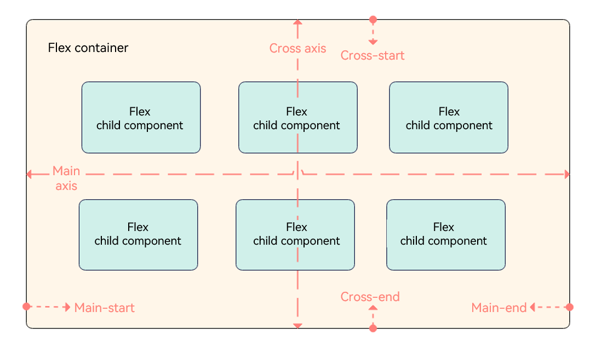
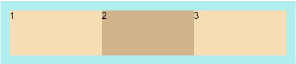
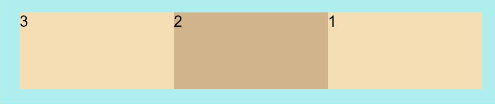
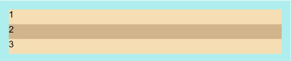
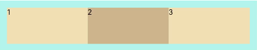
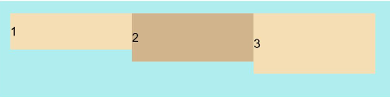
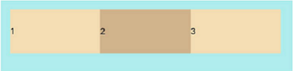
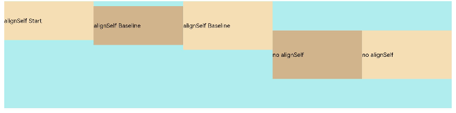
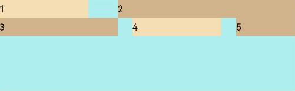
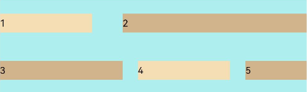

# Flex Layout

The flex layout is the most flexible layout used in adaptive layout. It provides simple and powerful tools for distributing space and aligning items.  


- Container: [\<Flex>](../reference/arkui-ts/ts-container-flex.md) component, used to set layout attributes.
- Child component: any of the child items in the **\<Flex>** component.
- Main axis: axis along which items are placed in the **\<Flex>** component. Child components are laid out along the main axis by default. The start point of the main axis is referred to as main-start, and the end point is referred to as main-end.
- Cross axis: axis that runs perpendicular to the main axis. The start point of the cross axis is referred to as cross-start, and the end point is referred to as cross-end.

The following uses **FlexDirection.Row** as an example.



## Container Attributes

Create a flex layout through the **Flex** API provided by the **\<Flex>** component. The sample code is as follows:

`Flex(options?: { direction?: FlexDirection, wrap?: FlexWrap,  justifyContent?: FlexAlign, alignItems?: ItemAlign, alignContent?: FlexAlign })`


### Flex Layout Direction
The **direction** parameter sets the direction in which items are laid out in the **\<Flex>** component and thereby defines the main axis. Available values are as follows:


- **FlexDirection.Row** (default value): The main axis runs along the row horizontally, and the child components are laid out from the start edge of the main axis.

    ```ts
    Flex({ direction: FlexDirection.Row }) {
      Text('1').width('33%').height(50).backgroundColor(0xF5DEB3)
      Text('2').width('33%').height(50).backgroundColor(0xD2B48C)
      Text('3').width('33%').height(50).backgroundColor(0xF5DEB3)
    }
    .height(70)
    .width('90%')
    .padding(10)
    .backgroundColor(0xAFEEEE)
    ```
    

- **FlexDirection.RowReverse**: The main axis runs along the row horizontally, and the child components are laid out from the end edge of the main axis, in a direction opposite to **FlexDirection.Row**.

    ```ts
    Flex({ direction: FlexDirection.RowReverse }) {
      Text('1').width('33%').height(50).backgroundColor(0xF5DEB3)
      Text('2').width('33%').height(50).backgroundColor(0xD2B48C)
      Text('3').width('33%').height(50).backgroundColor(0xF5DEB3)
    }
    .height(70)
    .width('90%')
    .padding(10)
    .backgroundColor(0xAFEEEE)
    ```

    

- **FlexDirection.Column**: The main axis runs along the column vertically, and the child components are laid out from the start edge of the main axis.

    ```ts
    Flex({ direction: FlexDirection.Column }) {
      Text('1').width('100%').height(50).backgroundColor(0xF5DEB3)
      Text('2').width('100%').height(50).backgroundColor(0xD2B48C)
      Text('3').width('100%').height(50).backgroundColor(0xF5DEB3)
    }
    .height(70)
    .width('90%')
    .padding(10)
    .backgroundColor(0xAFEEEE)
    ```

    

- **FlexDirection.ColumnReverse**: The main axis runs along the column vertically, and the child components are laid out from the end edge of the main axis, in a direction opposite to **FlexDirection.Column**.

    ```ts
    Flex({ direction: FlexDirection.ColumnReverse }) {
      Text('1').width('100%').height(50).backgroundColor(0xF5DEB3)
      Text('2').width('100%').height(50).backgroundColor(0xD2B48C)
      Text('3').width('100%').height(50).backgroundColor(0xF5DEB3)
    }
    .height(70)
    .width('90%')
    .padding(10)
    .backgroundColor(0xAFEEEE)
    ```

    

### Wrapping in the Flex Layout

By default, child components are laid out on a single line (also called an axis) in the flex container. You can use the **wrap** parameter to set whether child components can wrap onto multiple lines. Available values are as follows:

- **FlexWrap.NoWrap** (default value): Child components are laid out on a single line. This may cause the child components to shrink to fit the container when the total width of the child components is greater than the width of the container.

    ```ts
    Flex({ wrap: FlexWrap.NoWrap }) {
      Text('1').width('50%').height(50).backgroundColor(0xF5DEB3)
      Text('2').width('50%').height(50).backgroundColor(0xD2B48C)
      Text('3').width('50%').height(50).backgroundColor(0xF5DEB3)
    } 
    .width('90%')
    .padding(10)
    .backgroundColor(0xAFEEEE)
    ```
    
    

- **FlexWrap.Wrap**: Child components can break into multiple lines along the main axis.

    ```ts
    Flex({ wrap: FlexWrap.Wrap }) {
      Text('1').width('50%').height(50).backgroundColor(0xF5DEB3)
      Text('2').width('50%').height(50).backgroundColor(0xD2B48C)
      Text('3').width('50%').height(50).backgroundColor(0xD2B48C)
    } 
    .width('90%')
    .padding(10)
    .backgroundColor(0xAFEEEE)
    ```
    
    

- **FlexWrap.WrapReverse**: Child components can break into multiple lines in the reverse direction to the main axis.

    ```ts
    Flex({ wrap: FlexWrap.WrapReverse}) {
      Text('1').width('50%').height(50).backgroundColor(0xF5DEB3)
      Text('2').width('50%').height(50).backgroundColor(0xD2B48C)
      Text('3').width('50%').height(50).backgroundColor(0xF5DEB3)
    }
    .width('90%')
    .padding(10)
    .backgroundColor(0xAFEEEE)
    ```
    
    

### Alignment in the Flex Layout

#### Alignment on the Main Axis

Use the **justifyContent** parameter to set alignment of items on the main axis. The available options are as follows:


- **FlexAlign.Start** (default value): The items are aligned with each other toward the start edge of the container along the main axis.

    ```ts
    Flex({ justifyContent: FlexAlign.Start }) {  
      Text('1').width('20%').height(50).backgroundColor(0xF5DEB3)
      Text('2').width('20%').height(50).backgroundColor(0xD2B48C)    
      Text('3').width('20%').height(50).backgroundColor(0xF5DEB3)
    }
    .width('90%')
    .padding({ top: 10, bottom: 10 })
    .backgroundColor(0xAFEEEE)
    ```
    
    

- **FlexAlign.Center**: The items are aligned with each other toward the center of the container along the main axis.

    ```ts
    Flex({ justifyContent: FlexAlign.Center }) {  
      Text('1').width('20%').height(50).backgroundColor(0xF5DEB3)  
      Text('2').width('20%').height(50).backgroundColor(0xD2B48C)   
      Text('3').width('20%').height(50).backgroundColor(0xF5DEB3)
    }
    .width('90%')
    .padding({ top: 10, bottom: 10 })
    .backgroundColor(0xAFEEEE)
    ```
    
    

- **FlexAlign.End**: The items are aligned with each other toward the end edge of the container along the main axis.

    ```ts
    Flex({ justifyContent: FlexAlign.End }) {  
      Text('1').width('20%').height(50).backgroundColor(0xF5DEB3)  
      Text('2').width('20%').height(50).backgroundColor(0xD2B48C)   
      Text('3').width('20%').height(50).backgroundColor(0xF5DEB3)
    }
    .width('90%')
    .padding({ top: 10, bottom: 10 })
    .backgroundColor(0xAFEEEE)
    ```
    
    

- **FlexAlign.SpaceBetween**: The items are evenly distributed within the container along the main axis. The first and last items are aligned with the edges of the container.

    ```ts
    Flex({ justifyContent: FlexAlign.SpaceBetween }) {  
      Text('1').width('20%').height(50).backgroundColor(0xF5DEB3)  
      Text('2').width('20%').height(50).backgroundColor(0xD2B48C)   
      Text('3').width('20%').height(50).backgroundColor(0xF5DEB3)
    }
    .width('90%')
    .padding({ top: 10, bottom: 10 })
    .backgroundColor(0xAFEEEE)
    ```
    
    

- **FlexAlign.SpaceAround**: The items are evenly distributed in the container along the main axis. The space between the first item and main-start, and that between the last item and main-end are both half of the space between two adjacent items.

    ```ts
    Flex({ justifyContent: FlexAlign.SpaceAround }) {  
      Text('1').width('20%').height(50).backgroundColor(0xF5DEB3)  
      Text('2').width('20%').height(50).backgroundColor(0xD2B48C)   
      Text('3').width('20%').height(50).backgroundColor(0xF5DEB3)
    }
    .width('90%')
    .padding({ top: 10, bottom: 10 })
    .backgroundColor(0xAFEEEE)
    ```
    
    

- **FlexAlign.SpaceEvenly**: The items are equally distributed along the main axis. The space between the first item and main-start, the space between the last item and main-end, and the space between two adjacent items are the same.

    ```ts
    Flex({ justifyContent: FlexAlign.SpaceEvenly }) {  
      Text('1').width('20%').height(50).backgroundColor(0xF5DEB3)  
      Text('2').width('20%').height(50).backgroundColor(0xD2B48C)   
      Text('3').width('20%').height(50).backgroundColor(0xF5DEB3)
    }
    .width('90%')
    .padding({ top: 10, bottom: 10 })
    .backgroundColor(0xAFEEEE)
    ```
    
    

#### Alignment on the Cross Axis

Alignment on the cross axis can be set for both the container and child components, with that set for child components having a higher priority.

##### Setting Alignment on the Cross Axis for the Container
Use the **alignItems** parameter of the **\<Flex>** component to set alignment of items on the cross axis. The available options are as follows:

- **ItemAlign.Auto**: The items are automatically aligned in the flex container.

    ```ts
    Flex({ alignItems: ItemAlign.Auto }) {  
      Text('1').width('33%').height(30).backgroundColor(0xF5DEB3)  
      Text('2').width('33%').height(40).backgroundColor(0xD2B48C)  
      Text('3').width('33%').height(50).backgroundColor(0xF5DEB3)
    }
    .size({width: '90%', height: 80})
    .padding(10)
    .backgroundColor(0xAFEEEE)
    ```

    

- **ItemAlign.Start**: The items are aligned with the start edge of the container along the cross axis.

    ```ts
    Flex({ alignItems: ItemAlign.Start }) {  
      Text('1').width('33%').height(30).backgroundColor(0xF5DEB3)  
      Text('2').width('33%').height(40).backgroundColor(0xD2B48C)  
      Text('3').width('33%').height(50).backgroundColor(0xF5DEB3)
    }
    .size({width: '90%', height: 80})
    .padding(10)
    .backgroundColor(0xAFEEEE)
    ```
    
    

- **ItemAlign.Start**: The items are aligned with the center of the container along the cross axis.

    ```ts
    Flex({ alignItems: ItemAlign.Center }) {  
      Text('1').width('33%').height(30).backgroundColor(0xF5DEB3)  
      Text('2').width('33%').height(40).backgroundColor(0xD2B48C)  
      Text('3').width('33%').height(50).backgroundColor(0xF5DEB3)
    }
    .size({width: '90%', height: 80})
    .padding(10)
    .backgroundColor(0xAFEEEE)
    ```
    
    

- **ItemAlign.End**: The items are aligned with the end edge of the container along the cross axis.

    ```ts
    Flex({ alignItems: ItemAlign.End }) {  
      Text('1').width('33%').height(30).backgroundColor(0xF5DEB3)  
      Text('2').width('33%').height(40).backgroundColor(0xD2B48C)  
      Text('3').width('33%').height(50).backgroundColor(0xF5DEB3)
    }
    .size({width: '90%', height: 80})
    .padding(10)
    .backgroundColor(0xAFEEEE)
    ```
  
    

- **ItemAlign.Stretch**: The items are stretched along the cross axis. If no constraints are set, the items are stretched to fill the size of the container on the cross axis.

    ```ts
    Flex({ alignItems: ItemAlign.Stretch }) {  
      Text('1').width('33%').height(30).backgroundColor(0xF5DEB3)  
      Text('2').width('33%').height(40).backgroundColor(0xD2B48C)  
      Text('3').width('33%').height(50).backgroundColor(0xF5DEB3)
    }
    .size({width: '90%', height: 80})
    .padding(10)
    .backgroundColor(0xAFEEEE)
    ```
  
    

- **ItemAlign.Baseline**: The items are aligned at the baseline of the cross axis.

    ```ts
    Flex({ alignItems: ItemAlign.Baseline }) {  
      Text('1').width('33%').height(30).backgroundColor(0xF5DEB3)  
      Text('2').width('33%').height(40).backgroundColor(0xD2B48C)  
      Text('3').width('33%').height(50).backgroundColor(0xF5DEB3)
    }
    .size({width: '90%', height: 80})
    .padding(10)
    .backgroundColor(0xAFEEEE)
    ```
    
    

##### Setting Alignment on the Cross Axis for Child Components
Use the **alignSelf** attribute of child components to set their alignment in the container on the cross axis. The settings overwrite the default **alignItems** settings in the flex layout container. The sample code is as follows:

```ts
Flex({ direction: FlexDirection.Row, alignItems: ItemAlign.Center }) { // The items are aligned with the center of the container.
  Text('alignSelf Start').width('25%').height(80)
    .alignSelf(ItemAlign.Start)
    .backgroundColor(0xF5DEB3)
  Text('alignSelf Baseline')
    .alignSelf(ItemAlign.Baseline)
    .width('25%')
    .height(80)
    .backgroundColor(0xD2B48C)
  Text('alignSelf Baseline').width('25%').height(100)
    .backgroundColor(0xF5DEB3)
    .alignSelf(ItemAlign.Baseline)
  Text('no alignSelf').width('25%').height(100)
    .backgroundColor(0xD2B48C)
  Text('no alignSelf').width('25%').height(100)
    .backgroundColor(0xF5DEB3)

}.width('90%').height(220).backgroundColor(0xAFEEEE)
```



In the preceding example, both **alignItems** of the **\<Flex>** component and the **alignSelf** attribute of the child component are set. In this case, the **alignSelf** settings take effect.

#### Content Alignment

Use the **alignContent** parameter to set how space is distributed between and around content items along the cross axis. This parameter is valid only for a flex layout that contains multiple lines. The available options are as follows:

- **FlexAlign.Start**: The items are aligned toward the start edge of the cross axis in the container.

    ```ts
    Flex({ justifyContent: FlexAlign.SpaceBetween, wrap: FlexWrap.Wrap, alignContent: FlexAlign.Start }) {
      Text('1').width('30%').height(20).backgroundColor(0xF5DEB3)
      Text('2').width('60%').height(20).backgroundColor(0xD2B48C)
      Text('3').width('40%').height(20).backgroundColor(0xD2B48C)
      Text('4').width('30%').height(20).backgroundColor(0xF5DEB3)
      Text('5').width('20%').height(20).backgroundColor(0xD2B48C)
    }
    .width('90%')
    .height(100)
    .backgroundColor(0xAFEEEE)          
    ```
    
    

- **FlexAlign.Center**: The items are aligned toward the center of the cross axis in the container.

    ```ts
    Flex({ justifyContent: FlexAlign.SpaceBetween, wrap: FlexWrap.Wrap, alignContent: FlexAlign.Center }) {
      Text('1').width('30%').height(20).backgroundColor(0xF5DEB3)
      Text('2').width('60%').height(20).backgroundColor(0xD2B48C)
      Text('3').width('40%').height(20).backgroundColor(0xD2B48C)
      Text('4').width('30%').height(20).backgroundColor(0xF5DEB3)
      Text('5').width('20%').height(20).backgroundColor(0xD2B48C)
    }
    .width('90%')
    .height(100)
    .backgroundColor(0xAFEEEE)          
    ```
    
    

- **FlexAlign.End**: The items are aligned toward the end edge of the cross axis in the container.

    ```ts
    Flex({ justifyContent: FlexAlign.SpaceBetween, wrap: FlexWrap.Wrap, alignContent: FlexAlign.End }) {
      Text('1').width('30%').height(20).backgroundColor(0xF5DEB3)
      Text('2').width('60%').height(20).backgroundColor(0xD2B48C)
      Text('3').width('40%').height(20).backgroundColor(0xD2B48C)
      Text('4').width('30%').height(20).backgroundColor(0xF5DEB3)
      Text('5').width('20%').height(20).backgroundColor(0xD2B48C)
    }
    .width('90%')
    .height(100)
    .backgroundColor(0xAFEEEE)          
    ```
    
    

- **FlexAlign.SpaceBetween**: The items are evenly distributed in the container along the cross axis, with the first and last items aligned with the edges of the cross axis.

    ```ts
    Flex({ justifyContent: FlexAlign.SpaceBetween, wrap: FlexWrap.Wrap, alignContent: FlexAlign.SpaceBetween }) {
      Text('1').width('30%').height(20).backgroundColor(0xF5DEB3)
      Text('2').width('60%').height(20).backgroundColor(0xD2B48C)
      Text('3').width('40%').height(20).backgroundColor(0xD2B48C)
      Text('4').width('30%').height(20).backgroundColor(0xF5DEB3)
      Text('5').width('20%').height(20).backgroundColor(0xD2B48C)
    }
    .width('90%')
    .height(100)
    .backgroundColor(0xAFEEEE)          
    ```
    
    

- **FlexAlign.SpaceAround**: The items are evenly distributed in the container along the cross axis. The spacing before the first item and after the last item is half of the spacing between two adjacent items.

    ```ts
    Flex({ justifyContent: FlexAlign.SpaceBetween, wrap: FlexWrap.Wrap, alignContent: FlexAlign.SpaceAround }) {
      Text('1').width('30%').height(20).backgroundColor(0xF5DEB3)
      Text('2').width('60%').height(20).backgroundColor(0xD2B48C)
      Text('3').width('40%').height(20).backgroundColor(0xD2B48C)
      Text('4').width('30%').height(20).backgroundColor(0xF5DEB3)
      Text('5').width('20%').height(20).backgroundColor(0xD2B48C)
    }
    .width('90%')
    .height(100)
    .backgroundColor(0xAFEEEE)          
    ```
    
    

- **FlexAlign.SpaceEvenly**: The items are evenly distributed in the container along the cross axis. The spacing between each two adjacent items, the spacing between the start edge and the first item, and the spacing between the end edge and the last item, are the same.

    ```ts
    Flex({ justifyContent: FlexAlign.SpaceBetween, wrap: FlexWrap.Wrap, alignContent: FlexAlign.SpaceAround }) {
      Text('1').width('30%').height(20).backgroundColor(0xF5DEB3)
      Text('2').width('60%').height(20).backgroundColor(0xD2B48C)
      Text('3').width('40%').height(20).backgroundColor(0xD2B48C)
      Text('4').width('30%').height(20).backgroundColor(0xF5DEB3)
      Text('5').width('20%').height(20).backgroundColor(0xD2B48C)
    }
    .width('90%')
    .height(100)
    .backgroundColor(0xAFEEEE)          
    ```
    
    

### Adaptive Stretching of Flex Layout

When the size of the container in the flex layout is not large enough, the following attributes of the child component can be used to achieve adaptive layout.
- **flexBasis**: base size of the child component in the container along the main axis. It sets the space occupied by the child component. If this attribute is not set or is set to **auto**, the space occupied by the child component is the value of width/height.
  
  ```ts
  Flex() {
    Text('flexBasis("auto")')
      .flexBasis('auto') // When width is not set and flexBasis is set to auto, the content is loose.
      .height(100)
      .backgroundColor(0xF5DEB3)
    Text('flexBasis("auto")'+' width("40%")')
      .width('40%')
      .flexBasis('auto') // When width is set and flexBasis is set to auto, the value of width is used.
      .height(100)
      .backgroundColor(0xD2B48C)
  
    Text('flexBasis(100)') // When width is not set and flexBasis is set to 100, the width is 100 vp.
      .flexBasis(100)  
      .height(100)
      .backgroundColor(0xF5DEB3)
  
    Text('flexBasis(100)')
      .flexBasis(100)
      .width(200) // When width is set to 200 and flexBasis 100, the width is 100 vp, which means that the settings of flexBasis take precedence.
      .height(100)
      .backgroundColor(0xD2B48C)
  }.width('90%').height(120).padding(10).backgroundColor(0xAFEEEE)
  ```
  
  

- **flexGrow**: percentage of the flex layout's remaining space that is allocated to the child component. In other words, it is the grow factor of the child component.

  ```ts
  Flex() {
    Text('flexGrow(1)')
      .flexGrow(2) 
      .width(100)
      .height(100)
      .backgroundColor(0xF5DEB3)
    
    Text('flexGrow(3)')
      .flexGrow(2)
      .width(100)
      .height(100)
      .backgroundColor(0xD2B48C)
  
    Text('no flexGrow')
      .width(100) 
      .height(100)
      .backgroundColor(0xF5DEB3)
  }.width(400).height(120).padding(10).backgroundColor(0xAFEEEE)
  ```
  
  

In the preceding figure, the width of the parent container is 400 vp, the original width of the three child components is 100 vp, which adds up to the total width of 300 vp. The remaining space 100 vp is allocated to the child components based on their **flexGrow** settings. Child components that do not have **flexGrow** set are not involved in the allocation of remaining space.
The first child component and the second child component receive their share of remaining space at the 2:3 ratio. The width of the first child component is 100 vp + 100 vp x 2/5 = 140 vp, and the width of the second child component is 100 vp + 100 vp x 3/5 = 160 vp.

- **flexShrink**: shrink factor of the child component when the size of all child components is larger than the flex container.

  ```ts
  Flex({ direction: FlexDirection.Row }) {
    Text('flexShrink(3)')
      .flexShrink(3)
      .width(200)
      .height(100)
      .backgroundColor(0xF5DEB3)
    
    Text('no flexShrink')
      .width(200)
      .height(100)
      .backgroundColor(0xD2B48C)
  
    Text('flexShrink(2)')
      .flexShrink(2)
      .width(200)
      .height(100)
      .backgroundColor(0xF5DEB3)  
  }.width(400).height(120).padding(10).backgroundColor(0xAFEEEE) 
  ```
  
  

## Example Scenario

With the flex layout, child components can be arranged horizontally, aligned at both edges, evenly spaced, and centered in the vertical direction. The sample code is as follows:

```ts
@Entry  
@Component
struct FlexExample {
  build() {
    Column() {
      Column({ space: 5 }) {
        Flex({ direction: FlexDirection.Row, wrap: FlexWrap.NoWrap, justifyContent: FlexAlign.SpaceBetween, alignItems: ItemAlign.Center }) {
          Text('1').width('30%').height(50).backgroundColor(0xF5DEB3)
          Text('2').width('30%').height(50).backgroundColor(0xD2B48C)
          Text('3').width('30%').height(50).backgroundColor(0xF5DEB3)
        }
        .height(70)
        .width('90%')
        .backgroundColor(0xAFEEEE)
      }.width('100%').margin({ top: 5 })
    }.width('100%') 
 }
}
```


