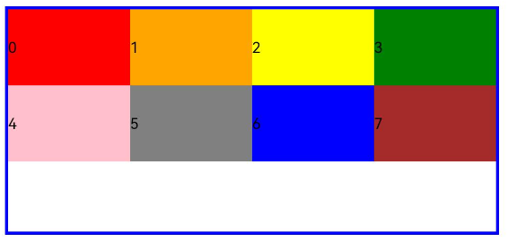
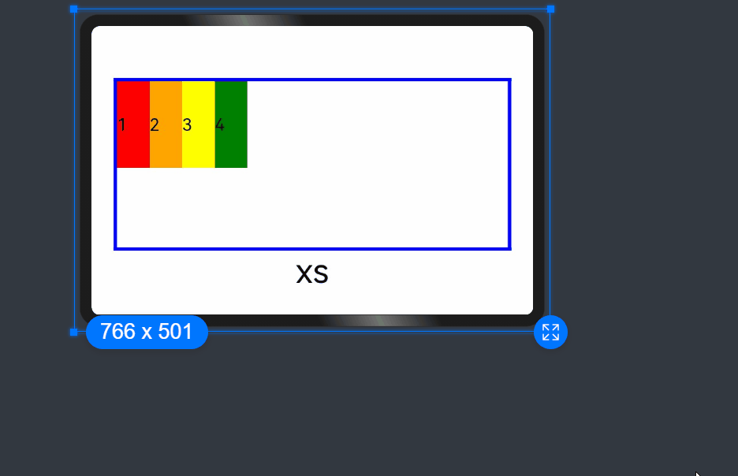

# Grid Layout

As a tool to provide layout auxiliary lines, the grid system is handy in graphic and website design. When employed in the UI design of mobile devices, the grid system exhibits the following advantages:

1. Provides rules for layout design and resolves issues of dynamic layout across devices with different sizes.
2. Provides a unified positioning method for the system to ensure layout consistency across layouts on different devices.
3. Provides a flexible spacing adjustment method for applications to keep up with layout in special scenarios.

To implement a grid layout, **[GridRow](../reference/arkui-ts/ts-container-gridrow.md)** and **[GridCol](../reference/arkui-ts/ts-container-gridcol.md)** are prioritized
over the obsolete **[GridContainer](../reference/arkui-ts/ts-container-gridcontainer.md)**, because the former provides more flexibility and functionality. **GridRow** is a grid container item and must be used only with **GridCol** in the grid container.


## GridRow


The grid container works in terms of **columns**, **gutter**, **direction**, and **breakpoints**.
- **columns**: total number of columns in the grid container. This attribute is the main tool for placing items in the grid layout.
- **gutter**: spacing between elements. This attribute determines how close the content tracks are with each other.
- **direction**: alignment of child components in the grid container.
- **breakpoints**: ranges of application window widths, which are set based on the device screen widths. You can use the breakpoints to meet specific layout requirements.


After you set the breakpoints, the layout listens for changes in the application window size, determines which breakpoint range the application window is located, and adjusts to match the window size accordingly.

### Grid Breakpoints

The grid system defines breakpoints, which are screen width types in effect, based on the horizontal width (screen density pixels, in vp) of the screens. You can use the breakpoints to meet specific layout requirements.
By default, the grid system provides four breakpoints: xs, sm, md, and lg.

| Breakpoint | Value Range (vp)| 
| --------| ------ | 
| xs | [0, 320)  | 
| sm | [320, 520) | 
| md | [520, 840) | 
| lg | [840, +∞)  | 

In the **\<GridRow>** component, you can use **breakpoints** to customize the value range of breakpoints. A maximum of six breakpoints are supported.
In addition to the four default breakpoints, you can also enable the xl and xxl breakpoints for your application window layout.

| Breakpoint| Device Description       |
| ----- | ---------------------------------------- |
| xs  | Device of the minimum size.   |
| sm   | Small-sized device.     |
| md   | Medium-sized device.   |
| lg  | Large-sized device.     |
| xl   | Extra-large-sized device.   |
| xxl | Ultra-large-sized device.   |

- Set **breakpoints** with a monotonically increasing array based on the use case. Because **breakpoints** supports a maximum of six breakpoints, the maximum length of the monotonically increasing array is 5.

  ```ts
  breakpoints: {value: ["100vp", "200vp"]}
  ```

  Enables three breakpoints: xs, sm, and md. If the value is less than 100 vp, the breakpoint is xs. If the value is 100–200 vp, the breakpoint is sm. If the value is greater than 200 vp, the breakpoint is md.

  ```ts
  breakpoints: {value: ["320vp", "520vp", "840vp", "1080vp"]}
  ```

  Enables five breakpoints: xs, sm, md, lg, and xl. If the value is less than 320 vp, the breakpoint is xs. If the value is 320–520 vp, the breakpoint is sm. If the value is 520–840 vp, the breakpoint is md. If the value is 840–1080vp, the breakpoint is lg. If the value is greater than 1080 vp, the breakpoint is xl.


- The grid system implements breakpoints by listening for the changes in the window or container size, and sets the breakpoint references through **reference**. Considering that the application may be displayed in non-full-screen mode, design the breakpoints with the application window width as the reference.

In the following example, the default number of columns of a grid is 12. Breakpoints are used to divide the application window width into six ranges, where different grid items occupy a different number of columns. The following figure shows the effect.
  ```ts
GridRow({
  breakpoints: {
    value: ['200vp', '300vp', '400vp', '500vp', '600vp'],
    reference: BreakpointsReference.WindowSize
  }
}) {
     ForEach(this.bgColors, (color, index) => {
       GridCol({
         span: {
           xs: 2,
           sm: 3,
           md: 4,
           lg: 6,
           xl: 8,
           xxl: 12
         }
       }) {
         Row() {
           Text(${index})
         }.width("100%").height("50vp")
       }.backgroundColor(color)
     })
}                                                                    
```


  


### Columns

In the **\<GridRow>**, **columns** is used to set the total number of columns in the grid layout.

- The default value of **columns** is 12. If **columns** is not set, the grid layout is divided into 12 columns at any breakpoint.
   ```ts
  GridRow() {
    ForEach(this.bgColors, (item, index) => {
      GridCol() {
        Row() {
          Text(`${index + 1}`)
        }.width("100%").height("50")
      }.backgroundColor(item)
    })
  }           
  ```

  

- When **columns** is set to a number, the grid layout is divided into the specified number of columns regardless of the screen size. The following example sets the number of grid layout columns to 4 and 8 in sequence, where a child component occupies one column by default.

  ```ts
  Row() {
    GridRow({ columns: 4 }) {
      ForEach(this.bgColors, (item, index) => {
        GridCol() {
          Row() {
            Text(`${index + 1}`)
          }.width("100%").height("50")
        }.backgroundColor(item)
      })
    }
    .width("100%").height("100%")
    .onBreakpointChange((breakpoint) => {
      this.currentBp = breakpoint
    })
  }
  .height(160)
  .border({ color: Color.Blue, width: 2 })
  .width('90%')
  
  Row() {
    GridRow({ columns: 8 }) {
      ForEach(this.bgColors, (item, index) => {
        GridCol() {
          Row() {
            Text(`${index + 1}`)
          }.width("100%").height("50")
        }.backgroundColor(item)
      })
    }
    .width("100%").height("100%")
    .onBreakpointChange((breakpoint) => {
      this.currentBp = breakpoint
    })
  }
  .height(160)
  .border({ color: Color.Blue, width: 2 })
  .width('90%')
  ```
  
  


- When **columns** is set to a value of the **GridRowColumnOption** type, you can assign values specific to the screen size (xs, sm, md, lg, xl, xxl).

  ```ts
  GridRow({ columns: { sm: 4, md: 8 }, breakpoints: { value: ['200vp', '300vp', '400vp', '500vp', '600vp'] } }) {
    ForEach(this.bgColors, (item, index) => {
      GridCol() {
        Row() {
          Text(`${index + 1}`)
        }.width("100%").height("50")
      }.backgroundColor(item)
    })
  }
  ```
  

  As shown above, if **columns** is only set for the sm and md screen size types, screen sizes smaller than sm use the default value 12, and screen sizes larger than md (lg, xl, and xxl) use the value of **columns** of the md type.

### Gutters

In the **\<GridRow>**, **gutter** is used to set the spacing between adjacent child components in the horizontal and vertical directions.

- When **gutter** is set to a number, the number applies to both the horizontal and vertical directions. In the following example, the horizontal and vertical spacing between adjacent child components are set to **10**.

  ```ts
   GridRow({ gutter: 10 }){}
  ```

  
  
  

- When **gutter** is set to a value of the **GutterOption** type, the **x** attribute of the value indicates the horizontal gutter, and the **y** attribute indicates the vertical gutter.

  ```ts
  GridRow({ gutter: { x: 20, y: 50 } }){}
  ```

    


### Alignment

In the **\<GridRow>**, **direction** is used to set the alignment of child components in the grid container.

- Child components are arranged from left to right by default.

  ```ts
  GridRow({ direction: GridRowDirection.Row }){}
  ```
  

- Child components are arranged from right to left.

  ```ts
  GridRow({ direction: GridRowDirection.RowReverse }){}
  ```
  
  


## GridCol

The **\<GridCol>** component is a child component of the **\<GridRow>** component. You can set the **span**, **offset**, and **order** attributes of this component by passing parameters or using setters.

- Setting **span**

  ```ts
  GridCol({ span: 2 }){}
  GridCol({ span: { xs: 1, sm: 2, md: 3, lg: 4 } }){}
  GridCol(){}.span(2)
  GridCol(){}.span({ xs: 1, sm: 2, md: 3, lg: 4 })
  ```

- Setting **offset**

  ```ts
  GridCol({ offset: 2 }){}
  GridCol({ offset: { xs: 2, sm: 2, md: 2, lg: 2 } }){}
  GridCol(){}.offset(2)
  GridCol(){}.offset({ xs: 1, sm: 2, md: 3, lg: 4 }) 
  ```

- Setting **order**

  ```ts
  GridCol({ order: 2 }){}
  GridCol({ order: { xs: 1, sm: 2, md: 3, lg: 4 } }){}
  GridCol(){}.order(2)
  GridCol(){}.order({ xs: 1, sm: 2, md: 3, lg: 4 })
  ```

  The following describes how to set the attributes by passing parameters.

### span

Sets the number of columns occupied by a child component in the grid layout, which determines the child component width. The default value is **1**.

- When the value type is number, the number of columns occupied by the child component is the same across screen sizes.

  ```ts
  GridRow({ columns: 8 }) {
    ForEach(this.bgColors, (color, index) => {
      GridCol({ span: 2 }) {      
        Row() {
          Text(${index})
        }.width("100%").height("50vp")          
      }
      .backgroundColor(color)
    })
  }                
  ```

  

- When the value type is **GridColColumnOption**, you can assign values specific to the screen size (xs, sm, md, lg, xl, xxl).

  ```ts
  GridRow({ columns: 8 }) {
    ForEach(this.bgColors, (color, index) => {
      GridCol({ span: { xs: 1, sm: 2, md: 3, lg: 4 } }) {      
        Row() {
          Text(${index})
        }.width("100%").height("50vp")          
      }
      .backgroundColor(color)
    })
  }                
  ```

  

### offset

Sets the column offset of a child component relative to the previous child component. The default value is **0**.
- When the value type is number, the column offset of the child component is the same across screen sizes.

  ```ts
  GridRow() {
    ForEach(this.bgColors, (color, index) => {
      GridCol({ offset: 2 }) {      
        Row() {
          Text("" + index)
        }.width("100%").height("50vp")          
      }
      .backgroundColor(color)
    })
  }                
  ```

  

  By default, a grid is divided into 12 columns and each child component occupies one column with an offset of two columns. Each row holds four child components, with three columns per child component plus the gutter.


- When the value type is **GridColColumnOption**, you can assign values specific to the screen size (xs, sm, md, lg, xl, xxl).

  ```ts
  GridRow() {
    ForEach(this.bgColors, (color, index) => {
      GridCol({ offset: { xs: 1, sm: 2, md: 3, lg: 4 } }) {      
        Row() {
          Text("" + index)
        }.width("100%").height("50vp")          
      }
      .backgroundColor(color)
    })
  }                
  ```

  

### order

  Sets the sequence number of a child component in the grid layout. If a child component shares an **order** value with another child component or does not have **order** set, it is displayed based on its code sequence number. A child components with a larger **order** value is placed before the one with a smaller **order** value.
  If **order** is not set for all child components, those that have **order** set are displayed after those that do not have **order** set and are sorted in descending order based on the value.


- When the value type is number, child components are sorted in the same order across screen sizes.

  ```ts
  GridRow() {
    GridCol({ order: 5 }) {
      Row() {
        Text("1")
      }.width("100%").height("50vp")
    }.backgroundColor(Color.Red)
    GridCol({ order: 4 }) {
      Row() {
        Text("2")
      }.width("100%").height("50vp")
    }.backgroundColor(Color.Orange)
    GridCol({ order: 3 }) {
      Row() {
        Text("3")
      }.width("100%").height("50vp")
    }.backgroundColor(Color.Yellow)
    GridCol({ order: 2 }) {
      Row() {
        Text("4")
      }.width("100%").height("50vp")
    }.backgroundColor(Color.Green)
  }            
  ```

  
- When the value type is **GridColColumnOption**, you can assign values specific to the screen size (xs, sm, md, lg, xl, xxl).

  ```ts
  GridRow() {
    GridCol({ order: { xs:1, sm:5, md:3, lg:7}}) {
      Row() {
        Text("1")
      }.width("100%").height("50vp")
    }.backgroundColor(Color.Red)
    GridCol({ order: { xs:2, sm:2, md:6, lg:1} }) {
      Row() {
        Text("2")
      }.width("100%").height("50vp")
    }.backgroundColor(Color.Orange)
    GridCol({ order: { xs:3, sm:3, md:1, lg:6} }) {
      Row() {
        Text("3")
      }.width("100%").height("50vp")
    }.backgroundColor(Color.Yellow)
    GridCol({ order: { xs:4, sm:4, md:2, lg:5} }) {
      Row() {
        Text("4")
      }.width("100%").height("50vp")
    }.backgroundColor(Color.Green)
  } 
  ```

  
