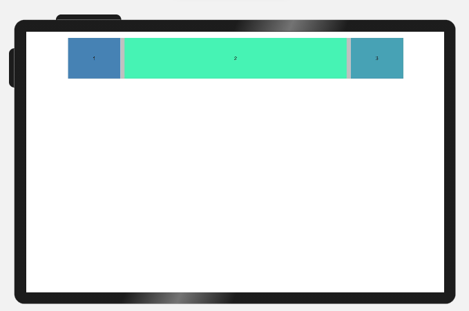

# Grid Layout


As a tool to provide layout auxiliary lines, the grid system is handy in graphic and website design. When employed in the UI design of mobile devices, the grid system exhibits the following advantages:


1. Provides rules for layout design and resolves issues of dynamic layout across devices with different sizes.
2. Provides a unified positioning method for the system to ensure layout consistency among modules on different devices.
3. Provides a flexible spacing adjustment method for applications to keep up with layout in special scenarios.

To implement grid layout, the declarative paradigm provides the [GridContainer](../reference/arkui-ts/ts-container-gridcontainer.md) grid container component, which works with the common attribute useSizeType of its subcomponents to implement grid layout.

## Grid System

The grid system works in terms of gutter, margin, and column.


1. Gutter:
   Spacing between elements. You can define different clutter values for different device sizes as part of the overall grid layout specifications. For better results, make sure the gutter is not greater than the margin.
2. Margin:
   Spacing around an item in the grid container. You can define different margin values for different device sizes as part of the overall grid layout specifications.
3. Column:
   Main tool for positioning items in the grid layout. The grid container is divided into various numbers of columns based on the device size. The width per column is calculated based on the total number of columns while respecting the margin and clutter specifications.


### Grid Breakpoints

Breakpoints in the grid system are set in terms of the device's screen pixel density. The grid system defines a set of breakpoint rules based on the mapping between the numbers of columns and device screen widths.

Depending on the screen width, devices are classified into different width types. The table below provides the mappings of the grid breakpoint ranges, device width types, default total number of columns, margins, and gutters.


| Grid Breakpoint Range             | Device Width Type| Description       | columns | gutter | margin |
| ----------------------- | ------ | --------- | ------- | ------ | ------ |
| 0 &lt; Device screen width &lt; 320 vp     | XS     | Device of the minimum size.| 2       | 12 vp  | 12 vp  |
| 320 vp &lt;= Horizontal width &lt; 600 vp| SM     | Small-sized device. | 4       | 24 vp  | 24 vp  |
| 600 vp &lt;= Horizontal width &lt; 840 vp| MD     | Medium-sized device.| 8       | 24 vp  | 32 vp  |
| 840 vp &lt;= Device screen width          | LG     | Large-sized device. | 12      | 24 vp  | 48 vp  |

## Usage

Create a grid container, define the grid layout, and set the number of columns for child components in the grid container under different device width types.

### Creating a Grid Container

Use the `GridContainer(options?: { columns?: number | 'auto', sizeType?: SizeType, gutter?: Length, margin?: Length})` API to create a grid container. All child components in the grid container follow the grid layout.

- Use the **columns**, **gutter**, and **margin** parameters to define your grid layout. In the sample below, the grid container is divided into six columns, with the gutter (spacing between columns) of 10 vp and the margin (spacing around a column) of 20 vp.

  ```
  GridContainer({ columns: 6, gutter: 10, margin: 20 }) {}
  ```

  In the sample below, the grid container does not have any parameter set. In this case, it follows the default layout, as in the case when sizeType is set to SizeType.Auto.

  ```
  GridContainer() {}
  ```

  On a small-sized device (**SizeType.SM**), the grid container is divided into four columns by default, with the gutter of 24 vp and the margin of 24 vp. On a medium-sized device (**SizeType.MD**), the grid container is divided into eight columns by default, with the gutter of 24 vp and the margin of 32 vp.

- You can also use **sizeType** to configure child components in the grid container to follow the grid settings for a specific device width type, as shown below:

  ```
  GridContainer({ sizeType: SizeType.SM) {
       Row() {

         Text('1')
           .useSizeType({
             xs: { span: 2},
             sm: { span: 3, offset: 1 },
             md: { span: 6, offset: 2 },
             lg: { span: 8, offset: 2 },
           })
       }
    }
  ```

  In the preceding example, the **\<Text>** component uses the grid setting of the **SizeType.SM** type regardless of the actual width type of the device. That is, the **\<Text>** component occupies three columns and is placed in the first column.

### Grid Settings of Child Components in the Grid Container

Use the universal attribute **useSizeType** to configure the positioning of child components in the grid container. **span** indicates the number of columns occupied by the child component. **offset** indicates the column offset, that is, the column where the component is located. The sample code is as follows:

```
GridContainer() {
   Row() {
     Text('1')
       .useSizeType({
         xs: { span: 2},
         sm: { span: 3, offset: 1 },
         md: { span: 6, offset: 2 },
         lg: { span: 8, offset: 2 },
       })
   }
}
```
In the preceding example, `sm: { span: 2, offset: 0 }` indicates that on a medium-sized device, the **\<Text>** component occupies three columns and is placed in the first column of the grid container.
## Example Scenario

The grid layout helps ensure proper display of components among different device width types, eliminating the hassle of writing a large amount of code for device compatibility. 

```
@Entry
@Component
struct GridContainerExample {
  build() {
    Column({ space: 5 }) {
      GridContainer({ columns: 6 }) {
        Flex({justifyContent:FlexAlign.SpaceAround}) {
          Text('1')
            .useSizeType({
              xs: { span: 2, offset: 0 },
              sm: { span: 2, offset: 0 },
              md: { span: 1, offset: 0 },
              lg: { span: 1, offset: 0 },
            })
            .height(100).backgroundColor(0x4682B4).textAlign(TextAlign.Center)
          Text('2')
            .useSizeType({
              xs: { span: 2, offset: 0 },
              sm: { span: 2, offset: 0 },
              md: { span: 4, offset: 0 },
              lg: { span: 4, offset: 0 },
            })
            .height(100).backgroundColor(0x46F2B4).textAlign(TextAlign.Center)
          Text('3')   
            .useSizeType({
              xs: { span: 2, offset: 0 },
              sm: { span: 2, offset: 0 },
              md: { span: 1, offset: 0 },
              lg: { span: 1, offset: 0 },
            })
            .height(100).backgroundColor(0x46A2B4).textAlign(TextAlign.Center)
        }
      }.width('80%').backgroundColor('gray')
    }.width('100%').margin({ top: 15 })
  }
}
```


Effect on a small-sized device (**SizeType.SM**):


Effect on a medium-sized device (**SizeType.MD**):

