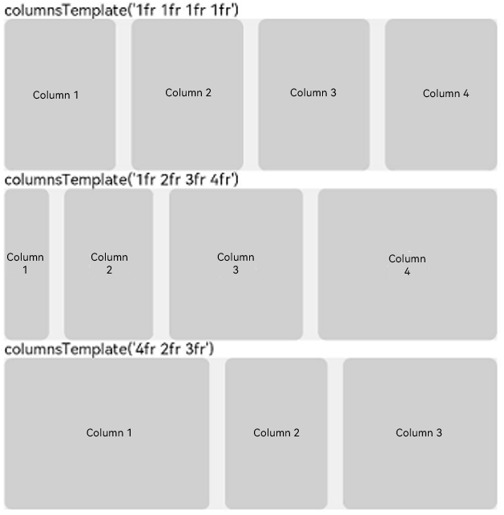
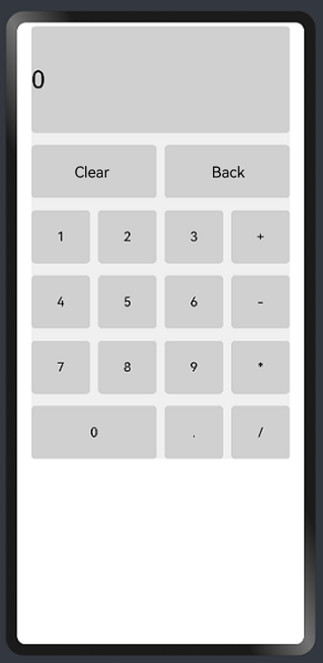

# Grid Layout

The grid layout is an important layout in adaptive layout. It excels at dividing a page and defining proportion.
You can implement a grid layout through the **[\<Grid>](../reference/arkui-ts/ts-container-grid.md)** container and the **[\<GridItem>](../reference/arkui-ts/ts-container-griditem.md)** child component.
**\<Grid>** sets grid-wide parameters, and **\<GridItem>** defines parameters specific to grid items. The grid layout has the following features:

1. When the size of the container changes, all child components and their spacings are adjusted proportionally.
2. The numbers of rows and columns in the grid layout as well as the proportion of each row and column are customizable.
3. The row and column spacing of child components in the grid layout can be set.
4. A child component can span the specified number of rows or columns.


## Grid Settings

### Number and Proportion of Rows and Columns
The number and proportion of rows and columns are set through the **columnsTemplate** and **rowTemplate** attributes.

The following describes how to set **columnsTemplate**. The value of this attribute is a string consisting of multiple 'number+fr' entries separated by spaces. The number of entries is the number of columns in the grid layout. The number before **fr** is used to calculate the proportion of the column to the grid layout width, thereby determining the column width.

```ts
struct GridExample {
  @State Number: Array<string> = ['1', '2', '3', '4']

  build() {
    Column({ space: 5 }) {
      Grid() {
        ForEach(this.Number, (num: string) => {
          GridItem() {
            Text(`Column ${num}`)
              .fontSize(16)
              .textAlign(TextAlign.Center)
              .backgroundColor(0xd0d0d0)
              .width('100%')
              .height('100%')
              .borderRadius(5)
          }
        })
      }
      .columnsTemplate('1fr 1fr 1fr 1fr')
      .rowsTemplate('1fr')
      .columnsGap(10)
      .rowsGap(20)
      .width('90%')
      .backgroundColor(0xF0F0F0)
      .height(100)
    }.width('100%')
  }
}
```

Create a four-column grid, where each column has an equal width.

```ts
struct GridExample {
  @State Number: Array<string> = ['1', '2', '3', '4']

  build() {
    Column({ space: 5 }) {
      Grid() {
        ForEach(this.Number, (num: string) => {
          GridItem() {
            Text(`Column ${num}`)
              .fontSize(16)
              .textAlign(TextAlign.Center)
              .backgroundColor(0xd0d0d0)
              .width('100%')
              .height('100%')
              .borderRadius(5)
          }
        })
      }
      .columnsTemplate('1fr 2fr 3fr 4fr')
      .rowsTemplate('1fr')
      .columnsGap(10)
      .rowsGap(20)
      .width('90%')
      .backgroundColor(0xF0F0F0)
      .height(100)
    }.width('100%')
  }
}
```

Create a four-column grid, where the proportions of the columns are 1:2:3:4.

```ts
struct GridExample {
  @State Number: Array<string> = ['1', '2', '3']

  build() {
    Column({ space: 5 }) {
      Grid() {
        ForEach(this.Number, (num: string) => {
          GridItem() {
            Text(`Column ${num}`)
              .fontSize(16)
              .textAlign(TextAlign.Center)
              .backgroundColor(0xd0d0d0)
              .width('100%')
              .height('100%')
              .borderRadius(5)
          }
        })
      }
      .columnsTemplate('4fr 2fr 3fr')
      .rowsTemplate('1fr')
      .columnsGap(10)
      .rowsGap(20)
      .width('90%')
      .backgroundColor(0xF0F0F0)
      .height(100)
    }.width('100%')
  }
}
```

Create a three-column grid, where the proportions of the columns are 4:2:3.

The effect is as follows:



### Alignment

Set **layoutDirection** to define how grid items are laid out along the main axis.
The layout options are **Row**, **RowReverse**, **Column**, and **ColumnReverse**.
The effect is as follows:


### Spacing Between Rows and Columns

Set **columnsGap** to define the vertical spacing of the grid items and **rowsGap** to define the horizontal spacing.

```ts
Grid()
.columnsTemplate('1fr 1fr 1fr 1fr')
.columnsGap(10)
.rowsGap(20)
```


In the preceding example, the horizontal and vertical spacings between grid items are 10 and 20, respectively.

## GridItem Settings

### Setting the Number of Rows and Columns per Grid Item

The rows and columns of a grid layout are numbered in sequence, starting from 1.

If a grid item spans multiple rows, use **rowStart** to set the start row number and **rowEnd** to set the end row number. If the value of **rowStart** is the same as that of **rowEnd**, the grid item occupies only one grid. The sample code is as follows:

```ts
Grid() {
    GridItem() {
      Text('5')
        .fontSize(16)
        .textAlign(TextAlign.Center)
        .textStyle()
    }.rowStart(2).rowEnd(3) // The grid item spans the second and third columns.

    GridItem() {
      Text('4')
        .fontSize(16)
        .textAlign(TextAlign.Center)
        .textStyle()
    }.columnStart(4).columnEnd(5) // The grid item spans the fourth and fifth columns.
  
    GridItem() {
      Text('6')
        .fontSize(16)
        .textAlign(TextAlign.Center)
        .textStyle()
    }.columnStart(2).columnEnd(4) // The grid item spans the second to fourth columns.

    GridItem() {
      Text('9')
        .fontSize(16)
        .textAlign(TextAlign.Center)
        .textStyle()
    }.columnStart(3).columnEnd(4)    // The grid item spans the third and fourth columns.
}
.columnsTemplate('1fr 1fr 1fr 1fr 1fr')
.rowsTemplate('1fr 1fr 1fr')
.columnsGap(10)
.rowsGap(20)
.width('90%')
.backgroundColor(0xF0F0F0)
.height('200vp')
.layoutDirection(GridDirection.Column)
```


## Example Scenario

Use the grid layout to implement a calculator. The sample code is as follows:

```ts
@Entry
@Component
struct GridExample {
  @State Number: Array<string> = ['1', '2', '3', '+', '4', '5', '6', '-', '7', '8', '9', '*', '0', '.', '/']

  @Styles textStyle(){
    .backgroundColor(0xd0d0d0)
    .width('100%')
    .height('100%')
    .borderRadius(5)
  }

  build() {
    Column({ space: 5 }) {
      Grid() {
        GridItem() {
          Text('0')
            .fontSize(30)
            .textStyle()
        }.columnStart(1).columnEnd(4)

        GridItem() {
          Text ('Clear')
            .fontSize(16)
            .textAlign(TextAlign.Center)
            .textStyle()
        }.columnStart(1).columnEnd(2)

        GridItem() {
          Text ('Back')
            .fontSize(16)
            .textAlign(TextAlign.Center)
            .textStyle()
        }.columnStart(3).columnEnd(4)

        ForEach(this.Number, (day: string) => {
          if (day === '0') {
            GridItem() {
              Text(day)
                .fontSize(16)
                .textAlign(TextAlign.Center)
                .textStyle()
            }.columnStart(1).columnEnd(2)
          } else {
            GridItem() {
              Text(day)
                .fontSize(16)
                .textAlign(TextAlign.Center)
                .textStyle()
            }
          }
        })
      }
      .columnsTemplate('1fr 1fr 1fr 1fr')
      .rowsTemplate('2fr 1fr 1fr 1fr 1fr 1fr')
      .columnsGap(10)
      .rowsGap(15)
      .width('90%')
      .backgroundColor(0xF0F0F0)
      .height('70%')
    }.width('100%').margin({ top: 5 })
  }
}
```

Below you can see how the calculator displays on a large-screen device.


Below you can see how the calculator displays on a small-screen device.


