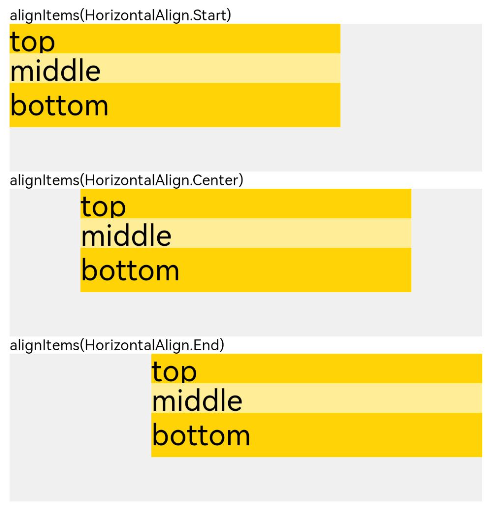
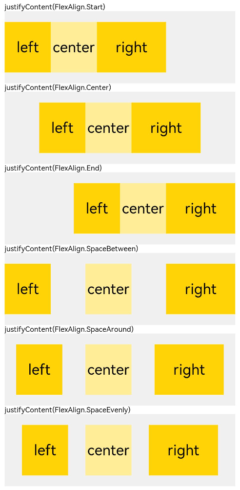
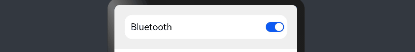
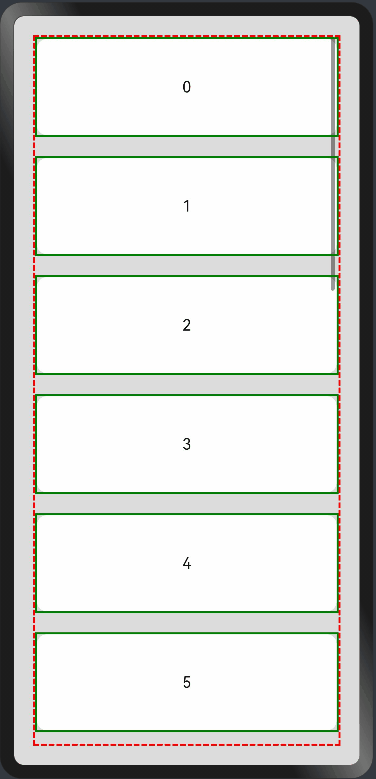
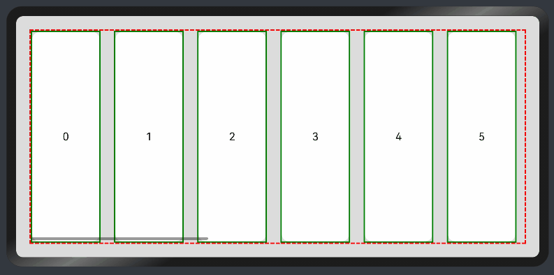

# Linear Layout

The linear layout is the most commonly used layout in development. The child components in a linear layout are arranged one by one in a linear direction, either vertically or horizontally.

You can implement a linear layout through the **[\<Row>](../reference/arkui-ts/ts-container-row.md)** and **[\<Column>](../reference/arkui-ts/ts-container-column.md)** containers. In the **\<Column>** container, child components are arranged vertically. In the **\<Row>** container, child components are arranged horizontally.

## Linear Layout Orientation

The orientation of a linear layout is subject to the container: **\<Row>** or **\<Column>**. You can use the container attributes to adjust the spacing between child components and the horizontal and vertical alignment modes.
1. The **space** attribute sets the spacing between child components so that they are evenly spaced along the main axis.
2. The **alignItems** attribute sets the alignment mode of the child components along the cross axis, which is consistent across screens of various sizes. When the cross axis is vertical, the value type is [VerticalAlign](../reference/arkui-ts/ts-appendix-enums.md#verticalalign). When the cross axis is horizontal, the value type is [HorizontalAlign](../reference/arkui-ts/ts-appendix-enums.md#horizontalalign).
3. The **justifyContent** attribute sets the alignment mode of the child components along the main axis, implementing adaptive layout. The value type is [FlexAlign](../reference/arkui-ts/ts-appendix-enums.md#flexalign).

The table below provides the usage and demo effects.

|Attribute|Description|Row Effect|Column Effect|
|------|---------------------------|----------------------------|---------------------------|
|space |- Horizontal spacing between child components in the horizontal layout<br> - Vertical spacing between child components in the vertical layout|         |    |
|alignItems |Alignment mode of child components along the cross axis of the container.|            ||
|justifyContent |Alignment mode of child components along the main axis of the container.|            ||

## Adaptive Stretching

In linear layout, the **[\<Blank>](../reference/arkui-ts/ts-basic-components-blank.md)** component is commonly used to automatically fill blank space along the main axis of the container, so as to achieve adaptive stretching.

```ts
@Entry
@Component
struct BlankExample {
  build() {
    Column() {
      Row() {
        Text('Bluetooth').fontSize(18)
        Blank()
        Toggle({ type: ToggleType.Switch, isOn: true })
      }.backgroundColor(0xFFFFFF).borderRadius(15).padding({ left: 12 }).width('100%')
    }.backgroundColor(0xEFEFEF).padding(20).width('100%')
  }
}
```



## Adaptive Scaling

Adaptive scaling means that child components scale according to the preset ratio to adapt to the container size on devices of various sizes. Below are the methods to implement adaptive scaling in a linear layout:

1. When the size of the parent container is determined, child components are laid out along the main axis based on the **layoutWeight** attribute settings, with the size settings of the child components ignored. In this way, the child components are adaptively scaled to fill up remaining space, regardless of the screen size.

    ```ts
    @Entry
    @Component
    struct layoutWeightExample {
      build() {
        Column() {
          Text('1:2:3').width('100%')
          Row() {
            Column() {
              Text('layoutWeight(1)')
                .textAlign(TextAlign.Center)
            }.layoutWeight(2).backgroundColor(0xffd306).height('100%')
    
            Column() {
              Text('layoutWeight(2)')
                .textAlign(TextAlign.Center)
            }.layoutWeight(4).backgroundColor(0xffed97).height('100%')
    
            Column() {
              Text('layoutWeight(6)')
                .textAlign(TextAlign.Center)
            }.layoutWeight(6).backgroundColor(0xffd306).height('100%')
    
          }.backgroundColor(0xffd306).height('30%')
    
          Text('2:5:3').width('100%')
          Row() {
            Column() {
              Text('layoutWeight(2)')
                .textAlign(TextAlign.Center)
            }.layoutWeight(2).backgroundColor(0xffd306).height('100%')
    
            Column() {
              Text('layoutWeight(5)')
                .textAlign(TextAlign.Center)
            }.layoutWeight(5).backgroundColor(0xffed97).height('100%')
    
            Column() {
              Text('layoutWeight(3)')
                .textAlign(TextAlign.Center)
            }.layoutWeight(3).backgroundColor(0xffd306).height('100%')
          }.backgroundColor(0xffd306).height('30%')
        }
      }
    }
    ```

   


3. When the size of the parent container is determined, set the widths of the child component and sibling components in percentage.

    ```ts
    @Entry
    @Component
    struct WidthExample {
      build() {
        Column() {
          Row() {
            Column() {
              Text('left width 20%')
                .textAlign(TextAlign.Center)
            }.width('20%').backgroundColor(0xffd306).height('100%')
    
            Column() {
              Text('center width 50%')
                .textAlign(TextAlign.Center)
            }.width('50%').backgroundColor(0xffed97).height('100%')
    
            Column() {
              Text('right width 30%')
                .textAlign(TextAlign.Center)
            }.width('30%').backgroundColor(0xffd306).height('100%')
          }.backgroundColor(0xffd306).height('30%')
        }
      }
    }
    ```

   

   In the preceding example, the proportion of child components remains unchanged across devices of different sizes.

## Positioning
- Relative layout

  You can use the **[offset](../reference/arkui-ts/ts-universal-attributes-location.md)** attribute to set the offset of a component relative to itself, thereby implmenting relative layout. Setting this attribute does not affect the layout of the parent container. It only adjusts the component position during drawing. The linear layout and offset can work together to meet most layout development requirements.

  ```ts
  @Entry
  @Component
  struct OffsetExample {
    @Styles eleStyle() {
      .size({ width: 120, height: '50' })
      .backgroundColor(0xbbb2cb)
      .border({ width: 1 })
    }
  
    build() {
      Column({ space: 20 }) {
        Row() {
          Text('1').size({ width: '15%', height: '50' }).backgroundColor(0xdeb887).border({ width: 1 }).fontSize(16)
          Text('2  offset(15, 30)')
            .eleStyle()
            .fontSize(16)
            .align(Alignment.Start)
            .offset({ x: 15, y: 30 })
          Text('3').size({ width: '15%', height: '50' }).backgroundColor(0xdeb887).border({ width: 1 }).fontSize(16)
          Text('4 offset(-10%, 20%)')
            .eleStyle()
            .fontSize(16)
            .offset({ x: '-5%', y: '20%' })
        }.width('90%').height(150).border({ width: 1, style: BorderStyle.Dashed })
      }
      .width('100%')
      .margin({ top: 25 })
    }
  } 
   ```

  


- Absolute layout

  In linear layout, you can use the **[position](../reference/arkui-ts/ts-universal-attributes-location.md)** attribute to set the offset of the upper left corner of a component relative to the upper left corner of the parent container, thereby implementing absolute layout. Absolute layout offers poorer adaptability to screen sizes than relative layout.

  ```ts
  @Entry
  @Component
  struct PositionExample {
    @Styles eleStyle(){
      .backgroundColor(0xbbb2cb)
      .border({ width: 1 })
      .size({ width: 120, height: 50 })
    }
  
    build() {
      Column({ space: 20 }) {
        // Set the offset of the upper left corner of the child component relative to the upper left corner of the parent container.
        Row() {
          Text('position(30, 10)')
            .eleStyle()
            .fontSize(16)
            .position({ x: 10, y: 10 })
  
          Text('position(50%, 70%)')
            .eleStyle()
            .fontSize(16)
            .position({ x: '50%', y: '70%' })
  
          Text('position(10%, 90%)')
            .eleStyle()
            .fontSize(16)
            .position({ x: '10%', y: '80%' })
        }.width('90%').height('100%').border({ width: 1, style: BorderStyle.Dashed })
      }
      .width('90%').margin(25)
    }
  }
  ```

  


## Adaptive Extension

Adaptive extension allows users to drag the scrollbar to display content when the content amount displayed on a page is subject to the screen size and the content extends beyond the viewport. Below are the methods to implement adaptive extension in a linear layout:


- **\<List>** component

  If the list items cannot be fully displayed on one screen, you can use the scrollbar to let users view the list items in full. Use the **scrollBar** attribute to set the scrollbar status, and the **edgeEffect** to set the rebound effect when the scrollbar has reached the edge.


  Vertical list:
  ```ts
    @Entry
    @Component
    struct ListExample1 {
      @State arr: string[] = ["0", "1", "2", "3", "4", "5", "6", "7", "8", "9", "10", "11", "12", "13", "14", "15"]
      @State alignListItem: ListItemAlign = ListItemAlign.Start
    
      build() {
        Column() {
          List({ space: 20, initialIndex: 0 }) {
            ForEach(this.arr, (item) => {
              ListItem() {
                Text('' + item)
                  .width('100%')
                  .height(100)
                  .fontSize(16)
                  .textAlign(TextAlign.Center)
                  .borderRadius(10)
                  .backgroundColor(0xFFFFFF)
              }
              .border({ width: 2, color: Color.Green })
            }, item => item)
          }
          .border({ width: 2, color: Color.Red, style: BorderStyle.Dashed })
          .scrollBar (BarState.On) // ScrollBar status
          .edgeEffect(EdgeEffect.Spring) // Rebound effect when the scrollbar has reached the edge
    
        }.width('100%').height('100%').backgroundColor(0xDCDCDC).padding(20)
      }
    }
  ```

  
  

  Horizontal List:

  ```ts
    @Entry
    @Component
    struct ListExample2 {
      @State arr: string[] = ["0", "1", "2", "3", "4", "5", "6", "7", "8", "9", "10", "11", "12", "13", "14", "15"]
      @State alignListItem: ListItemAlign = ListItemAlign.Start
    
      build() {
        Column() {
          List({ space: 20, initialIndex: 0 }) {
            ForEach(this.arr, (item) => {
              ListItem() {
                Text('' + item)
                  .height('100%')
                  .width(100)
                  .fontSize(16)
                  .textAlign(TextAlign.Center)
                  .borderRadius(10)
                  .backgroundColor(0xFFFFFF)
              }
              .border({ width: 2, color: Color.Green })
            }, item => item)
          }
          .border({ width: 2, color: Color.Red, style: BorderStyle.Dashed })
          .scrollBar (BarState.On) // Scrollbar status.
          .edgeEffect(EdgeEffect.Spring) // Rebound effect when the scrollbar has reached the edge.
          .listDirection(Axis.Horizontal) // Horizontal layout.
        }.width('100%').height('100%').backgroundColor(0xDCDCDC).padding(20)
      }
    } 
  ```
  
  

- **\<Scroll>** component

  In linear layout, the **\<Scroll>** component scrolls the content when the layout size of a component exceeds the size of its parent component. You can wrap a **\<Scroll>** component at the outer layer of the **\<Column>** or **\<Row>** component.

  Vertical Scroll:

  ```ts
  @Entry
  @Component
  struct ScrollExample {
    scroller: Scroller = new Scroller();
    private arr: number[] = [0, 1, 2, 3, 4, 5, 6, 7, 8, 9];
  
    build() {
      Scroll(this.scroller) {
        Column() {
          ForEach(this.arr, (item) => {
            Text(item.toString())
              .width('90%')
              .height(150)
              .backgroundColor(0xFFFFFF)
              .borderRadius(15)
              .fontSize(16)
              .textAlign(TextAlign.Center)
              .margin({ top: 10 })
          }, item => item)
        }.width('100%')
      }
      .backgroundColor(0xDCDCDC)
      .scrollable(ScrollDirection.Vertical) // Vertical scrolling.
      .scrollBar(BarState.On) // Scrollbar status.
      .scrollBarColor(Color.Gray) // Scrollbar color.
      .scrollBarWidth(30) // Scrollbar width.
      .edgeEffect(EdgeEffect.Spring) // Rebound effect when the scrollbar has reached the edge.
    }
  }
  ```

  

  Horizontal scrolling:

  ```ts
  @Entry
  @Component
  struct ScrollExample {
    scroller: Scroller = new Scroller();
    private arr: number[] = [0, 1, 2, 3, 4, 5, 6, 7, 8, 9];
  
    build() {
      Scroll(this.scroller) {
        Row() {
          ForEach(this.arr, (item) => {
            Text(item.toString())
              .height('90%')
              .width(150)
              .backgroundColor(0xFFFFFF)
              .borderRadius(15)
              .fontSize(16)
              .textAlign(TextAlign.Center)
              .margin({ left: 10 })
          }, item => item)
        }.height('100%')
      }
      .backgroundColor(0xDCDCDC)
      .scrollable(ScrollDirection.Horizontal) // Horizontal scrolling.
      .scrollBar(BarState.On) // Scrollbar status.
      .scrollBarColor(Color.Gray) // Scrollbar color
      .scrollBarWidth(30) // Scrollbar width.
      .edgeEffect(EdgeEffect.Spring) // Rebound effect when the scrollbar has reached the edge.
    }
  }
  ```
  
