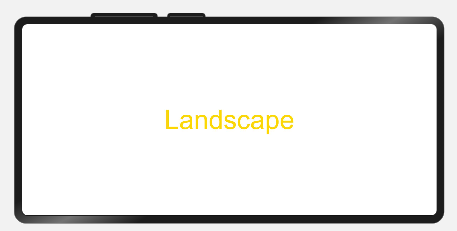

# Media Query


Media queries are widely used on mobile devices. You can use them to modify the application style based on the device type or specific features and device parameters (such as the screen resolution). Specifically, media queries allow you to:


1. Design a layout style based on the device and app attributes.

2. Update the page layout to adapt to dynamic screen changes (for example, screen splitting or switching between landscape and portrait modes).


## Usage

Invoke the **mediaquery** API to set the media query condition and the callback, and change the page layout or implement service logic in the callback corresponding to the condition.

First, import the mediaquery module, as shown below:
```ts
import mediaquery from '@ohos.mediaquery'
```
Then, use the **matchMediaSync** API to set the media query condition and save the returned listener, as shown below:
```ts
listener = mediaquery.matchMediaSync('(orientation: landscape)')
```
Finally, register the callback using the saved listener, and change the page layout or implement service logic in the callback. When the media query condition is matched, the callback is triggered. The sample code is as follows:
```ts
onPortrait(mediaQueryResult) {
    if (mediaQueryResult.matches) {
        // do something here
    } else {
        // do something here
    }
}
listener.on('change', onPortrait)
```

## Syntax of Media Query Conditions
```
[media-type] [and|not|only] [(media-feature)]
```
Examples are as follows:

 `screen and (round-screen: true)`  // The query is valid when the device screen is round.

 `(max-height: 800)`  // The query is valid when the height does not exceed 800.

 `(height <= 800)`   // The query is valid when the height does not exceed 800.

 `screen and (device-type: tv) or (resolution < 2)`  // The query is valid only when all media features are true.

###  media-type

| Type    | Description            |
| ------ | -------------- |
| screen | Media query based on screen-related parameters.|


### Media Logic Operation (and|not|only)

You can use logical operators (**and**, **or**, **not**, and **only**) to compose complex media queries. You can also combine them using comma (,). The following table describes the operators.

**Table 1** Media logical operators

| Type      | Description                                      |
| -------- | ---------------------------------------- |
| and      | The **and** operator is used to combine multiple media features into one media query, in a logical AND operation. The query is valid only when all media features are true. It can also combine media types and media functions.<br>For example, **screen and (device-type: wearable) and (max-height: 600) ** indicates that the query is valid when the device type is wearable and the maximum height of the application is 600 pixel units.|
| or       | The **or** operator is used to combine multiple media features into one media query, in a logical OR operation. The query is valid if a media feature is true.<br>For example, **screen and (max-height: 1000) or  (round-screen: true)** indicates that the query is valid when the maximum height of the application is 1000 pixel units or the device screen is round. |
| not      | The **not** operator is used to perform a logical negation for a media query. **true** is returned if the query condition is not met. Otherwise, **false** is returned. In a media query list, logical negation is performed only for the media query using the **not** operator.<br>For example, **not screen and (min-height: 50) and (max-height: 600) ** indicates that the query is valid when the height of the application is less than 50 pixel units or greater than 600 pixel units.<br>**NOTE**<br>When the **not** operator is used, the media type must be specified. |
| only     | The **only** operator applies the selected style only when the entire expression is matched. It can be used to prevent ambiguity on browsers of earlier versions. The statements that contain both media types and media features produce ambiguity when they are received by some browsers of earlier versions. For example:<br>screen and (min-height: 50)<br>The browsers of earlier versions would mislead this sentence into screen, causing the fact that the specified style is applied when only the media type is matched. In this case, the **only** operator can be used to avoid this problem.<br>**NOTE**<br>When the **only** operator is used, the media type must be specified. |
| ,(comma) | The **or** operator is used to combine multiple media features into one media query, in a logical OR operation. The query is valid if a media feature is true. The effect of a comma operator is equivalent to that of the **or** operator.<br>For example, **screen and (min-height: 1000),  (round-screen: true) ** indicates that the query is valid when the minimum height of the application is 1000 pixel units or the device screen is round.|

At MediaQuery Level 4, range query is imported so that you can use the operators including &lt;=, &gt;=, &lt;, and &gt; besides the max- and min-operators.

**Table 2** Logical operators for range query

| Type   | Description                                      |
| ----- | ---------------------------------------- |
| &lt;= | Less than or equal to, for example, **screen and (50 &lt;= height)**.|
| &gt;= | Greater than or equal to, for example, **screen and (600 &gt;= height)**.|
| &lt;  | Less than, for example, **screen and (50 &lt; height)**.|
| &gt;  | Greater than, for example, **screen and (600 &gt; height)**.|


### media-feature

| Type               | Description                                      |
| ----------------- | ---------------------------------------- |
| height            | Height of the display area on the application page.                            |
| min-height        | Minimum height of the display area on the application page.                          |
| max-height        | Maximum height of the display area on the application page.                          |
| width             | Width of the display area on the app page.                            |
| min-width         | Minimum width of the display area on the application page.                          |
| max-width         | Maximum width of the display area on the application page.                          |
| resolution        | Resolution of the device. The unit can be dpi, dppx, or dpcm.<br>- **dpi** indicates the number of physical pixels per inch. 1 dpi ≈ 0.39 dpcm.<br>- **dpcm** indicates the number of physical pixels per centimeter. 1 dpcm ≈ 2.54 dpi.<br>- **dppx** indicates the number of physical pixels in each pixel. (This unit is calculated based on this formula: 96 px = 1 inch, which is different from the calculation method of the px unit on the page.) 1 dppx = 96 dpi.|
| min-resolution    | Minimum device resolution.                               |
| max-resolution    | Maximum device resolution.                               |
| orientation       | Screen orientation.<br>Options are as follows:<br>- orientation: portrait<br>- orientation: landscape|
| device-height     | Height of the device.                                  |
| min-device-height | Minimum height of the device.                                |
| max-device-height | Maximum height of the device.                                |
| device-width      | Width of the device.                                  |
| min-device-width  | Minimum width of the device.                                |
| max-device-width  | Maximum width of the device.                                |
| round-screen      | Screen type. The value **true** means that the screen is round, and **false** means the opposite. |
| dark-mode         | Whether the device is in dark mode. The value **true** means that the device is in dark mode, and **false** means the opposite.                 |

## Example Scenario

Use media queries to apply different content and styles to the page text when the screen is switched between landscape and portrait modes.

```ts
import mediaquery from '@ohos.mediaquery'

let portraitFunc = null

@Entry
@Component
struct MediaQueryExample {
  @State color: string = '#DB7093'
  @State text: string = 'Portrait'
  listener = mediaquery.matchMediaSync('(orientation: landscape)') // The query is valid when the device is in landscape mode.

  onPortrait(mediaQueryResult) {
    if (mediaQueryResult.matches) {
      this.color = '#FFD700'
      this.text = 'Landscape'
    } else {
      this.color = '#DB7093'
      this.text = 'Portrait'
    }
  }

  aboutToAppear() {
    portraitFunc = this.onPortrait.bind(this) // Bind to the current application instance.
    this.listener.on('change', portraitFunc)
  }

  build() {
    Flex({ direction: FlexDirection.Column, alignItems: ItemAlign.Center, justifyContent: FlexAlign.Center }) {
      Text(this.text).fontSize(50).fontColor(this.color)
    }
    .width('100%').height('100%')
  }
}
```
When the device is in landscape orientation, the text content is displayed in landscape mode in the color of #FFD700.<br>


When the device is not in landscape orientation, the text content is displayed in portrait mode in the color of #DB7093.<br>
