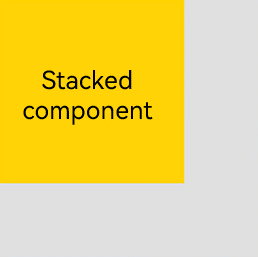
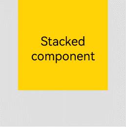
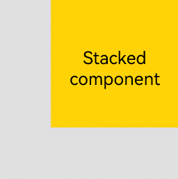
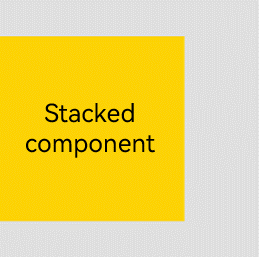
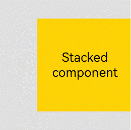
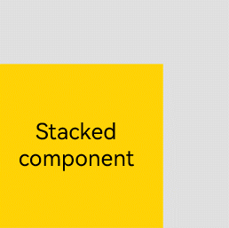
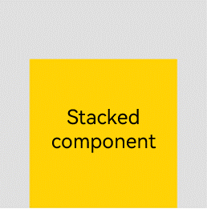
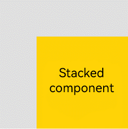
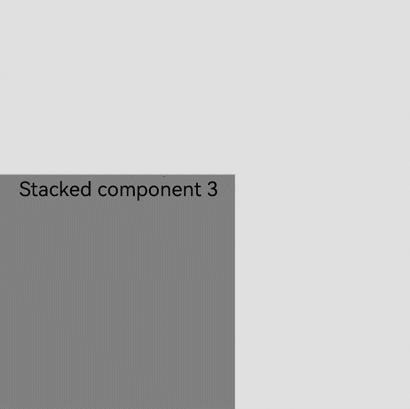
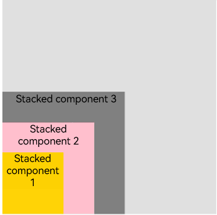

# Statck Layout

The stack layout reserves an area on the screen to display elements in a component and allows the elements to be stacked.
You can implement a stack layout through the **[\<Stack>](../reference/arkui-ts/ts-container-stack.md)** component, which provides a stack container where child components are successively stacked and the latter one overwrites the previous one.

## Alignment

Child components in the container can be aligned in any of the alignment modes described in the table below.

|Name|    Description| Image|
|---|---|---|
|TopStart|    Top start.||
|Top    |Horizontally centered on the top.||
|TopEnd|    Top end.||
|Start|    Vertically centered start.||
|Center|    Horizontally and vertically centered.||
|End|    Vertically centered end.||
|BottomStart    |Bottom start.||
|Bottom|    Horizontally centered on the bottom.||
|BottomEnd|    Bottom end.||

## Z-order Control

You can use the **[zIndex](../reference/arkui-ts/ts-universal-attributes-z-order.md)** attribute to set the z-order of a component in the stacking context,
so as to create a custom stacking order of the child components. A larger **zIndex** value indicates a higher display level.

- In the statck layout, if the size of a component is greater than that of the one before it, the one before it is hidden.

    ```ts
    Stack({ alignContent: Alignment.BottomStart }) {
        Column() {
          Text ('Stacked component 1').textAlign (TextAlign.End).fontSize (20)
        }.width(100).height(100).backgroundColor(0xffd306)
        Column() {
          Text ('Stacked component 2').fontSize (20)
        }.width(150).height(150).backgroundColor(Color.Pink)
        Column() {
          Text ('Stacked component 3').fontSize (20)
        }.width(200).height(200).backgroundColor(Color.Grey)
    }.margin({ top: 100 }).width(350).height(350).backgroundColor(0xe0e0e0)
    ```

  

  In the preceding figure, the size of the stacked component 3 is greater than that of all the components before it. Therefore, the first two components are completely hidden. To show these components, modify their **zIndex** attribute settings.

    ```ts
    Stack({ alignContent: Alignment.BottomStart }) {
        Column() {
          Text ('Stacked component 1').textAlign (TextAlign.End).fontSize (20)
        }.width(100).height(100).backgroundColor(0xffd306).zIndex(2)
        Column() {
          Text ('Stacked component 2').fontSize (20)
        }.width(150).height(150).backgroundColor(Color.Pink).zIndex(1)
        Column() {
          Text ('Stacked component 3').fontSize (20)
        }.width(200).height(200).backgroundColor(Color.Grey)
    }.margin({ top: 100 }).width(350).height(350).backgroundColor(0xe0e0e0)
    ```
  
    
