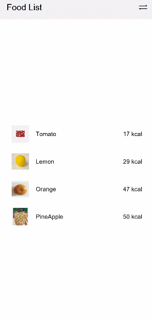
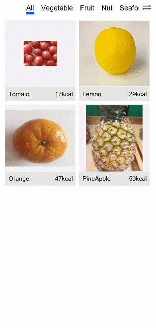
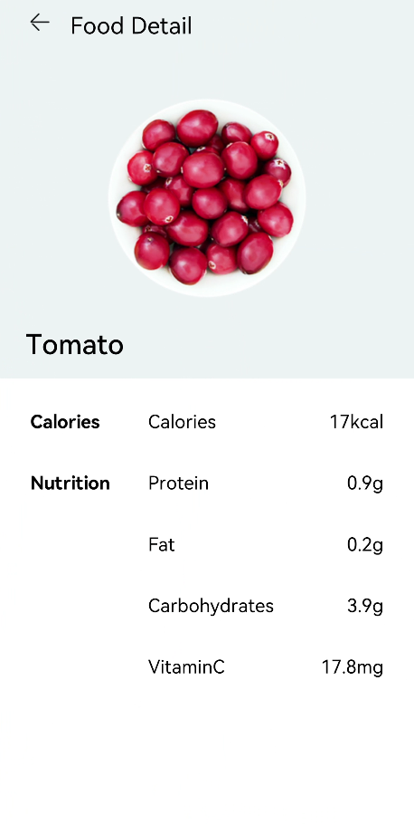

# Implementing Page Redirection and Data Transmission


This section describes how to implement page redirection and data transmission between pages:


1. Page redirection: Click a food item on the food list page to go to the food details page. Click the back button on the food details page to go back to the food list page.

2. Data transmission between pages: After you click a food item, FoodDetail receives data from the previous page and renders the corresponding food details page.


## Page Redirection

The declarative UI paradigm provides two mechanisms for page redirection:

1. Navigator: encapsulates the page routing capability. After the page target is specified, all child components in the page target have the routing capability.

2. Router APIs: called to implement various operations of page routing. You'll need to import router before calling the router APIs.

The procedure below uses these two mechanisms for redirection between the page list page and food details page.

1. Click FoodListItem. The FoodDetail page is displayed. Create a Navigator component in FoodListItem to enable its child components to have the routing function. The target page is 'pages/FoodDetail'.

   ```
   @Component
   struct FoodListItem {
     private foodItem: FoodData
     build() {
       Navigator({ target: 'pages/FoodDetail' }) {
         Flex({ justifyContent: FlexAlign.Start, alignItems: ItemAlign.Center }) {
           Image(this.foodItem.image)
             .objectFit(ImageFit.Contain)
             .height(40)
             .width(40)
             .backgroundColor('#FFf1f3f5')
             .margin({ right: 16 })
           Text(this.foodItem.name)
             .fontSize(14)
             .flexGrow(1)
           Text(this.foodItem.calories + ' kcal')
             .fontSize(14)
         }
         .height(64)
       }
       .margin({ right: 24, left:32 })
     }
   }
   ```

   

2. Click FoodGridItem. The FoodDetail page is displayed. Import the router module, and then call the push API of this module to push the FoodDetail page to the route stack to implement page redirection.

   ```
   import router from '@system.router'

   @Component
   struct FoodGridItem {
     private foodItem: FoodData
     build() {
       Column() {
         ......
       }
       .height(184)
       .width('100%')
       .onClick(() => {
         router.push({ uri: 'pages/FoodDetail' })
       })
     }
   }
   ```

   

3. Add the icon for returning from the FoodDetail page to the food list page. Save the Back.png file to the resources > base > media directory. Create a custom component PageTitle, which contains the back icon and Food Detail text. Call the router.back() API of the router to display the top page of the route stack, that is, the upper-level page.

   ```
   // FoodDetail.ets
   import router from '@system.router'

   @Component
   struct PageTitle {
       build() {
           Flex({ alignItems: ItemAlign.Start }) {
               Image($r('app.media.Back'))
                   .width(21.8)
                   .height(19.6)
               Text('Food Detail')
                   .fontSize(21.8)
                   .margin({left: 17.4})
           }
           .height(61)
           .backgroundColor('#FFedf2f5')
           .padding({ top: 13, bottom: 15, left: 28.3 })
           .onClick(() => {
               router.back()
           })
       }
   }
   ```

4. Create the Stack component in the FoodDetail component, including the FoodImageDisplay and PageTitle child components. Set the alignment mode to TopStart.

   ```
   @Entry
   @Component
   struct FoodDetail {
     build() {
       Column() {
         Stack( { alignContent: Alignment.TopStart }) {
           FoodImageDisplay()
           PageTitle()
         }
         ContentTable()
       }
       .alignItems(HorizontalAlign.Center)
     }
   }
   ```

   


## Data Transmission Between Pages

We have implemented the redirection and going back of the FoodCategoryList and FoodDetail pages. At this point, the tomato details page is displayed no matter which FoodListItem/FoodGridItem is clicked. This is because the data transmission between pages is not yet configured. To configure data transmission between pages, set the routing with parameters as follows:

1. Set the params attribute in the Navigator of the FoodListItem component. The params attribute accepts the key-value object.

   ```
   // FoodList.ets
   @Component
   struct FoodListItem {
     private foodItem: FoodData
     build() {
       Navigator({ target: 'pages/FoodDetail' }) {
         ......
       }
       .params({ foodData: this.foodItem })
     }
   }
   ```

   The router API called by FoodGridItem also has the capability of redirection with parameters. The method of using the router API is similar to that of using the Navigator.


   ```
   router.push({
     uri: 'pages/FoodDetail',
     params: { foodData: this.foodItem }
   })
   ```

2. Import the FoodData class to the FoodDetail page and add the foodItem member variable to the FoodDetail component.

   ```
   // FoodDetail.ets
   import { FoodData } from '../model/FoodData'

   @Entry
   @Component
   struct FoodDetail {
     private foodItem: FoodData
     build() {
       ......
     }
   }
   ```

3. Obtain the value of foodData. Call router.getParams().foodData to obtain the data corresponding to foodData carried when the FoodCategoryList page is displayed.

   ```
   @Entry
   @Component
   struct FoodDetail {
     private foodItem: FoodData = router.getParams().foodData

     build() {
       ......
     }
   }
   ```

4. Re-build the components on the FoodDetail page. During building, the food information on the FoodDetail page is all directly declared constants. You need to use the passed FoodData data to assign a new value to the constants. The code is as follows:

   ```
   @Component
   struct PageTitle {
       build() {
           Flex({ alignItems: ItemAlign.Start }) {
               Image($r('app.media.Back'))
                   .width(21.8)
                   .height(19.6)
               Text('Food Detail')
                   .fontSize(21.8)
                   .margin({left: 17.4})
           }
           .height(61)
           .backgroundColor('#FFedf2f5')
           .padding({ top: 13, bottom: 15, left: 28.3 })
           .onClick(() => {
               router.back()
           })
       }
   }

   @Component
   struct FoodImageDisplay {
     private foodItem: FoodData
     build() {
       Stack({ alignContent: Alignment.BottomStart }) {
         Image(this.foodItem.image)
           .objectFit(ImageFit.Contain)
         Text(this.foodItem.name)
           .fontSize(26)
           .fontWeight(500)
           .margin({ left: 26, bottom: 17.4 })
       }
       .height(357)
       .backgroundColor('#FFedf2f5')
     }
   }

   @Component
   struct ContentTable {
     private foodItem: FoodData

     @Builder IngredientItem(title:string, name: string, value: string) {
       Flex() {
         Text(title)
           .fontSize(17.4)
           .fontWeight(FontWeight.Bold)
           .layoutWeight(1)
         Flex() {
           Text(name)
             .fontSize(17.4)
             .flexGrow(1)
           Text(value)
             .fontSize(17.4)
         }
         .layoutWeight(2)
       }
     }

     build() {
       Flex({ direction: FlexDirection.Column, justifyContent: FlexAlign.SpaceBetween, alignItems: ItemAlign.Start }) {
         this.IngredientItem('Calories', 'Calories', this.foodItem.calories + 'kcal')
         this.IngredientItem('Nutrition', 'Protein', this.foodItem.protein + 'g')
         this.IngredientItem('', 'Fat', this.foodItem.fat + 'g')
         this.IngredientItem('', 'Carbohydrates', this.foodItem.carbohydrates + 'g')
         this.IngredientItem('', 'VitaminC', this.foodItem.vitaminC + 'mg')
       }
       .height(280)
       .padding({ top: 30, right: 30, left: 30 })
     }
   }

   @Entry
   @Component
   struct FoodDetail {
     private foodItem: FoodData = router.getParams().foodData

     build() {
       Column() {
         Stack( { alignContent: Alignment.TopStart }) {
           FoodImageDisplay({ foodItem: this.foodItem })
           PageTitle()
         }
         ContentTable({ foodItem: this.foodItem })
       }
       .alignItems(HorizontalAlign.Center)
     }
   }
   ```
