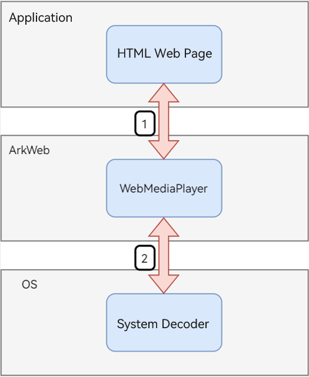
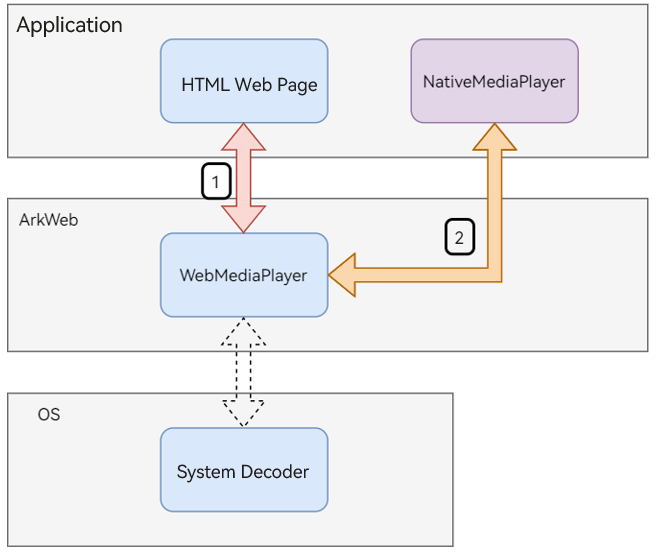
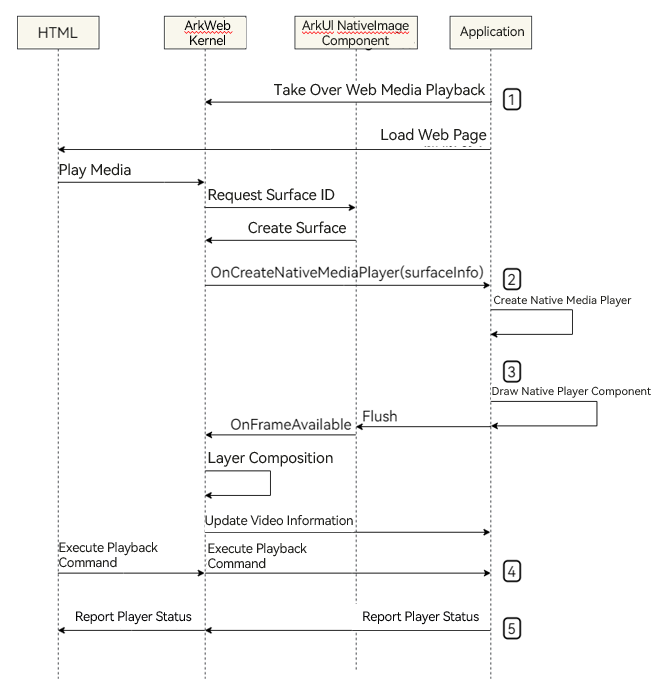

# Taking Over the Media Playback on Web Pages

The **Web** component provides the capability for applications to take over web media player, so that applications can better enhance web media playback capabilities (for example, image quality).

## When to Use

There are unsatisfactory scenarios when media is played on a web page, such as unclear video quality, overly simplistic and feature-lacking web player interface, or even videos that cannot be played. 

In this case, if you want to improve the web media playback experience by taking over web media playback with your own or third-party players, you can utilize this functionality.

## Implementation Principle

### Framework for the ArkWeb Kernel to Play Media

When this functionality is disabled, the playback architecture of the ArkWeb kernel is as follows:

  

  > **NOTE**
  > - In the preceding figure, step 1 indicates that the ArkWeb kernel creates a **WebMdiaPlayer** to play media resources on web pages.
  > - Step 2 indicates that the **WebMdiaPlayer** uses the system decoder to render media data.

When this functionality is enabled, the playback architecture of the ArkWeb kernel is as follows:

  

  > **NOTE**
  > - In the preceding figure, step 1 indicates that the ArkWeb kernel creates a **WebMdiaPlayer** to play media resources on web pages.
  > - Step 2 indicates that the **WebMdiaPlayer** uses the **NativeMediaPlayer** provided by the application to render media data.


### Interactions Between the ArkWeb Kernel and Application

  

  > **NOTE**
  > - For details about step 1 in the preceding figure, see [Enabling Web Media Playback Takeover](#enabling-web-media-playback-takeover).
  > - For details about step 2, see [Creating a Native Media Player](#creating-a-native-media-player).
  > - For details about step 3, see [Drawing Native Media Player Components](#drawing-native-media-player-components).
  > - For details about step 4, see [Executing Playback Control Commands Sent by ArkWeb Kernel to the Native Media Player](#executing-playback-control-commands-sent-by-arkweb-kernel-to-the-native-media-player).
  > - For details about step 5, see [Notifying the State Information of Native Media Player to the ArkWeb Kernel](#notifying-the-state-information-of-native-media-player-to-the-arkweb-kernel).

## How to Develop

### Enabling Web Media Playback Takeover

To take over web media playback, you need to enable this functionality 

using [enableNativeMediaPlayer](../reference/apis-arkweb/ts-basic-components-web.md#enablenativemediaplayer12).

  ```ts
  // xxx.ets
  import { webview } from '@kit.ArkWeb';

  @Entry
  @Component
  struct WebComponent {
    controller: webview.WebviewController = new webview.WebviewController();

    build() {
      Column() {
        Web({ src: 'www.example.com', controller: this.controller })
          .enableNativeMediaPlayer({ enable: true, shouldOverlay: false })
      }
    }
  }
  ```

For details about the API and parameters, see [enableNativeMediaPlayer](../reference/apis-arkweb/ts-basic-components-web.md#enablenativemediaplayer12).

### Creating a Native Media Player

Once this functionality is enabled, the ArkWeb kernel triggers the callback function registered by [onCreateNativeMediaPlayer](../reference/apis-arkweb/js-apis-webview.md#oncreatenativemediaplayer12) each time a media file needs to be played on a web page.

You need to register a callback function for creating a native media player by invoking **onCreateNativeMediaPlayer**.

The callback function determines whether to create a native media player to take over the web page media resources based on the media information.

  * If the application does not take over the web page media resource, **null** is returned in the callback function.
  * If the application takes over the web page media resource, a native media player instance is returned in the callback function.

The native media player needs to implement the [NativeMediaPlayerBridge](../reference/apis-arkweb/js-apis-webview.md#nativemediaplayerbridge12) API so that the ArkWeb kernel can control the playback on the native media player.

  ```ts
  // xxx.ets
  import { webview } from '@kit.ArkWeb';

  // Implement the webview.NativeMediaPlayerBridge API.
  // The ArkWeb kernel calls the APIs to control playback on NativeMediaPlayer.
  class NativeMediaPlayerImpl implements webview.NativeMediaPlayerBridge {
    // ...Implement the APIs in NativeMediaPlayerBridge...
    constructor(handler: webview.NativeMediaPlayerHandler, mediaInfo: webview.MediaInfo) {}
    updateRect(x: number, y: number, width: number, height: number) {}
    play() {}
    pause() {}
    seek(targetTime: number) {}
    release() {}
    setVolume(volume: number) {}
    setMuted(muted: boolean) {}
    setPlaybackRate(playbackRate: number) {}
    enterFullscreen() {}
    exitFullscreen() {}
  }

  @Entry
  @Component
  struct WebComponent {
    controller: webview.WebviewController = new webview.WebviewController();

    build() {
      Column() {
        Web({ src: 'www.example.com', controller: this.controller })
          .enableNativeMediaPlayer({ enable: true, shouldOverlay: false })
          .onPageBegin((event) => {
            this.controller.onCreateNativeMediaPlayer((handler: webview.NativeMediaPlayerHandler, mediaInfo: webview.MediaInfo) => {
              // Determine whether to take over the media.
              if (!shouldHandle(mediaInfo)) {
                // The native media player does not take over the media.
                // Return null. The ArkWeb kernel will play the media with the web media player.
                return null;
              }
              // Take over the web media.
              // Return a native media player instance to the ArkWeb kernel.
              let nativePlayer: webview.NativeMediaPlayerBridge = new NativeMediaPlayerImpl(handler, mediaInfo);
              return nativePlayer;
            });
          })
      }
    }
  }

  // stub
  function shouldHandle(mediaInfo: webview.MediaInfo) {
    return true;
  }
  ```

For details about the APIs and parameters, see [onCreateNativeMediaPlayer](../reference/apis-arkweb/js-apis-webview.md#oncreatenativemediaplayer12).

### Drawing Native Media Player Components

When the application takes over the media of the web page, you need to draw the native media player components and video images on the surface provided by the ArkWeb kernel.

Then the ArkWeb kernel combines the surface with the web page and displays the web page on the screen.

This process is the same as that of [Rendering and Drawing XComponent+AVPlayer and Button Components at the Same Layer](web-same-layer.md#)


1. Save the **UIContext** when the application is started, which will be used in the subsequent rendering and drawing at the same layer.

   ```ts
   // xxxAbility.ets

   import { UIAbility } from '@kit.AbilityKit';
   import { window } from '@kit.ArkUI';

   export default class EntryAbility extends UIAbility {
     onWindowStageCreate(windowStage: window.WindowStage): void {
       windowStage.loadContent('pages/Index', (err, data) => {
         if (err.code) {
           return;
         }
         // Save the UIContext, which will be used in subsequent rendering and drawing at the same layer.
         AppStorage.setOrCreate<UIContext>("UIContext", windowStage.getMainWindowSync().getUIContext());
       });
     }

     // ...Other APIs that need to be overridden...
   }
   ```

2. Use the surface created by the ArkWeb kernel is for rendering and drawing at the same layer.

   ```ts
   // xxx.ets
   import { webview } from '@kit.ArkWeb';
   import { BuilderNode, FrameNode, NodeController, NodeRenderType } from '@kit.ArkUI';

   interface ComponentParams {}

   class MyNodeController extends NodeController {
     private rootNode: BuilderNode<[ComponentParams]> | undefined;

     constructor(surfaceId: string, renderType: NodeRenderType) {
       super();

       // Obtain the saved UIContext.
       let uiContext = AppStorage.get<UIContext>("UIContext");
       this.rootNode = new BuilderNode(uiContext as UIContext, { surfaceId: surfaceId, type: renderType });
     }

     makeNode(uiContext: UIContext): FrameNode | null {
       if (this.rootNode) {
         return this.rootNode.getFrameNode() as FrameNode;
       }
       return null;
     }

     build() {
       // Construct the native media player component.
     }
   }

   @Entry
   @Component
   struct WebComponent {
     node_controller?: MyNodeController;
     controller: webview.WebviewController = new webview.WebviewController();
     @State show_native_media_player: boolean = false;

     build() {
       Column() {
         Stack({ alignContent: Alignment.TopStart }) {
           if (this.show_native_media_player) {
             NodeContainer(this.node_controller)
               .width(300)
               .height(150)
               .backgroundColor(Color.Transparent)
               .border({ width: 2, color: Color.Orange })
           }
           Web({ src: 'www.example.com', controller: this.controller })
             .enableNativeMediaPlayer({ enable: true, shouldOverlay: false })
             .onPageBegin((event) => {
               this.controller.onCreateNativeMediaPlayer((handler: webview.NativeMediaPlayerHandler, mediaInfo:    webview.MediaInfo) => {
                 // Take over the web media.

                 // Use the surface provided by the rendering at the same layer to construct a native media player component.
                 this.node_controller = new MyNodeController(mediaInfo..surfaceInfo.id, NodeRenderType.  RENDER_TYPE_TEXTURE);
                 this.node_controller.build();

                 // Show the native media player component.
                 this.show_native_media_player = true;

                 // Return a native media player instance to the ArkWeb kernel.
                 return null;
               });
             })
         }
       }
     }
   }
   ```

For details about how to dynamically create components and draw them on the surface, see [Rendering and Drawing XComponent+AVPlayer and Button Components at the Same Layer](web-same-layer.md#).

### Executing Playback Control Commands Sent by ArkWeb Kernel to the Native Media Player

To facilitate the control over native media player by the ArkWeb kernel, you need to implement the [NativeMediaPlayerBridge](../reference/apis-arkweb/js-apis-webview.md#nativemediaplayerbridge12) API on the native media player and perform operations on the native media player based on the functionality of each API.

  ```ts
  // xxx.ets
  import { webview } from '@kit.ArkWeb';

  class ActualNativeMediaPlayerListener {
    constructor(handler: webview.NativeMediaPlayerHandler) {}
  }

  class NativeMediaPlayerImpl implements webview.NativeMediaPlayerBridge {
    constructor(handler: webview.NativeMediaPlayerHandler, mediaInfo: webview.MediaInfo) {
      // 1. Create a listener for the native media player.
      let listener: ActualNativeMediaPlayerListener = new ActualNativeMediaPlayerListener(handler);
      // 2. Create a native media player.
      // 3. Listen for the local player.
      // ...
    }

    updateRect(x: number, y: number, width: number, height: number) {
      // The position and size of the <video> tag are changed.
      // Make changes based on the information change.
    }

    play() {
      // Starts the native media player for playback.
    }

    pause() {
      // Pause the playback.
    }

    seek(targetTime: number) {
      // The native media player seeks to the target playback time.
    }

    release() {
      // Destroy the native media player.
    }

    setVolume(volume: number) {
      // The ArkWeb kernel adjusts the volume of the native media player.
      // Set the volume of the native media player.
    }

    setMuted(muted: boolean) {
      // Mute or unmute the native media player.
    }

    setPlaybackRate(playbackRate: number) {
      // Set the playback rate of the native media player.
    }

    enterFullscreen() {
      // Enter the full-screen mode.
    }

    exitFullscreen() {
      // Exit the full-screen mode.
    }
  }
  ```

For details about the APIs, see [NativeMediaPlayerBridge](../reference/apis-arkweb/js-apis-webview.md#nativemediaplayerbridge12).

### Notifying the State Information of Native Media Player to the ArkWeb Kernel

The ArkWeb kernel requires the state information of the local player to update to the web page, such as the width and height of the video, playback time, and cache time. You need to notify the ArkWeb kernel of the state information of the native media player.

Through the [onCreateNativeMediaPlayer](../reference/apis-arkweb/js-apis-webview.md#oncreatenativemediaplayer12) API, the Ark Web kernel passes a [NativeMediaPlayerHandler](../reference/apis-arkweb/js-apis-webview.md#nativemediaplayerhandler12) object to the application.

You need to use this object to notify the ArkWeb kernel of the latest state information of the native media player.

  ```ts
  // xxx.ets
  import { webview } from '@kit.ArkWeb';

  class ActualNativeMediaPlayerListener {
    handler: webview.NativeMediaPlayerHandler;

    constructor(handler: webview.NativeMediaPlayerHandler) {
      this.handler = handler;
    }

    onPlaying() {
      // The native media player starts playback.
      this.handler.handleStatusChanged(webview.PlaybackStatus.PLAYING);
    }
    onPaused() {
      // The native media player pauses the playback.
      this.handler.handleStatusChanged(webview.PlaybackStatus.PAUSED);
    }
    onSeeking() {
      // The native media player starts to seek the target time point.
      this.handler.handleSeeking();
    }
    onSeekDone() {
      // The target time point is sought.
      this.handler.handleSeekFinished();
    }
    onEnded() {
      // The playback on the native media player is ended.
      this.handler.handleEnded();
    }
    onVolumeChanged() {
      // Obtain the volume of the native media player.
      let volume: number = getVolume();
      this.handler.handleVolumeChanged(volume);
    }
    onCurrentPlayingTimeUpdate() {
      // Update the playback time.
      let currentTime: number = getCurrentPlayingTime();
      // Convert the time unit to second.
      let currentTimeInSeconds = convertToSeconds(currentTime);
      this.handler.handleTimeUpdate(currentTimeInSeconds);
    }
    onBufferedChanged() {
      // The buffer is changed.
      // Obtain the cache duration of the native media player.
      let bufferedEndTime: number = getCurrentBufferedTime();
      // Convert the time unit to second.
      let bufferedEndTimeInSeconds = convertToSeconds(bufferedEndTime);
      this.handler.handleBufferedEndTimeChanged(bufferedEndTimeInSeconds);

      // Check the cache state.
      // If the cache state changes, notify the ArkWeb kernel.
      let lastReadyState: webview.ReadyState = getLastReadyState();
      let currentReadyState: webview.ReadyState = getCurrentReadyState();
      if (lastReadyState != currentReadyState) {
        this.handler.handleReadyStateChanged(currentReadyState);
      }
    }
    onEnterFullscreen() {
      // The native media player enters the full-screen mode.
      let isFullscreen: boolean = true;
      this.handler.handleFullscreenChanged(isFullscreen);
    }
    onExitFullscreen() {
      // The native media player exits the full-screen mode.
      let isFullscreen: boolean = false;
      this.handler.handleFullscreenChanged(isFullscreen);
    }
    onUpdateVideoSize(width: number, height: number) {
      // Notify the ArkWeb kernel when the local player parses the video width and height.
      this.handler.handleVideoSizeChanged(width, height);
    }

    // ...Listen for other state of the native media player.
  }
  @Entry
  @Component
  struct WebComponent {
    controller: webview.WebviewController = new webview.WebviewController();
    @State show_native_media_player: boolean = false;

    build() {
      Column() {
        Web({ src: 'www.example.com', controller: this.controller })
          .enableNativeMediaPlayer({enable: true, shouldOverlay: false})
          .onPageBegin((event) => {
            this.controller.onCreateNativeMediaPlayer((handler: webview.NativeMediaPlayerHandler, mediaInfo: webview.MediaInfo) => {
              // Take over the web media.

              // Create a native media player instance.
              // let nativePlayer: NativeMediaPlayerImpl = new NativeMediaPlayerImpl(handler, mediaInfo);

              // Create a listener for the native media player state. 
              let nativeMediaPlayerListener: ActualNativeMediaPlayerListener = new ActualNativeMediaPlayerListener(handler);
              // Listen for the native media player state.
              // nativePlayer.setListener(nativeMediaPlayerListener);

              // Return the native media player instance to the ArkWeb kernel.
              return null;
            });
          })
      }
    }
  }

  // stub
  function getVolume() {
    return 1;
  }
  function getCurrentPlayingTime() {
    return 1;
  }
  function getCurrentBufferedTime() {
    return 1;
  }
  function convertToSeconds(input: number) {
    return input;
  }
  function getLastReadyState() {
    return webview.ReadyState.HAVE_NOTHING;
  }
  function getCurrentReadyState() {
    return webview.ReadyState.HAVE_NOTHING;
  }
  ```


For details about the APIs, see [NativeMediaPlayerHandler](../reference/apis-arkweb/js-apis-webview.md#nativemediaplayerhandler12).


## Sample Code

- Add the following permissions to **module.json5** before using it:

  ```ts
  "ohos.permission.INTERNET"
  ```

- Example of saving **UIContext** during application startup on the application side:

  ```ts
  // xxxAbility.ets

  import { UIAbility } from '@kit.AbilityKit';
  import { window } from '@kit.ArkUI';

  export default class EntryAbility extends UIAbility {
    onWindowStageCreate(windowStage: window.WindowStage): void {
      windowStage.loadContent('pages/Index', (err, data) => {
        if (err.code) {
          return;
        }
        // Save the UIContext, which will be used in subsequent rendering and drawing at the same layer.
        AppStorage.setOrCreate<UIContext>("UIContext", windowStage.getMainWindowSync().getUIContext());
      });
    }

    // ...Other APIs that need to be overridden...
  }
  ```

- Example of web media playback takeover:

  ```ts
  import { webview } from '@kit.ArkWeb';
  import { BuilderNode, FrameNode, NodeController, NodeRenderType, UIContext } from '@kit.ArkUI';
  import { AVPlayerDemo, AVPlayerListener } from './PlayerDemo';

  // Implement the webview.NativeMediaPlayerBridge API.
  // The ArkWeb kernel calls the APIs to control playback on NativeMediaPlayer.
  class NativeMediaPlayerImpl implements webview.NativeMediaPlayerBridge {
    private surfaceId: string;
    mediaSource: string;
    private mediaHandler: webview.NativeMediaPlayerHandler;
    web: WebComponent;
    nativePlayer?: AVPlayerDemo;

    constructor(web: WebComponent, handler: webview.NativeMediaPlayerHandler, mediaInfo: webview.MediaInfo) {
      console.log('NativeMediaPlayerImpl.constructor, surface_id[' + mediaInfo.surfaceInfo.id + ']');
      this.web = web;
      this.mediaHandler = handler;
      this.surfaceId = mediaInfo.surfaceInfo.id;
      this.mediaSource = mediaInfo.mediaSrcList[0].source;

      // Use the rendering function at the same layer to draw the video and its playback control components to the web page.
      this.web.node_controller = new MyNodeController(
          this.web, this.surfaceId, this.mediaHandler, this, NodeRenderType.RENDER_TYPE_TEXTURE)
      this.web.node_controller.build()
      this.web.show_native_media_player = true;

      console.log('NativeMediaPlayerImpl.mediaSource : ' + this.mediaSource);
    }

    setNativePlayer(nativePlayer: AVPlayerDemo) {
      this.nativePlayer = nativePlayer;
    }

    updateRect(x: number, y: number, width: number, height: number): void {
      this.web.node_width = width
      this.web.node_height = height
    }

    play() {
      this.nativePlayer?.play();
    }
    pause() {
      this.nativePlayer?.pause();
    }
    seek(targetTime: number) {
    }
    setVolume(volume: number) {
    }
    setMuted(muted: boolean) {
    }
    setPlaybackRate(playbackRate: number) {
    }
    release() {
      this.nativePlayer?.release();
      this.web.show_native_media_player = false;
    }
    enterFullscreen() {
    }
    exitFullscreen() {
    }
  }

  // Listen for the NativeMediaPlayer state and report the state to the ArkWeb kernel using webview.NativeMediaPlayerHandler.
  class AVPlayerListenerImpl implements AVPlayerListener {
    handler: webview.NativeMediaPlayerHandler;
    component: NativePlayerComponent;

    constructor(handler: webview.NativeMediaPlayerHandler, component: NativePlayerComponent) {
      this.handler = handler;
      this.component = component;
    }
    onPlaying() {
      this.handler.handleStatusChanged(webview.PlaybackStatus.PLAYING);
    }
    onPaused() {
      this.handler.handleStatusChanged(webview.PlaybackStatus.PAUSED);
    }
    onDurationChanged(duration: number) {
      this.handler.handleDurationChanged(duration);
    }
    onBufferedTimeChanged(buffered: number) {
      this.handler.handleBufferedEndTimeChanged(buffered);
    }
    onTimeUpdate(time: number) {
      this.handler.handleTimeUpdate(time);
    }
    onEnded() {
      this.handler.handleEnded();
    }
    onError() {
      this.handler.handleError(1, "Oops!");
    }
    onVideoSizeChanged(width: number, height: number) {
      this.handler.handleVideoSizeChanged(width, height);
      this.component.onSizeChanged(width, height);
    }
  }

  interface Params {
    text: string
    text2: string
    web_tab: WebComponent
    handler: webview.NativeMediaPlayerHandler
    player: NativeMediaPlayerImpl
  }

  // Define the player components.
  @Component
  struct NativePlayerComponent {
    params?: Params
    @State bkColor: Color = Color.Red
    mXComponentController: XComponentController = new XComponentController();
    @State player_changed: boolean = false;

    videoController: VideoController = new VideoController();
    player?: AVPlayerDemo
    offset_x: number = 0
    offset_y: number = 0
    @State video_width_percent: number = 100;
    @State video_height_percent: number = 100;
    view_width: number = 0;
    view_height: number = 0;
    video_width: number = 0;
    video_height: number = 0;

    fullscreen: boolean = false;

    onSizeChanged(width: number, height: number) {
      this.video_width = width;
      this.video_height = height;
      let scale: number = this.view_width / width;
      let scaled_video_height: number = scale * height;
      this.video_height_percent = scaled_video_height / this.view_height * 100;
    }

    build() {
      Column() {
        Stack() {
          XComponent({ id: 'video_player_id', type: XComponentType.SURFACE, controller: this.mXComponentController })
            .width(this.video_width_percent + '%')
            .height(this.video_height_percent + '%')
            .border({ width: 1, color: Color.Red })
            .onLoad(()=>{
              if (!this.params) {
                console.log('this.params is null');
                return;
              }
              this.player = new AVPlayerDemo();
              this.params.player?.setNativePlayer(this.player);
              this.player.setSurfaceID(this.mXComponentController.getXComponentSurfaceId());
              this.player_changed = !this.player_changed;

              this.player.avPlayerLiveDemo(
                this.params.player.mediaSource,
                new AVPlayerListenerImpl(this.params.handler, this));
            })
          Column() {
            Row() {
              Button(this.params?.text)
                .height(50)
                .border({ width: 2, color: Color.Red })
                .backgroundColor(this.bkColor)
                .onClick(()=>{
                  console.log('[BrowserShell] Button[' + this.params?.text + '] is clicked');
                  this.player?.play();
                })
                .onTouch((event: TouchEvent) => {
                  event.stopPropagation();
                })
              Button(this.params?.text2)
                .height(50)
                .border({ width: 2, color: Color.Red })
                .onClick(()=>{
                  console.log('[BrowserShell] Button[' + this.params?.text2 + '] is clicked');
                  this.player?.pause();
                })
                .onTouch((event: TouchEvent) => {
                  event.stopPropagation();
                })
            }
            .width('100%')
            .justifyContent(FlexAlign.SpaceEvenly)
          }
        }
      }
      .width('100%')
      .height('100%')
      .onTouchIntercept((event : TouchEvent) => {
        return HitTestMode.None
      })
      .onAreaChange((oldValue: Area, newValue: Area) => {
        this.view_width = new Number(newValue.width).valueOf()
        this.view_height = new Number(newValue.height).valueOf()

        this.onSizeChanged(this.video_width, this.video_height);
      })
    }
  }

  @Builder
  function NativePlayerComponentBuilder(params: Params) {
    NativePlayerComponent({ params: params })
      .backgroundColor(Color.Green)
      .border({ width: 1, color: Color.Brown })
      .width('100%')
      .height('100%')
  }

  // Use NodeController to dynamically create a player component and draw the component content on the surface specified by surfaceId.
  class MyNodeController extends NodeController {
    private rootNode: BuilderNode<[Params]> | undefined;
    private isRemove = false;
    web_tab: WebComponent
    listener: webview.NativeMediaPlayerHandler
    player: NativeMediaPlayerImpl

    constructor(web_tab: WebComponent, surfaceId: string,  listener: webview.NativeMediaPlayerHandler, player: NativeMediaPlayerImpl, renderType: NodeRenderType) {
      super()
      this.web_tab = web_tab;
      this.listener = listener;
      this.player = player;
      let uiContext = AppStorage.get<UIContext>("UIContext");
      this.rootNode = new BuilderNode(uiContext as UIContext, { surfaceId: surfaceId, type: renderType });
    }

    makeNode(uiContext: UIContext): FrameNode | null {
      if (this.rootNode) {
        return this.rootNode.getFrameNode() as FrameNode;
      }
      return null;
    }

    build() {
      if (this.rootNode) {
        this.rootNode.build(wrapBuilder(NativePlayerComponentBuilder),
          { "text": "play", "text2": "pause", web_tab: this.web_tab, handler: this.listener, player: this.player})
      }
    }
  }

  interface PageBeginParam {
    url: string
  }

  @Entry
  @Component
  struct WebComponent {
    controller: WebviewController = new webview.WebviewController()
    nativePlayer? : webview.NativeMediaPlayerBridge
    page_url: Resource = $rawfile('main.html')
    node_controller?: MyNodeController
    @State show_native_media_player: boolean = false;
    @State node_width : number = 300;
    @State node_height : number = 150;
    area?: Area

    build() {
      Column() {
        Stack({alignContent: Alignment.TopStart}) {
          if (this.show_native_media_player) {
            NodeContainer(this.node_controller)
              .width(this.node_width + 'px')
              .height(this.node_height + 'px')
              .backgroundColor(Color.Transparent)
              .border({ width: 2, color: Color.Orange })
          }
          Web({ src: this.page_url, controller: this.controller })
            .enableNativeMediaPlayer({ enable: true, shouldOverlay: true })
            .onPageBegin((event: PageBeginParam) => {
              this.controller.onCreateNativeMediaPlayer((handler: webview.NativeMediaPlayerHandler, mediaInfo: webview.MediaInfo) => {
                console.error('onCreateNativeMediaPlayer(' + JSON.stringify(mediaInfo) + ')');
                this.nativePlayer = new NativeMediaPlayerImpl(this, handler, mediaInfo);
                return this.nativePlayer;
              });
            })
            .width('100%')
            .height('100%')
            .onAreaChange((oldValue: Area, newValue: Area) => {
              oldValue;
              this.area = newValue;
            })
        }
      }
    }
  }
  ```

- Example of using video playback on the application side:

  ```ts
  import { media } from '@kit.MediaKit';
  import { common } from '@kit.AbilityKit';
  import { BusinessError } from '@kit.BasicServicesKit';

  export interface AVPlayerListener {
    onPlaying() : void
    onPaused() : void
    onDurationChanged(duration: number) : void
    onBufferedTimeChanged(buffered: number) : void
    onTimeUpdate(time: number) : void
    onEnded() : void
    onError() : void
    onVideoSizeChanged(width: number, height: number): void
  }

  export class AVPlayerDemo {
    private surfaceID: string = ''; // The surfaceID parameter specifies the window used to display the video. Its value is obtained through the XComponent.
    private isSeek: boolean = true; // Specify whether the seek operation is supported.
    private fileSize: number = -1;
    private fd: number = 0;

    avPlayer?: media.AVPlayer;

    setSurfaceID(surface_id: string) {
      console.log('setSurfaceID : ' + surface_id)
      this.surfaceID = surface_id;
    }
    // Set AVPlayer callback functions.
    setAVPlayerCallback(avPlayer: media.AVPlayer, listener?: AVPlayerListener) {
      // Callback function for the seek operation.
      avPlayer.on('seekDone', (seekDoneTime: number) => {
        console.info(`AVPlayer seek succeeded, seek time is ${seekDoneTime}`);
      })
      // Callback function for errors. If an error occurs during the operation on the AVPlayer, reset() is called to reset the AVPlayer.
      avPlayer.on('error', (err: BusinessError) => {
        console.error(`Invoke avPlayer failed, code is ${err.code}, message is ${err.message}`);
        listener?.onError();
        avPlayer.reset(); // Call reset() to reset the AVPlayer, which enters the idle state.
      })
      // Callback function for state changes.
      avPlayer.on('stateChange', async (state: string, reason: media.StateChangeReason) => {
        switch (state) {
          case 'idle': // This state is reported upon a successful callback of reset().
            console.info('AVPlayer state idle called.');
            avPlayer.release(); // Call release() to release the instance.
            break;
          case 'initialized': // This state is reported when the AVPlayer sets the playback source.
            console.info('AVPlayer state initialized called.');
            avPlayer.surfaceId = this.surfaceID; // Set the window to display the video. This setting is not required when a pure audio asset is to be played.
            avPlayer.prepare();
            break;
          case 'prepared': // This state is reported upon a successful callback of prepare().
            console.info('AVPlayer state prepared called.');
            //avPlayer.play();
            break;
          case 'playing': // This state is reported upon a successful callback of play().
            console.info('AVPlayer state playing called.');
            listener?.onPlaying();
            break;
          case 'paused': // This state is reported upon a successful callback of pause().
            console.info('AVPlayer state paused called.');
            listener?.onPaused();
            break;
          case 'completed': // This state is reported upon the completion of the playback.
            console.info('AVPlayer state completed called.');
            avPlayer.stop(); // Call stop() to stop the playback.
            //avPlayer.seek(0);
            //avPlayer.play();
            break;
          case 'stopped': // This state is reported upon a successful callback of stop().
            console.info('AVPlayer state stopped called.');
            listener?.onEnded();
            avPlayer.reset(); // Call reset() to reset the AVPlayer.
            break;
          case 'released':
            console.info('AVPlayer state released called.');
            break;
          default:
            console.info('AVPlayer state unknown called.');
            break;
        }
      })
      avPlayer.on('durationUpdate', (duration: number) => {
        console.info('AVPlayer state durationUpdate success,new duration is :' + duration)
        listener?.onDurationChanged(duration/1000);
      })
      avPlayer.on('timeUpdate', (time:number) => {
        listener?.onTimeUpdate(time/1000);
      })
      avPlayer.on('bufferingUpdate', (infoType: media.BufferingInfoType, value: number) => {
        console.info('AVPlayer state bufferingUpdate success,and infoType value is:' + infoType + ', value is :' + value)
        if (infoType == media.BufferingInfoType.BUFFERING_PERCENT) {
        }
        listener?.onBufferedTimeChanged(value);
      })
      avPlayer.on('videoSizeChange', (width: number, height: number) => {
        console.info('AVPlayer state videoSizeChange success,and width is:' + width + ', height is :' + height)
        listener?.onVideoSizeChanged(width, height);
      })
    }

    // The following demo shows how to play live streams by setting the network address through the URL.
    async avPlayerLiveDemo(url: string, listener?: AVPlayerListener) {
      // Create an AVPlayer instance.
      this.avPlayer = await media.createAVPlayer();
      // Set a callback function for state changes.
      this.setAVPlayerCallback(this.avPlayer, listener);
      this.isSeek = false; // The seek operation is not supported.
      this.avPlayer.url = url;
    }

    play() {
      console.info('AVPlayer.play()');
      this.avPlayer?.play()
    }
    pause() {
      console.info('AVPlayer.pause()');
      this.avPlayer?.pause()
    }
    release() {
      console.info('AVPlayer.release()');
      this.avPlayer?.release();
    }
    seek(time: number) {
      console.info('AVPlayer.seek(' + time + ')');
      this.avPlayer?.seek(time * 1000);
    }
  }
  ```

- Frontend page example.

  ```html
  <html>
  <head>
      <title>Video Hosting Test html</title>
      <meta name="viewport" content="width=device-width">
  </head>
  <body>
  <div>
    <video src='https://media.w3.org/2010/05/sintel/trailer.mp4'></video>
  </div>
  </body>
  </html>
  ```
