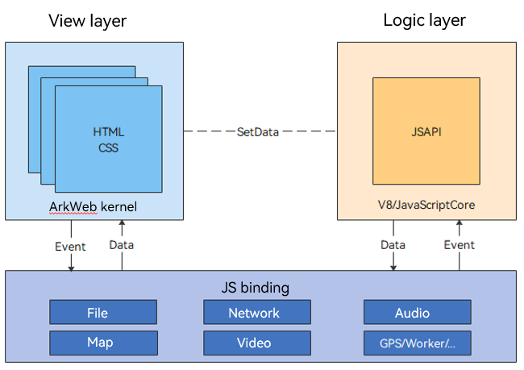
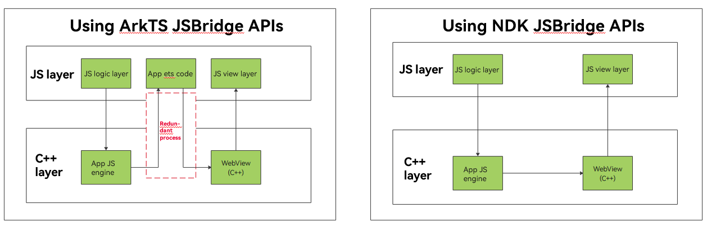

# Mutual Invoking Between the Application Side and Frontend Pages (C/C++)

This guide applies to the communication between the ArkWeb application side and frontend pages. You can use the ArkWeb native APIs to complete the service communication mechanism (JSBridge for short) based on the application architecture.

## Applicable Application Architecture

If an application is developed using ArkTS and C++ language, or if its architecture is close to that of a mini-program, with a built-in C++ environment, you are advised to use the [ArkWeb_ControllerAPI](../reference/apis-arkweb/_ark_web___controller_a_p_i.md#arkweb_controllerapi) and [ArkWeb_ComponentAPI](../reference/apis-arkweb/_ark_web___component_a_p_i.md#arkweb_componentapi) provided by ArkWeb on the native side to implement the JSBridge functionality.

  

  The preceding figure shows a general architecture of mini-programs with universal applicability. When the logic layer is run using the built-in JavaScript of the application, the native API can be used to communicate with the view layer (ArkWeb as the renderer) in the C++ environment. You do not need to call JSBridge-related APIs in the ArkTS environment.

  

  The native JSBridge APIs are provided to avoid unnecessary switching to the ArkTS environment and allow callback to be reported in non-UI threads to avoid UI blocking.

## Using Native APIs for JSBridge Communication

### ArkWeb Binding on the Native Side

* The **ArkWeb** component is declared on the ArkTS side. You need to define a **webTag** and transfer the **webTag** to the application C++ side using the NAPI. The **webTag** is used as the unique identifier of the corresponding component when an ArkWeb native API is used.

* ArkTS side:

  ```js
  // Define a webTag and transfer it as an input parameter when WebviewController is created to establish the mapping between controller and webTag.
  webTag: string = 'ArkWeb1';
  controller: web_webview.WebviewController = new web_webview.WebviewController(this.webTag);
  ...
  // Use aboutToAppear() to transfer the webTag to the C++ side through the NAPI API. The webTag uniquely identifies the ArkWeb component on the C++ side.
  aboutToAppear() {
    console.info("aboutToAppear")
    // Initialize the web NDK.
    testNapi.nativeWebInit(this.webTag);
  }
  ...
  ```

* C++ side:

  ```c++
  // Parse and store the webTag.
  static napi_value NativeWebInit(napi_env env, napi_callback_info info) {
      OH_LOG_Print(LOG_APP, LOG_INFO, LOG_PRINT_DOMAIN, "ArkWeb", "ndk NativeWebInit start");
      size_t argc = 1;
      napi_value args[1] = {nullptr};
      napi_get_cb_info(env, info, &argc, args, nullptr, nullptr);
      // Obtain the first parameter webTag.
      size_t webTagSize = 0;
      napi_get_value_string_utf8(env, args[0], nullptr, 0, &webTagSize);
      char *webTagValue = new (std::nothrow) char[webTagSize + 1];
      size_t webTagLength = 0;
      napi_get_value_string_utf8(env, args[0], webTagValue, webTagSize + 1, &webTagLength);
      OH_LOG_Print(LOG_APP, LOG_ERROR, LOG_PRINT_DOMAIN, "ArkWeb", "ndk NativeWebInit webTag:%{public}s", webTagValue);

      // Save the webTag in the instance object.
      jsbridge_object_ptr = std::make_shared<JSBridgeObject>(webTagValue);
  ...
  ```

### Obtaining the API Struct on the Native Side

You can obtain the native API of ArkWeb using the API [OH_ArkWeb_GetNativeAPI](../reference/apis-arkweb/_ark_web___any_native_a_p_i.md#arkweb_anynativeapi), and the function pointer structs [ArkWeb_ControllerAPI](../reference/apis-arkweb/_ark_web___controller_a_p_i.md#arkweb_controllerapi) and [ArkWeb_ComponentAPI](../reference/apis-arkweb/_ark_web___component_a_p_i.md#arkweb_componentapi) can be obtained based on the input parameter type. The [ArkWeb_ControllerAPI](../reference/apis-arkweb/_ark_web___controller_a_p_i.md#arkweb_controllerapi) corresponds to the [web_webview.WebviewController API](../reference/apis-arkweb/js-apis-webview.md) on ArkTS, and the [ArkWeb_ComponentAPI](../reference/apis-arkweb/_ark_web___component_a_p_i.md#arkweb_componentapi) corresponds to the [ArkWeb component API](../reference/apis-arkweb/ts-basic-components-web.md) on ArkTS.

  ```c++
  static ArkWeb_ControllerAPI *controller = nullptr;
  static ArkWeb_ComponentAPI *component = nullptr;
  ...
  controller = reinterpret_cast<ArkWeb_ControllerAPI *>(OH_ArkWeb_GetNativeAPI(ARKWEB_NATIVE_CONTROLLER));
  component = reinterpret_cast<ArkWeb_ComponentAPI *>(OH_ArkWeb_GetNativeAPI(ARKWEB_NATIVE_COMPONENT));
  ```

### Registering Component Lifecycle Callback on the Native Side

Use [ArkWeb Component API](../reference/apis-arkweb/_ark_web___component_a_p_i.md#arkweb_componentapi) to register the component lifecycle callback. To avoid crash caused by mismatch between the SDK and device ROM, you are advised to use [ARKWEB_MEMBER_MISSING](../reference/apis-arkweb/_web.md#arkweb_member_missing) to check whether there is a pointer to the function struct before calling an API.

  ```c++
  if (!ARKWEB_MEMBER_MISSING(component, onControllerAttached)) {
      component->onControllerAttached(webTagValue, ValidCallback,
                                      static_cast<void *>(jsbridge_object_ptr->GetWeakPtr()));
  } else {
      OH_LOG_Print(LOG_APP, LOG_ERROR, LOG_PRINT_DOMAIN, "ArkWeb", "component onControllerAttached func not exist");
  }

  if (!ARKWEB_MEMBER_MISSING(component, onPageBegin)) {
      component->onPageBegin(webTagValue, LoadStartCallback,
                                      static_cast<void *>(jsbridge_object_ptr->GetWeakPtr()));
  } else {
      OH_LOG_Print(LOG_APP, LOG_ERROR, LOG_PRINT_DOMAIN, "ArkWeb", "component onPageBegin func not exist");
  }

  if (!ARKWEB_MEMBER_MISSING(component, onPageEnd)) {
      component->onPageEnd(webTagValue, LoadEndCallback,
                                      static_cast<void *>(jsbridge_object_ptr->GetWeakPtr()));
  } else {
      OH_LOG_Print(LOG_APP, LOG_ERROR, LOG_PRINT_DOMAIN, "ArkWeb", "component onPageEnd func not exist");
  }

  if (!ARKWEB_MEMBER_MISSING(component, onDestroy)) {
      component->onDestroy(webTagValue, DestroyCallback,
                                      static_cast<void *>(jsbridge_object_ptr->GetWeakPtr()));
  } else {
      OH_LOG_Print(LOG_APP, LOG_ERROR, LOG_PRINT_DOMAIN, "ArkWeb", "component onDestroy func not exist");
  }
  ```

### Invoking Application Functions on the Frontend Page

Use [registerJavaScriptProxy](../reference/apis-arkweb/_ark_web___controller_a_p_i.md#registerjavascriptproxy) to register the application function with the frontend page. You are advised to register the function in callback [onControllerAttached](../reference/apis-arkweb/_ark_web___component_a_p_i.md#oncontrollerattached). In other cases, you need to call [refresh](../reference/apis-arkweb/_ark_web___controller_a_p_i.md#refresh) for the registration.

  ```c++
  // Register an object.
  OH_LOG_Print(LOG_APP, LOG_INFO, LOG_PRINT_DOMAIN, "ArkWeb", "ndk RegisterJavaScriptProxy begin");
  ArkWeb_ProxyMethod method1 = {"method1", ProxyMethod1, static_cast<void *>(jsbridge_object_ptr->GetWeakPt  ())};
  ArkWeb_ProxyMethod method2 = {"method2", ProxyMethod2, static_cast<void *>(jsbridge_object_ptr->GetWeakPt  ())};
  ArkWeb_ProxyMethod methodList[2] = {method1, method2};
  // Invoke the native API to register the object.
  // In this case, you can use proxy.method1 and proxy.method2 to call ProxyMethod1 and ProxyMethod2 in this file on the HTML5 side.
  ArkWeb_ProxyObject proxyObject = {"ndkProxy", methodList, 2};
  controller->registerJavaScriptProxy(webTag, &proxyObject);
  ```

### Invoking Frontend Page Functions on the Application

Use [runJavaScript](../reference/apis-arkweb/_ark_web___controller_a_p_i.md#runjavascript) to invoke frontend page functions.

  ```c++
  // Construct a struct executed in runJS.
  char* jsCode = "runJSRetStr()";
  ArkWeb_JavaScriptObject object = {(uint8_t *)jsCode, bufferSize, &JSBridgeObject::StaticRunJavaScriptCallback,
                                       static_cast<void *>(jsbridge_object_ptr->GetWeakPtr())};
  // Invoke the **runJSRetStr()** function of the frontend page.
  controller->runJavaScript(webTagValue, &object);
  ```

### Sample Code

* Frontend page code in **entry/src/main/resources/rawfile/runJS.html**:

  ```html
  <!DOCTYPE html>
  <html lang="en-gb">
  <head>
      <meta name="viewport" content="width=device-width, initial-scale=1.0">
      <title>run javascript demo</title>
  </head>
  <body>
  <h1>run JavaScript Ext demo</h1>
  <p id="webDemo"></p>
  <br>
  <button type="button" style="height:30px;width:200px" onclick="testNdkProxyObjMethod1()">test ndk method1 ! </button>
  <br>
  <br>
  <button type="button" style="height:30px;width:200px" onclick="testNdkProxyObjMethod2()">test ndk method2 ! </button>
  <br>

  </body>
  <script type="text/javascript">

  function testNdkProxyObjMethod1() {
        if (window.ndkProxy == undefined) {
              document.getElementById("webDemo").innerHTML = "ndkProxy undefined"
              return "objName undefined"
        }

        if (window.ndkProxy.method1 == undefined) {
              document.getElementById("webDemo").innerHTML = "ndkProxy method1 undefined"
              return "objName  test undefined"
        }

        if (window.ndkProxy.method2 == undefined) {
              document.getElementById("webDemo").innerHTML = "ndkProxy method2 undefined"
              return "objName  test undefined"
        }
        var retStr = window.ndkProxy.method1("hello", "world", [1.2, -3.4, 123.456], ["Saab", "Volvo", "BMW", undefined], 1.23456, 123789, true, false, 0,  undefined);
        document.getElementById("webDemo").innerHTML  = "ndkProxy and method1 is ok, " + retStr;
  }

  function testNdkProxyObjMethod2() {
        if (window.ndkProxy == undefined) {
              document.getElementById("webDemo").innerHTML = "ndkProxy undefined"
              return "objName undefined"
        }

        if (window.ndkProxy.method1 == undefined) {
              document.getElementById("webDemo").innerHTML = "ndkProxy method1 undefined"
              return "objName  test undefined"
        }

        if (window.ndkProxy.method2 == undefined) {
              document.getElementById("webDemo").innerHTML = "ndkProxy method2 undefined"
              return "objName  test undefined"
        }

      var student = {
              name:"zhang",
              sex:"man",
              age:25
      };
      var cars = [student, 456, false, 4.567];
      let params = "[\"{\\\"scope\\\"]";

      var retStr = window.ndkProxy.method2("hello", "world", false, cars, params);
      document.getElementById("webDemo").innerHTML  = "ndkProxy and method2 is ok, " + retStr;
  }

  function runJSRetStr(data) {
      const d = new Date();
      let time = d.getTime();
      return JSON.stringify(time)
  }
  </script>
  </html>
  ```

* ArkTS code in **entry/src/main/ets/pages/Index.ets**:

  ```javascript
  import testNapi from 'libentry.so';
  import { webview } from '@kit.ArkWeb';

  class testObj {
    constructor() {
    }

    test(): string {
      console.log('ArkUI Web Component');
      return "ArkUI Web Component";
    }

    toString(): void {
      console.log('Web Component toString');
    }
  }

  @Entry
  @Component
  struct Index {
    webTag: string = 'ArkWeb1';
    controller: webview.WebviewController = new webview.WebviewController(this.webTag);
    @State testObjtest: testObj = new testObj();

    aboutToAppear() {
      console.info("aboutToAppear")
      // Initialize the web NDK.
      testNapi.nativeWebInit(this.webTag);
    }

    build() {
      Column() {
        Row() {
          Button('runJS hello')
            .fontSize(12)
            .onClick(() => {
              testNapi.runJavaScript(this.webTag, "runJSRetStr(\"" + "hello" + "\")");
            })
        }.height('20%')

        Row() {
          Web({ src: $rawfile('runJS.html'), controller: this.controller })
            .javaScriptAccess(true)
            .fileAccess(true)
            .onControllerAttached(() => {
              console.error("ndk onControllerAttached webId: " + this.controller.getWebId());
            })
        }.height('80%')
      }
    }
  }
  ```

* The ArkTS APIs exposed on the NAPI side in **entry/src/main/cpp/types/libentry/index.d.ts**:

  ```javascript
  export const nativeWebInit: (webName: string) => void;
  export const runJavaScript: (webName: string, jsCode: string) => void;
  ```

* Compilation configuration on the NAPI Side in **entry/src/main/cpp/CMakeLists.txt**:

  ```c++
  # the minimum version of CMake.
  cmake_minimum_required(VERSION 3.4.1)
  project(NDKJSBridg)

  set(NATIVERENDER_ROOT_PATH ${CMAKE_CURRENT_SOURCE_DIR})

  if(DEFINED PACKAGE_FIND_FILE)
      include(${PACKAGE_FIND_FILE})
  endif()

  include_directories(${NATIVERENDER_ROOT_PATH}
                      ${NATIVERENDER_ROOT_PATH}/include)

  add_library(entry SHARED hello.cpp jsbridge_object.cpp)

  find_library(
      # Sets the name of the path variable.
      hilog-lib
      # Specifies the name of the NDK library that
      # you want CMake to locate.
      hilog_ndk.z
  )

  target_link_libraries(entry PUBLIC libace_napi.z.so ${hilog-lib} libohweb.so)
  ```

* NAPI layer code in **entry/src/main/cpp/hello.cpp**:

  ```c++
  #include "napi/native_api.h"
  #include <bits/alltypes.h>
  #include <memory>
  #include <string>
  #include <sys/types.h>
  #include <thread>

  #include "hilog/log.h"
  #include "web/arkweb_interface.h"
  #include "jsbridge_object.h"

  constexpr unsigned int LOG_PRINT_DOMAIN = 0xFF00;
  std::shared_ptr<JSBridgeObject> jsbridge_object_ptr = nullptr;
  static ArkWeb_ControllerAPI *controller = nullptr;
  static ArkWeb_ComponentAPI *component = nullptr;

  // Send the JS code to the HTML5 side for execution and obtain the execution result through a callback.
  static void RunJavaScriptCallback(const char *webTag, const char *result, void *userData) {
      OH_LOG_Print(LOG_APP, LOG_INFO, LOG_PRINT_DOMAIN, "ArkWeb", "ndk RunJavaScriptCallback webTag:%{public}s", webTag);
      if (!userData) {
          OH_LOG_Print(LOG_APP, LOG_INFO, LOG_PRINT_DOMAIN, "ArkWeb", "ndk RunJavaScriptCallback userData is nullptr");
          return;
      }
      std::weak_ptr<JSBridgeObject> jsb_weak_ptr = *static_cast<std::weak_ptr<JSBridgeObject> *>(userData);
      if (auto jsb_ptr = jsb_weak_ptr.lock()) {
          jsb_ptr->RunJavaScriptCallback(result);
      } else {
          OH_LOG_Print(LOG_APP, LOG_INFO, LOG_PRINT_DOMAIN, "ArkWeb",
                       "ndk RunJavaScriptCallback jsb_weak_ptr lock failed");
      }
  }

  // This example registers one object and two methods.
  static void ProxyMethod1(const char *webTag, const ArkWeb_JavaScriptBridgeData *dataArray, size_t arraySize, void *userData) {
      OH_LOG_Print(LOG_APP, LOG_INFO, LOG_PRINT_DOMAIN, "ArkWeb", "ndk ProxyMethod1 webTag:%{public}s", webTag);
      if (!userData) {
          OH_LOG_Print(LOG_APP, LOG_INFO, LOG_PRINT_DOMAIN, "ArkWeb", "ndk ProxyMethod1 userData is nullptr");
          return;
      }
      std::weak_ptr<JSBridgeObject> jsb_weak_ptr = *static_cast<std::weak_ptr<JSBridgeObject> *>(userData);
      if (auto jsb_ptr = jsb_weak_ptr.lock()) {
          jsb_ptr->ProxyMethod1(dataArray, arraySize);
      } else {
          OH_LOG_Print(LOG_APP, LOG_INFO, LOG_PRINT_DOMAIN, "ArkWeb", "ndk ProxyMethod1 jsb_weak_ptr lock failed");
      }
  }

  static void ProxyMethod2(const char *webTag, const ArkWeb_JavaScriptBridgeData *dataArray, size_t arraySize, void *userData) {
      OH_LOG_Print(LOG_APP, LOG_INFO, LOG_PRINT_DOMAIN, "ArkWeb", "ndk ProxyMethod2 webTag:%{public}s", webTag);
      if (!userData) {
          OH_LOG_Print(LOG_APP, LOG_INFO, LOG_PRINT_DOMAIN, "ArkWeb", "ndk ProxyMethod2 userData is nullptr");
          return;
      }
      std::weak_ptr<JSBridgeObject> jsb_weak_ptr = *static_cast<std::weak_ptr<JSBridgeObject> *>(userData);

      std::string jsCode = "runJSRetStr()";
      ArkWeb_JavaScriptObject object = {(uint8_t *)jsCode.c_str(), jsCode.size(),
                                       &JSBridgeObject::StaticRunJavaScriptCallback,
                                       static_cast<void *>(jsbridge_object_ptr->GetWeakPtr())};
      controller->runJavaScript(webTag, &object);

      if (auto jsb_ptr = jsb_weak_ptr.lock()) {
          jsb_ptr->ProxyMethod2(dataArray, arraySize);
      } else {
          OH_LOG_Print(LOG_APP, LOG_INFO, LOG_PRINT_DOMAIN, "ArkWeb", "ndk ProxyMethod2 jsb_weak_ptr lock failed");
      }
  }

  void ValidCallback(const char *webTag, void *userData) {
      OH_LOG_Print(LOG_APP, LOG_INFO, LOG_PRINT_DOMAIN, "ArkWeb", "ndk ValidCallback webTag: %{public}s", webTag);
      if (!userData) {
          OH_LOG_Print(LOG_APP, LOG_INFO, LOG_PRINT_DOMAIN, "ArkWeb", "ndk ValidCallback userData is nullptr");
          return;
      }
      std::weak_ptr<JSBridgeObject> jsb_weak_ptr = *static_cast<std::weak_ptr<JSBridgeObject> *>(userData);
      if (auto jsb_ptr = jsb_weak_ptr.lock()) {
          jsb_ptr->SaySomething("ValidCallback");
      } else {
          OH_LOG_Print(LOG_APP, LOG_INFO, LOG_PRINT_DOMAIN, "ArkWeb", "ndk ValidCallback jsb_weak_ptr lock failed");
      }

      // Register an object.
      OH_LOG_Print(LOG_APP, LOG_INFO, LOG_PRINT_DOMAIN, "ArkWeb", "ndk RegisterJavaScriptProxy begin");
      ArkWeb_ProxyMethod method1 = {"method1", ProxyMethod1, static_cast<void *>(jsbridge_object_ptr->GetWeakPtr())};
      ArkWeb_ProxyMethod method2 = {"method2", ProxyMethod2, static_cast<void *>(jsbridge_object_ptr->GetWeakPtr())};
      ArkWeb_ProxyMethod methodList[2] = {method1, method2};
      // Invoke the native API to register the object.
      // In this case, you can use proxy.method1 and proxy.method2 to call ProxyMethod1 and ProxyMethod2 in this file on the HTML5 side.
      ArkWeb_ProxyObject proxyObject = {"ndkProxy", methodList, 2};
      controller->registerJavaScriptProxy(webTag, &proxyObject);

      OH_LOG_Print(LOG_APP, LOG_INFO, LOG_PRINT_DOMAIN, "ArkWeb", "ndk RegisterJavaScriptProxy end");
  }

  void LoadStartCallback(const char *webTag, void *userData) {
      OH_LOG_Print(LOG_APP, LOG_INFO, LOG_PRINT_DOMAIN, "ArkWeb", "ndk LoadStartCallback webTag: %{public}s", webTag);
      if (!userData) {
          OH_LOG_Print(LOG_APP, LOG_INFO, LOG_PRINT_DOMAIN, "ArkWeb", "ndk LoadStartCallback userData is nullptr");
          return;
      }
      std::weak_ptr<JSBridgeObject> jsb_weak_ptr = *static_cast<std::weak_ptr<JSBridgeObject> *>(userData);
      if (auto jsb_ptr = jsb_weak_ptr.lock()) {
          jsb_ptr->SaySomething("LoadStartCallback");
      } else {
          OH_LOG_Print(LOG_APP, LOG_INFO, LOG_PRINT_DOMAIN, "ArkWeb", "ndk LoadStartCallback jsb_weak_ptr lock failed");
      }
  }

  void LoadEndCallback(const char *webTag, void *userData) {
      OH_LOG_Print(LOG_APP, LOG_INFO, LOG_PRINT_DOMAIN, "ArkWeb", "ndk LoadEndCallback webTag: %{public}s", webTag);
      if (!userData) {
          OH_LOG_Print(LOG_APP, LOG_INFO, LOG_PRINT_DOMAIN, "ArkWeb", "ndk LoadEndCallback userData is nullptr");
          return;
      }
      std::weak_ptr<JSBridgeObject> jsb_weak_ptr = *static_cast<std::weak_ptr<JSBridgeObject> *>(userData);
      if (auto jsb_ptr = jsb_weak_ptr.lock()) {
          jsb_ptr->SaySomething("LoadEndCallback");
      } else {
          OH_LOG_Print(LOG_APP, LOG_INFO, LOG_PRINT_DOMAIN, "ArkWeb", "ndk LoadEndCallback jsb_weak_ptr lock failed");
      }
  }

  void DestroyCallback(const char *webTag, void *userData) {
      OH_LOG_Print(LOG_APP, LOG_INFO, LOG_PRINT_DOMAIN, "ArkWeb", "ndk DestoryCallback webTag: %{public}s", webTag);
      if (!userData) {
          OH_LOG_Print(LOG_APP, LOG_INFO, LOG_PRINT_DOMAIN, "ArkWeb", "ndk DestroyCallback userData is nullptr");
          return;
      }
      std::weak_ptr<JSBridgeObject> jsb_weak_ptr = *static_cast<std::weak_ptr<JSBridgeObject> *>(userData);
      if (auto jsb_ptr = jsb_weak_ptr.lock()) {
          jsb_ptr->SaySomething("DestroyCallback");
      } else {
          OH_LOG_Print(LOG_APP, LOG_INFO, LOG_PRINT_DOMAIN, "ArkWeb", "ndk DestroyCallback jsb_weak_ptr lock failed");
      }
  }

  void SetComponentCallback(ArkWeb_ComponentAPI * component, const char* webTagValue) {
      if (!ARKWEB_MEMBER_MISSING(component, onControllerAttached)) {
          component->onControllerAttached(webTagValue, ValidCallback,
                                          static_cast<void *>(jsbridge_object_ptr->GetWeakPtr()));
      } else {
          OH_LOG_Print(LOG_APP, LOG_ERROR, LOG_PRINT_DOMAIN, "ArkWeb", "component onControllerAttached func not exist");
      }

      if (!ARKWEB_MEMBER_MISSING(component, onPageBegin)) {
          component->onPageBegin(webTagValue, LoadStartCallback,
                                          static_cast<void *>(jsbridge_object_ptr->GetWeakPtr()));
      } else {
          OH_LOG_Print(LOG_APP, LOG_ERROR, LOG_PRINT_DOMAIN, "ArkWeb", "component onPageBegin func not exist");
      }

      if (!ARKWEB_MEMBER_MISSING(component, onPageEnd)) {
          component->onPageEnd(webTagValue, LoadEndCallback,
                                          static_cast<void *>(jsbridge_object_ptr->GetWeakPtr()));
      } else {
          OH_LOG_Print(LOG_APP, LOG_ERROR, LOG_PRINT_DOMAIN, "ArkWeb", "component onPageEnd func not exist");
      }

      if (!ARKWEB_MEMBER_MISSING(component, onDestroy)) {
          component->onDestroy(webTagValue, DestroyCallback,
                                          static_cast<void *>(jsbridge_object_ptr->GetWeakPtr()));
      } else {
          OH_LOG_Print(LOG_APP, LOG_ERROR, LOG_PRINT_DOMAIN, "ArkWeb", "component onDestroy func not exist");
      }
  }

  // Parse and store the webTag.
  static napi_value NativeWebInit(napi_env env, napi_callback_info info) {
      OH_LOG_Print(LOG_APP, LOG_INFO, LOG_PRINT_DOMAIN, "ArkWeb", "ndk NativeWebInit start");
      size_t argc = 1;
      napi_value args[1] = {nullptr};
      napi_get_cb_info(env, info, &argc, args, nullptr, nullptr);
      // Obtain the first parameter webTag.
      size_t webTagSize = 0;
      napi_get_value_string_utf8(env, args[0], nullptr, 0, &webTagSize);
      char *webTagValue = new (std::nothrow) char[webTagSize + 1];
      size_t webTagLength = 0;
      napi_get_value_string_utf8(env, args[0], webTagValue, webTagSize + 1, &webTagLength);
      OH_LOG_Print(LOG_APP, LOG_ERROR, LOG_PRINT_DOMAIN, "ArkWeb", "ndk NativeWebInit webTag:%{public}s", webTagValue);

      // Save the webTag in the instance object.
      jsbridge_object_ptr = std::make_shared<JSBridgeObject>(webTagValue);
      if (jsbridge_object_ptr)
          jsbridge_object_ptr->Init();

      controller = reinterpret_cast<ArkWeb_ControllerAPI *>(OH_ArkWeb_GetNativeAPI(ARKWEB_NATIVE_CONTROLLER));
      component = reinterpret_cast<ArkWeb_ComponentAPI *>(OH_ArkWeb_GetNativeAPI(ARKWEB_NATIVE_COMPONENT));
      SetComponentCallback(component, webTagValue);

      OH_LOG_Print(LOG_APP, LOG_INFO, LOG_PRINT_DOMAIN, "ArkWeb", "ndk NativeWebInit end");
      return nullptr;
  }

  // Send the JS code to the HTML5 side for execution.
  static napi_value RunJavaScript(napi_env env, napi_callback_info info) {
      size_t argc = 2;
      napi_value args[2] = {nullptr};
      napi_get_cb_info(env, info, &argc, args, nullptr, nullptr);

      // Obtain the first parameter webTag.
      size_t webTagSize = 0;
      napi_get_value_string_utf8(env, args[0], nullptr, 0, &webTagSize);
      char *webTagValue = new (std::nothrow) char[webTagSize + 1];
      size_t webTagLength = 0;
      napi_get_value_string_utf8(env, args[0], webTagValue, webTagSize + 1, &webTagLength);
      OH_LOG_Print(LOG_APP, LOG_INFO, LOG_PRINT_DOMAIN, "ArkWeb", "ndk OH_NativeArkWeb_RunJavaScript webTag:%{public}s",
                   webTagValue);

      // Obtain the second parameter jsCode.
      size_t bufferSize = 0;
      napi_get_value_string_utf8(env, args[1], nullptr, 0, &bufferSize);
      char *jsCode = new (std::nothrow) char[bufferSize + 1];
      size_t byteLength = 0;
      napi_get_value_string_utf8(env, args[1], jsCode, bufferSize + 1, &byteLength);

      OH_LOG_Print(LOG_APP, LOG_INFO, LOG_PRINT_DOMAIN, "ArkWeb",
                   "ndk OH_NativeArkWeb_RunJavaScript jsCode len:%{public}zu", strlen(jsCode));

      // Construct a struct executed in runJS.
      ArkWeb_JavaScriptObject object = {(uint8_t *)jsCode, bufferSize, &JSBridgeObject::StaticRunJavaScriptCallback,
                                       static_cast<void *>(jsbridge_object_ptr->GetWeakPtr())};
      controller->runJavaScript(webTagValue, &object);
      return nullptr;
  }

  EXTERN_C_START
  static napi_value Init(napi_env env, napi_value exports) {
      napi_property_descriptor desc[] = {
          {"nativeWebInit", nullptr, NativeWebInit, nullptr, nullptr, nullptr, napi_default, nullptr},
          {"runJavaScript", nullptr, RunJavaScript, nullptr, nullptr, nullptr, napi_default, nullptr},
      };
      napi_define_properties(env, exports, sizeof(desc) / sizeof(desc[0]), desc);
      return exports;
  }
  EXTERN_C_END

  static napi_module demoModule = {
      .nm_version = 1,
      .nm_flags = 0,
      .nm_filename = nullptr,
      .nm_register_func = Init,
      .nm_modname = "entry",
      .nm_priv = ((void *)0),
      .reserved = {0},
  };

  extern "C" __attribute__((constructor)) void RegisterEntryModule(void) { napi_module_register(&demoModule); }
  ```

* Native service codes in **entry/src/main/cpp/jsbridge_object.h** and **entry/src/main/cpp/jsbridge_object.cpp**:

  ```c++
  #include "web/arkweb_type.h"
  #include <string>

  class JSBridgeObject : public std::enable_shared_from_this<JSBridgeObject> {
  public:
      JSBridgeObject(const char* webTag);
      ~JSBridgeObject() = default;
      void Init();
      std::weak_ptr<JSBridgeObject>* GetWeakPtr();
      static void StaticRunJavaScriptCallback(const char *webTag, const ArkWeb_JavaScriptBridgeData *data, void *userData);
      void RunJavaScriptCallback(const char *result);
      void ProxyMethod1(const ArkWeb_JavaScriptBridgeData *dataArray, int32_t arraySize);
      void ProxyMethod2(const ArkWeb_JavaScriptBridgeData *dataArray, int32_t arraySize);
      void SaySomething(const char* say);

  private:
      std::string webTag_;
      std::weak_ptr<JSBridgeObject> weak_ptr_;
  };
  ```

  ```c++
  #include "jsbridge_object.h"

  #include "hilog/log.h"

  constexpr unsigned int LOG_PRINT_DOMAIN = 0xFF00;

  JSBridgeObject::JSBridgeObject(const char *webTag) : webTag_(webTag) {}

  void JSBridgeObject::Init() { weak_ptr_ = shared_from_this(); }

  std::weak_ptr<JSBridgeObject> *JSBridgeObject::GetWeakPtr() { return &weak_ptr_; }

  void JSBridgeObject::StaticRunJavaScriptCallback(const char *webTag, const ArkWeb_JavaScriptBridgeData *data,
                                                   void *userData) {
      OH_LOG_Print(LOG_APP, LOG_INFO, LOG_PRINT_DOMAIN, "ArkWeb",
                   "JSBridgeObject StaticRunJavaScriptCallback webTag:%{public}s", webTag);
      if (!userData) {
          OH_LOG_Print(LOG_APP, LOG_INFO, LOG_PRINT_DOMAIN, "ArkWeb",
                       "JSBridgeObject StaticRunJavaScriptCallback userData is nullptr");
          return;
      }
      std::weak_ptr<JSBridgeObject> jsb_weak_ptr = *static_cast<std::weak_ptr<JSBridgeObject> *>(userData);
      if (auto jsb_ptr = jsb_weak_ptr.lock()) {
          std::string result((char *)data->buffer, data->size);
          jsb_ptr->RunJavaScriptCallback(result.c_str());
      } else {
          OH_LOG_Print(LOG_APP, LOG_INFO, LOG_PRINT_DOMAIN, "ArkWeb",
                       "JSBridgeObject StaticRunJavaScriptCallback jsb_weak_ptr lock failed");
      }
  }

  void JSBridgeObject::RunJavaScriptCallback(const char *result) {
      OH_LOG_Print(LOG_APP, LOG_INFO, LOG_PRINT_DOMAIN, "ArkWeb",
                   "JSBridgeObject OH_NativeArkWeb_RunJavaScript result:%{public}s", result);
  }

  void JSBridgeObject::ProxyMethod1(const ArkWeb_JavaScriptBridgeData *dataArray, int32_t arraySize) {
      OH_LOG_Print(LOG_APP, LOG_INFO, LOG_PRINT_DOMAIN, "ArkWeb", "JSBridgeObject ProxyMethod1 argc:%{public}d",
                   arraySize);
      for (int i = 0; i < arraySize; i++) {
          std::string result((char *)dataArray[i].buffer, dataArray[i].size);
          OH_LOG_Print(LOG_APP, LOG_INFO, LOG_PRINT_DOMAIN, "ArkWeb",
                       "JSBridgeObject ProxyMethod1 argv[%{public}d]:%{public}s, size:%{public}d", i, result.c_str(),
                       dataArray[i].size);
      }
  }

  void JSBridgeObject::ProxyMethod2(const ArkWeb_JavaScriptBridgeData *dataArray, int32_t arraySize) {
      OH_LOG_Print(LOG_APP, LOG_INFO, LOG_PRINT_DOMAIN, "ArkWeb", "JSBridgeObject ProxyMethod2 argc:%{public}d",
                   arraySize);
      for (int i = 0; i < arraySize; i++) {
          std::string result((char *)dataArray[i].buffer, dataArray[i].size);
          OH_LOG_Print(LOG_APP, LOG_INFO, LOG_PRINT_DOMAIN, "ArkWeb",
                       "JSBridgeObject ProxyMethod2 argv[%{public}d]:%{public}s, size:%{public}d", i, result.c_str(),
                       dataArray[i].size);
      }
  }

  void JSBridgeObject::SaySomething(const char *say) {
      OH_LOG_Print(LOG_APP, LOG_INFO, LOG_PRINT_DOMAIN, "ArkWeb", "JSBridgeObject SaySomething argc:%{public}s", say);
  }
  ```
