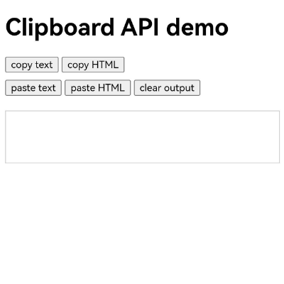
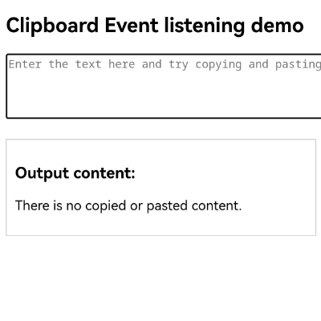

# Processing Web Page Content by Interacting with the System Clipboard

ArkWeb provides the capability of interacting with the system clipboard to cut, copy, and paste various types of data through the following methods: the [Menu](web_menu.md) component, keyboard shortcuts, and [W3C clipboard API and events](https://www.w3.org/TR/clipboard-apis/).

## Using the Menu Component or Keyboard Shortcuts

You can customize options in the menu. When a user selects a specific option, the [cut](../reference/apis-arkweb/arkts-basic-components-web-WebContextMenuResult.md#cut9), [copy](../reference/apis-arkweb/arkts-basic-components-web-WebContextMenuResult.md#copy9) and [copyImage](../reference/apis-arkweb/arkts-basic-components-web-WebContextMenuResult.md#copyimage9) APIs can be called to cut or copy the text, HTML or image data to the system clipboard. The [paste](../reference/apis-arkweb/arkts-basic-components-web-WebContextMenuResult.md#paste9) and [pasteAndMatchStyle](../reference/apis-arkweb/arkts-basic-components-web-WebContextMenuResult.md#pasteandmatchstyle20) APIs can be used to paste the data to the input area of the web page.

For details about how to use the APIs provided by the **Menu** component, see [Processing Web Page Content Using the Menu Component](web_menu.md).

When a device has a physical keyboard, a user can also use keyboard shortcuts **Ctrl+X** (cut), **Ctrl+C** (copy), and **Ctrl+V** (paste) to interact with the clipboard.

> **NOTE**
>
> To access the clipboard content through the [paste](../reference/apis-arkweb/arkts-basic-components-web-WebContextMenuResult.md#paste9) and [pasteAndMatchStyle](../reference/apis-arkweb/arkts-basic-components-web-WebContextMenuResult.md#pasteandmatchstyle20) APIs, you need to [request permissions to access the pasteboard](../basic-services/pasteboard/get-pastedata-permission-guidelines.md) by requesting the **ohos.permission.READ_PASTEBOARD** permission.

## Using the W3C Asynchronous Clipboard API

[Asynchronous clipboard API](https://www.w3.org/TR/clipboard-apis/#async-clipboard-api) provides the methods of reading and writing the system clipboard for you to implement the cutting, copying, and pasting functionalities in web applications.

- Use **writeText** to write text content to the system clipboard.

```javascript
// Write text content to the clipboard.
await navigator.clipboard.writeText ("Text content");
```

- Use **write** to write content of any type to the system clipboard.

```javascript
// Write HTML content to the clipboard.
const clipboardItem = new ClipboardItem({
    'text/html': new Blob (["HTML content"], { type: 'text/html' })
});
await navigator.clipboard.write([clipboardItem]);
```

- Use **readText** to read text from the system clipboard.

```javascript
// Read text from the clipboard.
const text = await navigator.clipboard.readText()
```

- Use **read()** to read any type of content from the system clipboard.

```javascript
// Read HTML from the clipboard.
const clipboardItems = await navigator.clipboard.read();
const htmlBlob = await clipboardItems[0].getType('text/html');
```

> **NOTE**
>
> To access the clipboard content through the **read()** and **readText()** methods of the asynchronous API, you need to [request the permission to access the pasteboard](../basic-services/pasteboard/get-pastedata-permission-guidelines.md): **ohos.permission.READ_PASTEBOARD**.

```ts
// xxx.ets
import { webview } from '@kit.ArkWeb';

@Entry
@Component
struct WebComponent {
  controller: webview.WebviewController = new webview.WebviewController();

  build() {
    Column() {
      Web({ src: $rawfile("clipboard.html"), controller: this.controller })
    }
  }
}
```

Loaded HTML:

```html
<!--clipboard.html-->
<!DOCTYPE html>
<html lang="zh">
<head>
    <meta charset="UTF-8">
    <meta name="viewport" content="width=device-width, initial-scale=1.0">
    <title>Clipboard API demo</title>
    <style>
        #output {
            margin-top: 20px;
            border: 1px solid #ccc;
            padding: 10px;
            min-height: 50px;
        }
        .button-group {
            margin-bottom: 10px;
        }
    </style>
</head>
<body>
<h1>Clipboard API demo</h1>
<div class="button-group">
    <button id="copyTextButton">Copy text</button>;
    <button id="copyHtmlButton">Copy HTML</button>;
</div>

<div class="button-group">
    <button id="pasteTextButton">Paste text</button>;
    <button id="pasteHtmlButton">Paste HTML</button>;
    <button id="clearOutputButton">Clear the text box</button>;
</div>

<div id="result"></div>
<div id="output" contenteditable="true"></div>

<script>
    const textContent = "This is some text content";
    const htmlContent = `<strong><em>This is some HTML content</em></strong>`;

    // Call writeText()
    async function copyText() {
        await navigator.clipboard.writeText(textContent);
        document.getElementById('result').innerText = "The text has been copied to the clipboard.";
    }

    // Call write()
    async function copyHtml() {
        const clipboardItem = new ClipboardItem({
            'text/html': new Blob([htmlContent], { type: 'text/html' })
        });
        await navigator.clipboard.write([clipboardItem]);
        document.getElementById('result').innerText = "HTML has been copied to the clipboard.";
    }

    // Call readText()
    async function pasteText() {
        const text = await navigator.clipboard.readText();
        document.getElementById('output').innerText = text;
    }

    // Call read()
    async function pasteHtml() {
        const items = await navigator.clipboard.read();
        for (const item of items) {
            const types = item.types;
            if (types.includes('text/html')) {
                const blob = await item.getType('text/html');
                const html = await blob.text();
                document.getElementById('output').innerHTML = html;
                return;
            }
        }
        document.getElementById ('result').innerText = "No HTML content on the clipboard.";
    }

    function clearOutput() {
        document.getElementById('result').innerText = " ";
        document.getElementById('output').innerHTML = '';
    }

    // Listen for events.
    document.getElementById('copyTextButton').addEventListener('click', copyText);
    document.getElementById('copyHtmlButton').addEventListener('click', copyHtml);
    document.getElementById('pasteTextButton').addEventListener('click', pasteText);
    document.getElementById('pasteHtmlButton').addEventListener('click', pasteHtml);
    document.getElementById('clearOutputButton').addEventListener('click', clearOutput);
</script>
</body>
</html>
```

Configure permissions for the **module.json5** file.

```json
// module.json5
{
  "module" : {
    // ...
    "requestPermissions":[
      {
        "name" : "ohos.permission.READ_PASTEBOARD",
        "reason": "$string:module_desc",
        "usedScene": {
          "abilities": [
            "FormAbility"
          ],
          "when":"inuse"
        }
      }
    ]
  }
}
```



## Using the W3C Clipboard Event API

[Clipboard events](https://www.w3.org/TR/clipboard-apis/#clipboard-events-and-interfaces) describes the **cut**, **copy**, and **paste** events related to the clipboard. When a user performs the cut, copy, or paste operation, the corresponding event is triggered. By listening for these events, you can read and write the system clipboard or intercept the default behavior to change the copy or paste result.

```ts
// xxx.ets
import { webview } from '@kit.ArkWeb';

@Entry
@Component
struct WebComponent {
  controller: webview.WebviewController = new webview.WebviewController();

  build() {
    Column() {
      Web({ src: $rawfile("clipboard_event.html"), controller: this.controller })
    }
  }
}
```

Loaded HTML:

```html
<!--clipboard_event.html-->
<!DOCTYPE html>
<html lang="zh">
<head>
    <meta charset="UTF-8">
    <meta name="viewport" content="width=device-width, initial-scale=1.0">
    <title>Clipboard Event demo</title>
    <style>
        .output {
            margin-top: 20px;
            border: 1px solid #ccc;
            padding: 10px;
            max-width: 400px;
        }
    </style>
</head>
<body>
<h2>Example of listening a clipboad event</h2>
<textarea id="inputArea" rows="4" cols="50" placeholder="Input text here and try to copy and paste..."></textarea>;

<div class="output" id="output">
    <h3>Output content:</h3>
    <p id="resultText">No content is copied or pasted. </p>
</div>

<script>
    const inputArea = document.getElementById('inputArea');
    const resultText = document.getElementById('resultText');

    // Listen to the copy event.
    inputArea.addEventListener('copy', (event) => {
        const selection = document.getSelection();
        const copiedText = selection.toString() + "(Copied from ArkWeb)
        event.clipboardData.setData("text/plain", copiedText);
        event.preventDefault();
        resultText.textContent = `Copied content: "${copiedText}"`;
    });

    // Listen for the paste event.
    inputArea.addEventListener('paste', (event) => {
        const pastedData = event.clipboardData.getData('text');
        resultText.textContent = `Pasted content: "${pastedData}"`;
    });

    // Listen for the cut event.
    inputArea.addEventListener('cut', (event) => {
        const selection = document.getSelection();
        const cutText = selection.toString() + "(Cut from ArkWeb)
        event.clipboardData.setData("text/plain", cutText);
        selection.deleteFromDocument();
        event.preventDefault();
        resultText.textContent = `Copied content: "${cutText}"`;
    });
</script>
</body>
</html>
```



## Setting Copy Options

You can set the [copyOptions](../reference/apis-arkweb/arkts-basic-components-web-attributes.md#copyoptions11) attribute of a **Web** component to specify the copy scope of the clipboard on the **Web** component. The available options are **CopyOptions.None** (copy is not supported), **CopyOptions.InApp** (in-application copy is supported), and **CopyOptions.LocalDevice** (in-device copy is supported). The default value is **CopyOptions.LocalDevice**, indicating that copy within a device is supported by default.

```ts
// xxx.ets
import { webview } from '@kit.ArkWeb';

@Entry
@Component
struct WebComponent {
  controller: webview.WebviewController = new webview.WebviewController();
  @State copyOption: CopyOptions = CopyOptions.LocalDevice;

  build() {
    Column() {
      Web({ src: $rawfile("copyOptions.html"), controller: this.controller })
        .copyOptions(this.copyOption)
    }
  }
}
```

Loaded HTML:

```html
<!--copyOptions.html-->
<!DOCTYPE html>
<html lang="zh">
<head>
    <meta charset="UTF-8">
    <meta name="viewport" content="width=device-width, initial-scale=1.0">
    <title>Clipboard CopyOption demo</title>
</head>
<body>
<h2>Example of clipboard CopyOption</h2>
<textarea id="inputArea"></textarea>
</body>
</html>
```
