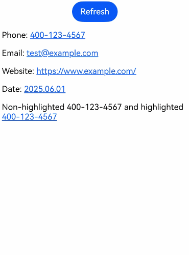

# Using Smart Text Data Detector
Since API version 20, ArkWeb provides the text segmentation and recognition feature on HTML5 pages, enabling segmented-text highlighting, long-press preview, and text-selection menus extension. To use this feature, set [enableDataDetector](../reference/apis-arkweb/arkts-basic-components-web-attributes.md#enabledatadetector20) to **true**. The default value is **false**.

This feature is mainly used to automatically identify entities such as phone numbers and URLs on HTML5 pages and provide convenient interaction operations. For example, a user can click a phone number to make a call or click a URL to view the address on the map, improving user experience.

The recognizable entity types include phone numbers, URLs, email addresses and time. For details, see [TextDataDetectorType](../reference/apis-arkui/arkui-ts/ts-text-common.md#textdatadetectortype11).


## Segmented Text Highlighting
After the HTML5 page in the **Web** component is loaded, the special entities on the page are automatically identified and highlighted. Entities that appear after the page changes are not highlighted.

The filtering rules for highlighting special entities are as follows:

- Text entities in the text box and editable area are not processed.
- Text entities in the `<a></a>` tag are not processed.
- Text entities in cross-domain iframes and nested iframes are not processed.
- Text entities that cross nodes are not highlighted, for example, `<p>400-<span>123-4567</span></p>`.

After being highlighted, text entities on the page are converted into hyperlinks. When they are touched or left-clicked, the operation menu is displayed based on the entity type.

```ts
// xxx.ets
import { webview } from '@kit.ArkWeb';

@Entry
@Component
struct Index {
  @State message: string = 'Hello World';
  webController: webview.WebviewController = new webview.WebviewController();

  build() {
    Column() {
      Row() {
        Button('Refresh')
          .onClick(() => {
            this.webController.refresh();
          })
      }

      Web({
        src: $rawfile('index.html'),
        controller: this.webController
      })
        .enableDataDetector(true)
        .dataDetectorConfig({
          types: []  // Entity recognition type. If this parameter is left empty, all types are recognized.
        })
    }
    .height('100%')
    .width('100%')
  }
}
```

HTML file to be loaded:
```html
<!-- index.html -->
<!DOCTYPE html>
<html>
<head>
    <title>Test</title>
    <meta name="viewport" content="width=device-width, initial-scale=1.0">
</head>
<body>
<p>Phone: 400-123-4567</p>
<p>Email: test@example.com</p>
<p>Website: https://www.example.com/</p>
<p>Date: 2025.06.01</p>
<p>Non-highlighted 400-<span>123-4567</span> and highlighted 400-123-4567</p>
</body>
</html>
```
Click a text entity to display the corresponding operation menu, as shown in the following figure.


Right-clicking or dragging the mouse triggers the default behavior of the hyperlink.

When the [dataDetectorConfig](../reference/apis-arkweb/arkts-basic-components-web-attributes.md#datadetectorconfig20) API is not used or **enablePreviewMenu** of the [TextDataDetectorConfig](../reference/apis-arkui/arkui-ts/ts-text-common.md#textdatadetectorconfig11) attribute is set to **false**, long-pressing or dragging triggers the default behavior of the hyperlink, as shown in the following figure.


If the computed style of the text element on the page contains **user-select:none**, the **Select text** option in the entity menu is invalid. However, the entity text can still be copied when [copyOptions](../reference/apis-arkweb/arkts-basic-components-web-attributes.md#copyoptions11) is not **CopyOptions.None**.

## Long Press Preview
To use the long-press preview functionality, you need to configure [dataDetectorConfig](../reference/apis-arkweb/arkts-basic-components-web-attributes.md#datadetectorconfig20) as follows:

<!--code_no_check-->
```ts
Web({
  src: $rawfile('index.html'),
  controller: this.webController
})
  .enableDataDetector(true)
  .dataDetectorConfig({
    enablePreviewMenu: true,  // Enable the long-press preview functionality.
    types: []
  })
```
If [copyOptions](../reference/apis-arkweb/arkts-basic-components-web-attributes.md#copyoptions11) is not set to **CopyOptions.None**, a preview menu is displayed when you long-press the highlighted entity text, as shown in the following figure.



The [custom menu](web_menu.md#custom-menu) bound by [bindSelectionMenu](../reference/apis-arkweb/arkts-basic-components-web-attributes.md#bindselectionmenu13) does not affect the long-press preview menu of text segmentation. Long-pressing the highlighted text segmentation hyperlink does not display the custom hyperlink menu, and long-pressing a common hyperlink does not display the text segmentation preview menu.


## Text Selection Menu Extension
In the non-editing area, if the selected text meets the following conditions, the corresponding AI menu options are displayed in the text selection menu:

- The UTF-8-encoded selected text does not exceed 255 bytes.
- The selected text contains only one entity word that matches the recognition type. (You can configure the recognition type supported by [dataDetectorConfig](../reference/apis-arkweb/arkts-basic-components-web-attributes.md#datadetectorconfig20).)
- The text is not in the **Select all** operation state.


The AI menu item is displayed as long as the preceding conditions are met, regardless of whether the highlighted entity text is selected.
