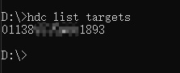
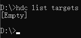
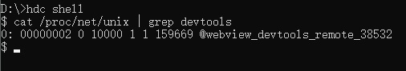
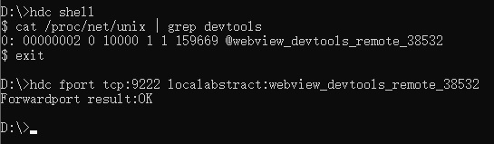
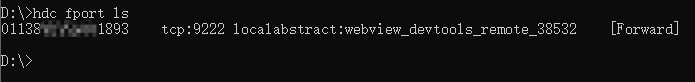
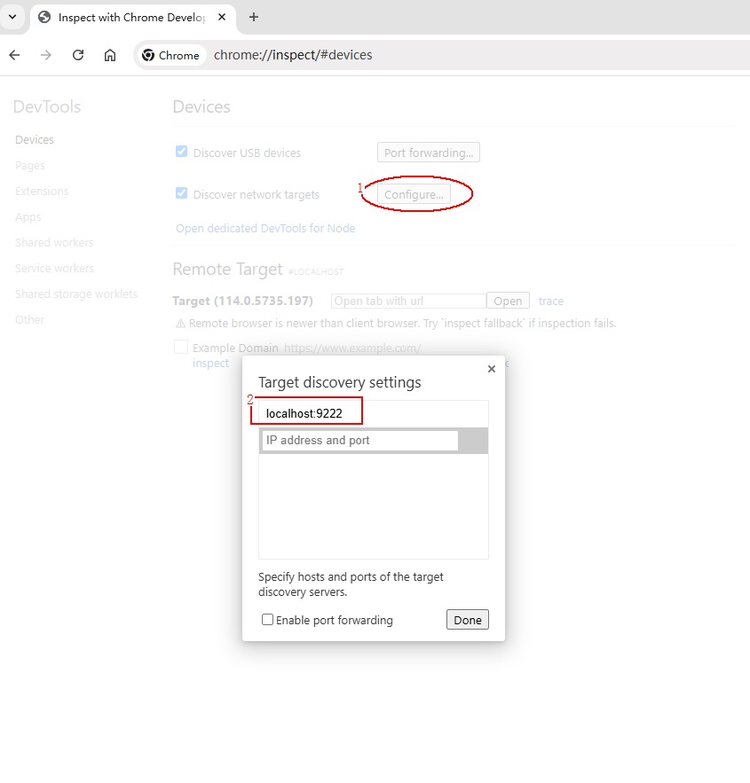
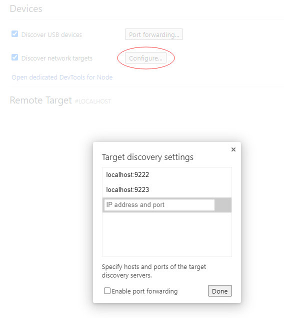
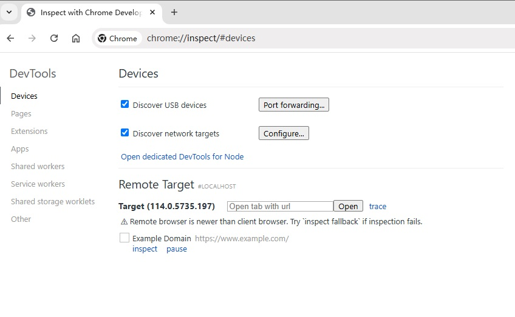
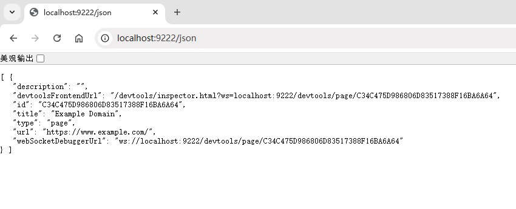
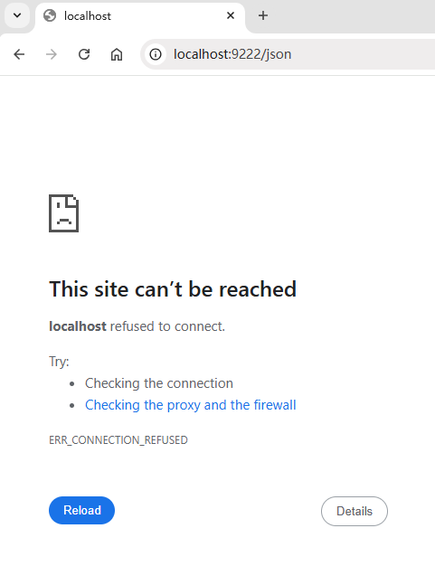

# Debugging Frontend Pages by Using DevTools


The **Web** component supports debugging of web frontend pages by using DevTools, a web frontend development and debugging tool that allows you to debug an application's frontend pages on a PC. Before you do this, use [setWebDebuggingAccess()](../reference/apis-arkweb/arkts-apis-webview-WebviewController.md#setwebdebuggingaccess) to enable frontend page debugging for the **Web** component and make sure the test device connected to the PC runs 4.1.0 or a later version.


## Procedure

### Enabling Web Debugging for Application Code

Before debugging a web page, call the [setWebDebuggingAccess()](../reference/apis-arkweb/arkts-apis-webview-WebviewController.md#setwebdebuggingaccess) API to enable the web debugging feature. 
If the web debugging function is not enabled, DevTools cannot detect the web page to be debugged.

1. Enable web frontend page debugging in the application code.

   ```ts
   // xxx.ets
   import { webview } from '@kit.ArkWeb';

   @Entry
   @Component
   struct WebComponent {
     controller: webview.WebviewController = new webview.WebviewController();

     aboutToAppear() {
       // Enable web frontend page debugging.
       webview.WebviewController.setWebDebuggingAccess(true);
     }

     build() {
       Column() {
         Web({ src: 'www.example.com', controller: this.controller })
       }
     }
   }
   ```
2. Declare the required permission in the **module.json5** file of the HAP module in the application project in DevEco Studio. For details, see [Declaring Permissions in the Configuration File](../security/AccessToken/declare-permissions.md).

   ```
   "requestPermissions":[
      {
        "name" : "ohos.permission.INTERNET"
      }
    ]
   ```

### Connecting the Device to a PC

Connect the device to a PC and enable Developer mode for subsequent port forwarding operations.

1. Enable Developer mode and USB debugging on your device. 

   (1) Choose **Settings** > **System** and check whether **Developer options** is available. If not, go to **Settings** > **About** and touch the version number for seven consecutive times until the message "Enable developer mode?" is displayed. Touch **OK** and enter the PIN (if set). Then the device will automatically restart.

   (2) Connect the device to the PC using a USB cable. Choose **Settings** > **System** > **Developer options** and enable USB debugging. In the displayed dialog box, touch **Allow**.

2. Run the hdc command to connect to the device. 
   Run the following command in the CLI to check whether hdc can discover the device.
   ```shell
   hdc list targets
   ```
   - If a device ID is returned, the device is connected. 
   
   - If **[Empty]** is returned, the device is not found. 
   

3. Enter the hdc shell.  
   After the device is connected, run the following command to enter hdc shell:
   ```shell
   hdc shell
   ```

### Port Forwarding
After the application code calls the **setWebDebuggingAccess** API to enable web debugging, the ArkWeb kernel starts a domain socket listener to enable DevTools to debug web pages. For details, see [Automatically Mapping the WebView Debugging Link](https://developer.huawei.com/consumer/en/doc/harmonyos-guides/ide-run-debug-configurations#section2773943154118). 
However, Chrome cannot directly access the domain socket on the device. Therefore, the domain socket on the device needs to be forwarded to the PC.

1. Run the following command in hdc shell to obtain the domain socket created by ArkWeb on the device. 
   ```shell
   cat /proc/net/unix | grep devtools
   ```
   * If the preceding operations are correct, the domain socket port is displayed. 
   

   * If it is not displayed, check the following items again. 
     (1) The web debugging function is enabled for the application. 
     (2) The application uses the **Web** component to load the web page.

2. Exit hdc shell, and run the following command to forward the obtained domain socket to TCP port 9222 of the PC. 
   Run the **exit** command to exit the hdc shell.
   ```shell
   exit
   ```
   Run the following command to forward the port:
   ```shell
   hdc fport tcp:9222 localabstract:webview_devtools_remote_38532
   ```
   > **NOTE**
   >
   > The number following **webview_devtools_remote_** indicates the process ID of the application where the **Web** component is located. The number is not fixed. Change the number following **webview_devtools_remote_** to the obtained value. 
   > If the process ID of the application changes (for example, the application is restarted), configure port forwarding again.

   The following figure shows a successful forwarding. 
   

3. Run the following command to check whether the port is successfully forwarded.
   ```shell
   hdc fport ls
   ```
   * If a port forwarding task is returned, the operation is successful. 
   
   * If **[Empty]** is returned, the operation fails. 
   

### Opening the Debugging Tool Page in Chrome
  1. Input **chrome://inspect/\#devices** in the address box of Chrome on the PC and open the page. 
  2. Configure the Chrome debugging tool. 
     The web page to be debugged needs to be discovered from the local TCP port 9222. Therefore, ensure that **Discover network targets** is selected. Then, configure the network. 
     (1) Click the **Configure** button. 
     (2) Add **localhost:9222** to **Target discovery settings**.

     

  3. To debug multiple applications at the same time, add multiple port numbers in **Configure** of the **Devices** option on the Chrome debugging tool page.

     

### Waiting for the Page to Be Debugged

  If the preceding steps are successful, the page to be debugged is displayed on the Chrome debugging page. 
  

### Starting Web Page Debugging

  

## Script
### On Windows
Copy the following information to create a .bat file, enable application debugging, and run the file.
   ```
   @echo off
   setlocal enabledelayedexpansion

   :: Initialize port number and PID list
   set PORT=9222
   set PID_LIST=

   :: Get the list of all forwarded ports and PIDs
   for /f "tokens=2,5 delims=:_" %%a in ('hdc fport ls') do (
       if %%a gtr !PORT! (
           set PORT=%%a
       )
       for /f "tokens=1 delims= " %%c in ("%%b") do (
           set PID_LIST=!PID_LIST! %%c
       )
   )

   :: Increment port number for next application
   set temp_PORT=!PORT!
   set /a temp_PORT+=1
   set PORT=!temp_PORT!

   :: Get the domain socket name of devtools
   for /f "tokens=*" %%a in ('hdc shell "cat /proc/net/unix | grep devtools"') do (
       set SOCKET_NAME=%%a

       :: Extract process ID
       for /f "delims=_ tokens=4" %%b in ("!SOCKET_NAME!") do set PID=%%b

       :: Check if PID already has a mapping
       echo !PID_LIST! | findstr /C:" !PID! " >nul
       if errorlevel 1 (
           :: Add mapping
           hdc fport tcp:!PORT! localabstract:webview_devtools_remote_!PID!
           if errorlevel 1 (
               echo Error: Failed to add mapping.
               pause
               exit /b
           )

           :: Add PID to list and increment port number for next application
           set PID_LIST=!PID_LIST! !PID!
           set temp_PORT=!PORT!
           set /a temp_PORT+=1
           set PORT=!temp_PORT!
       )
   )

   :: If no process ID was found, prompt the user to open debugging in their application code and provide the documentation link
   if "!SOCKET_NAME!"=="" (
       echo No process ID was found. Please open debugging in your application code using the corresponding interface. You can find the relevant documentation at this link: [https://gitee.com/openharmony/docs/blob/master/en/application-dev/web/web-debugging-with-devtools.md]
       pause
       exit /b
   )

   :: Check mapping
   hdc fport ls

   echo.
   echo Script executed successfully. Press any key to exit...
   pause >nul

   :: Try to open the page in Edge
   start msedge chrome://inspect/#devices.com

   :: If Edge is not available, then open the page in Chrome
   if errorlevel 1 (
       start chrome chrome://inspect/#devices.com
   )

   endlocal
   ```
### On Linux or macOS
Copy the following information to create an .sh file. Note that you need to run the **chmod** command and convert the file format. Enable the application debugging and run the file.
This script will delete all port forwarding. If other tools (such as DevEco Studio) are using port forwarding, they will be affected.
   ```
   #!/bin/bash

   # Get current fport rule list
   CURRENT_FPORT_LIST=$(hdc fport ls)

   # Delete the existing fport rule one by one
   while IFS= read -r line; do
       # Extract the taskline
       IFS=' ' read -ra parts <<< "$line"
       taskline="${parts[1]} ${parts[2]}"

       # Delete the corresponding fport rule
       echo "Removing forward rule for $taskline"
       hdc fport rm $taskline
       result=$?

       if [ $result -eq 0 ]; then
           echo "Remove forward rule success, taskline:$taskline"
       else
           echo "Failed to remove forward rule, taskline:$taskline"
       fi

   done <<< "$CURRENT_FPORT_LIST"

   # Initial port number
   INITIAL_PORT=9222

   # Get the current port number, use initial port number if not set previously
   CURRENT_PORT=${PORT:-$INITIAL_PORT}

   # Get the list of all PIDs that match the condition
   PID_LIST=$(hdc shell cat /proc/net/unix | grep webview_devtools_remote_ | awk -F '_' '{print $NF}')

   if [ -z "$PID_LIST" ]; then
       echo "Failed to retrieve PID from the device"
       exit 1
   fi

   # Increment the port number
   PORT=$CURRENT_PORT

   # Forward ports for each application one by one
   for PID in $PID_LIST; do
       # Increment the port number
       PORT=$((PORT + 1))

       # Execute the hdc fport command
       hdc fport tcp:$PORT localabstract:webview_devtools_remote_$PID

       # Check if the command executed successfully
       if [ $? -ne 0 ]; then
           echo "Failed to execute hdc fport command"
           exit 1
       fi
   done

   # List all forwarded ports
   hdc fport ls
   ```

## Wireless Debugging
In [debugging procedure](#procedure), domain sockets need to be frequently queried and ports need to be forwarded in [port forwarding](#port forwarding), which is inconvenient for page debugging. Therefore, since API version 20, the wireless debugging API [setWebDebuggingAccess<sup>20+</sup>](../reference/apis-arkweb/arkts-apis-webview-WebviewController.md#setwebdebuggingaccess20) can be used to simplify the debugging process.

1. Enable web debugging for application code.

   In the application, call the [setWebDebuggingAccess<sup>20+</sup>](../reference/apis-arkweb/arkts-apis-webview-WebviewController.md#setwebdebuggingaccess20) API to set the TCP Socket port number and enable web debugging.
   ```ts
   // xxx.ets
   import { webview } from '@kit.ArkWeb';
   import { BusinessError } from '@kit.BasicServicesKit';

   @Entry
   @Component
   struct WebComponent {
     controller: webview.WebviewController = new webview.WebviewController();

     aboutToAppear(): void {
       try {
         // Enable wireless web debugging and specify the TCP socket port.
         webview.WebviewController.setWebDebuggingAccess(true, 8888);
       } catch (error) {
         console.error(`ErrorCode: ${(error as BusinessError).code},  Message: ${(error as BusinessError).message}`);
       }
     }

     build() {
       Column() {
         Web({ src: 'www.example.com', controller: this.controller })
       }
     }
   }
   ```
   > **NOTE**
   >
   >  Port 8888 used in the sample code is for reference only. You must ensure that the port number can be used by applications in practice. If the port cannot be used because the port is occupied or the application does not have the permission to use the port, the API throws an exception or the ArkWeb cannot enable the debugging mode.

2. Connect the device to a PC.

   If wireless debugging is successfully enabled, skip this step.

3. Forward the port.

   If wireless debugging is successfully enabled, skip this step.

4. Open the debugging tool page in Chrome.

   In step 2 "Configure the Chrome debugging tool" of [Opening the Debugging Tool Page in Chrome](#opening-the-debugging-tool-page-in-chrome), change (2) to the following: 
   In **Target discovery settings**, add the IP address of the device to be debugged and the port specified in the [setWebDebuggingAccess<sup>20+</sup>](../reference/apis-arkweb/arkts-apis-webview-WebviewController.md#setwebdebuggingaccess20) API, for example, **192.168.0.3:8888**.

   > **NOTE**
   >
   >  The debugging tool and the device to be debugged must be in the same LAN and can access each other. If the device to be debugged has multiple IP addresses, use the IP address that is in the same network segment as the IP address of the debugging tool.

5. Wait for the page to be debugged.

   This step does not change.

6. Start web page debugging.

   This step does not change.

## FAQs

### What should I do if hdc cannot discover devices?
**Symptom**

   The device ID is not displayed after the following command is executed.
   ```shell
   hdc list targets
   ```

**Solution**

  * Ensure that USB debugging is enabled on the device.
  * Ensure that the device is connected to the PC.

### What should I do if "unauthorized" is displayed in the hdc command output?
**Symptom**

   When the hdc command is executed, the system displays a message indicating that the device is "unauthorized".

**Possible Causes**

   The PC is not authorized to debug the device.

**Solution**

  When a device with USB debugging enabled is connected to an unauthorized PC, a dialog box is displayed, asking you whether to allow USB debugging. In this case, select **Allow**.

### What should I do if the domain socket of DevTools cannot be found?
**Symptom**

   No result is displayed after the following command is executed in hdc shell.
   ```shell
   cat /proc/net/unix | grep devtools
   ```

**Solution**

  * Ensure that the step of [Enabling Web Debugging for Application Code](#enabling-web-debugging-for-application-code) is performed.
  * Ensure that the application uses the **Web** component to load the web page.

### What should I do if port forwarding fails
**Symptom**

   The configured forwarding task is not displayed after the following command is executed.
   ```shell
   hdc fport ls
   ```

**Solution**

  * Ensure that the domain socket exists on the device.
  * Ensure that **tcp:9222** on the PC is not occupied. 
    If **tcp:9222** is occupied, forward the domain socket to another TCP port that is not occupied, for example, **tcp:9223**. 
    If the domain socket is forwarded to a new TCP port, you need to change the port number in **Target discovery settings** of Chrome on the PC.

### What should I do if the web page to be debugged cannot be found in Chrome on the PC after port forwarding is successful?
**Symptom**

  The web page to be debugged cannot be found in Chrome on the PC.

**Possible Causes**

The port forwarding may be invalid due to the following reasons:
  * The device is disconnected from the PC. As a result, all forwarding tasks in hdc are cleared.
  * The hdc service is restarted. As a result, all forwarding tasks in hdc are cleared.
  * The process ID of the application on the device is changed (for example, the application is restarted). As a result, the previous forwarding tasks in hdc become invalid.
  * Exceptions occur when multiple forwarding tasks are forwarded to the same port.

**Solution**

  * Ensure that the local **tcp:9222** (or other configured port) on the PC is not occupied.
  * Ensure that the domain socket exists on the device.
  * Ensure that the process ID in the domain socket name is the same as that of the application to be debugged.
  * Delete unnecessary forwarding tasks from hdc.
  * After the domain socket is successfully forwarded, open **http://localhost:9222/json** using the Chrome on the PC. Change **9222** in the URL to the actual TCP port number.

    - If the web page is normally displayed, the port forwarding is successful. On the Chrome debugging page, perform the operation of [Waiting for the Page to Be Debugged](#waiting-for-the-page-to-be-debugged). 
    

    - If an error page is displayed, port forwarding fails. For details, see [What should I do if port forwarding fails](#what-should-i-do-if-port-forwarding-fails). 
    

  * If the **http://localhost:9222/json** page is normally displayed on Chrome, but the debugging target cannot be found on the Chrome debugging page, perform the following operations:
    - Ensure that the port number in **Configure** on the Chrome debugging page is the same as the TCP port number specified for port forwarding.
    - In this topic, the default TCP port number is **9222**.  
      If you use another TCP port number (for example, **9223**), change the TCP port number in [Port Forwarding](#port-forwarding) and [Opening the Debugging Tool Page in Chrome](#opening-the-debugging-tool-page-in-chrome).

### What should I do if the Chrome browser on the PC cannot find the web page to be debugged after the wireless debugging mode is enabled?
**Symptom**

  After the wireless debugging mode is enabled for ArkWeb, the Chrome on the PC cannot detect the web page to be debugged.

**Possible Causes**

* The wireless debugging mode is not enabled.
* The network between the debugging tool and the device to be debugged is disconnected.

**Solution**

* Ensure that the port can be used by applications.
* Ensure that the debugging tool and the device to be debugged are in the same LAN and the network between them is normal.
