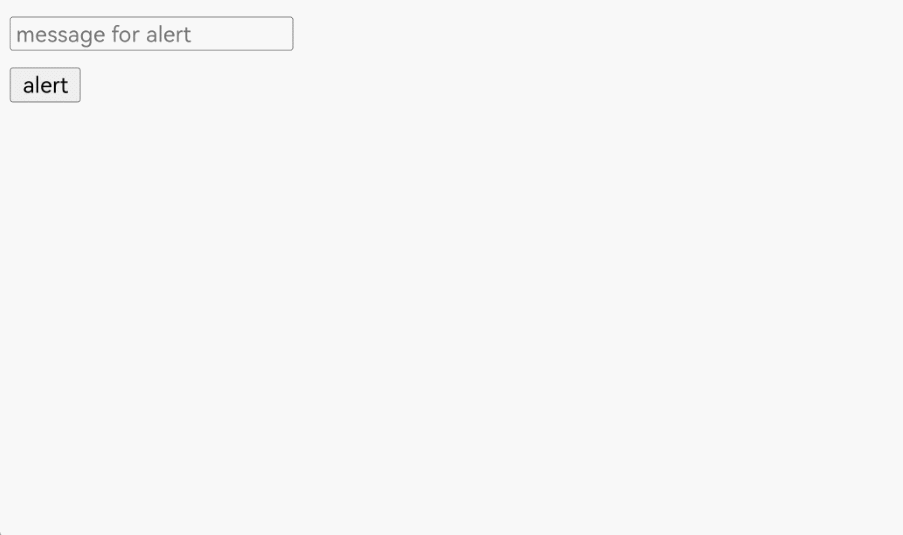
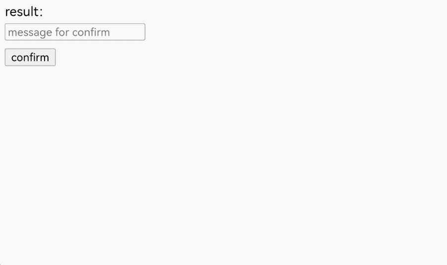

# Displaying Web Page Dialog Boxes

In HTML, JavaScript can be used to create the following types of dialog boxes: **window.alert(message)**, **window.confirm(message)**, and **window.prompt(message, defaultValue)**. These dialog boxes can be used to convey information, confirm operations, or request input from users.

Currently, ArkWeb does not provide default dialog boxes. To ensure that the dialog box of a web page can be used properly, the application needs to customize the dialog box through the [onAlert](../reference/apis-arkweb/arkts-basic-components-web-events.md#onalert), [onConfirm](../reference/apis-arkweb/arkts-basic-components-web-events.md#onconfirm), and [onPrompt](../reference/apis-arkweb/arkts-basic-components-web-events.md#onprompt9) APIs.

## Implementing the Alert Dialog Box

You can use **window.alert()** to display a dialog box that contains optional information. The alert dialog box is used to ensure that users can obtain certain information. When the alert dialog box is displayed, the user needs to click **OK** to continue the operation.
- The optional parameter **message** is a string to be displayed in the alert dialog box. If other types of values are passed, the values will be converted to strings.
- This method does not return any value.

An application can listen for the **alert** method of a web page through the [onAlert](../reference/apis-arkweb/arkts-basic-components-web-events.md#onalert) event and create a dialog box.

- Create a dialog box using [AlertDialog](../reference/apis-arkui/arkui-ts/ts-methods-alert-dialog-box.md).

  ```ts
  import { webview } from '@kit.ArkWeb';

  @Entry
  @Component
  struct Index {
    @State message: string = 'Hello World';
    webviewController: webview.WebviewController = new webview.WebviewController();
    uiContext: UIContext = this.getUIContext();

    build() {
      Row() {
        Web({ src: $rawfile('test.html'), controller: this.webviewController })
          .onAlert((event) => {
            if (event) {
              console.log("event.url:" + event.url);
              console.log("event.message:" + event.message);
              this.uiContext.showAlertDialog({
                title: "Alert from " + event.url + "",
                message: event.message,
                confirm:{
                  value: "OK",
                  action: ()=>{
                    console.info('Alert confirmed.');
                    event.result.handleConfirm();
                  }
                },
                cancel: () => {
                  event.result.handleCancel();
                }
              })
            }
            return true;
          })
      }
    }
  }
  ```
  Loaded HTML:
  ```html
  <!doctype html>
  <html lang="en">
  <head>
      <meta charset="UTF-8">
      <meta name="viewport"
            content="width=device-width, user-scalable=no, initial-scale=1.0, maximum-scale=1.0, minimum-scale=1.0">
      <meta http-equiv="X-UA-Compatible" content="ie=edge">
      <title>Document</title>
      <style>
          button,label,input {
          margin: 5px 0;
          }
      </style>
  </head>
  <body>
  <input type="text" id="alert-message" placeholder="message for alert"><br/>
  <button onclick="handleAlert()">alert</button><br/>
  <script>
      function handleAlert() {
          let message = document.getElementById("alert-message").value;
          let result = window.alert(message ? message : 'alert');
      }
  </script>
  </body>
  </html>
  ```

- Create a dialog box using [CustomDialog-AlertDialog](../reference/apis-arkui/arkui-ts/ohos-arkui-advanced-Dialog.md#alertdialog).

  ```ts
  import { AlertDialog, router } from '@kit.ArkUI';
  import { webview } from '@kit.ArkWeb';

  @Entry
  @Component
  struct AlertDialogPage {
    @State message: string = 'Hello World';
    @State title: string = 'Hello World';
    @State subtitle: string = '';
    @State result: JsResult | null = null;
    webviewController: webview.WebviewController = new webview.WebviewController();
    dialogControllerAlert: CustomDialogController = new CustomDialogController({
      builder: AlertDialog({
        primaryTitle: this.title,
        secondaryTitle: this.subtitle,
        content: this.message,
        primaryButton: {
          value: 'OK',
          role: ButtonRole.ERROR,
          action: () => {
            console.info('Callback when the second button is clicked');
            this.result?.handleConfirm();
          }
        },
      }),
      onWillDismiss: ()=>{
        this.result?.handleCancel();
        this.dialogControllerAlert.close();
      }
    })

    build() {
      Column() {
        Button('back').onClick((event: ClickEvent) => {
          this.getUIContext().getRouter().back();
        })
        Web({ src: $rawfile('alert.html'), controller: this.webviewController })
          .onAlert((event) => {
            if (event) {
              console.log("event.url:" + event.url);
              console.log("event.message:" + event.message);
              this.title = "Alert from " + event.url + "";
              this.message = event.message;
              this.result = event.result;
              this.dialogControllerAlert.open();
            }
            return true;
          })
      }
    }
  }
  ```
  Loaded HTML:
  ```html
  <!doctype html>
  <html lang="en">
  <head>
      <meta charset="UTF-8">
      <meta name="viewport"
            content="width=device-width, user-scalable=no, initial-scale=1.0, maximum-scale=1.0, minimum-scale=1.0">
      <meta http-equiv="X-UA-Compatible" content="ie=edge">
      <title>Document</title>
      <style>
          button,label,input {
          margin: 5px 0;
          }
      </style>
  </head>
  <body>
  <input type="text" id="alert-message" placeholder="message for alert"><br/>
  <button onclick="handleAlert()">alert</button><br/>
  <script>
      function handleAlert() {
          let message = document.getElementById("alert-message").value;
          let result = window.alert(message ? message : 'alert');
      }
  </script>
  </body>
  </html>
  ```

  

## Implementing the Confirm Dialog Box

You can use **window.confirm()** to display a dialog box that contains optional messages and waits for the user to confirm or cancel it.
- The optional parameter **message** is a string to be displayed in the dialog box. If other types of values are passed, the values will be converted to strings.
- This method returns a Boolean value, indicating whether OK (**true**) or Cancel (**false**) is selected. If the application ignores the dialog box on the page, the return value is always **false**.

The confirm dialog box is used to check whether the user accepts an operation such as leaving a web page to prevent data loss.

An application can listen for the **confirm** method of a web page through the [onConfirm](../reference/apis-arkweb/arkts-basic-components-web-events.md#onconfirm) event and create a dialog box.

- Create a dialog box using [AlertDialog](../reference/apis-arkui/arkui-ts/ts-methods-alert-dialog-box.md).

  ```ts
  import { webview } from '@kit.ArkWeb';

  @Entry
  @Component
  struct Index {
    @State message: string = 'Hello World';
    webviewController: webview.WebviewController = new webview.WebviewController();
    uiContext: UIContext = this.getUIContext();

    build() {
      Column() {
        Web({ src: $rawfile('test.html'), controller: this.webviewController })
          .onConfirm((event) => {
            if (event) {
              console.log("event.url:" + event.url);
              console.log("event.message:" + event.message);
              this.uiContext.showAlertDialog({
                title: "Message from " + event.url + "",
                message: event.message,
                primaryButton: {
                  value: 'cancel',
                  action: () => {
                    event.result.handleCancel();
                  }
                },
                secondaryButton: {
                  value: 'ok',
                  action: () => {
                    event.result.handleConfirm();
                  }
                },
                cancel: () => {
                  event.result.handleCancel();
                }
              })
            }
            return true;
          })
      }
    }
  }
  ```

  Loaded HTML:
  ```html
  <!doctype html>
  <html lang="en">
  <head>
      <meta charset="UTF-8">
      <meta name="viewport"
            content="width=device-width, user-scalable=no, initial-scale=1.0, maximum-scale=1.0, minimum-scale=1.0">
      <meta http-equiv="X-UA-Compatible" content="ie=edge">
      <title>Document</title>
      <style>
          button,label,input {
          margin: 5px 0;
          }
      </style>
  </head>
  <body>
  result: <label id="confirmLabel" for="confirm"></label><br/>
  <input type="text" id="confirm-message" placeholder="message for confirm"><br/>
  <button id="confirm" onclick="handleConfirm()">confirm</button><br/>
  <script>
      function handleConfirm() {
          let message = document.getElementById("confirm-message").value;
          let result = window.confirm(message ? message : 'confirm');
          console.log(result);
          document.getElementById("confirmLabel").innerHTML=String(result);
      }
  </script>
  </body>
  </html>
  ```

- Create a dialog box using [CustomDialog-ConfirmDialog](../reference/apis-arkui/arkui-ts/ohos-arkui-advanced-Dialog.md#confirmdialog).

  ```ts
  import { webview } from '@kit.ArkWeb';
  import { ConfirmDialog } from '@kit.ArkUI';

  @Entry
  @Component
  struct DialogConfirmDialog {
    @State message: string = 'Hello World';
    @State title: string = 'Hello World';
    @State result: JsResult | null = null;
    webviewController: webview.WebviewController = new webview.WebviewController();
    isChecked = false;
    dialogControllerCheckBox: CustomDialogController = new CustomDialogController({
      builder: ConfirmDialog({
        title: this.title,
        content: this.message,
        // Selected state of the check box
        isChecked: this.isChecked,
        // Content of the check box
        checkTips: 'Do not ask again after denying',
        primaryButton: {
          value: 'Disable',
          action: () => {
            this.result?.handleCancel();
          },
        },
        secondaryButton: {
          value: 'Allow',
          action: () => {
            this.isChecked = false;
            console.info('Callback when the second button is clicked');
            this.result?.handleConfirm();
          }
        },
        onCheckedChange: (checked) => {
          this.isChecked = checked;
          console.info('Callback when the checkbox is clicked');
        },
      }),
      onWillDismiss: () => {
        this.result?.handleCancel();
        this.dialogControllerCheckBox.close();
      },
      autoCancel: true
    })

    build() {
      Column() {
        Web({ src: $rawfile('confirm.html'), controller: this.webviewController })
          .onConfirm((event) => {
            if (event) {
              if (this.isChecked) {
                event.result.handleCancel();
              } else {
                console.log("event.url:" + event.url);
                console.log("event.message:" + event.message);
                this.title = "Message from " + event.url + "";
                this.message = event.message;
                this.result = event.result;
                this.dialogControllerCheckBox.open();
              }
            }
            return true;
          })
      }
    }
  }
  ```
  Loaded HTML:
  ```html
  <!doctype html>
  <html lang="en">
  <head>
      <meta charset="UTF-8">
      <meta name="viewport"
            content="width=device-width, user-scalable=no, initial-scale=1.0, maximum-scale=1.0, minimum-scale=1.0">
      <meta http-equiv="X-UA-Compatible" content="ie=edge">
      <title>Document</title>
      <style>
          button,label,input {
          margin: 5px 0;
          }
      </style>
  </head>
  <body>
  result: <label id="confirmLabel" for="confirm"></label><br/>
  <input type="text" id="confirm-message" placeholder="message for confirm"><br/>
  <button id="confirm" onclick="handleConfirm()">confirm</button><br/>
  <script>
      function handleConfirm() {
          let message = document.getElementById("confirm-message").value;
          let result = window.confirm(message ? message : 'confirm');
          console.log(result);
          document.getElementById("confirmLabel").innerHTML=String(result);
      }
  </script>
  </body>
  </html>
  ```

  

## Implementing the Prompt Dialog Box

You can use **window.prompt()** to display a dialog box and wait for the user to submit text or cancel the dialog box. The user needs to input a value and then click **OK **or **Cancel**. If **OK** is clicked, the input value is returned. If **Cancel** is clicked, **null** is returned.
- The optional parameter **message** is a text displayed to the user. If no message is required, this parameter can be ignored.
- The optional parameter **defaultValue** is a string that contains the default value displayed in the text input field.
- The return value is a string of the text input by the user or **null**.

The prompt box is used to prompt users to input a value, which is usually used in scenarios where users need to input a temporary password or verification code.

An application can listen for the **prompt** method of a web page through the [onPrompt](../reference/apis-arkweb/arkts-basic-components-web-events.md#onprompt9) event and create a dialog box.

- Create a dialog box using [CustomDialog-CustomContentDialog](../reference/apis-arkui/arkui-ts/ohos-arkui-advanced-Dialog.md#customcontentdialog12).

  ```ts
  import { CustomContentDialog } from '@kit.ArkUI';
  import { webview } from '@kit.ArkWeb';

  @Entry
  @Component
  struct PromptDialog {
    @State message: string = 'Hello World';
    @State title: string = 'Hello World';
    @State result: JsResult | null = null;
    promptResult: string = '';
    webviewController: webview.WebviewController = new webview.WebviewController();
    dialogController: CustomDialogController = new CustomDialogController({
      builder: CustomContentDialog({
        primaryTitle: this.title,
        contentBuilder: () => {
          this.buildContent();
        },
        buttons: [
          {
            value: 'Cancel',
            buttonStyle: ButtonStyleMode.TEXTUAL,
            action: () => {
              console.info('Callback when the button is clicked');
              this.result?.handleCancel();
            }
          },
          {
            value: 'OK',
            buttonStyle: ButtonStyleMode.TEXTUAL,
            action: () => {
              this.result?.handlePromptConfirm(this.promptResult);
            }
          }
        ],
      }),
      onWillDismiss: () => {
        this.result?.handleCancel();
        this.dialogController.close();
      }
    });

    // Custom content area of the dialog box
    @Builder
    buildContent(): void {
      Column() {
        Text(this.message)
        TextInput()
          .onChange((value) => {
            this.promptResult = value;
          })
          .defaultFocus(true)
      }
      .width('100%')
    }

    build() {
      Column() {
        Web({ src: $rawfile('prompt.html'), controller: this.webviewController })
          .onPrompt((event) => {
            if (event) {
              console.log("event.url:" + event.url);
              console.log("event.message:" + event.message);
              console.log("event.value:" + event.value);
              this.title = "Message from " + event.url + "";
              this.message = event.message;
              this.promptResult = event.value;
              this.result = event.result;
              this.dialogController.open();
            }
            return true;
          })
      }
    }
  }
  ```
  Loaded HTML:
  ```html
  <!doctype html>
  <html lang="en">
  <head>
      <meta charset="UTF-8">
      <meta name="viewport"
            content="width=device-width, user-scalable=no, initial-scale=1.0, maximum-scale=1.0, minimum-scale=1.0">
      <meta http-equiv="X-UA-Compatible" content="ie=edge">
      <title>Document</title>
      <style>
          button,label,input {
          margin: 5px 0;
          }
      </style>
  </head>
  <body>
  result: <label id="promptLabel" for="prompt"></label><br/>
  <input type="text" id="prompt-message" placeholder="message for prompt"><br/>
  <input type="text" id="prompt-value" placeholder="default value for prompt"><br/>
  <button id="prompt" onclick="handlePrompt()">prompt</button><br/>
  <script>
      function handlePrompt() {
          let message = document.getElementById("prompt-message").value;
          let defaultValue = document.getElementById("prompt-value").value;
          let result = window.prompt(message ? message : 'prompt', defaultValue);
          console.log(result);
          document.getElementById("promptLabel").innerHTML=result;
      }
  </script>
  </body>
  </html>
  ```

  
