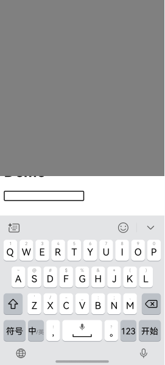
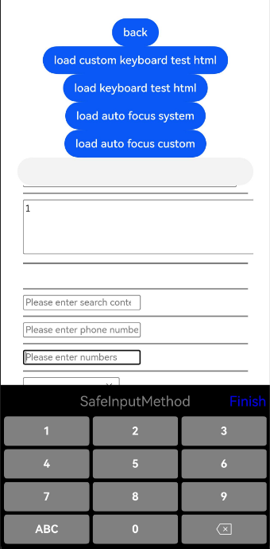
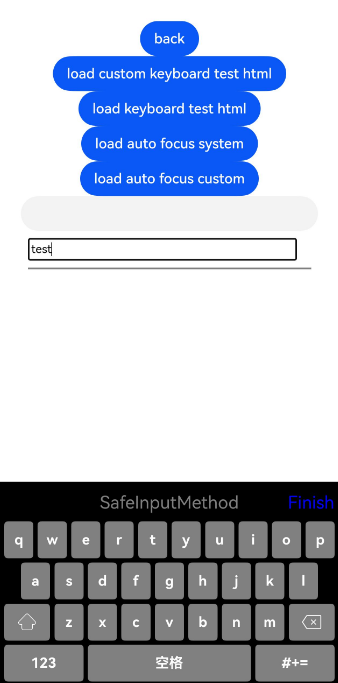
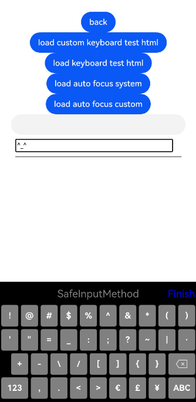

# Docking to the Soft Keyboard
<!--Kit: ArkWeb-->
<!--Subsystem: Web-->
<!--Owner: @weixin_41848015-->
<!--Designer: @libing23232323-->
<!--Tester: @ghiker-->
<!--Adviser: @HelloCrease-->

By docking the **Web** component to the soft keyboard, you can manage the display and interaction of the soft keyboard in your application, and can also customize its features to suit your specific needs. The main scenarios are as follows:

- Bringing up the system soft keyboard to enter text: When a user taps a text box on a web page, the default soft keyboard is displayed at the bottom of the screen. The user can enter text using the soft keyboard, and the entered content is displayed in the text box.
- Customizing the **Enter** key type of the system soft keyboard: You can set different **Enter** keys. For example, **Confirm**, **Next**, and **Submit**.
- Specifying the soft keyboard avoidance mode: On a mobile device, the input method is usually fixed at the lower part of the screen. The application can set different soft keyboard avoidance modes for web pages. For example, relocating, resizing, or no avoidance.
- Defining a custom soft keyboard: On a mobile device, you can use a self-drawing soft keyboard to replace the system soft keyboard.


## W3C Standard Attributes for the Interaction Between the Web Page Text Box and the Soft Keyboard

To support the interaction between the web page and the system soft keyboard and custom soft keyboard, ArkWeb complies with and implements the following input component attributes in the W3C specifications:
- **type**

  The **type** attribute defines the type of the **input** element, which affects the input validation, display mode, and keyboard type. The common type values are as follows.

  | Value   | Description        |
  | -------- | ---------- |
  | text     | Default value. Common text.|
  | number   | Number.      |
  | email    | Email address.  |
  | password | Password.      |
  | tel      | Telephone number.    |
  | url      | URL.     |
  | date     | Date picker.     |
  | time     | Time picker.     |
  | checkbox | Check box.       |
  | radio    | Radio button.      |
  | file     | File upload.      |
  | submit   | Submit button.      |
  | reset    | Reset button.      |
  | button   | Common button.      |

- **inputmode**

  The **inputmode** attribute is used to configure the input method type. The default value is **text**.

  | Value| Description                                      |
  | --------- | ---------------------------------------- |
  | decimal   | Numeric keyboard, usually with a comma key.                       |
  | email     | Text keyboard with keys usually used for email addresses, such as **@**.                  |
  | none      | No keyboard.                                  |
  | numeric   | Numeric keypad.                                 |
  | search    | Text keyboard. The **Enter** key is displayed as **Go**.                  |
  | tel       | Numeric keyboard with **+**, *, and **#** keys.               |
  | text      | Default text keyboard.                                 |
  | url       | Text keyboard with keys used for websites such as the **.**, **/**, and **.com** keys, or other domain name terminators used locally.|

- enterkeyhint

  The **enterkeyhint** attribute specifies the display mode of the **Enter** key on the virtual keyboard of the mobile device. It accepts the values listed below.

  | Value| Description       |
  | ------------- | --------- |
  | enter         | Displays the default **Enter** key. |
  | done          | Indicates that the input is complete.   |
  | go            | Indicates to jump or execute.  |
  | next          | Goes to the next input field.|
  | previous      | Goes to the previous input field.|
  | search        | Searches for information.     |
  | send          | Sends a message.     |

>**NOTE**
>
>When a user taps a web page input box, the default soft keyboard is displayed at the bottom of the screen, and the user can enter text on the screen.
>
>The **type** attribute affects the keyboard display, input validation, and element appearance.
>
>The **inputmode** is used to optimize the keyboard input experience on mobile devices and does not affect the basic input behavior or verification.


## Automatically Displaying the Soft Keyboard
To improve user experience, you can invoke the [showTextInput()](../reference/apis-ime-kit/js-apis-inputmethod.md#showtextinput10) API to automatically display the soft keyboard after the page is loaded.

```html
<!-- index.html -->
<!DOCTYPE html>
<html>
  <head>
    <title>Test Web Page</title>
  </head>
  <body>
    <h1>DEMO</h1>
    <input type="text" id="input_a">
  </body>
</html>
```

```ts
//Index.ets
import { webview } from '@kit.ArkWeb';
import { inputMethod } from '@kit.IMEKit';

@Entry
@Component
struct WebComponent {
  controller: webview.WebviewController = new webview.WebviewController();
  build() {
    Column() {
      Web({ src: $rawfile("index.html"), controller: this.controller})
        .onPageEnd(() => {
          this.controller.runJavaScript(`document.getElementById('input_a').focus()`).then(() => {
            setTimeout(() => {
              inputMethod.getController().showTextInput();
            }, 10);
          });
        });
    }
  }
}
```

## Setting the Avoidance Mode for the Soft Keyboard

On a mobile device, you can set the avoidance mode for the soft keyboard on the web page.

1. Call [setKeyboardAvoidMode()](../reference/apis-arkui/arkui-ts/ts-universal-attributes-expand-safe-area.md#setkeyboardavoidmode11) of UIContext in your application code to set the avoidance mode, which can be **Resize** or **Offset** for the **Web** component.

- In the **Resize** mode, the height of the application window can be reduced to avoid the soft keyboard, and the **Web** component is re-arranged with ArkUI.
- In the **Offset** mode (the default mode), the height of the application window remains unchanged, and the **Web** component performs avoidance based on its own avoidance mode.

(1) Set the soft keyboard avoidance mode of **UIContext**.

```ts
// EntryAbility.ets
import { KeyboardAvoidMode } from '@kit.ArkUI';
import { hilog } from '@kit.PerformanceAnalysisKit';

onWindowStageCreate(windowStage: window.WindowStage) {
  hilog.info(0x0000, 'testTag', '%{public}s', 'Ability onWindowStageCreate');

  windowStage.loadContent('pages/Index', (err, data) => {
    let keyboardAvoidMode = windowStage.getMainWindowSync().getUIContext().getKeyboardAvoidMode();
    // When the soft keyboard is displayed, the application window is resized to its original height minus the keyboard height.
  windowStage.getMainWindowSync().getUIContext().setKeyboardAvoidMode(KeyboardAvoidMode.RESIZE);
    if (err.code) {
      hilog.error(0x0000, 'testTag', 'Failed to load the content. Cause: %{public}s', JSON.stringify(err) ?? '');
      return;
    }
    hilog.info(0x0000, 'testTag', 'Succeeded in loading the content. Data: %{public}s', JSON.stringify(data) ?? '');
  });
}
```
(2) Enable the soft keyboard in the **Web** component.

```html
<!-- index.html -->
<!DOCTYPE html>
<html>
  <head>
    <title>Test Web Page</title>
  </head>
  <body>
    <h1>DEMO</h1>
    <input type="text" id="input_a">
  </body>
</html>
```

```ts
//Index.ets
import { webview } from '@kit.ArkWeb';

@Entry
@Component
struct KeyboardAvoidExample {
  controller: webview.WebviewController = new webview.WebviewController();
  build() {
    Column() {
      Row().height("50%").width("100%").backgroundColor(Color.Gray)
      Web({ src: $rawfile("index.html"),controller: this.controller})
      Text("I can see the bottom of the page").width("100%").textAlign(TextAlign.Center).backgroundColor(Color.Pink).layoutWeight(1)
    }.width('100%').height("100%")
  }
}
```
The **Web** component is re-arranged with ArkUI, as shown in Figure 1 and Figure 2.

**Figure 1** Soft keyboard in the default avoidance mode



**Figure 2** Soft keyboard following the avoidance mode of the ArkUI soft keyboard


2. When the keyboard avoidance mode of **UIContext** is **Offset**, the application can set the keyboard avoidance mode of the **Web** component through the [WebKeyboardAvoidMode()](../reference/apis-arkweb/arkts-basic-components-web-e.md#webkeyboardavoidmode12) API of the **Web** component. This API is at a higher priority than **virtualKeyboard.overlayContens** on the W3C side.

- **RESIZE_VISUAL**: Only the size of the visual viewport is adjusted, and the size of the layout viewport is not adjusted.
- **RESIZE_CONTENT**: The size of both the visual viewport and the layout viewport is adjusted.
- **OVERLAYS_CONTENT**: No viewport size is adjusted, and the soft keyboard overlays the content of the web page.

>**NOTE**
>
>The visual viewport refers to the area of the web page that the user is viewing, and the width of this area is equal to the width of the browser window of the mobile device.
>
>The layout viewport refers to the width of the web page itself.

Set the soft keyboard avoidance mode of the **Web** component in the application code.

```ts
// Index.ets
import { webview } from '@kit.ArkWeb';

@Entry
@Component
struct KeyboardAvoidExample {
  controller: webview.WebviewController = new webview.WebviewController();
  build() {
    Column() {
      Row().height("50%").width("100%").backgroundColor(Color.Gray)
      Web({ src: $rawfile("index.html"),controller: this.controller})
        .keyboardAvoidMode (WebKeyboardAvoidMode.OVERLAYS_CONTENT) // The Web component does not adjust the size of any viewport.
      Text("I can see the bottom of the page").width("100%").textAlign(TextAlign.Center).backgroundColor(Color.Pink).layoutWeight(1)
    }.width('100%').height("100%")
  }
}
```
The **Web** component performs avoidance based on its avoidance mode, as shown in Figure 3.

**Figure 3** Soft keyboard avoidance mode of the **Web** component page


3. When the soft keyboard is displayed, you can call [expandSafeArea()](../reference/apis-arkui/arkui-ts/ts-universal-attributes-expand-safe-area.md#expandsafearea) to expand the safe area of the **Web** component to prevent the **Web** component from avoiding the soft keyboard. For more examples, see [Calculating and Adjusting Safe Area Insets](../web/web-safe-area-insets.md).

  ```ts
  // xxx.ets
  import { webview } from '@kit.ArkWeb';

  @Entry
  @Component
  struct WebComponent {
    controller: webview.WebviewController = new webview.WebviewController();

    build() {
      Column() {
        Web({ src: 'www.example.com', controller: this.controller })
          .width('100%').height('100%')
          .expandSafeArea([SafeAreaType.KEYBOARD, SafeAreaType.SYSTEM])
      }
    }
  }
  ```


The following are interaction scenarios with other **Web** component behaviors.

| Overlapping Scenario        | Specifications                                      |
| ------------ | ---------------------------------------- |
| Same-layer rendering component        | The soft keyboard avoidance mode of the same-layer **Web** component is the same as that in common scenarios.<br></div>The soft keyboard avoidance mode of the same-layer system component is implemented by ArkUI.|
| Offscreen component creation      | By default, the soft keyboard avoidance mode used in non-offscreen creation is used. You can set other avoidance modes before attaching the component to the tree.  |
| customDialog | The **customDialog** component avoids the keyboard by itself.                       |
| Foldable device         | The soft keyboard avoidance behavior is the same as that in common scenarios. The soft keyboard is opened and closed based on the screen status.   |
| Soft keyboard docking       | The soft keyboard avoidance behavior is the same as that in common scenarios.                       |
| Web nested scrolling     | In the nested scrolling scenario, the soft keyboard avoidance mode of the **Web** component is not recommended, including **RESIZE_VISUAL** and **RESIZE_CONTENT**.|


## Blocking System Soft Keyboard and Custom Soft Keyboard

An application can invoke the [onInterceptKeyboardAttach](../reference/apis-arkweb/arkts-basic-components-web-events.md#oninterceptkeyboardattach12) API to control the display of the soft keyboard and use any of the following options:

- The system soft keyboard with default settings
- The system soft keyboard with a custom **Enter** key
- The custom soft keyboard of the application

```ts
  // Index.ets
  import { webview } from '@kit.ArkWeb';
  import { inputMethodEngine } from '@kit.IMEKit';

  @Entry
  @Component
  struct WebComponent {
    controller: webview.WebviewController = new webview.WebviewController();
    webKeyboardController: WebKeyboardController = new WebKeyboardController();
    inputAttributeMap: Map<string, number> = new Map([
        ['UNSPECIFIED', inputMethodEngine.ENTER_KEY_TYPE_UNSPECIFIED],
        ['GO', inputMethodEngine.ENTER_KEY_TYPE_GO],
        ['SEARCH', inputMethodEngine.ENTER_KEY_TYPE_SEARCH],
        ['SEND', inputMethodEngine.ENTER_KEY_TYPE_SEND],
        ['NEXT', inputMethodEngine.ENTER_KEY_TYPE_NEXT],
        ['DONE', inputMethodEngine.ENTER_KEY_TYPE_DONE],
        ['PREVIOUS', inputMethodEngine.ENTER_KEY_TYPE_PREVIOUS]
      ])

      /**
       * Builder for a custom keyboard component
       */
      @Builder
      customKeyboardBuilder() {
		  // Implement a custom keyboard component and connect it to WebKeyboardController to implement operations such as input, deletion, and close.
        Row() {
          Text("Finish")
            .fontSize(20)
            .fontColor(Color.Blue)
            .onClick(() => {
              this.webKeyboardController.close();
            })
          // Insert characters.
          Button("insertText").onClick(() => {
            this.webKeyboardController.insertText('insert ');
          }).margin({
            bottom: 200,
          })
          // Delete characters from the end to the beginning for the length specified by the length parameter.
          Button("deleteForward").onClick(() => {
            this.webKeyboardController.deleteForward(1);
          }).margin({
            bottom: 200,
          })
          // Delete characters from the beginning to the end for the length specified by the length parameter.
          Button("deleteBackward").onClick(() => {
            this.webKeyboardController.deleteBackward(1);
          }).margin({
            left: -220,
          })
          // Insert a function key.
          Button("sendFunctionKey").onClick(() => {
            this.webKeyboardController.sendFunctionKey(6);
          })
        }
      }

    build() {
      Column() {
        Web({ src: $rawfile('index.html'), controller: this.controller })
        .onInterceptKeyboardAttach((KeyboardCallbackInfo) => {
          // Initialize option. By default, the default keyboard is used.
          let option: WebKeyboardOptions = {
            useSystemKeyboard: true,
          };
          if (!KeyboardCallbackInfo) {
            return option;
          }

          // Save the WebKeyboardController. When a custom keyboard is used, this handler is required to control behaviors such as input, deletion, and closing of the keyboard.
          this.webKeyboardController = KeyboardCallbackInfo.controller;
          let attributes: Record<string, string> = KeyboardCallbackInfo.attributes;
          // Traverse attributes.
          let attributeKeys = Object.keys(attributes);
          for (let i = 0; i < attributeKeys.length; i++) {
            console.log('WebCustomKeyboard key = ' + attributeKeys[i] + ', value = ' + attributes[attributeKeys[i]]);
          }

          if (attributes) {
            if (attributes['data-keyboard'] == 'customKeyboard') {
              // Determine the soft keyboard to use based on the attributes of editable HTML elements. For example, if the attribute includes data-keyboard and its value is customKeyboard, use a custom keyboard.
              console.log('WebCustomKeyboard use custom keyboard');
              option.useSystemKeyboard = false;
              // Set the custom keyboard builder.
              option.customKeyboard = () => {
                this.customKeyboardBuilder()
              }
              return option;
            }

            if (attributes['keyboard-return'] != undefined) {
              // Determine the soft keyboard to use based on the attributes of editable HTML elements. For example, if the attribute includes keyboard-return, use the system keyboard and specify the type of the system soft keyboard's Enter key.
              option.useSystemKeyboard = true;
              let enterKeyType: number | undefined = this.inputAttributeMap.get(attributes['keyboard-return']);
              if (enterKeyType != undefined) {
                option.enterKeyType = enterKeyType;
              }
              return option;
            }
          }

          return option;
        })
      }
    }
  }
```

```html
<!-- index.html -->
    <!DOCTYPE html>
    <html>

    <head>
        <meta charset="utf-8">
        <meta name="viewport" content="width=device-width,minimum-scale=1.0,maximum-scale=1.0">
    </head>

    <body>

    <p style="font-size:12px">input tag. Original default behavior: </p>
    <input type="text" style="width: 300px; height: 20px"><br>
    <hr style="height:2px;border-width:0;color:gray;background-color:gray">

    <p style="font-size:12px">input tag. System keyboard with enterKeyType as UNSPECIFIED: </p>
    <input type="text" keyboard-return="UNSPECIFIED" style="width: 300px; height: 20px"><br>
    <hr style="height:2px;border-width:0;color:gray;background-color:gray">

    <p style="font-size:12px">input tag. System keyboard with enterKeyType as GO: </p>
    <input type="text" keyboard-return="GO" style="width: 300px; height: 20px"><br>
    <hr style="height:2px;border-width:0;color:gray;background-color:gray">

    <p style="font-size:12px">input tag. System keyboard with enterKeyType as SEARCH: </p>
    <input type="text" keyboard-return="SEARCH" style="width: 300px; height: 20px"><br>
    <hr style="height:2px;border-width:0;color:gray;background-color:gray">

    <p style="font-size:12px">input tag. System keyboard with enterKeyType as SEND: </p>
    <input type="text" keyboard-return="SEND" style="width: 300px; height: 20px"><br>
    <hr style="height:2px;border-width:0;color:gray;background-color:gray">

    <p style="font-size:12px">input tag. System keyboard with enterKeyType as NEXT: </p>
    <input type="text" keyboard-return="NEXT" style="width: 300px; height: 20px"><br>
    <hr style="height:2px;border-width:0;color:gray;background-color:gray">

    <p style="font-size:12px">input tag. System keyboard with enterKeyType as DONE: </p>
    <input type="text" keyboard-return="DONE" style="width: 300px; height: 20px"><br>
    <hr style="height:2px;border-width:0;color:gray;background-color:gray">

    <p style="font-size:12px">input tag. System keyboard with enterKeyType as PREVIOUS: </p>
    <input type="text" keyboard-return="PREVIOUS" style="width: 300px; height: 20px"><br>
    <hr style="height:2px;border-width:0;color:gray;background-color:gray">

    <p style="font-size:12px">input tag. Custom keyboard: </p>
    <input type="text" data-keyboard="customKeyboard" style="width: 300px; height: 20px"><br>

    </body>

    </html>
```

Figure 4, Figure 5, and Figure 6 show the ArkWeb custom keyboard examples.

**Figure 4** Custom numeric keyboard



**Figure 5** Custom alphabetic keyboard



**Figure 6** Custom symbol keyboard


