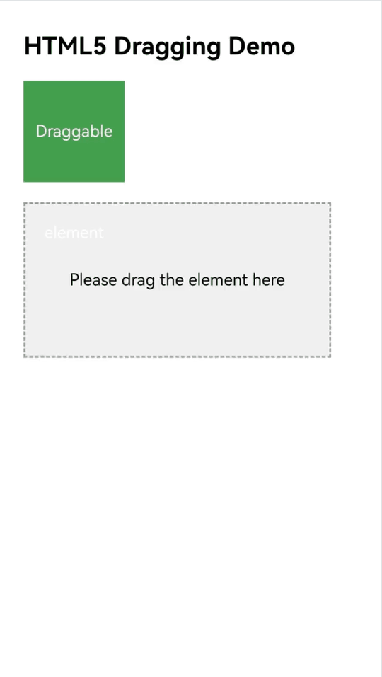
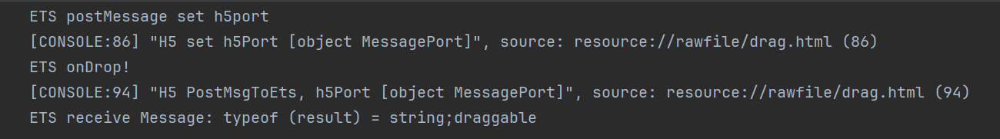

# Interacting with Web Pages Using the Drag-and-Drop Feature of the Web Component

<!--Kit: ArkWeb-->
<!--Subsystem: Web-->
<!--Owner: @zourongchun-->
<!--Designer: @zhufenghao-->
<!--Tester: @ghiker-->
<!--Adviser: @HelloShuo-->
<!-- md-trans-meta sourceCommit=c48cc55c94537836cd0c6607c52e83530e5d401a translatedAt=2026-08-14T03:45:47.537Z pushedAt=2026-08-14T08:16:54.134Z -->

The drag-and-drop feature of ArkWeb enables apps to drag and drop elements on web pages. You can press and hold a draggable element, drag it onto a droppable element, and then release it to complete the drop. The drag-and-drop feature of ArkWeb for web content complies with the H5 standard.

## Dragging Web Content to Other Apps

ArkWeb currently supports the following four data formats. After setting the drag data in these formats according to the H5 standard, you can drag the content to other apps.

| Data Format    | Description |
| -------------- | ----------- |
| text/plain     | Text        |
| text/uri-list  | Link        |
| text/html      | HTML format |
| Files          | File        |

## Drag Event Notifications

ArkWeb drag differs from ArkUI component-level drag in that it mainly targets dragging of web content, and therefore supports only some drag event listening methods.

| Listening Method    | Description                                                  |
| ----------- | ----------------------------------------------------- |
| [onDragStart](../reference/apis-arkui/arkui-ts/ts-universal-events-drag-drop.md#ondragstart)  | It is not recommended to use this method, as it affects the drag behavior of the Web component and causes the drag logic to behave unexpectedly, for example, H5 drag event listeners cannot be triggered, the preview image cannot be created or is incorrect, and drag data cannot be preset.|
|  [onDragEnter](../reference/apis-arkui/arkui-ts/ts-universal-events-drag-drop.md#ondragenter) | The dragged element enters the Web region. |
| [onDragMove](../reference/apis-arkui/arkui-ts/ts-universal-events-drag-drop.md#ondragmove)  | The dragged element moves within the Web region.  |
| [onDragLeave](../reference/apis-arkui/arkui-ts/ts-universal-events-drag-drop.md#ondragleave) | The dragged element leaves the Web region.          |
| [onDrop](../reference/apis-arkui/arkui-ts/ts-universal-events-drag-drop.md#ondrop15) | The dragged element is dropped into the Web region.        |
| [onDragEnd](../reference/apis-arkui/arkui-ts/ts-universal-events-drag-drop.md#ondragend10) | The drag of an element initiated by Web ends.         |

## Implementing Drag-and-Drop Logic on the ArkTS Side

In most cases, the drag-and-drop functionality implemented on the H5 side meets your needs. If necessary, refer to the following example to implement operations such as reading drag data on the ArkTS side.

1. [Establish a data channel between the app side and the frontend page](web-app-page-data-channel.md).

2. In the onDrop method, implement simple logic, such as temporarily storing some key data.

3. In the method that receives messages on the ArkTS side, add app processing logic, which can perform time-consuming tasks.

Because the `onDrop` method on the ArkTS side is executed earlier than the drop event handler in H5 (the `droppable.addEventListener('drop')` in the H5 example), performing operations such as page navigation in the `onDrop` method will prevent the `drop` method in H5 from executing correctly and produce unexpected results. Therefore, you should establish a bidirectional communication mechanism so that, after the `drop` method in H5 finishes executing, it notifies the ArkTS side to execute the corresponding business logic, ensuring that the business logic runs as expected.

<!-- @[DragArkTSPage](https://gitcode.com/openharmony/applications_app_samples/blob/master/code/DocsSample/ArkWeb/WebDragInteraction/entry/src/main/ets/pages/DragArkTSPage.ets) --> 

``` TypeScript
import { webview } from '@kit.ArkWeb'
import { unifiedDataChannel, uniformTypeDescriptor } from '@kit.ArkData';

@Entry
@Component
struct DragDrop {
  private controller: webview.WebviewController = new webview.WebviewController()
  @State ports: Array<webview.WebMessagePort> = []
  @State dragData: Array<unifiedDataChannel.UnifiedRecord> = []

  build() {
    Column() {
      Web({
        src: $rawfile('drag.html'),
        controller: this.controller,
      }).onPageEnd((event) => {
        // Register the communication port.
        this.ports = this.controller.createWebMessagePorts();
        this.ports[1].onMessageEvent((result: webview.WebMessage) => {
          // Process the data received from HTML on the ArkTS side. You can first print a log to confirm the message. The message format on both ends can be defined by yourself, as long as it can be uniquely identified.
          console.info('ETS receive Message: typeof (result) = ' + typeof (result) + ';' + result);
          // Add the processing logic for the message received in result here. Time-consuming tasks can be performed.
        });
        console.info('ETS postMessage set h5port ');
        // After the communication port registration is complete, send a registration-complete message to the frontend to complete the bidirectional port binding.
        this.controller.postMessage('__init_port__', [this.ports[0]], '*');
      })// onDrop can perform simple logic, for example, temporarily storing some key data.
        .onDrop((dragEvent: DragEvent) => {
          console.info('ETS onDrop!')
          let data: UnifiedData = dragEvent.getData();
          if(!data) {
            return false;
          }
          let uriArr: unifiedDataChannel.UnifiedRecord[] = data.getRecords();
          if (!uriArr || uriArr.length <= 0) {
            return false;
          }
          // Traverse records to obtain and temporarily store data, or store data in other ways.
          for (let i = 0; i < uriArr.length; ++i) {
            if (uriArr[i].getType() === uniformTypeDescriptor.UniformDataType.PLAIN_TEXT) {
              let plainText = uriArr[i] as unifiedDataChannel.PlainText;
              if (plainText.textContent) {
                console.info('plainText.textContent: ', plainText.textContent);
              }
            }
          }
          return true
        })
    }

  }
}
```

H5 example:

```html
<html lang="zh-CN">
<head>
    <meta charset="UTF-8">
    <meta name="viewport" content="width=device-width, initial-scale=1.0, user-scalable=no">
    <title>HTML5 Dragging Demo</title>
</head>
<style>
    body {
      font-family: Arial, sans-serif;
      padding: 20px;
    }

    .draggable {
      width: 100px;
      height: 100px;
      background-color: #4CAF50;
      color: white;
      text-align: center;
      line-height: 100px;
      margin-bottom: 20px;
      cursor: grab;
    }

    .droppable {
      width: 300px;
      height: 150px;
      border: 2px dashed #999;
      background-color: #f0f0f0;
      text-align: center;
      line-height: 150px;
      font-size: 16px;
    }

    .success {
      background-color: #4CAF50;
      color: white;
    }
</style>
<body>

<h2>H5 Drag Demo</h2>

<div id="draggable" class="draggable" draggable="true">Draggable element</div>

<div id="droppable" class="droppable">Please drag the element here </div>

<script>
    const draggable = document.getElementById('draggable');
    const droppable = document.getElementById('droppable');

    // Drag start event.
    draggable.addEventListener('dragstart', function (e) {
      e.dataTransfer.setData('text/plain', this.id);
      this.style.opacity = '0.4';
    });

    // Drag end event.
    draggable.addEventListener('dragend', function (e) {
      this.style.opacity = '1';
    });

    // Triggered when an item is dragged into the target region.
    droppable.addEventListener('dragover', function (e) {
      e.preventDefault(); // Must be called; otherwise, the drop event cannot be triggered.
    });

    // Drop event.
    droppable.addEventListener('drop', function (e) {
      e.preventDefault();
      const data = e.dataTransfer.getData('text/plain');
      // Pass to ArkTS.
      PostMsgToArkTS(data);
      const draggableEl = document.getElementById(data);
      this.appendChild(draggableEl);
      this.classList.add('success');
      this.textContent = "Dropped successfully!";
    });

    // Set the scriptproxy port on the JS side.
    var h5Port;
    window.addEventListener('message', function (event) {
    console.info("H5 receive settingPort message");
        if (event.data == '__init_port__') {
            if (event.ports[0] != null) {
                console.info("H5 set h5Port " + event.ports[0]);
                h5Port = event.ports[0];
            }
        }
    });

    // Send data to the ArkTS side through scriptproxy.
    function PostMsgToArkTS(data) {
        console.info("H5 PostMsgToArkTS, h5Port " + h5Port);
        if (h5Port) {
          h5Port.postMessage(data);
        } else {
          console.error("h5Port is null, Please initialize first");
        }
    }
</script>

</body>
</html>
```



Log output:



## FAQs

### Why Are Drag Events Set in H5 Not Triggered

Check whether the related CSS resources are configured correctly. Some web pages determine the User Agent (UA) and apply CSS styles only to specific device UAs. You can resolve this issue by setting a custom UA for the Web component, for example:

<!-- @[SetUAPage](https://gitcode.com/openharmony/applications_app_samples/blob/master/code/DocsSample/ArkWeb/WebDragInteraction/entry/src/main/ets/pages/SetUAPage.ets) -->

``` TypeScript
import { webview } from '@kit.ArkWeb'

@Entry
@Component
struct Index {
  private webController: webview.WebviewController = new webview.WebviewController()
  build(){
    Column() {
      Web({
        src: 'example.com',
        controller: this.webController,
      }).onControllerAttached(() => {
        // Specific UA
        let customUA = 'android'
        this.webController.setCustomUserAgent(this.webController.getUserAgent() + customUA)
      })
    }
  }
}
```

### How to Disable the Drag Capability of the Web Component

Without special configuration, the Web component supports drag and drop by default. If you do not need the drag capability, refer to the following example to disable it.

There are two main ways to disable drag and drop:

1. On the web page side, intercept or disable it through W3C CSS and JS.

2. On the app side, inject JS through the Web component's runJavaScriptExt API to intercept or disable it.

H5 example 1:

``` HTML
<html lang="zh-CN">
<head>
    <meta charset="UTF-8">
    <meta name="viewport" content="width=device-width, initial-scale=1.0, user-scalable=no">
    <title>Using the W3C Common Attributes or Methods</title>
</head>
<style>
    body {
      font-family: Arial, sans-serif;
      padding: 20px;
    }
    .normal {
      width: 100px;
      height: 100px;
      margin-bottom: 40px;
    }
    .undraggable {
      width: 100px;
      height: 100px;
      margin-bottom: 40px;
      -webkit-user-drag: none;
    }

</style>
<body>

<h2>Use the W3C common attributes or methods to disable the drag functionality.</h2>

<!--1. Disable dragging of the element by explicitly setting the draggable style to false.-->
<!--This takes effect only for dragging the entire element node such as img or div, not for selected text within the node.-->
<div>Set the draggable attribute to disable the drag functionality.</div>
<br>

<!--2. Disable dragging by referencing a style class in which -webkit-user-drag is set to none.-->
<!--The effective scope is the same as method 1.-->
<div>Set -webkit-user-drag to disable the drag functionality.</div>
<br>

<!--3. Disable dragging by setting an ondragstart event listener and calling preventDefault.-->
<!--This applies to the drag behavior of any content.-->
<!--You can expand the listener scope to disable dragging in a larger region. For example, listening on window disables dragging for the entire Web component.-->
<!--Because the effective node is relatively late, dragging has actually partially proceeded, which affects the menu function.-->
<div>Set ondragstart to disable the drag functionality.</div>
<div ondragstart="dragstartHandler(event)">
    
    <p>
        This text is used to verify the drag disabling effect of the ondragstart script on the selected text.
    </p>
</div>

<script>
    function dragstartHandler(event) {
        console.info('forbid drag when drag start');
        event.preventDefault();
    }
</script>

</body>
</html>
```


HTML example 2:

``` HTML
<html lang="zh-CN">
<head>
    <meta charset="UTF-8">
    <meta name="viewport" content="width=device-width, initial-scale=1.0, user-scalable=no">
    <title>Using runJavascriptExt to Inject JS</title>
</head>
<style>
    body {
      font-family: Arial, sans-serif;
      padding: 20px;
    }
    .normal {
      width: 100px;
      height: 100px;
      margin-bottom: 40px;
    }
</style>
<body>

<h2>Use runJavascriptExt to inject JS for disabling the drag functionality.</h2>

<div>
    
    <p>
        This text is used to verify the drag disabling effect of the JS injected by runJavascriptExt on the selected text.
    </p>
</div>

</body>
</html>
```


ArkTS example:

<!-- @[ForbidDragPage](https://gitcode.com/openharmony/applications_app_samples/blob/master/code/DocsSample/ArkWeb/WebDragInteraction/entry/src/main/ets/pages/ForbidDragPage.ets) -->

``` TypeScript
import { webview } from '@kit.ArkWeb';

@Entry
@Component
struct Index {
  webViewController: webview.WebviewController = new webview.WebviewController();

  build() {
    Column() {
      Button('w3cDemoPage')
        .onClick(() => {
          this.webViewController.loadUrl($rawfile('w3c-forbid.html'));
        })
      Button('runJsDemoPage')
        .onClick(() => {
          this.webViewController.loadUrl($rawfile('runJs-forbid.html'));
        })
      Button('runJsForbidDrag')
        .onClick(() => {
          try {
            // Use runJavaScriptExt to execute a script that adds a dragstart event listener to disable dragging.
            this.webViewController.runJavaScriptExt(
              'window.addEventListener(\'dragstart\', (ev) => {\n' +
                'ev.preventDefault();\n' +
                '});',
              (error, result) => {
                if (error) {
                  console.error(`run JavaScript error, ErrorCode: ${(error as BusinessError).code},  Message: ${(error as BusinessError).message}`)
                  return;
                }
              });
          } catch (resError) {
            console.error(`ErrorCode: ${(resError as BusinessError).code},  Message: ${(resError as BusinessError).message}`);
          }
        })
      Web({
        src: $rawfile('w3c-forbid.html'),
        controller: this.webViewController
      })
        .domStorageAccess(true)
        .javaScriptAccess(true)
        .fileAccess(true)
    }
    .height('100%')
    .width('100%')
  }
}
```