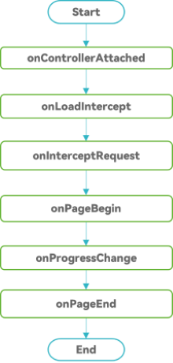

# Lifecycle of Web Components

## Overview

You can use **Web** components to load local or online web pages.

The **Web** components provide various component lifecycle callbacks. Using these callbacks, you can detect the lifecycle changes of **Web** components and process related services.

The states of a **Web** component include: controller binding to the **Web** component, web page loading start, web page loading progress, web page loading end, and the page that is about to be visible.

**Figure 1** shows callback events during the normal loading of the web page of the **Web** component



## Web Page Loading States of the Web component

- [aboutToAppear](../reference/apis-arkui/arkui-ts/ts-custom-component-lifecycle.md#abouttoappear): When a new instance of a custom component is created, execute this function before its build function is executed. In this case, you are advised to invoke APIs such as [setWebDebuggingAccess](../reference/apis-arkweb/js-apis-webview.md#setwebdebuggingaccess), [customizeSchemes](../reference/apis-arkweb/js-apis-webview.md#customizeschemes), and [configCookie](../reference/apis-arkweb/js-apis-webview.md#configcookie11-1).

- [onControllerAttached](../reference/apis-arkweb/ts-basic-components-web.md#oncontrollerattached10): This callback is triggered when the controller is successfully attached to the **Web** component. You are advised to inject the JavaScript object [registerJavaScriptProxy](../reference/apis-arkweb/js-apis-webview.md#registerjavascriptproxy) and set the custom user agent [setCustomUserAgent](../reference/apis-arkweb/js-apis-webview.md#setcustomuseragent10) in this event. In the callback, you can use APIs irrelevant to web page operations, such as [loadUrl](../reference/apis-arkweb/js-apis-webview.md#loadurl) and [getWebId](../reference/apis-arkweb/js-apis-webview.md#getwebid). However, the web page is not loaded when the callback function is called. Therefore, APIs for  web page operation, such as [zoomIn](../reference/apis-arkweb/js-apis-webview.md#zoomin) and [zoomOut](../reference/apis-arkweb/js-apis-webview.md#zoomout), cannot be used in the callback function.

- [onLoadIntercept](../reference/apis-arkweb/ts-basic-components-web.md#onloadintercept10) : This callback is triggered before the **Web** component loads the URL, which is used to determine whether to block the access. By default, the loading is allowed.

- [onOverrideUrlLoading](../reference/apis-arkweb/ts-basic-components-web.md#onoverrideurlloading12): This callback is triggered when the URL is to be loaded to the web. By using this callback, the host application can obtain the control right. If the callback returns **true**, the web stops loading the URL. If the callback returns **false**, the web continues to load the URL. The behavior of **onLoadIntercept()** is different from that of the **onOverrideUrlLoading()** and they are triggered in different timing. Therefore, the two APIs are used in different scenarios. When **LoadUrl** and **iframe** (HTML tag, indicating the HTML inline framework element, which is used to embed another page into the current page) are loaded, **onLoadIntercept()** is triggered, but **onOverrideUrlLoading()** is not triggered when **LoadUrl** is loaded and when the **iframe** loads the HTTP(s) protocol or **about:blank**. For details, see [onLoadIntercept](../reference/apis-arkweb/ts-basic-components-web.md#onloadintercept10) and [onOverrideUrlLoading](../reference/apis-arkweb/ts-basic-components-web.md#onoverrideurlloading12).

- [onInterceptRequest](../reference/apis-arkweb/ts-basic-components-web.md#oninterceptrequest9): This callback is triggered before the **Web** component loads the URL, which is used to intercept the URL and return response data.

- [onPageBegin](../reference/apis-arkweb/ts-basic-components-web.md#onpagebegin): This callback is triggered when a web page starts to be loaded and is triggered only in the main frame (an HTML element used to display the HTML page). This callback is not triggered when the content of an **iframe** or **frameset** (an HTML tag used to include frames) is loaded. The multi-frame page may start to be loaded at the same time. Even if the main frame is already loaded, the sub-frames may start to be loaded or continue to be loaded. This callback is not triggered for navigation (such as segment and historical status) on the same page, navigation that fails before submission, or navigation that is canceled.

- [onProgressChange](../reference/apis-arkweb/ts-basic-components-web.md#onprogresschange): This callback is triggered to notify the loading progress of the page. The multi-frame page or sub-frames may continue to be loaded while the main frame is already loaded. Therefore, this callback may still be received after [onPageEnd](../reference/apis-arkweb/ts-basic-components-web.md#onpageend) is triggered.

- [onPageEnd](../reference/apis-arkweb/ts-basic-components-web.md#onpageend): This callback is triggered only in the main frame when the web page is loaded. The multi-frame page may start to be loaded at the same time. Even if the main frame is already loaded, the sub-frame may start to be loaded or continue to be loaded. This callback is not triggered for navigation (such as segment and historical status) on the same page, navigation that fails before submission, or navigation that is canceled. You are advised to execute the JavaScript script [loadUrl](../reference/apis-arkweb/js-apis-webview.md#runjavascript) in this callback. Note that receiving this callback does not guarantee that the next frame of drawn by the **Web** will reflect the current DOM status.

- [onPageVisible](../reference/apis-arkweb/ts-basic-components-web.md#onpagevisible9): This callback is triggered when the body of an HTTP response starts to be loaded and a new page is about to be visible. This callback is triggered only in the main frame. This callback is triggered early in document loading, so linked resources such as online CSS and online images may not be available.

- [onRenderExited](../reference/apis-arkweb/ts-basic-components-web.md#onrenderexited9): This callback function is triggered when the application rendering process exits abnormally. You can release system resources and save data in this callback. If you want to recover the application from an exception, call the [loadUrl](../reference/apis-arkweb/js-apis-webview.md#loadurl) API to reload the page.

- [onDisAppear](../reference/apis-arkui/arkui-ts/ts-universal-events-show-hide.md#ondisappear) : This callback is triggered when the component is uninstalled. This event is a common event triggered when a component is uninstalled from the component tree.

Codes on the application side:

  ```ts
  // xxx.ets
  import { webview } from '@kit.ArkWeb';
  import { BusinessError } from '@kit.BasicServicesKit';
  import { promptAction } from '@kit.ArkUI';

  @Entry
  @Component
  struct WebComponent {
    controller: webview.WebviewController = new webview.WebviewController();
    responseWeb: WebResourceResponse = new WebResourceResponse();
    heads: Header[] = new Array();
    @State webData: string = "<!DOCTYPE html>\n" +
      "<html>\n" +
      "<head>\n" +
      "<title>intercept test</title>\n" +
      "</head>\n" +
      "<body>\n" +
      "<h1>intercept test</h1>\n" +
      "</body>\n" +
      "</html>";

    aboutToAppear(): void {
      try {
        webview.WebviewController.setWebDebuggingAccess(true);
      } catch (error) {
        console.error(`ErrorCode: ${(error as BusinessError).code},  Message: ${(error as BusinessError).message}`);
      }
    }

    build() {
      Column() {
        Web({ src: $rawfile('index.html'), controller: this.controller })
          .onControllerAttached(() => {
            // You are advised to use **loadUrl**, set a custom user agent, and inject a JS object.
            console.log('onControllerAttached execute')
          })
          .onLoadIntercept((event) => {
            if (event) {
              console.log('onLoadIntercept url:' + event.data.getRequestUrl())
              console.log('url:' + event.data.getRequestUrl())
              console.log('isMainFrame:' + event.data.isMainFrame())
              console.log('isRedirect:' + event.data.isRedirect())
              console.log('isRequestGesture:' + event.data.isRequestGesture())
            }
            // If true is returned, the loading is blocked. Otherwise, the loading is allowed.
            return true
          })
          .onOverrideUrlLoading((webResourceRequest: WebResourceRequest) => {
            if (webResourceRequest && webResourceRequest.getRequestUrl() == "about:blank") {
              return true;
            }
            return false;
          })
          .onInterceptRequest((event) => {
            if (event) {
              console.log('url:' + event.request.getRequestUrl());
            }
            let head1: Header = {
              headerKey: "Connection",
              headerValue: "keep-alive"
            }
            let head2: Header = {
              headerKey: "Cache-Control",
              headerValue: "no-cache"
            }
            let length = this.heads.push(head1);
            length = this.heads.push(head2);
            this.responseWeb.setResponseHeader(this.heads);
            this.responseWeb.setResponseData(this.webData);
            this.responseWeb.setResponseEncoding('utf-8');
            this.responseWeb.setResponseMimeType('text/html');
            this.responseWeb.setResponseCode(200);
            this.responseWeb.setReasonMessage('OK');
            // If response data is returned, the data is loaded based on the response data. If no response data is returned, null is returned, indicating that the data is loaded in the original mode.
            return this.responseWeb;
          })
          .onPageBegin((event) => {
            if (event) {
              console.log('onPageBegin url:' + event.url);
            }
          })
          .onFirstContentfulPaint(event => {
            if (event) {
              console.log("onFirstContentfulPaint:" + "[navigationStartTick]:" +
              event.navigationStartTick + ", [firstContentfulPaintMs]:" +
              event.firstContentfulPaintMs);
            }
          })
          .onProgressChange((event) => {
            if (event) {
              console.log('newProgress:' + event.newProgress);
            }
          })
          .onPageEnd((event) => {
            // You are advised to execute the JavaScript script in this event.
            if (event) {
              console.log('onPageEnd url:' + event.url);
            }
          })
          .onPageVisible((event) => {
            console.log('onPageVisible url:' + event.url);
          })
          .onRenderExited((event) => {
            if (event) {
              console.log('onRenderExited reason:' + event.renderExitReason);
            }
          })
          .onDisAppear(() => {
            promptAction.showToast({
              message: 'The web is hidden',
              duration: 2000
            })
          })
      }
    }
  }
  ```

Frontend index.html.

  ```html
  <!-- index.html -->
  <!DOCTYPE html>
  <html>
  <head>
    <meta charset="UTF-8">
  </head>
  <body>
  <h1>Hello, ArkWeb</h1>
  </body>
  </html>
  ```

## Performance Indicators Loaded by the Web Page of Web Components

Pay attention to some important performance indicators during web page loading. Such as First Contentful Paint (FCP), First Meaningful Paint (FMP), and Last Contentful Paint (LCP). The **Web** component provides the following APIs:

- [onFirstContentfulPaint](../reference/apis-arkweb/ts-basic-components-web.md#onfirstcontentfulpaint10): This callback is triggered when the web page content is first rendered. Time point when a text, image, non-blank Canvva, or SVG is drawn for the first time.

- [onFirstMeaningfulPaint](../reference/apis-arkweb/ts-basic-components-web.md#onfirstmeaningfulpaint12): This callback is triggered when a meaningful web page is first rendered. Time when the main content of the page is rendered for the first time.

- [onLargestContentfulPaint](../reference/apis-arkweb/ts-basic-components-web.md#onlargestcontentfulpaint12) : This callback is triggered when the largest contentful web page is rendered. Time when the visible element with the largest content in the visible area starts to appear on the page.
