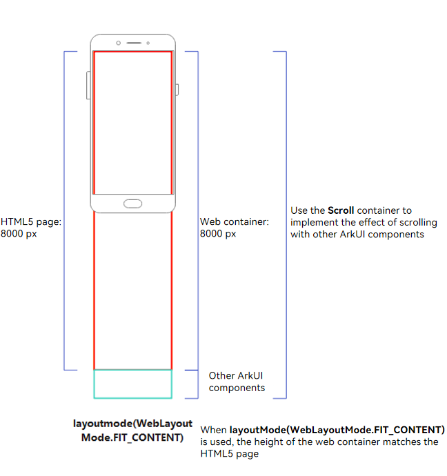
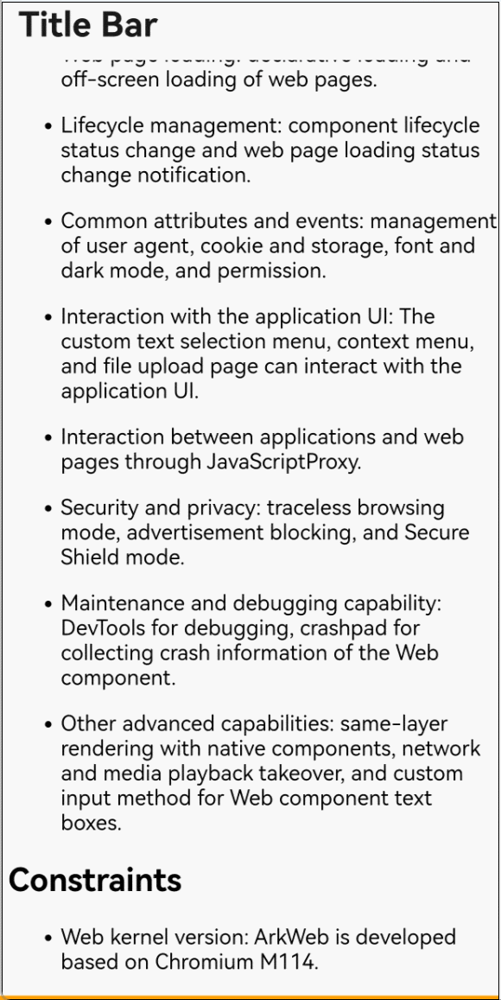

# Fitting In the Page Content Layout

When **layoutMode(WebLayoutMode.FIT_CONTENT)** is used, the size of the **Web** component can automatically fit in the page content.

## When to Use

This mode is applicable to the scenario where the **Web** component needs to be expanded based on the web page height and scrolls with other system components. For example:

- Long articles. In this scenario, there are other system components at the same layout level of the **Web** component, such as the comment area and toolbar.
- Home page of a long page. In this scenario, there are other system components at the same layout level of the **Web** component, such as the grid menu.

**Web Layout Following the System**

As shown in Figure 1, the height of the **Web** component is the same as the screen height, and the height of the HTML 5 page is 8000 px, which is greater than the height of the **Web** component. In this case, a scroll bar is displayed in the **Web** component. When the **Web** component is scrolled, a part of the page is hidden, and the screen cannot be fully used to display the web page, resulting in poor user experience.

**Web Layout Fitting In the Page Content**

As shown in Figure 3, the height of both the **Web** component and the HTML5 page is 8000 px. In this case, no scroll bar is generated in the **Web** component. When a user scrolls the page, other ArkUI components are scrolled at the same time, and the **Web** component is displayed on the entire screen, as shown in Figure 4.

| Figure 3 Web layout fitting in the page content| Figure 4 Real effect of the web layout|
| --- | --- |
|  |  |

## Specifications and Constraints

1. Set the [rendering mode](web-render-mode.md) to synchronous to avoid exceptions (white screen and layout errors) caused by the component size exceeding the limit.
2. Disable the [overscroll mode](../reference/apis-arkweb/arkts-basic-components-web-attributes.md#overscrollmode11). When the overscroll mode is enabled and a user scrolls to the edge of a web page, the web page is displayed with a spring animation, which conflicts with the rebound effect of the **Scroll** component, affecting user experience.
3. Set the attribute of [keyboard avoidance mode](../reference/apis-arkweb/arkts-basic-components-web-attributes.md#keyboardavoidmode12) to **RESIZE_CONTENT** to disable this mode.
4. Do not support page zooming.
5. Do not support using the **height** attribute of the **Web** component to change the component height.
6. Support only component height fitting in the page content, but not width fitting.
7. Do not support the waterfall page.

## Sample Code

```typescript
// fit_content_test.ets
import { webview } from '@kit.ArkWeb';

@Entry
@Component
struct WebHeightPage {
  private webviewController: WebviewController = new webview.WebviewController()
  private scroller: Scroller = new Scroller()

  build() {
    Navigation() {
      Column() {
        Scroll(this.scroller) {
          Column() {
            Web({
              src: $rawfile("fit_content.html"),
              controller: this.webviewController,
              renderMode: RenderMode.SYNC_RENDER // Set the synchronous rendering mode.
            })
              .layoutMode (WebLayoutMode.FIT_CONTENT) // Set the Web component size to fit in the page content.
              .overScrollMode (OverScrollMode.NEVER) // Disable the overscroll mode.
            Text('Comments')
              .fontSize(28)
              .fontColor("#FF0F0F")
              .height(100)
              .width("100%")
              .backgroundColor("#f89f0f")
          }
        }

      }
    }
    .title ("Title bar")
  }
}
```

```html
<!--fit_content.html-->
<!DOCTYPE html>
<html>
<head>
    <meta charset="UTF-8">
    <meta name="viewport" content="width=device-width, initial-scale=1, user-scalable=no">
    <title>Fit-Content</title>
</head>
<body>
<div>
    <div><h2 id="When to use">When to use</h2>
        <p>ArkWeb provides Web components to display web page content in applications. The common application scenarios are as follows:</p>;
        <ul>
            <li><p>
                Web page integration: Applications can use Web components to embed web page content to reduce development costs and improve development and operation efficiency.</p> 
            </li>
            <li><p>
                Web browsing: Browser applications can use Web components to open third-party web pages, browse web pages in traceless mode, and set advertisement blocking.</p>
            </li>
            <li><p>Applet: Host applications of the applet type can use web components to render applet pages. </p></li>
        </ul>
    </div>
    <div><h2 id="Capabilities">Capabilities</h2>
        <p>The Web component provides various capabilities for controlling web pages, including: </p>;
        <ul>
            <li><p>Web page loading: Declarative loading and off-screen loading of web pages. </p></li>
            <li><p>Lifecycle management: Managing the lifecycle of components and notifying web pages of loading status changes. </p></li>
            <li><p>Common attributes and events: User-Agent management, cookie and storage management, font and dark mode management, and permission management. </p>
            </li>
            <li><p>
                Interaction with the application UI: The text selection menu, context menu, and file upload page can be customized to interact with the application UI. </p>
            </li>
            <li><p>Applications can interact with web pages through JavaScriptProxy. </p></li>
            <li><p>Security and privacy: Incognito browsing mode, advertisement blocking, and Advanced Security mode. </p></li>
            <li><p>Maintenance and debugging capability: DevTools debugging and Crashpad (used to collect Web component crash information).
            </p></li>
            <li><p>
                Other advanced capabilities: same-layer rendering with system components, network and media playback takeover, and custom input method for Web component text boxes. </p>
            </li>
        </ul>
    </div>
    <div><h2 id="Constraints">Constraints</h2>
        <ul>
            <li>Web kernel version: ArkWeb is developed based on Chromium M114.</li>
        </ul>
    </div>
</div>
</body>
</html>
```

## FAQs

### What should I do if the scroll bar still appears in the Web component when FIT_CONTENT is set?

**Possible Causes**

- The height of the internal HTML5 page exceeds 7680 px (physical pixel), but the rendering mode is not set to [synchronous rendering mode](web-render-mode.md).
- The **metaviewport** attribute is not configured.

**Solution**

- Change the rendering mode to [synchronous rendering mode](web-render-mode.md).
- Configure **<\meta name="viewport" content="width=device-width, initial-scale=1.0">** on the HTML5 page.


### What should I do if a white screen is displayed or the page disappears after FIT_CONTENT is set?

**Possible Causes**

The height of the DOM node of the core content is 0.

If the CSS **height: <number& > vh** is conflict with the **Web** component size adaptation page layout, check whether **height: vh** is the first CSS height style from the body node. For example, in the following structure, the height of the DOM node whose ID is 2 is 0.

```
<body>
  <div id = "1">
    <div id = "2" style = "height: 100vh">Child DOM</div>
    <div id = "3" style = "height: 20px">Child DOM</div>
  </div>
</body>
```

**Solution**

- Use a specific height style for the child DOM to extend the parent element.

  ```
  <body>
    <div id = "1">
      <div id = "2"><div style = "height: 20px"><div/></div>
      <div id = "3" style = "height: 20px">Child DOM</div>
    </div>
  </body>
  ```

- Use the actual height style for the parent element.

  ```
  <body>
    <div id = "1">
      <div id = "2" style = "height: 20px">Child DOM</div>
      <div id = "3" style = "height: 20px">Child DOM</div>
    </div>
  </body>
  ```
