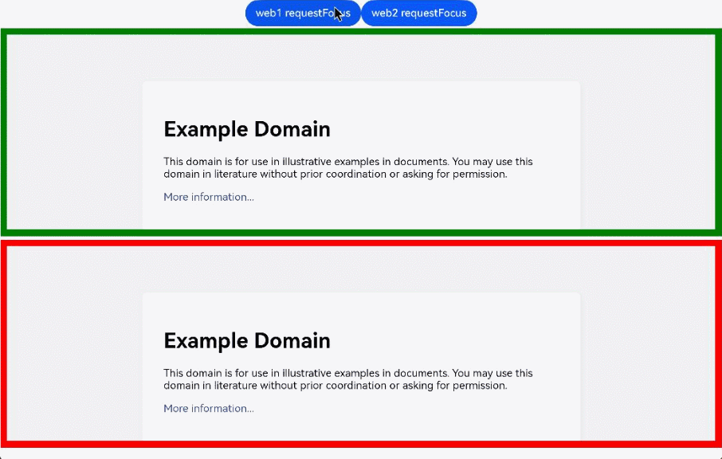

# Managing Focus
<!--Kit: ArkWeb-->
<!--Subsystem: Web-->
<!--Owner: @zourongchun-->
<!--Designer: @zhufenghao-->
<!--Tester: @ghiker-->
<!--Adviser: @HelloCrease-->

The **Web** component provides the focus management functionality for you to effectively manage the focus and defocus of the **Web** component. In addition, you can use the W3C standards-compliant API on the HTML5 side to manage the focus and defocus of the only interactive element on the Web page.

- Application scenarios of common APIs for controlling the focus of the **Web** component and ArkUI component:

  1. Use **requestFocus** to request the focus for a **Web** component: When an application has multiple components, you can use [requestFocus](../reference/apis-arkweb/arkts-apis-webview-WebviewController.md#requestfocus) of the **Web** component to move the focus to the **Web** component.
  2. Change the **Web** component style based on the focus state: The component listens for focus event to modify the component style, such as the border and background color. This provides visual and interactive feedback.

- Application scenarios of common APIs for controlling the focus of the HTML5 element in the **Web** component:

  1. Use the **tabindex** attribute to manage the element focus: You can define the focus sequence of elements in the **Web** component through the **tabindex** attribute. For example, by setting it to **-1**, you can focus the element through the script and control the visibility of the element in CSS.
  2. Update the focus position based on keyboard events: Listen for keyboard events, such as the **Tab** key, so that the focus position can be updated based on user operations.
  3. Change the element style in the Web component based on the focus state: Add styles, such as the border and background color, to the focus element to provide visual and interaction feedback.

## Basic Concepts
For details about the focus, focus chain, and focus navigation of the **Web** component, see [Basic Concepts of ArkUI Focus](../ui/arkts-common-events-focus-event.md#basic-concepts).

- Focus:
    - Component focus: unique interactive element on the current application UI.
    - Element focus: unique interactive element on the current web page.
- Focus navigation:
    - Focus navigation: refers to the behavior of focus shifting between components in an application. This process is transparent to the user but can be monitored through **onFocus** and **onBlur** events.
    - Element focus navigation: refers to the behavior of focus shifting between elements on a web page. This behavior complies with the W3C standard. You can obtain the changes by listening for the **focus** (triggered when the element obtains the focus) and **blur** (triggered when the element loses the focus) events.

## Focus Traversal Guidelines
Focus traversal can be divided into active and passive based on how it is triggered. For details, see [Focus Traversal Guidelines](../ui/arkts-common-events-focus-event.md#focus-traversal-guidelines).

### Active Focus Traversal
Refers to focus movement initiated by deliberate actions, such as keyboard shortcuts (**Tab** or **Shift+Tab**) and clicks or touches through (the gesture, mouse, or touchpad).

- requestFocus

  Moves focus to a specific component. For details, see [Controlling the Focus of the Web Component and ArkUI Component](./web-focus.md#controlling-the-focus-of-the-web-component-and-arkui-component).

- Keyboard traversal

  - Supports focus traversal between the **Web** component and other components through the **TAB** and **Shift+TAB** keys.
  - Supports focus traversal among ArkWeb page elements through the **TAB** and **Shift+TAB** keys. After the focus traversal of page elements, ArkUI continues the focus traversal in the framework.

- Click/Touch for focus

  Users can use gestures, the mouse, or touchpad to click/touch a **Web** component to obtain the focus. Elements in the **Web** component can also be focused when being clicked/touched. For example, an input box in a web page can be clicked/touched to change from a non-editable state to an editable state and activate the input method.

### Passive Focus Traversal
Passive focus traversal occurs when the focus automatically shifts due to system actions or other operations without manual intervention, reflecting the default behavior of the focus system.

Passive focus traversal occurs in the following scenarios:

- Component removal: If a focused **Web** component is removed, the system tries to shift focus to the next available sibling, following a back-to-front order. If no components at the same level are focusable, focus is released to the parent component.

- Attribute change: Changing a component's **focusable** or **enabled** to **false**, or **visibility** to invisible causes the system to automatically move focus to another focusable component, using the same method as for component removal.

- Invisible **Web** components: In scenarios such as application foreground and background switchover, page switchover, and navigation, a focused **Web** component will lose focus and be focused again.

- Web page loading: When the **Web** component loads a web page through **src**, **loadUrl**, and **loadData**, the focus is obtained by default. However, if the **Web** component is not focusable, the focus fails to be obtained. The common causes are as follows: The parent component cannot be focused during the animation. The **Web** component or its parent component is set to be not focusable on the application side. The application can call [requestFocus](../reference/apis-arkweb/arkts-apis-webview-WebviewController.md#requestfocus) to obtain the focus again. When the focus is obtained successfully, the **onFocus** and **W3C focus** events on the application side are reported.

- **autofocus**: Elements with the **autofocus** style are focused by default after web pages are loaded. If the element supports text input, the cursor blinks in the text box, but the soft keyboard is not displayed. For details about how to automatically display the soft keyboard, see [Automatically Displaying the Soft Keyboard](web-docking-softkeyboard.md#automatically-displaying-the-soft-keyboard).


- Menu display: By default, the ArkUI component with the **overlay** attribute is focused. When the **Web** component is used together with this type of component such as [menu](../reference/apis-arkui/arkui-ts/ts-basic-components-menu.md), [datepicker](../reference/apis-arkui/arkui-ts/ts-basic-components-datepicker.md), [timepicker](../reference/apis-arkui/arkui-ts/ts-basic-components-timepicker.md), drop-down list box, and dialog box, the **Web** component loses focus.

## Controlling the Focus of the Web Component and ArkUI Component

- [onFocus](../reference/apis-arkui/arkui-ts/ts-universal-focus-event.md#onfocus): common focus obtaining callback API on the application side. When a component bound to this API is focused, the callback responses.
- [onBlur](../reference/apis-arkui/arkui-ts/ts-universal-focus-event.md#onblur): common defocus callback API on the application side. When a component bound to this API loses focus, the callback responses.
- To enable the component to proactively obtain focus, invoke the [requestFocus](../reference/apis-arkweb/arkts-apis-webview-WebviewController.md#requestfocus) API on the application side.
- To set whether a **Web** component can obtain the focus, set the [focusable](../reference/apis-arkui/arkui-ts/ts-universal-attributes-focus.md#focusable) attribute. The **Web** component can obtain the focus by default.

**Example**
1. Use the **requestFocus** API to allow the **Web** component to proactively obtain the focus.
2. The **onFocus** and **onBlur** APIs are usually used in pairs to listen for the focus changes of the component.

```ts
// xxx.ets
import { webview } from '@kit.ArkWeb';
import { BusinessError } from '@kit.BasicServicesKit';

@Entry
@Component
struct WebComponent {
  controller: webview.WebviewController = new webview.WebviewController();
  controller2: webview.WebviewController = new webview.WebviewController();
  @State webBorderColor: Color = Color.Red;
  @State webBorderColor2: Color = Color.Red;

  build() {
    Column() {
      Row() {
        Button('web1 requestFocus')
          .onClick(() => {
            try {
              this.controller.requestFocus();
            } catch (error) {
              console.error(`ErrorCode: ${(error as BusinessError).code},  Message: ${(error as BusinessError).message}`);
            }
          });
        Button('web2 requestFocus')
          .onClick(() => {
            try {
              this.controller2.requestFocus();
            } catch (error) {
              console.error(`ErrorCode: ${(error as BusinessError).code},  Message: ${(error as BusinessError).message}`);
            }
          });
      }
      Web({ src: 'www.example.com', controller: this.controller })
        .onFocus(() => {
          this.webBorderColor = Color.Green;
        })
        .onBlur(() => {
          this.webBorderColor = Color.Red;
        })
        .margin(3)
        .borderWidth(10)
        .borderColor(this.webBorderColor)
        .height("45%")

      Web({ src: 'www.example.com', controller: this.controller2 })
        .onFocus(() => {
          this.webBorderColor2 = Color.Green;
        })
        .onBlur(() => {
          this.webBorderColor2 = Color.Red;
        })
        .margin(3)
        .borderWidth(10)
        .borderColor(this.webBorderColor2)
        .height("45%")
    }
  }
}
```
Figure 1 **onFocus**/**onBlur** events

Use **requestFocus** to request focus, and change the border color of the **Web** component by listening for the **onFocus** and **onBlur** events.



## Controlling the Focus of HTML5 Elements in the Web Component
- Use the **focus** event of the W3C standards to detect whether an element is focused on a web page.
```
addEventListener("focus", (event) => {});

onfocus = (event) => {};
```
- Use the **blur** event of the W3C standards to detect whether an element loses focus on a web page.
```
addEventListener("blur", (event) => {});

onblur = (event) => {};
```
- Use W3C **autofocus** to focus an element when the page is loaded or the **dialog** to which the element belongs is displayed.
```
<input name="q" autofocus />
```
In a document or dialog box, only one element can have the **autofocus** attribute. If you apply this attribute to multiple elements, the first element will be focused.

**Example**
```ts
// xxx.ets
import { webview } from '@kit.ArkWeb';
import { BusinessError } from '@kit.BasicServicesKit';

@Entry
@Component
struct WebComponent {
  controller: webview.WebviewController = new webview.WebviewController();

  build() {
    Column() {
      Web({ src: $rawfile("test.html"), controller: this.controller })
    }
  }
}
```

```js
// test.html
<!DOCTYPE html>
<html>
<head>
<meta charset="utf-8">
<title>test</title>
</head>
<body>
  <form id="form">
    <input type="text" placeholder="text input" />
    <input type="password" placeholder="password" />
  </form>
</body>
<script>
const form = document.getElementById("form");

form.addEventListener(
  "focus",
  (event) => {
    event.target.style.background = "pink";
  },
  true,
);

form.addEventListener(
  "blur",
  (event) => {
    event.target.style.background = "";
  },
  true,
);
</script>
</html>
```

Example 2 **focus**/**blur** events

Change the input background color by listening for the W3C **focus** and **blur** events.


