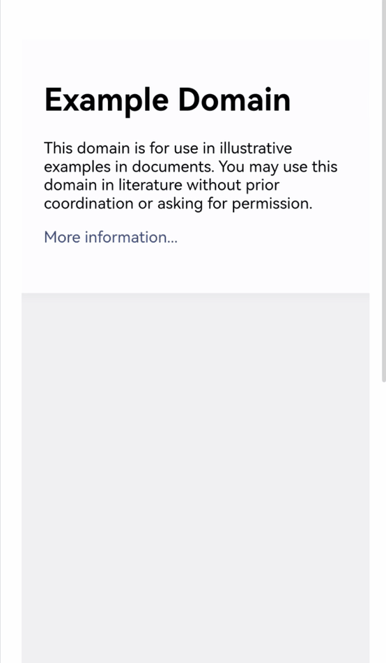

# Interacting with Applications Using Gestures

<!--Kit: ArkWeb-->
<!--Subsystem: Web-->
<!--Owner: @zourongchun-->
<!--Designer: @zhufenghao-->
<!--Tester: @ghiker-->
<!--Adviser: @HelloShuo-->
<!-- md-trans-meta sourceCommit=ed167df66a96022fba65e719fceebf8eb263c3fa translatedAt=2026-08-14T03:46:36.979Z pushedAt=2026-08-14T08:37:08.388Z -->

On mobile or touch-enabled web applications, users interact with web pages through gestures. ArkWeb supports the recognition of common gestures, such as touch and hold, swipe, and tap, providing a rich user interaction experience.

## ArkWeb Gesture Recognition

ArkWeb receives the ArkUI [touch event](../ui/arkts-interaction-development-guide-touch-screen.md#touch-event) and identifies the gesture. For details about the distribution policy of touch events, see [Basic Interaction Principles](../ui/arkts-interaction-basic-principles.md). ArkWeb gestures comply with the touch events, UI events, and pointer events defined by the W3C standard.

The following table lists identifications of common events.

| Gesture Event| Trigger Conditions|
| --- | --- |
| Tap | Triggered when a button is pressed and then lifted within a short interval.|
| LongPress | Triggered when a button is pressed for a period of time without moving.|
| ScrollBegin | Triggered when the page scrolling starts.|
| ScrollUpdate | Triggered when a page is scrolled, including flinging and dragging. Dragging indicates scrolling when a finger does not leave the screen. Flinging indicates that the page continues to scroll after the finger leaves the screen.|
| ScrollEnd | Triggered when the scrolling ends.|
| FlingStart| Triggered when a fling starts.|
| FlingCancel| Triggered when a fling is canceled.|
| PinchBegin | Triggered when a pinch gesture starts.|
| PinchUpdate | Triggered when a pinch gesture is updated.|
| PinchEnd | Triggered when a pinch gesture ends.|

## ArkWeb Gestures and ArkUI Gestures

ArkUI provides [gesture binding](../ui/arkts-gesture-events-binding.md) while ArkWeb has independent gesture recognition. Therefore, you need to distinguish these two types of gestures.

- ArkWeb gestures: automatically generated by **Web** components upon receiving touch events. These gestures are used on web pages.

- ArkUI gestures: received by and used on the **Web** component. ArkUI gestures are not directly used on web pages.

The following uses zoom as an example to describe the differences between the two gestures:

- When two fingers are pinched on the web page, the content in the **Web** component is zoomed in or out. This is because ArkWeb identifies the pinch event and applies it to the web page.

- If a user pinches three fingers together, the **Web** component itself scales. This is because ArkWeb receives the [Pinch Gesture](../ui/arkts-gesture-events-single-gesture.md#pinch-gesture-pinchgesture) identified by ArkUI and executes the bound callback function. In addition, ArkWeb supports the **scale** method, which can be used to adjust the zoom ratio of the **Web** component.

> **NOTE**
>
> This example is used only to describe the differences between ArkUI gestures and ArkWeb gestures. You are not advised to use this method to scale **Web** components.

<!-- @[DistinguishTwoGesture](https://gitcode.com/openharmony/applications_app_samples/blob/master/code/DocsSample/ArkWeb/WebGestureInteraction/entry/src/main/ets/pages/DistinguishTwoGesture.ets) -->

``` TypeScript
import { webview } from '@kit.ArkWeb';

@Entry
@Component
struct Index {
  @State scaleValue: number = 1;
  @State pinchValue: number = 1;
  controller: webview.WebviewController = new webview.WebviewController();

  build() {
    Column() {
      Web({ src: 'www.example.com', controller: this.controller })
      // Bind the zoom ratio to the component. You can change the zoom ratio to zoom in or out the component.
        .scale({ x: this.scaleValue, y: this.scaleValue, z: 1 })
        .zoomAccess(true)
        .gesture(
          // Bind the pinch gesture triggered by three fingers to the component.
          PinchGesture({ fingers: 3 })
            .onActionStart((event: GestureEvent|undefined) => {
              console.info('Pinch start');
            })
            // Obtain the zoom ratio through the callback function when the pinch gesture is triggered, and then change the zoom ratio of the component.
            .onActionUpdate((event: GestureEvent|undefined) => {
              if(event){
                this.scaleValue = this.pinchValue * event.scale;
                console.info(`Pinch update: ${this.scaleValue}`);
              }
            })
            .onActionEnd(() => {
              this.pinchValue = this.scaleValue;
              console.info('Pinch end');
            })
        )
    }
  }
}
```



## ArkWep Gesture Judgment

- ArkUI gestures

  ArkWeb consumes some ArkUI gestures, for example, the [swipe gesture](../ui/arkts-gesture-events-single-gesture.md#swipe-gesture-pangesture). If you want to handle these gestures yourself instead of letting ArkWeb consume them, refer to ArkUI's [gesture conflict handling](../ui/arkts-gesture-events-gesture-judge.md). For a specific example, see [example](../reference/apis-arkui/arkui-ts/ts-gesture-customize-judge.md#example).

- ArkWeb gestures

  ArkWeb gestures are generated after the **Web** component receives touch events. You can use either of the following methods to judge ArkWeb gestures:

  1. Do not send touch events to the **Web** component. For details, see [Hit Testing](../ui/arkts-interaction-basic-principles.md#hit-testing).

  2. Send the **TouchCancel** event to the **Web** component. For details about the C APIs, see [OH_ArkUI_TouchRecognizer_CancelTouch](../reference/apis-arkui/capi-native-gesture-h.md#functions). For details about the sample, see <!--RP1-->[NdkGestureSetting](https://gitcode.com/openharmony/applications_app_samples/tree/master/code/DocsSample/ArkUISample/NdkGestureSetting)<!--RP1End-->.

## FAQs

### How do I disable the zoom gesture?

The **Web** component provides the [zoomAccess](../reference/apis-arkweb/arkts-basic-components-web-attributes.md#zoomaccess) API to control whether to enable zooming. You can also use the **user-scalable** attribute on the web page to control zooming. For details, see [Zooming Web Pages](web-scale-zoom.md).

### How do I enable the **Web** component to return to the previous web page following a swipe gesture?

**Solution**

Override the **onBackPress** API to define the return logic and use **WebviewController** to determine whether to return to the previous web page.

**Example**

<!-- @[ReturnLastWebPage](https://gitcode.com/openharmony/applications_app_samples/blob/master/code/DocsSample/ArkWeb/WebGestureInteraction/entry/src/main/ets/pages/ReturnLastWebPage.ets) -->

``` TypeScript
import { webview } from '@kit.ArkWeb';

@Entry
@Component
struct Index {
  controller: webview.WebviewController = new webview.WebviewController();

  build() {
    Column() {
      Web({ src: 'https://www.example.com', controller: this.controller }) // Replace it with a real website manually.
    }
  }

  onBackPress() {
    try {
      // Whether the current page can go forward or backward by the given step (-1). A positive value indicates forward, and a negative value indicates backward.
      if (this.controller.accessStep(-1)) {
        this.controller.backward(); // Return to the previous web page.
        // Execute the user-defined back logic.
        return true;
      }
    } catch (err) {
      console.error(`onBackPress failed with error: ${err.code}, ${err.message}`);
    }
    // Execute the default system back logic to return to the previous page.
    return false;
  }
}
```

### Why cannot I interact with the web page after it is loaded?

The web page may determine its behavior based on other platforms' **User-Agent**. To solve this problem, you can use [setCustomUserAgent](../reference/apis-arkweb/arkts-apis-webview-WebviewController.md#setcustomuseragent10) to set a custom **User-Agent** in the **Web** component. For example:

<!-- @[SetUserAgent](https://gitcode.com/openharmony/applications_app_samples/blob/master/code/DocsSample/ArkWeb/WebGestureInteraction/entry/src/main/ets/pages/SetUserAgent.ets) -->

``` TypeScript
import { webview } from '@kit.ArkWeb';

@Entry
@Component
struct Index {
  private webController: webview.WebviewController = new webview.WebviewController();
  build(){
    Column() {
      Web({
        src: 'https://www.example.com',
        controller: this.webController,
      }).onControllerAttached(() => {
        // Customize User-Agent.
        let customUA = 'Mozilla/5.0 (Phone; Android; HarmonyOS 5.0) AppleWebKit/537.36 (KHTML, like Gecko) Chrome/129.0.0.0 Mobile Safari/537.36';
        this.webController.setCustomUserAgent(customUA);
      })
    }
  }
}
```

### How to handle a blank page caused by excessive fling speed?

The **Web** component extends the viewport meta tag by adding two attributes, `max-fling-speed-x` and `max-fling-speed-y`, to control the fling speed of the page. You can adjust the attribute values based on your actual requirements.

> **NOTE**
>
> `max-fling-speed-x` limits the horizontal fling speed, and `max-fling-speed-y` limits the vertical fling speed, in vp/s.

The following is an example HTML snippet:

```html
  <meta name="viewport" content="width=device-width, initial-scale=1, max-fling-speed-y=4500">
```

```html
  <meta name="viewport" content="width=device-width, initial-scale=1, max-fling-speed-x=4500">
```

```html
  <meta name="viewport" content="width=device-width, initial-scale=1, max-fling-speed-y=4500, max-fling-speed-x=4500">
```