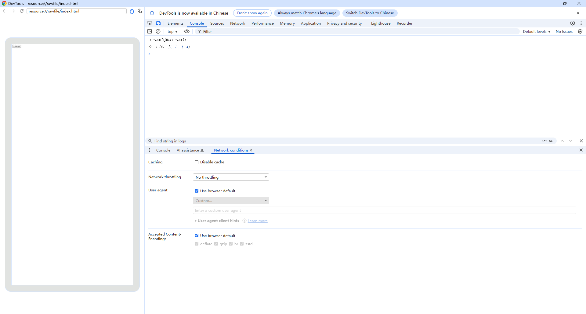

# Invoking Application Functions on the Frontend Page

Register your application code with frontend pages. Then you can invoke application methods with the registered object names on frontend pages.

## Establishing an Interaction Channel Between the Application Side and the HTML5 Page

Two methods are available for registering the application code:<br>Call [javaScriptProxy()](../reference/apis-arkweb/arkts-basic-components-web-attributes.md#javascriptproxy) during **Web** component initialization. Call [registerJavaScriptProxy()](../reference/apis-arkweb/arkts-apis-webview-WebviewController.md#registerjavascriptproxy) after **Web** component initialization. The two methods must be used together with the [deleteJavaScriptRegister](../reference/apis-arkweb/arkts-apis-webview-WebviewController.md#deletejavascriptregister) API to prevent memory leaks.

The following example registers the **test()** function with the frontend page. This way, the **test()** function can be triggered and run on the frontend page.


- Sample code for using [javaScriptProxy()](../reference/apis-arkweb/arkts-basic-components-web-attributes.md#javascriptproxy):

  ```ts
  // xxx.ets
  import { webview } from '@kit.ArkWeb';
  import { BusinessError } from '@kit.BasicServicesKit';

  class TestClass {
    constructor() {
    }

    test(): string {
      return 'ArkTS Hello World!';
    }
  }

  @Entry
  @Component
  struct WebComponent {
    webviewController: webview.WebviewController = new webview.WebviewController();
    // Declare the object to be registered.
    @State testObj: TestClass = new TestClass();

    build() {
      Column() {
        Button('deleteJavaScriptRegister')
          .onClick(() => {
            try {
              this.webviewController.deleteJavaScriptRegister("testObjName");
            } catch (error) {
              console.error(`ErrorCode: ${(error as BusinessError).code},  Message: ${(error as BusinessError).message}`);
            }
          })
        // Load the local index.html page.
        Web({ src: $rawfile('index.html'), controller: this.webviewController})
          // Inject the object to the web client.
          .javaScriptProxy({
            object: this.testObj,
            name: "testObjName",
            methodList: ["test"],
            controller: this.webviewController,
            // Optional parameter.
            asyncMethodList: [],
            permission: '{"javascriptProxyPermission":{"urlPermissionList":[{"scheme":"resource","host":"rawfile","port":"","path":""},' +
                        '{"scheme":"e","host":"f","port":"g","path":"h"}],"methodList":[{"methodName":"test","urlPermissionList":' +
                        '[{"scheme":"https","host":"xxx.com","port":"","path":""},{"scheme":"resource","host":"rawfile","port":"","path":""}]},' +
                        '{"methodName":"test11","urlPermissionList":[{"scheme":"q","host":"r","port":"","path":"t"},' +
                        '{"scheme":"u","host":"v","port":"","path":""}]}]}}'
          })
      }
    }
  }
  ```
- Sample code for the application using [registerJavaScriptProxy()](../reference/apis-arkweb/arkts-apis-webview-WebviewController.md#registerjavascriptproxy) for registration:

  ```ts
  // xxx.ets
  import { webview } from '@kit.ArkWeb';
  import { BusinessError } from '@kit.BasicServicesKit';

  class TestClass {
    constructor() {
    }

    test(): string {
      return "ArkUI Web Component";
    }

    toString(): void {
      console.log('Web Component toString');
    }
  }

  @Entry
  @Component
  struct Index {
    webviewController: webview.WebviewController = new webview.WebviewController();
    @State testObj: TestClass = new TestClass();

    build() {
      Column() {
        Button('refresh')
          .onClick(() => {
            try {
              this.webviewController.refresh();
            } catch (error) {
              console.error(`ErrorCode: ${(error as BusinessError).code},  Message: ${(error as BusinessError).message}`);
            }
          })
        Button('Register JavaScript To Window')
          .onClick(() => {
            try {
              this.webviewController.registerJavaScriptProxy(this.testObj, "testObjName", ["test", "toString"],
                      // Optional parameter: asyncMethodList
                      [],
                      // Optional parameter: permission
                      '{"javascriptProxyPermission":{"urlPermissionList":[{"scheme":"resource","host":"rawfile","port":"","path":""},' +
                      '{"scheme":"e","host":"f","port":"g","path":"h"}],"methodList":[{"methodName":"test","urlPermissionList":' +
                      '[{"scheme":"https","host":"xxx.com","port":"","path":""},{"scheme":"resource","host":"rawfile","port":"","path":""}]},' +
                      '{"methodName":"test11","urlPermissionList":[{"scheme":"q","host":"r","port":"","path":"t"},' +
                      '{"scheme":"u","host":"v","port":"","path":""}]}]}}'
              );
            } catch (error) {
              console.error(`ErrorCode: ${(error as BusinessError).code},  Message: ${(error as BusinessError).message}`);
            }
          })
        Button('deleteJavaScriptRegister')
          .onClick(() => {
            try {
              this.webviewController.deleteJavaScriptRegister("testObjName");
            } catch (error) {
              console.error(`ErrorCode: ${(error as BusinessError).code},  Message: ${(error as BusinessError).message}`);
            }
          })
        Web({ src: $rawfile('index.html'), controller: this.webviewController })
      }
    }
  }
  ```

  > **NOTE**
  >
  > - You need to call the [refresh()](../reference/apis-arkweb/arkts-apis-webview-WebviewController.md#refresh) method for the registration to take effect after using the [registerJavaScriptProxy()](../reference/apis-arkweb/arkts-apis-webview-WebviewController.md#registerjavascriptproxy) method.

- The optional parameter permission is a JSON string. The following is an example:
  ```json
  {
    "javascriptProxyPermission": {
      "urlPermissionList": [       // Object-level permission. If it is granted, all methods are available.
        {
          "scheme": "resource",    // Exact match. This field is mandatory and cannot be empty.
          "host": "rawfile",       // Exact match. This field is mandatory and cannot be empty.
          "port": "",              // Exact match. If the value is empty, the check is not performed. This field is mandatory.
          "path": ""               // Prefix match. If the value is empty, the check is not performed. This field is mandatory.
        },
        {
          "scheme": "https",       // Exact match. This field is mandatory and cannot be empty.
          "host": "xxx.com",       // Exact match. This field is mandatory and cannot be empty.
          "port": "8080",          // Exact match. If the value is empty, the check is not performed. This field is mandatory.
          "path": "a/b/c"          // Prefix match. If the value is empty, the check is not performed. This parameter is mandatory.
        }
      ],
      "methodList": [
        {
          "methodName": "test",
          "urlPermissionList": [   // Method-level permission.
            {
              "scheme": "https",   // Exact match. This field is mandatory and cannot be empty.
              "host": "xxx.com",   // Exact match. This field is mandatory and cannot be empty.
              "port": "",          // Exact match. If the value is empty, the check is not performed. This field is mandatory.
              "path": ""           // Prefix match. If the value is empty, the check is not performed. This parameter is mandatory.
            },
            {
              "scheme": "resource",// Exact match. This field is mandatory and cannot be empty.
              "host": "rawfile",   // Exact match. This field is mandatory and cannot be empty.
              "port": "",          // Exact match. If the value is empty, the check is not performed. This field is mandatory.
              "path": ""           // Prefix match. If the value is empty, the check is not performed. This field is mandatory.
            }
          ]
        },
        {
          "methodName": "test11",
          "urlPermissionList": [   // Method-level permission.
            {
              "scheme": "q",       // Exact match. This field is mandatory and cannot be empty.
              "host": "r",         // Exact match. This field is mandatory and cannot be empty.
              "port": "",          // Exact match. If the value is empty, the check is not performed. This field is mandatory.
              "path": "t"          // Prefix match. If the value is empty, the check is not performed. This field is mandatory.
            },
            {
              "scheme": "u",       // Exact match. This field is mandatory and cannot be empty.
              "host": "v",         // Exact match. This field is mandatory and cannot be empty.
              "port": "",          // Exact match. If the value is empty, the check is not performed. This field is mandatory.
              "path": ""           // Prefix match. If the value is empty, the check is not performed. This field is mandatory.
            }
          ]
        }
      ]
    }
  }
  ```

- Sample code for invoking application functions on the **index.html** frontend page:

  ```html
  <!-- index.html -->
  <!DOCTYPE html>
  <html>
  <body>
  <button type="button" onclick="callArkTS()">Click Me!</button>
  <p id="demo"></p>
  <script>
      function callArkTS() {
          let str = testObjName.test();
          document.getElementById("demo").innerHTML = str;
          console.info('ArkTS Hello World! :' + str);
      }
  </script>
  </body>
  </html>
  ```
## Usage of Complex Types

### Passing Arrays Between the Application and the Frontend Page

 Arrays can be used as parameters or return values of object registration methods and passed between applications and frontend pages.
  ```ts
  // xxx.ets
  import { webview } from '@kit.ArkWeb';
  import { BusinessError } from '@kit.BasicServicesKit';

  class TestClass {
    constructor() {
    }

    test(): Array<Number> {
      return [1, 2, 3, 4]
    }

    toString(param: String): void {
      console.log('Web Component toString' + param);
    }
  }

  @Entry
  @Component
  struct Index {
    webviewController: webview.WebviewController = new webview.WebviewController();
    @State testObj: TestClass = new TestClass();

    build() {
      Column() {
        Button('refresh')
          .onClick(() => {
            try {
              this.webviewController.refresh();
            } catch (error) {
              console.error(`ErrorCode: ${(error as BusinessError).code},  Message: ${(error as BusinessError).message}`);
            }
          })
        Button('Register JavaScript To Window')
          .onClick(() => {
            try {
              this.webviewController.registerJavaScriptProxy(this.testObj, "testObjName", ["test", "toString"]);
            } catch (error) {
              console.error(`ErrorCode: ${(error as BusinessError).code},  Message: ${(error as BusinessError).message}`);
            }
          })
        Button('deleteJavaScriptRegister')
          .onClick(() => {
            try {
              this.webviewController.deleteJavaScriptRegister("testObjName");
            } catch (error) {
              console.error(`ErrorCode: ${(error as BusinessError).code},  Message: ${(error as BusinessError).message}`);
            }
          })
        Web({ src: $rawfile('index.html'), controller: this.webviewController })
      }
    }
  }
  ```

  ```html
  <!-- index.html -->
  <!DOCTYPE html>
  <html>
  <body>
  <button type="button" onclick="callArkTS()">Click Me!</button>
  <p id="demo"></p>
  <script>
      function callArkTS() {
          testObjName.toString(testObjName.test());
      }
  </script>
  </body>
  </html>
  ```

### Using Complex Types Excluding Functions

  Sample code for passing complex types (excluding functions) as parameters or return values in object registration methods between the application and the frontend page:
  ```ts
  // xxx.ets
  import { webview } from '@kit.ArkWeb';
  import { BusinessError } from '@kit.BasicServicesKit';

  class Student {
    name: string = '';
    age: string = '';
  }

  class TestClass {
    constructor() {
    }

    // Data of primitive types to pass: name:"jeck", age:"12"
    test(): Student {
      let st: Student = { name: "jeck", age: "12" };
      return st;
    }

    toString(param: ESObject): void {
      console.log('Web Component toString' + param["name"]);
    }
  }

  @Entry
  @Component
  struct Index {
    webviewController: webview.WebviewController = new webview.WebviewController();
    @State testObj: TestClass = new TestClass();

    build() {
      Column() {
        Button('refresh')
          .onClick(() => {
            try {
              this.webviewController.refresh();
            } catch (error) {
              console.error(`ErrorCode: ${(error as BusinessError).code},  Message: ${(error as BusinessError).message}`);
            }
          })
        Button('Register JavaScript To Window')
          .onClick(() => {
            try {
              this.webviewController.registerJavaScriptProxy(this.testObj, "testObjName", ["test", "toString"]);
            } catch (error) {
              console.error(`ErrorCode: ${(error as BusinessError).code},  Message: ${(error as BusinessError).message}`);
            }
          })
        Button('deleteJavaScriptRegister')
          .onClick(() => {
            try {
              this.webviewController.deleteJavaScriptRegister("testObjName");
            } catch (error) {
              console.error(`ErrorCode: ${(error as BusinessError).code},  Message: ${(error as BusinessError).message}`);
            }
          })
        Web({ src: $rawfile('index.html'), controller: this.webviewController })
      }
    }
  }
  ```

  ```html
  <!-- index.html -->
  <!DOCTYPE html>
  <html>
  <body>
  <button type="button" onclick="callArkTS()">Click Me!</button>
  <p id="demo"></p>
  <script>
      function callArkTS() {
          testObjName.toString(testObjName.test());
      }
  </script>
  </body>
  </html>
  ```
### Invoking a Callback of the Frontend Page from the Application

  Callbacks can be used as parameters or return values of object registration methods and passed between applications and frontend pages.
  ```ts
  // xxx.ets
  import { webview } from '@kit.ArkWeb';
  import { BusinessError } from '@kit.BasicServicesKit';

  class TestClass {
    constructor() {
    }

    test(param: Function): void {
      param("call callback");
    }

    toString(param: String): void {
      console.log('Web Component toString' + param);
    }
  }

  @Entry
  @Component
  struct Index {
    webviewController: webview.WebviewController = new webview.WebviewController();
    @State testObj: TestClass = new TestClass();

    build() {
      Column() {
        Button('refresh')
          .onClick(() => {
            try {
              this.webviewController.refresh();
            } catch (error) {
              console.error(`ErrorCode: ${(error as BusinessError).code},  Message: ${(error as BusinessError).message}`);
            }
          })
        Button('Register JavaScript To Window')
          .onClick(() => {
            try {
              this.webviewController.registerJavaScriptProxy(this.testObj, "testObjName", ["test", "toString"]);
            } catch (error) {
              console.error(`ErrorCode: ${(error as BusinessError).code},  Message: ${(error as BusinessError).message}`);
            }
          })
        Button('deleteJavaScriptRegister')
          .onClick(() => {
            try {
              this.webviewController.deleteJavaScriptRegister("testObjName");
            } catch (error) {
              console.error(`ErrorCode: ${(error as BusinessError).code},  Message: ${(error as BusinessError).message}`);
            }
          })
        Web({ src: $rawfile('index.html'), controller: this.webviewController })
      }
    }
  }
  ```

  ```html
  <!-- index.html -->
  <!DOCTYPE html>
  <html>
  <body>
  <button type="button" onclick="callArkTS()">Click Me!</button>
  <p id="demo"></p>
  <script>
      function callArkTS() {
          testObjName.test(function(param){testObjName.toString(param)});
      }
  </script>
  </body>
  </html>
  ```
### Calling the Function in an Object of the Frontend Page from the Application Side

  The function in an object of the frontend page can be used as the parameter or return value of the registration object method and passed between the application side and the frontend page.
  ```ts
  // xxx.ets
  import { webview } from '@kit.ArkWeb';
  import { BusinessError } from '@kit.BasicServicesKit';

  class TestClass {
    constructor() {
    }

    test(param: ESObject): void {
      param.hello("call obj func");
    }

    toString(param: String): void {
      console.log('Web Component toString' + param);
    }
  }

  @Entry
  @Component
  struct Index {
    webviewController: webview.WebviewController = new webview.WebviewController();
    @State testObj: TestClass = new TestClass();

    build() {
      Column() {
        Button('refresh')
          .onClick(() => {
            try {
              this.webviewController.refresh();
            } catch (error) {
              console.error(`ErrorCode: ${(error as BusinessError).code},  Message: ${(error as BusinessError).message}`);
            }
          })
        Button('Register JavaScript To Window')
          .onClick(() => {
            try {
              this.webviewController.registerJavaScriptProxy(this.testObj, "testObjName", ["test", "toString"]);
            } catch (error) {
              console.error(`ErrorCode: ${(error as BusinessError).code},  Message: ${(error as BusinessError).message}`);
            }
          })
        Button('deleteJavaScriptRegister')
          .onClick(() => {
            try {
              this.webviewController.deleteJavaScriptRegister("testObjName");
            } catch (error) {
              console.error(`ErrorCode: ${(error as BusinessError).code},  Message: ${(error as BusinessError).message}`);
            }
          })
        Web({ src: $rawfile('index.html'), controller: this.webviewController })
      }
    }
  }
  ```

  ```html
  <!-- index.html -->
  <!DOCTYPE html>
  <html>
  <body>
  <button type="button" onclick="callArkTS()">Click Me!</button>
  <p id="demo"></p>
  <script>
      // Method 1
      class Student {
          constructor(nameList) {
              this.methodNameListForJsProxy = nameList;
          }

          hello(param) {
              testObjName.toString(param)
          }
      }
      var st = new Student(["hello"])

      // Method 2
      // Create a constructor, with the first letter of the constructor capitalized.
      function Obj1(){
          this.methodNameListForJsProxy=["hello"];
          this.hello=function(param){
              testObjName.toString(param)
          };
      }
      // Use the constructor to create an object using the new keyword.
      var st1 = new Obj1();

      function callArkTS() {
          testObjName.test(st);
          testObjName.test(st1);
      }
  </script>
  </body>
  </html>
  ```

### Calling the Function in an Object of the Application Side from the Frontend Page

  The function in an object of the application side can be used as the parameter or return value of the registration object method and passed between the application side and the frontend page.
  ```ts
  // xxx.ets
  import { webview } from '@kit.ArkWeb';
  import { BusinessError } from '@kit.BasicServicesKit';

  class ObjOther {
    methodNameListForJsProxy: string[]

    constructor(list: string[]) {
      this.methodNameListForJsProxy = list
    }

    testOther(json: string): void {
      console.info(json)
    }
  }

  class TestClass {
    ObjReturn: ObjOther

    constructor() {
      this.ObjReturn = new ObjOther(["testOther"]);
    }

    test(): ESObject {
      return this.ObjReturn
    }

    toString(param: string): void {
      console.log('Web Component toString' + param);
    }
  }

  @Entry
  @Component
  struct Index {
    webviewController: webview.WebviewController = new webview.WebviewController();
    @State testObj: TestClass = new TestClass();

    build() {
      Column() {
        Button('refresh')
          .onClick(() => {
            try {
              this.webviewController.refresh();
            } catch (error) {
              console.error(`ErrorCode: ${(error as BusinessError).code},  Message: ${(error as BusinessError).message}`);
            }
          })
        Button('Register JavaScript To Window')
          .onClick(() => {
            try {
              this.webviewController.registerJavaScriptProxy(this.testObj, "testObjName", ["test", "toString"]);
            } catch (error) {
              console.error(`ErrorCode: ${(error as BusinessError).code},  Message: ${(error as BusinessError).message}`);
            }
          })
        Button('deleteJavaScriptRegister')
          .onClick(() => {
            try {
              this.webviewController.deleteJavaScriptRegister("testObjName");
            } catch (error) {
              console.error(`ErrorCode: ${(error as BusinessError).code},  Message: ${(error as BusinessError).message}`);
            }
          })
        Web({ src: $rawfile('index.html'), controller: this.webviewController })
      }
    }
  }
  ```

  ```html
  <!-- index.html -->
  <!DOCTYPE html>
  <html>
  <body>
  <button type="button" onclick="callArkTS()">Click Me!</button>
  <p id="demo"></p>
  <script>
      function callArkTS() {
        testObjName.test().testOther("call other object func");
      }
  </script>
  </body>
  </html>
  ```

### Using Promises

  Create a promise on the application side. Use the promise as the parameter or return value of the object method and pass it to the frontend page.
  ```ts
  // xxx.ets
  import { webview } from '@kit.ArkWeb';
  import { BusinessError } from '@kit.BasicServicesKit';

  class TestClass {
    constructor() {
    }

    test(): Promise<string> {
      let p: Promise<string> = new Promise((resolve, reject) => {
        setTimeout(() => {
          console.log ('Execution completed');
          reject('fail');
        }, 10000);
      });
      return p;
    }

    toString(param: String): void {
      console.log(" " + param);
    }
  }

  @Entry
  @Component
  struct Index {
    webviewController: webview.WebviewController = new webview.WebviewController();
    @State testObj: TestClass = new TestClass();

    build() {
      Column() {
        Button('refresh')
          .onClick(() => {
            try {
              this.webviewController.refresh();
            } catch (error) {
              console.error(`ErrorCode: ${(error as BusinessError).code},  Message: ${(error as BusinessError).message}`);
            }
          })
        Button('Register JavaScript To Window')
          .onClick(() => {
            try {
              this.webviewController.registerJavaScriptProxy(this.testObj, "testObjName", ["test", "toString"]);
            } catch (error) {
              console.error(`ErrorCode: ${(error as BusinessError).code},  Message: ${(error as BusinessError).message}`);
            }
          })
        Button('deleteJavaScriptRegister')
          .onClick(() => {
            try {
              this.webviewController.deleteJavaScriptRegister("testObjName");
            } catch (error) {
              console.error(`ErrorCode: ${(error as BusinessError).code},  Message: ${(error as BusinessError).message}`);
            }
          })
        Web({ src: $rawfile('index.html'), controller: this.webviewController })
      }
    }
  }
  ```

  ```html
  <!-- index.html -->
  <!DOCTYPE html>
  <html>
  <body>
  <button type="button" onclick="callArkTS()">Click Me!</button>
  <p id="demo"></p>
  <script>
      function callArkTS() {
        testObjName.test().then((param)=>{testObjName.toString(param)}).catch((param)=>{testObjName.toString(param)})
      }
  </script>
  </body>
  </html>
  ```
  Create a promise on the frontend page. Use the promise as the parameter or return value of the object method and pass it to the application side.
  ```ts
  // xxx.ets
  import { webview } from '@kit.ArkWeb';
  import { BusinessError } from '@kit.BasicServicesKit';

  class TestClass {
    constructor() {
    }

    test(param:Function): void {
      setTimeout( () => { param("suc") }, 10000)
    }

    toString(param:String): void {
      console.log(" " + param);
    }
  }

  @Entry
  @Component
  struct Index {
    webviewController: webview.WebviewController = new webview.WebviewController();
    @State testObj: TestClass = new TestClass();

    build() {
      Column() {
        Button('refresh')
          .onClick(() => {
            try {
              this.webviewController.refresh();
            } catch (error) {
              console.error(`ErrorCode: ${(error as BusinessError).code},  Message: ${(error as BusinessError).message}`);
            }
          })
        Button('Register JavaScript To Window')
          .onClick(() => {
            try {
              this.webviewController.registerJavaScriptProxy(this.testObj, "testObjName", ["test", "toString"]);
            } catch (error) {
              console.error(`ErrorCode: ${(error as BusinessError).code},  Message: ${(error as BusinessError).message}`);
            }
          })
        Button('deleteJavaScriptRegister')
          .onClick(() => {
            try {
              this.webviewController.deleteJavaScriptRegister("testObjName");
            } catch (error) {
              console.error(`ErrorCode: ${(error as BusinessError).code},  Message: ${(error as BusinessError).message}`);
            }
          })
        Web({ src: $rawfile('index.html'), controller: this.webviewController })
      }
    }
  }
  ```

  ```html
  <!-- index.html -->
  <!DOCTYPE html>
  <html>
  <body>
  <button type="button" onclick="callArkTS()">Click Me!</button>
  <p id="demo"></p>
  <script>
      function callArkTS() {
        let funpromise
        var p = new Promise(function(resolve, reject){funpromise=(param)=>{resolve(param)}})
        testObjName.test(funpromise)
        p.then((param)=>{testObjName.toString(param)})
      }
  </script>
  </body>
  </html>
  ```
## Checking Whether the Channel Is Successfully Established

1. Enable web debugging.

   For details about how to enable web debugging, see [Debugging Frontend Pages by Using DevTools](web-debugging-with-devtools.md).

2. Use an example to check whether the channel is successfully established.

   The following example passes arrays between the application side and the frontend page described in [Usage of Complex Types](#usage-of-complex-types). The debugging result is shown in the following figure.

   
