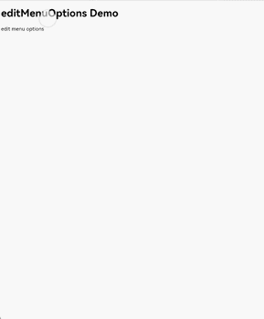
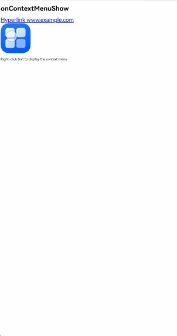
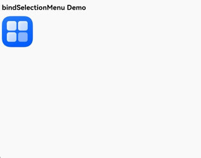
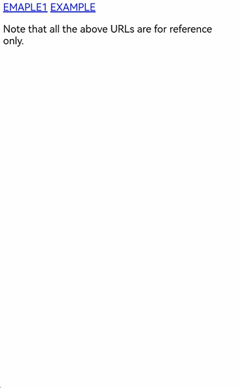
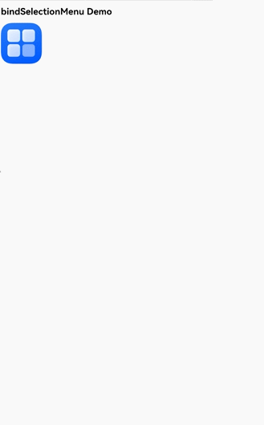
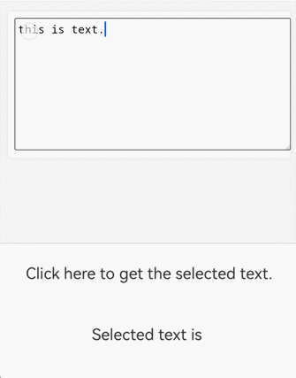
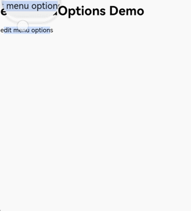

# Using Web Component Menus to Process Web Content

<!--Kit: ArkWeb-->
<!--Subsystem: Web-->
<!--Owner: @zourongchun-->
<!--Designer: @zhufenghao-->
<!--Tester: @ghiker-->
<!--Adviser: @HelloShuo-->
<!-- md-trans-meta sourceCommit=de6c5587afdcf50b930b84ee7fea72915daa554b translatedAt=2026-08-14T03:47:47.046Z pushedAt=2026-08-14T10:20:38.406Z -->

As a key component of user interaction, menus build a clear navigation system and present function entries through a structured layout, allowing users to quickly find target content or perform operations. As an important hub of human-machine interaction, menus significantly improve the accessibility and user experience of the Web component and are an indispensable part of app design. The Web component menu types include the [text selection menu](./web-menu.md#text-selection-menu), [context menu](./web-menu.md#context-menu), and [custom menu](./web-menu.md#custom-menu). You can flexibly select a menu type based on your specific requirements.

|Menu Type|Target Element|Response Type|Customizable|
|----|----|----|----|
|[Text selection menu](./web-menu.md#text-selection-menu)|Text|Long press gesture|Menu items can be added or removed, but the menu style cannot be customized.|
|[Context menu](./web-menu.md#context-menu)|Hyperlink, image, text|Long press gesture, right-click|Customizable through the menu component.|
|[Custom menu](./web-menu.md#custom-menu)|Image|Long press gesture|Customizable through the menu component.|

## Text Selection Menu

The text selection menu of the Web component is a context interaction component implemented through custom elements. It is dynamically displayed when the user selects text, providing semantic operations such as copy, share, and annotate. With standardized functions and good extensibility, it is one of the core features of text operations on mobile devices. The text selection menu pops up when the user long-presses to select text or when a single handle appears after a long press in editing state, with menu items arranged horizontally. The system provides a default menu implementation. An app can customize the text selection menu through the [editMenuOptions](../reference/apis-arkweb/arkts-basic-components-web-attributes.md#editmenuoptions12) API.

1. Customize menu items through the onCreateMenu method. By operating the Array<[TextMenuItem](../reference/apis-arkui/arkui-ts/ts-text-common.md#textmenuitem12)> array, you can add or remove displayed menu items. Define the menu item name, icon, ID, and other content in [TextMenuItem](../reference/apis-arkui/arkui-ts/ts-text-common.md#textmenuitem12).

2. Handle menu item click events through the onMenuItemClick method. When it returns false, the system default logic is executed.

3. Create an [EditMenuOptions](../reference/apis-arkui/arkui-ts/ts-text-common.md#editmenuoptions) object that contains the onCreateMenu and onMenuItemClick methods, and bind it to the Web component through the [editMenuOptions](../reference/apis-arkweb/arkts-basic-components-web-attributes.md#editmenuoptions12) API of the Web component.

<!-- @[web_textMenuItem](https://gitcode.com/openharmony/applications_app_samples/blob/master/code/DocsSample/ArkWeb/ArkWebMenu/entry/src/main/ets/pages/WebTextMenuItem.ets) --> 

``` TypeScript
import { webview } from '@kit.ArkWeb';

@Entry
@Component
struct WebComponent {
  controller: webview.WebviewController = new webview.WebviewController();

  onCreateMenu(menuItems: Array<TextMenuItem>): Array<TextMenuItem> {
    let items = menuItems.filter((menuItem) => {
      // Filter the system menu items required by the user.
      return (
        menuItem.id.equals(TextMenuItemId.CUT) ||
          menuItem.id.equals(TextMenuItemId.COPY) ||
          menuItem.id.equals(TextMenuItemId.PASTE)
      );
    });
    let customItem1: TextMenuItem = {
      content: 'customItem1',
      id: TextMenuItemId.of('customItem1'),
      // Replace $r('app.media.startIcon') with the actual resource file.
      icon: $r('app.media.startIcon')
    };
    let customItem2: TextMenuItem = {
      // Replace $r('app.string.EntryAbility_label') with the actual resource file. In this example, the value of the resource file is "label".
      content: $r('app.string.EntryAbility_label'),
      id: TextMenuItemId.of('customItem2'),
      // Replace $r('app.media.startIcon') with the actual resource file.
      icon: $r('app.media.startIcon')
    };
    items.push(customItem1); // Add a new option after the option list.
    items.unshift(customItem2); // Add an option before the option list.
    for (let i = 0; i < 5; i++) {
      items.push(customItem1); // Add the option repeatedly to support displaying more menus.
    }
    return items;
  }

  onMenuItemClick(menuItem: TextMenuItem, textRange: TextRange): boolean {
    if (menuItem.id.equals(TextMenuItemId.CUT)) {
      // User-defined behavior.
      console.info('intercept id:CUT')
      return true; // Return true to skip the system callback.
    } else if (menuItem.id.equals(TextMenuItemId.COPY)) {
      // User-defined behavior.
      console.info('Do not intercept id:COPY')
      return false; // Return false to execute the system callback.
    } else if (menuItem.id.equals(TextMenuItemId.of('customItem1'))) {
      // User-defined behavior.
      console.info('intercept id:customItem1')
      return true; // For a user-defined menu option, returning true keeps the menu open after the click, and returning false closes the menu.
    } else if (menuItem.id.equals(TextMenuItemId.of('customItem2'))) {
      // User-defined behavior.
      console.info('intercept id:customItem2')
      return true;
    }
    return false; // Return the default value false.
  }

  @State editMenuOptions: EditMenuOptions = { onCreateMenu: this.onCreateMenu, onMenuItemClick: this.onMenuItemClick }

  build() {
    Column() {
      Web({ src: $rawfile('index.html'), controller: this.controller })
        .editMenuOptions(this.editMenuOptions)
    }
  }
}
```

<!---->

  ```html
  <!--index.html-->
  <!DOCTYPE html>
  <html>
    <head>
        <title>Test page</title>
    </head>
    <body>
      <h1>editMenuOptions Demo</h1>
      <span>edit menu options</span>
    </body>
  </html>
  ```

  

## Context Menu

A context menu is a shortcut menu triggered by a specific user action (such as right-clicking or long-pressing rich text). It provides function options related to the current operation object or UI element. Menu items are arranged vertically. The system does not provide a default implementation. If the app does not implement one, no context menu is displayed. You need to create a [Menu](../reference/apis-arkui/arkui-ts/ts-basic-components-menu.md) component and bind it to the Web component. When the menu pops up, you can obtain detailed context menu information through the [onContextMenuShow](../reference/apis-arkweb/arkts-basic-components-web-events.md#oncontextmenushow9) callback of the Web component, including the HTML element information of the clicked position and the click position information.

1. The [Menu](../reference/apis-arkui/arkui-ts/ts-basic-components-menu.md) component serves as the popup menu and contains the behavior and style of all menu items.

2. Use the bindPopup method to bind the Menu component to the Web component. When the context menu pops up, the created Menu component is displayed.

3. Obtain the context menu event information [onContextMenuShowEvent](../reference/apis-arkweb/arkts-basic-components-web-i.md#oncontextmenushowevent12) in the onContextMenuShow callback. In it, param is of the [WebContextMenuParam](../reference/apis-arkweb/arkts-basic-components-web-WebContextMenuParam.md) type, which contains the HTML element information and position information corresponding to the clicked position, and result is of the [WebContextMenuResult](../reference/apis-arkweb/arkts-basic-components-web-WebContextMenuResult.md) type, which provides common menu capabilities.

<!-- @[web_ContextMenu](https://gitcode.com/openharmony/applications_app_samples/blob/master/code/DocsSample/ArkWeb/ArkWebMenu/entry/src/main/ets/pages/WebContextMenu.ets) --> 

``` TypeScript
// xxx.ets
import { webview } from '@kit.ArkWeb';
import { pasteboard } from '@kit.BasicServicesKit';

const TAG = 'ContextMenu';

@Entry
@Component
struct WebComponent {
  controller: webview.WebviewController = new webview.WebviewController();
  private result: WebContextMenuResult | undefined = undefined;
  @State linkUrl: string = '';
  @State offsetX: number = 0;
  @State offsetY: number = 0;
  @State showMenu: boolean = false;
  uiContext: UIContext = this.getUIContext();

  @Builder
  // Build the custom menu and the trigger function interface.
  MenuBuilder() {
    // Menu displayed as a vertical list.
    Menu() {
      // Display the specific menu items in the Menu.
      MenuItem({
        content: 'Copy Image',
      })
        .width(100)
        .height(50)
        .onClick(() => {
          this.result?.copyImage();
          this.showMenu = false;
        })
      MenuItem({
        content: 'Cut',
      })
        .width(100)
        .height(50)
        .onClick(() => {
          this.result?.cut();
          this.showMenu = false;
        })
      MenuItem({
        content: 'Copy',
      })
        .width(100)
        .height(50)
        .onClick(() => {
          this.result?.copy();
          this.showMenu = false;
        })
      MenuItem({
        content: 'Paste',
      })
        .width(100)
        .height(50)
        .onClick(() => {
          this.result?.paste();
          this.showMenu = false;
        })
      MenuItem({
        content: 'Copy link',
      })
        .width(100)
        .height(50)
        .onClick(() => {
          let pasteData = pasteboard.createData(pasteboard.MIMETYPE_TEXT_PLAIN, this.linkUrl);
          pasteboard.getSystemPasteboard().setData(pasteData, (error) => {
            if (error) {
              return;
            }
          })
          this.showMenu = false;
        })
      MenuItem({
        content: 'Select All',
      })
        .width(100)
        .height(50)
        .onClick(() => {
          this.result?.selectAll();
          this.showMenu = false;
        })
    }
    .width(150)
    .height(300)
  }

  build() {
    Column() {
      Web({ src: $rawfile('index1.html'), controller: this.controller })
      // Trigger the custom popup.
        .onContextMenuShow((event) => {
          if (event) {
            this.result = event.result
            console.info('x coord = ' + event.param.x());
            console.info('link url = ' + event.param.getLinkUrl());
            this.linkUrl = event.param.getLinkUrl();
          }
          console.info(TAG, `x: ${this.offsetX}, y: ${this.offsetY}`);
          this.showMenu = true;
          this.offsetX = 0;
          this.offsetY = Math.max(this.uiContext!.px2vp(event?.param.y() ?? 0) - 0, 0);
          return true;
        })
        .bindPopup(this.showMenu,
          {
            builder: this.MenuBuilder(),
            enableArrow: false,
            placement: Placement.LeftTop,
            offset: { x: this.offsetX, y: this.offsetY },
            mask: false,
            onStateChange: (e) => {
              if (!e.isVisible) {
                this.showMenu = false;
                this.result!.closeContextMenu();
              }
            }
          })
    }
  }
}
```

<!---->

```html
<!-- index1.html -->
<!DOCTYPE html>
<html lang="en">
<body>
  <h1>onContextMenuShow</h1>
  <a href="http://www.example.com" style="font-size:27px">Hyperlink www.example.com</a>
  <!--example.png is an image in the same directory as the HTML file.-->
  <div></div>
  <p>Right-click text to display the context menu</p>
</body>
</html>
```



## Custom Menu

The custom menu gives developers the flexibility to control when the menu is triggered and how it is presented. It allows the app to dynamically match function entries based on user operation scenarios, significantly simplifying UI adaptation during development while making the interaction experience more intuitive.

You can implement the custom menu feature through the [bindSelectionMenu](../reference/apis-arkweb/arkts-basic-components-web-attributes.md#bindselectionmenu13) API. Currently, it additionally supports triggering the custom menu and custom text menu by long pressing images, links, and text.

1. Create a [Menu](../reference/apis-arkui/arkui-ts/ts-basic-components-menu.md) component as the menu popup.

2. Bind the MenuBuilder menu popup through the [bindSelectionMenu](../reference/apis-arkweb/arkts-basic-components-web-attributes.md#bindselectionmenu13) method of the Web component. Set [WebElementType](../reference/apis-arkweb/arkts-basic-components-web-e.md#webelementtype13) to `WebElementType.IMAGE` and [responseType](../reference/apis-arkweb/arkts-basic-components-web-e.md#webresponsetype13) to `WebResponseType.LONG_PRESS` to indicate that the menu pops up when an image is long pressed. In [options](../reference/apis-arkweb/arkts-basic-components-web-i.md#selectionmenuoptionsext13), define the menu display callback `onAppear`, the menu disappearance callback `onDisappear`, the preview window `preview`, and the menu type `menuType`.

<!-- @[web_BindSelectionMenu](https://gitcode.com/openharmony/applications_app_samples/blob/master/code/DocsSample/ArkWeb/ArkWebMenu/entry/src/main/ets/pages/WebBindSelectionMenu.ets) -->

``` TypeScript
import { webview } from '@kit.ArkWeb';

interface PreviewBuilderParam {
  previewImage: Resource | string | undefined;
  width: number;
  height: number;
}

@Builder function previewBuilderGlobal($$: PreviewBuilderParam) {
  Column() {
    Image($$.previewImage)
      .objectFit(ImageFit.Fill)
      .autoResize(true)
  }.width($$.width).height($$.height)
}

@Entry
@Component
struct WebComponent {
  controller: webview.WebviewController = new webview.WebviewController();

  private result: WebContextMenuResult | undefined = undefined;
  @State previewImage: Resource | string | undefined = undefined;
  @State previewWidth: number = 0;
  @State previewHeight: number = 0;
  uiContext: UIContext = this.getUIContext();

  @Builder
  MenuBuilder() {
    Menu() {
      MenuItem({ content: 'Copy', })
        .onClick(() => {
          this.result?.copy();
          this.result?.closeContextMenu();
        })
      MenuItem({ content: 'Select All', })
        .onClick(() => {
          this.result?.selectAll();
          this.result?.closeContextMenu();
        })
    }
  }
  build() {
    Column() {
      Web({ src: $rawfile('index2.html'), controller: this.controller })
        .bindSelectionMenu(WebElementType.IMAGE, this.MenuBuilder, WebResponseType.LONG_PRESS,
          {
            onAppear: () => {},
            onDisappear: () => {
              this.result?.closeContextMenu();
            },
            preview: previewBuilderGlobal({
              previewImage: this.previewImage,
              width: this.previewWidth,
              height: this.previewHeight
            }),
            menuType: MenuType.PREVIEW_MENU
          })
        .onContextMenuShow((event) => {
          if (event) {
            this.result = event.result;
            if (event.param.getLinkUrl()) {
              return false;
            }
            this.previewWidth = this.uiContext!.px2vp(event.param.getPreviewWidth());
            this.previewHeight = this.uiContext!.px2vp(event.param.getPreviewHeight());
            if (event.param.getSourceUrl().indexOf('resource://rawfile/') == 0) {
              this.previewImage = $rawfile(event.param.getSourceUrl().substr(19));
            } else {
              this.previewImage = event.param.getSourceUrl();
            }
            return true;
          }
          return false;
        })
    }
  }
}
```

<!---->

```html
<!--index.html-->
<!DOCTYPE html>
<html>
  <head>
      <title>Test page</title>
  </head>
  <body>
    <h1>bindSelectionMenu Demo</h1>
    <!--img.png is an image in the same directory as the HTML file.-->
    
  </body>
</html>
```



Since API version 20, binding a long press gesture menu for hyperlinks is supported. You can bind different custom menus for images and links.

In the following example, PreviewBuilder defines the popup content of the menu corresponding to the hyperlink, loads the hyperlink content with the Web component (note that the Web component in PreviewBuilder does not receive events), and uses the [Progress component](../ui/arkts-common-components-progress-indicator.md) to display the loading progress.

<!-- @[web_PreviewBuilder](https://gitcode.com/openharmony/applications_app_samples/blob/master/code/DocsSample/ArkWeb/ArkWebMenu/entry/src/main/ets/pages/WebPreviewBuilder.ets) --> 

``` TypeScript
import { webview } from '@kit.ArkWeb';
import { pasteboard } from '@kit.BasicServicesKit';

interface PreviewBuilderParam {
  width: number;
  height: number;
  url:Resource | string | undefined;
}

interface PreviewBuilderParamForImage {
  previewImage: Resource | string | undefined;
  width: number;
  height: number;
}


@Builder function previewBuilderGlobalForImage($$: PreviewBuilderParamForImage) {
  Column() {
    Image($$.previewImage)
      .objectFit(ImageFit.Fill)
      .autoResize(true)
  }.width($$.width).height($$.height)
}

@Entry
@Component
struct SelectionMenuLongPress {
  controller: webview.WebviewController = new webview.WebviewController();
  previewController: webview.WebviewController = new webview.WebviewController();
  @Builder PreviewBuilder($$: PreviewBuilderParam){
    Column() {
      Stack(){
        Text('') // Choose whether to display the URL.
          .padding(5)
          .width('100%')
          .textAlign(TextAlign.Start)
          .backgroundColor(Color.White)
          .copyOption(CopyOptions.LocalDevice)
          .maxLines(1)
          .textOverflow({overflow:TextOverflow.Ellipsis})
        Progress({ value: this.progressValue, total: 100, type: ProgressType.Linear }) // Display the progress bar.
          .style({ strokeWidth: 3, enableSmoothEffect: true })
          .backgroundColor(Color.White)
          .opacity(this.progressVisible?1:0)
      }.alignContent(Alignment.Bottom)
      Web({src:$$.url,controller: new webview.WebviewController()})
        .javaScriptAccess(true)
        .fileAccess(true)
        .onlineImageAccess(true)
        .imageAccess(true)
        .domStorageAccess(true)
        .onPageBegin(()=>{
          this.progressValue = 0;
          this.progressVisible = true;
        })
        .onProgressChange((event)=>{
          this.progressValue = event.newProgress;
        })
        .onPageEnd(()=>{
          this.progressVisible = false;
        })
        .hitTestBehavior(HitTestMode.None) // Make the preview Web component not respond to gestures.
    }.width($$.width).height($$.height) // Set the preview width and height.
  }

  private result: WebContextMenuResult | undefined = undefined;
  @State previewImage: Resource | string | undefined = undefined;
  @State previewWidth: number = 1;
  @State previewHeight: number = 1;
  @State previewWidthImage: number = 1;
  @State previewHeightImage: number = 1;
  @State linkURL:string = '';
  @State progressValue:number = 0;
  @State progressVisible:boolean = true;
  uiContext: UIContext = this.getUIContext();

  @Builder
  LinkMenuBuilder() {
    Menu() {
      MenuItem({ content: 'Copy link', })
        .onClick(() => {
          const pasteboardData = pasteboard.createData(pasteboard.MIMETYPE_TEXT_PLAIN, this.linkURL);
          const systemPasteboard = pasteboard.getSystemPasteboard();
          systemPasteboard.setData(pasteboardData);
        })
      MenuItem({content:'Open the link'})
        .onClick(()=>{
          this.controller.loadUrl(this.linkURL);
        })
    }
  }
  @Builder
  ImageMenuBuilder() {
    Menu() {
      MenuItem({ content: 'Copy Image', })
        .onClick(() => {
          this.result?.copyImage();
          this.result?.closeContextMenu();
        })
    }
  }
  build() {
    Column() {
      Web({ src: $rawfile('index3.html'), controller: this.controller })
        .javaScriptAccess(true)
        .fileAccess(true)
        .onlineImageAccess(true)
        .imageAccess(true)
        .domStorageAccess(true)
        .bindSelectionMenu(WebElementType.LINK, this.LinkMenuBuilder, WebResponseType.LONG_PRESS,
          {
            onAppear: () => {},
            onDisappear: () => {
              this.result?.closeContextMenu();
            },
            preview: this.PreviewBuilder({
              width: 500,
              height: 400,
              url:this.linkURL
            }),
            menuType: MenuType.PREVIEW_MENU,
          })
        .bindSelectionMenu(WebElementType.IMAGE, this.ImageMenuBuilder, WebResponseType.LONG_PRESS,
          {
            onAppear: () => {},
            onDisappear: () => {
              this.result?.closeContextMenu();
            },
            preview: previewBuilderGlobalForImage({
              previewImage: this.previewImage,
              width: this.previewWidthImage,
              height: this.previewHeightImage,
            }),
            menuType: MenuType.PREVIEW_MENU,
          })
        .zoomAccess(true)
        .onContextMenuShow((event) => {
          if (event) {
            this.result = event.result;
            this.previewWidthImage = this.uiContext!.px2vp(event.param.getPreviewWidth());
            this.previewHeightImage = this.uiContext!.px2vp(event.param.getPreviewHeight());
            if (event.param.getSourceUrl().indexOf('resource://rawfile/') == 0) {
              this.previewImage = $rawfile(event.param.getSourceUrl().substring(19));
            } else {
              this.previewImage = event.param.getSourceUrl();
            }
            this.linkURL = event.param.getLinkUrl()
            return true;
          }
          return false;
        })
    }

  }
  // Swipe back.
  onBackPress(): boolean | void {
    try {
      if (this.controller.accessStep(-1)) {
        this.controller.backward();
        return true;
      }
    } catch (err) {
      console.error(`onBackPress failed with error: ${err.code}, ${err.message}`);
    }
    return false;
  }
}
```

<!---->

HTML example

```html
<html lang="zh-CN"><head>
    <meta charset="UTF-8">
    <meta name="viewport" content="width=device-width, initial-scale=1.0">
    <title>General Information Page</title>
</head>
<body>
<div>
    <h1>General Information and Contact Details</h1>
    <section>
        <a href="https://www.example.com">EXAMPLE</a>
        <br>
        <a href="https://www.example1.com/">EXAMPLE1</a>
    </section>
</div>
<footer>
    <p>Please note that all URLs provided above are for demonstration purposes only.</p>
</footer>
</body>
</html>
```



## Saving Images from the Web Menu

1. Create a MenuBuilder component as the menu popup, use the [SaveButton](../reference/apis-arkui/arkui-ts/ts-security-components-savebutton.md) component to save images, and bind the MenuBuilder to Web through bindContextMenu.

2. Obtain the image URL in onContextMenuShow, and save the image to the app sandbox through copyLocalPicToDir or copyUrlPicToDir.

3. Save the image in the app sandbox to the gallery through photoAccessHelper.

<!-- @[web_Save_Image](https://gitcode.com/openharmony/applications_app_samples/blob/master/code/DocsSample/ArkWeb/ArkWebMenu/entry/src/main/ets/pages/WebSaveImage.ets) -->

``` TypeScript
import { webview } from '@kit.ArkWeb';
import { common } from '@kit.AbilityKit';
import { fileIo } from '@kit.CoreFileKit';
import { systemDateTime } from '@kit.BasicServicesKit';
import { http } from '@kit.NetworkKit';
import { photoAccessHelper } from '@kit.MediaLibraryKit';

@Entry
@Component
struct WebComponent {
  saveButtonOptions: SaveButtonOptions = {
    icon: SaveIconStyle.FULL_FILLED,
    text: SaveDescription.SAVE_IMAGE,
    buttonType: ButtonType.Capsule
  }
  controller: webview.WebviewController = new webview.WebviewController();
  @State showMenu: boolean = false;
  @State imgUrl: string = '';
  context = this.getUIContext().getHostContext() as common.UIAbilityContext;

  copyLocalPicToDir(rawfilePath: string, newFileName: string): string {
    try {
      let srcFileDes = this.context.resourceManager.getRawFdSync(rawfilePath);
      let dstPath = this.context.filesDir + '/' + newFileName;
      let dest: fileIo.File = fileIo.openSync(dstPath, fileIo.OpenMode.CREATE | fileIo.OpenMode.READ_WRITE);
      let bufsize = 4096;
      let buf = new ArrayBuffer(bufsize);
      let off = 0;
      let len = 0;
      let readedLen = 0;
      while ((len = fileIo.readSync(srcFileDes.fd, buf, { offset: srcFileDes.offset + off, length: bufsize })) != 0) {
        readedLen += len;
        fileIo.writeSync(dest.fd, buf, { offset: off, length: len });
        off = off + len;
        if ((srcFileDes.length - readedLen) < bufsize) {
          bufsize = srcFileDes.length - readedLen;
        }
      }
      fileIo.close(dest.fd);
      fileIo.close(srcFileDes.fd)
      return dest.path;
    } catch (err) {
      console.error(`copyLocalPicToDir failed with error: ${err.code}, ${err.message}`);
      return '';
    }
  }

  async copyUrlPicToDir(picUrl: string, newFileName: string): Promise<string> {
    let uri = '';
    let httpRequest = http.createHttp();
    try {
      let data: http.HttpResponse = await (httpRequest.request(picUrl) as Promise<http.HttpResponse>);
      if (data?.responseCode == http.ResponseCode.OK) {
        let dstPath = this.context.filesDir + '/' + newFileName;
        let dest: fileIo.File = fileIo.openSync(dstPath, fileIo.OpenMode.CREATE | fileIo.OpenMode.READ_WRITE);
        let writeLen: number = fileIo.writeSync(dest.fd, data.result as ArrayBuffer);
        uri = dest.path;
      }
    } catch (err) {
      console.error(`copyUrlPicToDir failed with error: ${err.code}, ${err.message}`);
    } finally {
      httpRequest.destroy();
    }
    return uri;
  }

  @Builder
  MenuBuilder() {
    Column() {
      Row() {
        SaveButton(this.saveButtonOptions)
          .onClick(async (event, result: SaveButtonOnClickResult) => {
            if (result == SaveButtonOnClickResult.SUCCESS) {
              try {
                let context = this.context;
                let phAccessHelper = photoAccessHelper.getPhotoAccessHelper(context);
                let uri = '';
                if (this.imgUrl?.includes('rawfile')) {
                  let rawFileName: string = this.imgUrl.substring(this.imgUrl.lastIndexOf('/') + 1);
                  uri = this.copyLocalPicToDir(rawFileName, 'copyFile.png');
                } else if (this.imgUrl?.includes('http') || this.imgUrl?.includes('https')) {
                  uri = await this.copyUrlPicToDir(this.imgUrl, `onlinePic${systemDateTime.getTime()}.png`);
                }
                let assetChangeRequest: photoAccessHelper.MediaAssetChangeRequest =
                  photoAccessHelper.MediaAssetChangeRequest.createImageAssetRequest(context,  uri);
                await phAccessHelper.applyChanges(assetChangeRequest);
              } catch (err) {
                console.error(`create asset failed with error: ${err.code}, ${err.message}`);
              }
            } else {
              console.error(`SaveButtonOnClickResult create asset failed`);
            }
            this.showMenu = false;
          })
      }
      .margin({ top: 20, bottom: 20 })
      .justifyContent(FlexAlign.Center)
    }
    .width('80')
    .backgroundColor(Color.White)
    .borderRadius(10)
  }

  build() {
    Column() {
      Web({src: $rawfile('index4.html'), controller: this.controller})
        .onContextMenuShow((event) => {
          if (event) {
            let hitValue = this.controller.getLastHitTest();
            this.imgUrl = hitValue.extra;
          }
          this.showMenu = true;
          return true;
        })
        .bindContextMenu(this.MenuBuilder, ResponseType.LongPress)
        .fileAccess(true)
        .javaScriptAccess(true)
        .domStorageAccess(true)
    }
  }
}
```

<!---->

  ```html
  <!--index4.html-->
  <!DOCTYPE html>
  <html>
  <head>
      <title>SavePicture</title>
  </head>
  <body>
  <h1>SavePicture</h1>
  <br>
  <br>
  <br>
  <br>
  <br>
  <!--startIcon.png is an image in the same directory as the HTML file.-->
  
  </body>
  </html>
  ```



## Obtaining Selected Text Through the Web Menu

The [editMenuOptions](../reference/apis-arkweb/arkts-basic-components-web-attributes.md#editmenuoptions12) API of the Web component does not provide a way to obtain the selected text. You can obtain the selected text from JavaScript through [javaScriptProxy](../reference/apis-arkweb/arkts-basic-components-web-attributes.md#javascriptproxy) to implement the custom menu logic.

1. Create a `SelectClass` class, and register the `SelectClass` object with the Web component through [javaScriptProxy](../reference/apis-arkweb/arkts-basic-components-web-attributes.md#javascriptproxy).

2. Register a selection change listener on the HTML side, and pass the selection to the ArkTS side through the `SelectClass` object when the selection changes.

<!-- @[web_EditMenuOptions](https://gitcode.com/openharmony/applications_app_samples/blob/master/code/DocsSample/ArkWeb/ArkWebMenu/entry/src/main/ets/pages/WebEditMenuOptions.ets) -->

``` TypeScript
import { webview } from '@kit.ArkWeb';
let selectText = '';

class SelectClass {
  constructor() {
  }

  setSelectText(param: string) {
    selectText = param.toString();
  }
}

@Entry
@Component
struct WebComponent {
  webController: webview.WebviewController = new webview.WebviewController();
  @State selectObj: SelectClass = new SelectClass();
  @State textStr: string = '';

  build() {
    Column() {
      Web({ src: $rawfile('index5.html'), controller: this.webController})
        .javaScriptProxy({
          object: this.selectObj,
          name: 'selectObjName',
          methodList: ['setSelectText'],
          controller: this.webController
        })
        .height('40%')
      Text('Click here to get the selected text.')
        .fontSize(20)
        .onClick(() => {
          this.textStr = selectText;
        })
        .height('10%')
      Text('Selected text is ' + this.textStr)
        .fontSize(20)
        .height('10%')
    }
  }
}
```

<!---->

  ```html
  <!DOCTYPE html>
  <html>
  <head>
      <title>Test Get Select</title>
      <style>
          body {
            margin: 40px;
            background-color: #f4f4f4;
          }
          .edit-container {
            padding: 20px;
            background-color: #fff;
            border-radius: 8px;
            box-shadow: 0 0 10px rgba(0,0,0,0.1);
            margin: auto;
          }
          textarea {
            width: 100%;
            height: 400px;
            font-size: 16px;
            padding: 10px;
            border: 1px solid #ccc;
            border-radius: 4px;
          }
      </style>
  </head>
  <body>
  <div class="edit-container">
      <textarea placeholder="Enter the text here and select it by long pressing."></textarea>
  </div>
  <script>
      document.addEventListener('selectionchange', () => {
        var selection = window.getSelection();
        if(selection.rangeCount > 0) {
          var selectedText = selection.toString();
          selectObjName.setSelectText(selectedText);
        }
      })
  </script>
  </body>
  </html>
  ```



<!--RP1-->
<!--RP1End-->

## FAQs

### How to Disable the Menu Popup on Long Press Selection

You can use the [editMenuOptions](../reference/apis-arkweb/arkts-basic-components-web-attributes.md#editmenuoptions12) API to filter out all default system menu items. When no menu item remains, the menu is not displayed.

<!-- @[web_Disable_long_press](https://gitcode.com/openharmony/applications_app_samples/blob/master/code/DocsSample/ArkWeb/ArkWebMenu/entry/src/main/ets/pages/WebDisableLongPress.ets) --> 

``` TypeScript
import { webview } from '@kit.ArkWeb';

@Entry
@Component
struct WebComponent {
  controller: webview.WebviewController = new webview.WebviewController();

  onCreateMenu(menuItems: Array<TextMenuItem>): Array<TextMenuItem> {
    let items = menuItems.filter((menuItem) => {
      // Filter out the system menu items that the user needs.
      return false;
    });
    return items;
  }

  onMenuItemClick(menuItem: TextMenuItem, textRange: TextRange): boolean {
    return false; // Return the default value false.
  }

  @State editMenuOptions: EditMenuOptions = { onCreateMenu: this.onCreateMenu, onMenuItemClick: this.onMenuItemClick }

  build() {
    Column() {
      Web({ src: $rawfile('index7.html'), controller: this.controller })
        .editMenuOptions(this.editMenuOptions)
    }
  }
}
```

<!---->

  ```html
  <!--index.html-->
  <!DOCTYPE html>
  <html>
    <head>
        <title>Test Page</title>
    </head>
    <body>
      <h1>editMenuOptions Demo</h1>
      <span>edit menu options</span>
    </body>
  </html>
  ```



### Handle Menu Not Displayed When a Selection Exists

Check whether the selection has been manipulated through the JavaScript [selection API](https://www.w3.org/TR/selection-api/). Currently, changing the selection in this way causes the text selection menu not to be displayed.

### How to Customize the Style of the Text Selection Menu

From API version 21, your app can implement a custom text selection menu through the [bindSelectionMenu](../reference/apis-arkweb/arkts-basic-components-web-attributes.md#bindselectionmenu13) API.

**Sample code**

<!-- @[web_BindSelectionMenu_Text](https://gitcode.com/openharmony/applications_app_samples/blob/master/code/DocsSample/ArkWeb/ArkWebMenu/entry/src/main/ets/pages/WebBindSelectionMenuText.ets) -->

``` TypeScript
import { webview } from '@kit.ArkWeb';
import { BusinessError } from '@kit.BasicServicesKit';

@Entry
@Component
struct WebComponent {
  controller: webview.WebviewController = new webview.WebviewController();

  clearSelection() {
    try {
      this.controller.runJavaScript(
        'clearSelection()',
        (error, result) => {
          if (error) {
            console.error(`run clearSelection JavaScript error, ErrorCode: ${(error as BusinessError).code}, Message: ${(error as BusinessError).message}`);
            return;
          }
          if (result) {
            console.info(`The clearSelection() return value is: ${result}`);
          }
        });
    } catch (error) {
      console.error(`ErrorCode: ${(error as BusinessError).code}, Message: ${(error as BusinessError).message}`);
    }
  }

  @Builder
  TextMenuBuilder() {
    Menu() {
      MenuItem({ content: 'Copy', })
        .onClick(() => {
          try {
            this.controller.runJavaScript(
              'copySelectedText()',
              (error, result) => {
                if (error) {
                  console.error(`run copySelectedText JavaScript error, ErrorCode: ${(error as BusinessError).code}, Message: ${(error as BusinessError).message}`);
                  return;
                }
                if (result) {
                  console.info(`The copySelectedText() return value is: ${result}`);
                }
              });
          } catch (error) {
            console.error(`ErrorCode: ${(error as BusinessError).code}, Message: ${(error as BusinessError).message}`);
          }
          this.clearSelection()
        }).backgroundColor(Color.Pink)
    }
  }
  build() {
    Column() {
      Web({ src: $rawfile('bindSelectionMenuText.html'), controller: this.controller })
        .javaScriptAccess(true)
        .fileAccess(true)
        .onlineImageAccess(true)
        .imageAccess(true)
        .domStorageAccess(true)
        .zoomAccess(true)
        .bindSelectionMenu(WebElementType.TEXT, this.TextMenuBuilder, WebResponseType.LONG_PRESS,
          {
            onAppear: () => {},
            onDisappear: () => {},
            menuType: MenuType.SELECTION_MENU,
          })
    }
  }
  onBackPress(): boolean | void {
    try {
      if (this.controller.accessStep(-1)) {
        this.controller.backward();
        return true;
      }
    } catch (err) {
      console.error(`onBackPress failed with error: ${err.code}, ${err.message}`);
    }
    return false;
  }
}
```

<!---->

```html
<!--bindSelectionMenuText.html-->
<!DOCTYPE html>
<html lang="zh-CN">
<head>
    <meta charset="UTF-8">
    <meta name="viewport" content="width=device-width, initial-scale=1.0">
    <title>Custom Text Menu</title>
    <style>
        .container {
            background-color: white;
            padding: 30px;
            margin: 20px 0;
        }

        .context {
            line-height: 1.8;
            font-size: 18px;
        }

        .context span {
            border-radius: 8px;
            background-color: #f8f9fa;
        }
    </style>
</head>
<body>
<div class="container">
    <div class="context">
        <span>In this digital age, text copying has become increasingly important. Whether quoting a famous saying, saving important information, or sharing interesting content, copying text has become part of our daily activities.</span>
    </div>
</div>

<script>
  function copySelectedText() {
      const selectedText = window.getSelection().toString();
      if (selectedText.length > 0) {
          // Use the Clipboard API to copy the text.
          navigator.clipboard.writeText(selectedText)
              .then(() => {
                  showNotification();
              })
              .catch(err => {
                  console.error('copy failed:', err);
              });
      }
  }
  function clearSelection() {
    if (window.getSelection) {
      window.getSelection().removeAllRanges();
    }
  }
</script>
</body>
</html>
```

