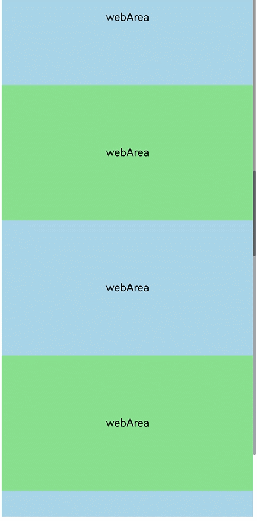

# Implementing Nested Scrolling
<!--Kit: ArkWeb-->
<!--Subsystem: Web-->
<!--Owner: @zourongchun-->
<!--Designer: @zhufenghao-->
<!--Tester: @ghiker-->
<!--Adviser: @HelloCrease-->

There may be times when you want to implement nested scrolling for the **Web** component. A typical use case is a page that contains multiple scrollable areas including the **Web** component, whose scrolling is intrinsically linked with the scroll positions in other areas. To implement nested scrolling between **Web** components and ArkUI scrollable containers ([Grid](../reference/apis-arkui/arkui-ts/ts-container-grid.md), [List](../reference/apis-arkui/arkui-ts/ts-container-list.md), [Scroll](../reference/apis-arkui/arkui-ts/ts-container-scroll.md), [Swiper](../reference/apis-arkui/arkui-ts/ts-container-swiper.md), [Tabs](../reference/apis-arkui/arkui-ts/ts-container-tabs.md), [WaterFlow](../reference/apis-arkui/arkui-ts/ts-container-waterflow.md), [Refresh](../reference/apis-arkui/arkui-ts/ts-container-refresh.md) and [bindSheet](../reference/apis-arkui/arkui-ts/ts-universal-attributes-sheet-transition.md#bindsheet)), you should set the ArkUI [NestedScrollMode](../reference/apis-arkui/arkui-ts/ts-appendix-enums.md#nestedscrollmode10) attribute for the **Web** components after receiving the scrolling gesture events.

The following provides two solutions for implementing nested scrolling of **Web** components: Solution 1: [Using the nestedScroll Attribute](#using-the-nestedscroll-attribute); Solution 2: [Distributing Scrolling Offsets Through the Parent Scroll Component](#distributing-scrolling-offsets-through-the-parent-scroll-component). You can select a solution based on the specific service scenario. To associate **Web** components with other parent components, you are advised to use solution 1. To customize the scrolling of **Web** components and other scrolling components, especially in some complex scenarios, you are advised to use solution 2.

> **NOTE**
>
> If a **Web** component uses full expansion (**layoutMode** is set to **WebLayoutMode.FIT_CONTENT**), the rendering mode (**RenderMode.SYNC_RENDER**) must be explicitly specified. For details, see [layoutMode](../reference/apis-arkweb/arkts-basic-components-web-attributes.md#layoutmode11).

## Using the nestedScroll Attribute

Call the [nestedScroll](../reference/apis-arkweb/arkts-basic-components-web-attributes.md#nestedscroll11) attribute of the **Web** component to set the nested scrolling mode in the up, down, left, and right directions or in the forward and backward directions to implement the scrolling association with the parent component. This attribute also allows the nested scrolling mode to be dynamically changed during the process.

**Complete Code**
```ts
// xxx.ets
import { webview } from '@kit.ArkWeb';

@Entry
@ComponentV2
struct NestedScroll {
  private scrollerForScroll: Scroller = new Scroller()
  private listScroller: Scroller = new Scroller()
  controller: webview.WebviewController = new webview.WebviewController();
  @Local arr: Array<number> = []

  aboutToAppear(): void {
    for (let i = 0; i < 10; i++) {
      this.arr.push(i)
    }
  }

  build() {
    Scroll(this.scrollerForScroll) {
      Column() {
        Web({ src: $rawfile("index.html"), controller: this.controller })
          .nestedScroll({
            scrollUp: NestedScrollMode.PARENT_FIRST,//Scroll up the parent component first.
            scrollDown: NestedScrollMode.SELF_FIRST,//Scroll down the child component first.
          }).height("100%")
        Repeat<number>(this.arr)
          .each((item: RepeatItem<number>) => {
            Text("Scroll Area")
              .width("100%")
              .height("40%")
              .backgroundColor(0X330000FF)
              .fontSize(16)
              .textAlign(TextAlign.Center)
          })
      }
    }
  }
}
```
HTML file to be loaded:

```html
<!-- index.html -->
<!DOCTYPE html>
<html>
<head>
    <meta name="viewport" id="viewport" content="width=device-width, initial-scale=1.0">
    <style>
        .blue {
          background-color: lightblue;
        }
        .green {
          background-color: lightgreen;
        }
        .blue, .green {
         font-size:16px;
         height:200px;
         text-align: center;       /* Horizontally centered */
         line-height: 200px;       /* Vertically centered (the height matches the container height) */
        }
    </style>
</head>
<body>
<div class="blue" >webArea</div>
<div class="green">webArea</div>
<div class="blue">webArea</div>
<div class="green">webArea</div>
<div class="blue">webArea</div>
<div class="green">webArea</div>
<div class="blue">webArea</div>
</body>
</html>
```


## Distributing Scrolling Offsets Through the Parent Scroll Component

**How to Implement**

1. Scrolling up:

    (1) If the web page does not scroll to the bottom, the **Scroll** component sends the scrolling offset to the **Web** component, and the **Scroll** component does not scroll.

    (2) If the web page scrolls to the bottom but the **Scroll** component does not scroll to the bottom, only the **Scroll** component scrolls and it does not send the scrolling offset to the **Web** and **List** components.

    (3) If the **Scroll** component scrolls to the bottom, the scrolling offset is sent to the **List** component, and the **Scroll** component does not scroll.
2. Scrolling down:

    (1) If the **List** component does not scroll to the top, the **Scroll** component sends the scrolling offset to the **List** component, and the **Scroll** component does not scroll.

    (2) When the **List** component scrolls to the top but the **Scroll** component does not, the **Scroll** component automatically scrolls. The scrolling offset is not sent to the **List** component and **Web** component.

    (3) If the **Scroll** component scrolls to the top, the scrolling offset is sent to the **Web** component, and the **Scroll** component does not scroll.

**Implementation**

1. Disable the scrolling gestures of the **Web** component.

    (1) Call [setScrollable](../reference/apis-arkweb/arkts-apis-webview-WebviewController.md#setscrollable12) to disable touch scrolling.
    ```ts
    this.webController.setScrollable(false, webview.ScrollType.EVENT);
    ```
    (2) Call [onGestureRecognizerJudgeBegin](../reference/apis-arkui/arkui-ts/ts-gesture-blocking-enhancement.md#ongesturerecognizerjudgebegin13) to disable the scrolling gesture of the **Web** component.
    ```ts
    .onGestureRecognizerJudgeBegin((event: BaseGestureEvent, current: GestureRecognizer, otherArray<GestureRecognizer>) => {
      if (current.isBuiltIn() && current.getType() == GestureControl.GestureType.PAN_GESTURE) {
        return GestureJudgeResult.REJECT;
      }
      return GestureJudgeResult.CONTINUE;
    })
    ```
2. Disable the gestures of the [List](../reference/apis-arkui/arkui-ts/ts-container-list.md) component.
    ```ts
	  .enableScrollInteraction(false)
    ```
3. Check whether the **List** and **Scroll** components scroll to the boundary.
	
	(1) Scroll to the top boundary: **scroller.currentOffset().yOffset <= 0**;
		
	(2) Scroll to the bottom boundary: **scroller.isAtEnd() == true**;

4. Check whether the **Web** component scrolls to the boundary.
	
	(1) Obtain the height, content height, and current scrolling offset of the **Web** component.
	
	(2) Scroll to the top boundary: **webController.getPageOffset().y == 0**;
	
	(3) Scroll to the bottom boundary: **webController.getPageOffset().y + this.webHeight >= webController.getPageHeight()**;
	
	(4) Height of the **Web** component: **webController.[getPageHeight()](../reference/apis-arkweb/arkts-apis-webview-WebviewController.md#getpageheight)**;
	
	(5) Height of the **Web** component window: **webController?.[runJavaScriptExt](../reference/apis-arkweb/arkts-apis-webview-WebviewController.md#runjavascriptext10)('window. innerHeight')**;
	
	(6) Scrolling offset of the **Web** component: **webController.[getPageOffset()](../reference/apis-arkweb/arkts-apis-webview-WebviewController.md#getpageoffset20)**;
5. Disable the scrolling feature of the **Scroll** component.
	
	Bind the **Scroll** component to the [onScrollFrameBegin](../reference/apis-arkui/arkui-ts/ts-container-scroll.md#onscrollframebegin9) event and set the remaining scrolling offset to **0**. Then the **Scroll** component does not scroll, and the inertial scrolling animation does not stop.
6. Distribute the scrolling offset to the **List** component.
    ```ts
	  this.listScroller.scrollBy(0, offset)
    ```
7. Distribute the scrolling offset to the **Web** component.
    ```ts
	  this.webController.scrollBy(0, offset)
    ```
8. Set [bypassVsyncCondition](../reference/apis-arkweb/arkts-basic-components-web-attributes.md#bypassvsynccondition20) of the **Web** component to **WebBypassVsyncCondition.SCROLLBY_FROM_ZERO_OFFSET** to accelerate the drawing of the first scrolling frame.
    ```ts
	  .bypassVsyncCondition(WebBypassVsyncCondition.SCROLLBY_FROM_ZERO_OFFSET)
    ```

**Complete Code**
```ts
// xxx.ets
import { webview } from '@kit.ArkWeb';

@Entry
@ComponentV2
struct Index {
  private scroller:Scroller = new Scroller()
  private listScroller:Scroller = new Scroller()
  private webController: webview.WebviewController = new webview.WebviewController()
  private isWebAtEnd:boolean = false
  private webHeight:number = 0
  @Local arr: Array<number> = []

  aboutToAppear(): void {
    for (let i = 0; i < 10; i++) {
      this.arr.push(i)
    }
  }

  getWebHeight() {
    try {
      this.webController?.runJavaScriptExt('window.innerHeight',
        (error, result) => {
          if (error || !result) {
            return;
          }
          if (result.getType() === webview.JsMessageType.NUMBER) {
            this.webHeight = result.getNumber()
          }
        })
    } catch (error) {
    }
  }

  checkScrollBottom() {
  	this.isWebAtEnd = false;
  	if (this.webController.getPageOffset().y + this.webHeight >= this.webController.getPageHeight()) {
  	  this.isWebAtEnd = true;
  	}
  }

  build() {
    Scroll(this.scroller) {
      Column() {
        Web({
          src: $rawfile("index.html"),
          controller: this.webController,
        }).height("100%")
          .bypassVsyncCondition(WebBypassVsyncCondition.SCROLLBY_FROM_ZERO_OFFSET)
          .onPageEnd(() => {
            this.webController.setScrollable(false, webview.ScrollType.EVENT);
            this.getWebHeight();
          })
            // When the recognizer is about to succeed, set whether to enable the recognizer based on the current component status.
          .onGestureRecognizerJudgeBegin((event: BaseGestureEvent, current: GestureRecognizer, others: Array<GestureRecognizer>) => {
            if (current.isBuiltIn() && current.getType() == GestureControl.GestureType.PAN_GESTURE) {
              return GestureJudgeResult.REJECT;
            }
            return GestureJudgeResult.CONTINUE;
          })
        List({ scroller: this.listScroller }) {
          Repeat<number>(this.arr)
            .each((item: RepeatItem<number>) => {
              ListItem() {
                Text("Scroll Area")
                  .width("100%")
                  .height("40%")
                  .backgroundColor(0X330000FF)
                  .fontSize(16)
                  .textAlign(TextAlign.Center)
              }
            })
        }.height("100%")
        .maintainVisibleContentPosition(true)
        .enableScrollInteraction(false)
      }
    }
    .onScrollFrameBegin((offset: number, state: ScrollState)=>{
      this.checkScrollBottom();
      if (offset > 0) {
        if (!this.isWebAtEnd) {
          this.webController.scrollBy(0, offset)
          return {offsetRemain:0}
        } else if (this.scroller.isAtEnd()) {
          this.listScroller.scrollBy(0, offset)
          return {offsetRemain:0}
        }
      } else if (offset < 0) {
        if (this.listScroller.currentOffset().yOffset > 0) {
          this.listScroller.scrollBy(0, offset)
          return {offsetRemain:0}
        } else if (this.scroller.currentOffset().yOffset <= 0) {
          this.webController.scrollBy(0, offset)
          return {offsetRemain:0}
        }
      }
      return {offsetRemain:offset}
    })
  }
}
```
HTML file to be loaded:

```html
<!-- index.html -->
<!DOCTYPE html>
<html>
<head>
    <meta name="viewport" id="viewport" content="width=device-width, initial-scale=1.0">
    <style>
        .blue {
          background-color: lightblue;
        }
        .green {
          background-color: lightgreen;
        }
        .blue, .green {
         font-size:16px;
         height:200px;
         text-align: center;       /* Horizontally centered */
         line-height: 200px;       /* Vertically centered (the height matches the container height) */
        }
    </style>
</head>
<body>
<div class="blue" >webArea</div>
<div class="green">webArea</div>
<div class="blue">webArea</div>
<div class="green">webArea</div>
<div class="blue">webArea</div>
<div class="green">webArea</div>
<div class="blue">webArea</div>
</body>
</html>
```

<!--RP1--><!--RP1End-->
