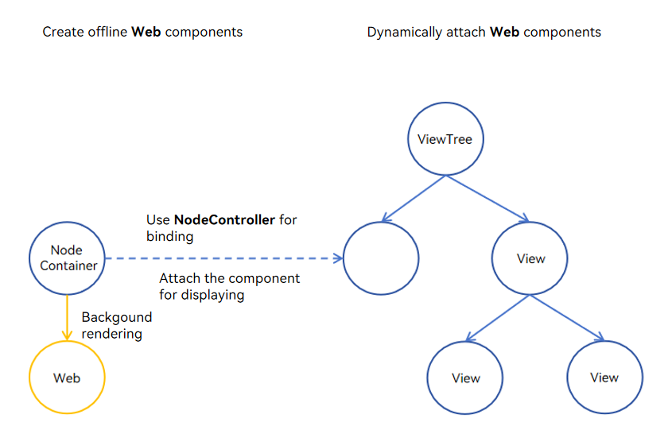

# Using Offline Web Components

The **Web** component can be attached to and detached from the component trees in different windows. With this capability, you can create **Web** components in advance to optimize performance. For example, when a tab page is implemented with a **Web** component, pre-creation of the **Web** component allows for ahead-of-time rendering, so that the page appears instantly when accessed.

The offline **Web** component is created based on the custom placeholder component [NodeContainer](../reference/apis-arkui/arkui-ts/ts-basic-components-nodecontainer.md). The basic principle is as follows: **Web** components that are created using commands are not attached to the component tree immediately after being created. This means they are not displayed to users immediately, remaining in the **Hidden** or **InActive** state until explicitly attached. You can dynamically attach these components as required to implement more flexible usage.

Offline **Web** components can be used to pre-start the rendering process and pre-render web pages.

- Pre-start rendering process: By creating an empty **Web** component prior to the user's access of the web page, the rendering process is initiated in advance, preparing for subsequent use of the page. 
- Pre-render web pages: In the web page startup or redirection scenario, creating **Web** components in the background in advance allows for ahead-of-time data loading and rendering. In this way, web pages can be instantly displayed when being redirected to.

## Overall Architecture

As shown in the following figure, to create an offline **Web** component, you need to define a custom stateless [NodeContainer](../reference/apis-arkui/arkui-ts/ts-basic-components-nodecontainer.md) to encapsulate the **Web** component, and bind the component to the corresponding [NodeController](../reference/apis-arkui/js-apis-arkui-nodeController.md). To display a **Web** component that has been pre-rendered in the background, use [NodeController](../reference/apis-arkui/js-apis-arkui-nodeController.md) to attach the component to [NodeContainer](../reference/apis-arkui/arkui-ts/ts-basic-components-nodecontainer.md) of ViewTree.



## Creating an Offline Web Component

This example shows how to create an offline **Web** component in advance and attach it to the component tree for display when necessary. Such an offline **Web** component can be used in pre-starting the rendering process and pre-rendering the web page to optimize the performance.

> **NOTE**
>
> When creating **Web** components, be mindful that each component consumes a significant amount of memory (about 200 MB) and computing resources. To optimize resource usage, limit the number of offline **Web** components created at a time.

```ts
// Carrier ability
// EntryAbility.ets
import { createNWeb } from "../pages/common"
onWindowStageCreate(windowStage: window.WindowStage): void {
  windowStage.loadContent('pages/Index', (err, data) => {
    // Create a dynamic Web component, in which the UIContext should be passed. The component can be created at any time after loadContent() is called.
    createNWeb("https://www.example.com", windowStage.getMainWindowSync().getUIContext());
    if (err.code) {
      return;
    }
  });
}
```

```ts
// Create a NodeController instance.
// common.ets
import { UIContext, NodeController, BuilderNode, Size, FrameNode } from '@kit.ArkUI';
import { webview } from '@kit.ArkWeb';

// @Builder contains the specific information of the dynamic component.
// Data is an input parameter of encapsulation class.
class Data{
  url: ResourceStr = "https://www.example.com";
  controller: WebviewController = new webview.WebviewController();
}

@Builder
function WebBuilder(data:Data) {
  Column() {
    Web({ src: data.url, controller: data.controller })
      .width("100%")
      .height("100%")
  }
}

let wrap = wrapBuilder<Data[]>(WebBuilder);

// Used to control and report the behavior of the node in NodeContainer. This function must be used together with NodeContainer.
export class myNodeController extends NodeController {
  private rootnode: BuilderNode<Data[]> | null = null;
  // This function must be overridden, which is used to construct the number of nodes, return the nodes and attach them to NodeContainer.
  // Call it when the NodeContainer is created or call rebuild() to refresh.
  makeNode(uiContext: UIContext): FrameNode | null {
    console.log(" uicontext is undefined : "+ (uiContext === undefined));
    if (this.rootnode != null) {
      // Return the FrameNode.
      return this.rootnode.getFrameNode();
    }
    // Return null to detach the dynamic component from the bound node.
    return null;
  }
  // Called when the layout size changes.
  aboutToResize(size: Size) {
    console.log("aboutToResize width : " + size.width  +  " height : " + size.height );
  }

  // Called when the NodeContainer bound to the controller is about to appear.
  aboutToAppear() {
    console.log("aboutToAppear");
  }

  // Called when the NodeContainer bound to the controller is about to disappear.
  aboutToDisappear() {
    console.log("aboutToDisappear");
  }

  // This function is a custom function and can be used as an initialization function.
  // Initialize BuilderNode through UIContext, and then initialize the content in @Builder through the build API in BuilderNode.
  initWeb(url:ResourceStr, uiContext:UIContext, control:WebviewController) {
    if(this.rootnode != null)
    {
      return;
    }
    // Create a node, during which the UIContext should be passed.
    this.rootnode = new BuilderNode(uiContext);
    // Create a dynamic Web component.
    this.rootnode.build(wrap, { url:url, controller:control });
  }
}
// Create a Map to save the required NodeController.
let NodeMap:Map<ResourceStr, myNodeController | undefined> = new Map();
// Create a Map to save the required WebViewController.
let controllerMap:Map<ResourceStr, WebviewController | undefined> = new Map();

// UIContext is required for initialization and needs to be obtained from the ability.
export const createNWeb = (url: ResourceStr, uiContext: UIContext) => {
  // Create a NodeController instance.
  let baseNode = new myNodeController();
  let controller = new webview.WebviewController() ;
  // Initialize the custom Web component.
  baseNode.initWeb(url, uiContext, controller);
  controllerMap.set(url, controller)
  NodeMap.set(url, baseNode);
}
// Customize the API for obtaining the NodeController.
export const getNWeb = (url: ResourceStr) : myNodeController | undefined => {
  return NodeMap.get(url);
}
```

```ts
// Use the pages of NodeController.
// Index.ets
import { getNWeb } from "./common"
@Entry
@Component
struct Index {
  build() {
    Row() {
      Column() {
        // NodeContainer is used to bind to the NodeController. A rebuild call triggers makeNode.
        // The Page page is bound to the NodeController through the NodeContainer API to display the dynamic component.
        NodeContainer(getNWeb("https://www.example.com"))
          .height("90%")
          .width("100%")
      }
      .width('100%')
    }
    .height('100%')
  }
}
```

## Pre-starting the Web Rendering Process

To save time required for starting the web rendering process when the **Web** component is loaded, you can create a **Web** component in the background in advance.

> **NOTE**
>
> The optimization effect is obvious only when the single-rendering-process mode is used, that is, one web rendering process is globally shared. The web rendering process is terminated when all **Web** components are destroyed. Therefore, you are advised to keep at least one **Web** component active.

In the following example, a **Web** component is pre-created during **onWindowStageCreate** phase to load a blank page. In this way, the rendering process is started in advance. When the index is redirected to index2, the time required for starting and initializing the rendering process of the Web component is reduced.

Creating additional **Web** components causes memory overhead. Therefore, you are advised to reuse the **Web** components based on this solution.

```ts
// Carrier ability
// EntryAbility.ets
import { createNWeb } from "../pages/common"
onWindowStageCreate(windowStage: window.WindowStage): void {
  windowStage.loadContent('pages/Index', (err, data) => {
    // Create an empty dynamic Web component, in which the UIContext should be passed. The component can be created at any time after loadContent() is called.
    createNWeb("about: blank", windowStage.getMainWindowSync().getUIContext());
    if (err.code) {
      return;
    }
  });
}
```

```ts
// Create a NodeController instance.
// common.ets
import { UIContext, NodeController, BuilderNode, Size, FrameNode } from '@kit.ArkUI';
import { webview } from '@kit.ArkWeb';

// @Builder contains the specific information of the dynamic component.
// Data is an input parameter of encapsulation class.
class Data{
  url: ResourceStr = "https://www.example.com";
  controller: WebviewController = new webview.WebviewController();
}

@Builder
function WebBuilder(data:Data) {
  Column() {
    Web({ src: data.url, controller: data.controller })
      .width("100%")
      .height("100%")
  }
}

let wrap = wrapBuilder<Data[]>(WebBuilder);

// Used to control and report the behavior of the node in NodeContainer. This function must be used together with NodeContainer.
export class myNodeController extends NodeController {
  private rootnode: BuilderNode<Data[]> | null = null;
  // This function must be overridden, which is used to construct the number of nodes, return the nodes and attach them to NodeContainer.
  // Call it when the NodeContainer is created or call rebuild() to refresh.
  makeNode(uiContext: UIContext): FrameNode | null {
    console.log(" uicontext is undefined : "+ (uiContext === undefined));
    if (this.rootnode != null) {
      // Return the FrameNode.
      return this.rootnode.getFrameNode();
    }
    // Return null to detach the dynamic component from the bound node.
    return null;
  }
  // Called when the layout size changes.
  aboutToResize(size: Size) {
    console.log("aboutToResize width : " + size.width  +  " height : " + size.height );
  }

  // Called when the NodeContainer bound to the controller is about to appear.
  aboutToAppear() {
    console.log("aboutToAppear");
  }

  // Called when the NodeContainer bound to the controller is about to disappear.
  aboutToDisappear() {
    console.log("aboutToDisappear");
  }

  // This function is a custom function and can be used as an initialization function.
  // Initialize BuilderNode through UIContext, and then initialize the content in @Builder through the build API in BuilderNode.
  initWeb(url:ResourceStr, uiContext:UIContext, control:WebviewController) {
    if(this.rootnode != null)
    {
      return;
    }
    // Create a node, during which the UIContext should be passed.
    this.rootnode = new BuilderNode(uiContext);
    // Create a dynamic Web component.
    this.rootnode.build(wrap, { url:url, controller:control });
  }
}
// Create a Map to save the required NodeController.
let NodeMap:Map<ResourceStr, myNodeController | undefined> = new Map();
// Create a Map to save the required WebViewController.
let controllerMap:Map<ResourceStr, WebviewController | undefined> = new Map();

// UIContext is required for initialization and needs to be obtained from the ability.
export const createNWeb = (url: ResourceStr, uiContext: UIContext) => {
  // Create a NodeController instance.
  let baseNode = new myNodeController();
  let controller = new webview.WebviewController() ;
  // Initialize the custom Web component.
  baseNode.initWeb(url, uiContext, controller);
  controllerMap.set(url, controller)
  NodeMap.set(url, baseNode);
}
// Customize the API for obtaining the NodeController.
export const getNWeb = (url: ResourceStr) : myNodeController | undefined => {
  return NodeMap.get(url);
}
```

```ts
// index.ets
import { webview } from '@kit.ArkWeb';

@Entry
@Component
struct Index1 {
  webviewController: webview.WebviewController = new webview.WebviewController();
  
  build() {
    Column() {
      // The rendering process has been pre-started.
      Button("Go to Web Page").onClick(()=>{
        this.getUIContext().getRouter().pushUrl({url: "pages/index2"});
      })
        .width('100%')
        .height('100%')
    }
  }
}
```

```ts
// index2.ets
import { webview } from '@kit.ArkWeb';

@Entry
@Component
struct index2 {
  webviewController: webview.WebviewController = new webview.WebviewController();
  
  build() {
    Row() {
      Column() {
        Web({src: 'https://www.example.com', controller: this.webviewController})
          .width('100%')
          .height('100%')
      }
      .width('100%')
    }
    .height('100%')
  }
}
```

## Pre-rendering Web Pages

Pre-rendering optimization is particularly beneficial for scenarios involving web page startup and redirection. For example, you can apply it in the situation where the user accesses the home page and is then redirected to a different page. For best possible effects, use this solution on pages that have a high cache hit ratio, meaning they are frequently revisited by users.

To pre-render a web page, create an offline **Web** component in advance and activate it. The activation enables the rendering engine to initiate background rendering.

> **NOTE**
>
> 1. For a web page to be pre-rendered successfully, identify the resources to be loaded beforehand.
> 2. In this solution, the invisible **Web** component in the background is activated. Due to this activation, avoid pre-rendering pages that automatically play audio or video, as this could inadvertently lead to unintended media playback. Check and manage the behavior of the page on the application side.
> 3. The pre-rendered web page is continuously rendered in the background. To prevent overheating and power consumption, you are advised to stop the rendering process immediately after the pre-rendering is complete. The following example shows how to use [onFirstMeaningfulPaint](../reference/apis-arkweb/arkts-basic-components-web-events.md#onfirstmeaningfulpaint12) to determine the time for stopping pre-rendering. This API can be used in HTTP and HTTPS online web pages.

```ts
// Carrier ability
// EntryAbility.ets
import {createNWeb} from "../pages/common";
import { UIAbility } from '@kit.AbilityKit';
import { window } from '@kit.ArkUI';

export default class EntryAbility extends UIAbility {
  onWindowStageCreate(windowStage: window.WindowStage): void {
    windowStage.loadContent('pages/Index', (err, data) => {
      // Create a dynamic ArkWeb component, in which the UIContext should be passed. The component can be created at any time after loadContent() is called.
      createNWeb("https://www.example.com", windowStage.getMainWindowSync().getUIContext());
      if (err.code) {
        return;
      }
    });
  }
}
```

```ts
// Create a NodeController instance.
// common.ets
import { UIContext } from '@kit.ArkUI';
import { webview } from '@kit.ArkWeb';
import { NodeController, BuilderNode, Size, FrameNode }  from '@kit.ArkUI';
// @Builder contains the specific information of the dynamic component.
// Data is an input parameter of encapsulation class.
class Data{
  url: string = 'https://www.example.com';
  controller: WebviewController = new webview.WebviewController();
}
// Use the Boolean variable shouldInactive to stop rendering after the web page is pre-rendered in the background.
let shouldInactive: boolean = true;
@Builder
function WebBuilder(data:Data) {
  Column() {
    Web({ src: data.url, controller: data.controller })
      .onPageBegin(() => {
        // Call onActive to enable rendering.
        data.controller.onActive();
      })
      .onFirstMeaningfulPaint(() =>{
        if (!shouldInactive) {
          return;
        }
        // Triggered when the pre-rendering is complete to stop rendering.
        data.controller.onInactive();
        shouldInactive = false;
      })
      .width("100%")
      .height("100%")
  }
}
let wrap = wrapBuilder<Data[]>(WebBuilder);
// Used to control and report the behavior of the node in NodeContainer. This function must be used together with NodeContainer.
export class myNodeController extends NodeController {
  private rootnode: BuilderNode<Data[]> | null = null;
  // This function must be overridden, which is used to construct the number of nodes, return the nodes and attach them to NodeContainer.
  // Call it when the NodeContainer is created or call rebuild() to refresh.
  makeNode(uiContext: UIContext): FrameNode | null {
    console.info(" uicontext is undefined : "+ (uiContext === undefined));
    if (this.rootnode != null) {
      // Return the FrameNode.
      return this.rootnode.getFrameNode();
    }
    // Return null to detach the dynamic component from the bound node.
    return null;
  }
  // Called when the layout size changes.
  aboutToResize(size: Size) {
    console.info("aboutToResize width : " + size.width  +  " height : " + size.height )
  }
  // Called when the NodeContainer bound to the controller is about to appear.
  aboutToAppear() {
    console.info("aboutToAppear")
    // When the page is switched to the foreground, the rendering does not need to be stopped.
    shouldInactive = false;
  }
  // Called when the NodeContainer bound to the controller is about to disappear.
  aboutToDisappear() {
    console.info("aboutToDisappear")
  }
  // This function is a custom function and can be used as an initialization function.
  // Initialize BuilderNode through UIContext, and then initialize the content in @Builder through the build API in BuilderNode.
  initWeb(url:string, uiContext:UIContext, control:WebviewController) {
    if(this.rootnode != null)
    {
      return;
    }
    // Create a node, during which the UIContext should be passed.
    this.rootnode = new BuilderNode(uiContext)
    // Create a dynamic Web component.
    this.rootnode.build(wrap, { url:url, controller:control })
  }
}
// Create a Map to save the required NodeController.
let NodeMap:Map<string, myNodeController | undefined> = new Map();
// Create a Map to save the required WebViewController.
let controllerMap:Map<string, WebviewController | undefined> = new Map();
// UIContext is required for initialization and needs to be obtained from the ability.
export const createNWeb = (url: string, uiContext: UIContext) => {
  // Create a NodeController instance.
  let baseNode = new myNodeController();
  let controller = new webview.WebviewController() ;
  // Initialize the custom Web component.
  baseNode.initWeb(url, uiContext, controller);
  controllerMap.set(url, controller)
  NodeMap.set(url, baseNode);
}
// Customize the API for obtaining the NodeController.
export const getNWeb = (url : string) : myNodeController | undefined => {
  return NodeMap.get(url);
}
```

```ts
// Use the pages of NodeController.
// Index.ets
import {createNWeb, getNWeb} from "./common";

@Entry
@Component
struct Index {
  build() {
    Row() {
      Column() {
        // NodeContainer is used to bind to the NodeController. A rebuild call triggers makeNode.
        // The Page page is bound to the NodeController through the NodeContainer API to display the dynamic component.
        NodeContainer(getNWeb("https://www.example.com"))
          .height("90%")
          .width("100%")
      }
      .width('100%')
    }
    .height('100%')
  }
}
```

## Common Troubleshooting Procedure

1. Check the network permission of the application.

Make sure the network permission has been added to the **module.json5** file. For details, see [Declaring Permissions in the Configuration File](../security/AccessToken/declare-permissions.md).

```ts
"requestPermissions":[
    {
      "name" : "ohos.permission.INTERNET"
    }
  ]
```

2. Check the logic for binding [NodeContainer](../reference/apis-arkui/arkui-ts/ts-basic-components-nodecontainer.md) to the node.

Check whether the node has been added to the component tree. For diagnostics purposes, you are advised to add a **Text** component above the existing **Web** component, as shown in the following example. If the **Text** component is not displayed on the white screen, there is a potential issue with the binding between the NodeContainer and the node.

```ts
@Builder
function WebBuilder(data:Data) {
  Column() {
    Text('test')
    Web({ src: data.url, controller: data.controller })
      .width("100%")
      .height("100%")
  }
}
```

3. Check the visibility of the **Web** component.

If the node has been added to the tree, examine the [WebPattern::OnVisibleAreaChange](../reference/apis-arkui/arkui-ts/ts-universal-component-visible-area-change-event.md#onvisibleareachange) log to check whether the **Web** component is visible. Invisible **Web** components may cause a white screen.
