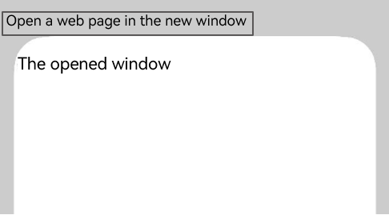

# Opening Pages in a New Window

<!--Kit: ArkWeb-->
<!--Subsystem: Web-->
<!--Owner: @csliutt-private-->
<!--Designer: @ringking0-->
<!--Tester: @ghiker-->
<!--Adviser: @HelloShuo-->
<!-- md-trans-meta sourceCommit=e1ff875f66e384f6b59920f2a400e509e2ca7898 translatedAt=2026-08-14T03:48:06.876Z pushedAt=2026-08-14T09:20:27.325Z -->

The **Web** component provides the capability of opening pages in a new window. You can call [multiWindowAccess()](../reference/apis-arkweb/arkts-basic-components-web-attributes.md#multiwindowaccess9) to specify whether to allow a web page to be opened in a new window. When a new window is opened, the application receives the new window event of the **Web** component through the [onWindowNew()](../reference/apis-arkweb/arkts-basic-components-web-events.md#onwindownew9) or [onWindowNewExt()](../reference/apis-arkweb/arkts-basic-components-web-events.md#onwindownewext23) API. You need to create a window for processing the window opening request in the event callback.

> **NOTE**
>
> - The [onWindowNewExt()](../reference/apis-arkweb/arkts-basic-components-web-events.md#onwindownewext23) API is an enhanced version of the [onWindowNew()](../reference/apis-arkweb/arkts-basic-components-web-events.md#onwindownew9) API. Compared with `OnWindowNewEvent`, `OnWindowNewExtEvent` adds [NavigationPolicy](../reference/apis-arkweb/arkts-basic-components-web-e.md#navigationpolicy23) and [WindowFeatures](../reference/apis-arkweb/arkts-basic-components-web-i.md#windowfeatures23), which are used to notify the app of how the new window is opened and its position and size information. When both APIs are used on the same Web component, only the [onWindowNewExt()](../reference/apis-arkweb/arkts-basic-components-web-events.md#onwindownewext23) API is triggered.
>
> - When the [allowWindowOpenMethod()](../reference/apis-arkweb/arkts-basic-components-web-attributes.md#allowwindowopenmethod10) API is set to **true**, the frontend page opens a new window by calling a JavaScript function.
>
> - When `window.open(url, name)` is called on a web page to open a new window, the ArkWeb kernel searches for a bound Web component based on `name`. If one exists, the Web component receives the [onActivateContent()](../reference/apis-arkweb/arkts-basic-components-web-events.md#onactivatecontent20) API notification so that the app can bring it to the foreground. If not, the ArkWeb kernel notifies the app to create a new window through the `onWindowNew()` API.
>
> - If a new window is created in the `onWindowNew()` API notification and the parameter of the [ControllerHandler.setWebController()](../reference/apis-arkweb/arkts-basic-components-web-ControllerHandler.md#setwebcontroller9) API is set to the `WebviewController` of the new Web component, the ArkWeb kernel binds `name` to the new Web component.
>
> - If no new window is created in the `onWindowNew()` API notification, set the parameter of the [ControllerHandler.setWebController()](../reference/apis-arkweb/arkts-basic-components-web-ControllerHandler.md#setwebcontroller9) API to `null`.

In the following local example, when a user clicks the **Open Page in New Window** button, the app receives the new window event of the Web component in the `onWindowNew()` API.
> **NOTE**
> - The [OnWindowNewEvent](../reference/apis-arkweb/arkts-basic-components-web-i.md#onwindownewevent12) callback is triggered when the web page requires the user to create a new window. In this callback, the `isUserTrigger` parameter returns **true** if the event is triggered by the user, and **false** otherwise.

- Application code:

<!-- @[receive_a_web_component_new_window_event](https://gitcode.com/openharmony/applications_app_samples/blob/master/code/DocsSample/ArkWeb/SetBasicAttrsEvts/SetBasicAttrsEvtsOne/entry/src/main/ets/pages/OpenPageNewWin.ets) -->

``` TypeScript
// xxx.ets
import { webview } from '@kit.ArkWeb';

// There are two Web components on the same page. When the WebComponent object opens a new window, the NewWebViewComp object is displayed.
@CustomDialog
struct NewWebViewComp {
  controller?: CustomDialogController;
  webviewController1: webview.WebviewController = new webview.WebviewController();

  build() {
    Column() {
      Web({ src: '', controller: this.webviewController1 })
        .javaScriptAccess(true)
        .multiWindowAccess(false)
        .onWindowExit(() => {
          console.info('NewWebViewComp onWindowExit');
          if (this.controller) {
            this.controller.close();
          }
        })
        .onActivateContent(() => {
          // This Web needs to be displayed in the foreground. It is recommended that the app switch the tab or window here.
          console.info('NewWebViewComp onActivateContent')
        })
    }
  }
}

@Entry
@Component
struct WebComponent {
  controller: webview.WebviewController = new webview.WebviewController();
  dialogController: CustomDialogController | null = null;

  build() {
    Column() {
      Web({ src: $rawfile('window.html'), controller: this.controller })
        .javaScriptAccess(true)
          // Enable the multi-window permission.
        .multiWindowAccess(true)
        .allowWindowOpenMethod(true)
        .onWindowNew((event) => {
          if (this.dialogController) {
            this.dialogController.close()
          }
          let popController: webview.WebviewController = new webview.WebviewController();
          // Return the WebviewController corresponding to the new window to the Web kernel.
          // If event.handler.setWebController is not called, the rendering process will be blocked.
          // If no new window is created, set the value to null when calling event.handler.setWebController to notify the Web that no new window has been created.
          event.handler.setWebController(popController);
          this.dialogController = new CustomDialogController({
            builder: NewWebViewComp({ webviewController1: popController }),
            // Set isModal to false to prevent the new window from being destroyed, so that the onActivateContent callback can be triggered.
            isModal: false
          })
          this.dialogController.open();
        })
    }
  }
}
```

- Code of the **window.html** page:

  ```html
  <!DOCTYPE html>
  <html>
  <head>
      <meta name="viewport" content="width=device-width"/>
      <title>WindowEvent</title>
  </head>
  <body>
  <input type="button" value="Open Page in New Window" onclick="OpenNewWindow()">
  <script type="text/javascript">
      function OpenNewWindow()
      {
          var txt = 'Opened window';
          let openedWindow = window.open("about:blank", "", "location=no,status=no,scrollbars=no");
          openedWindow.document.write("<p>" + "<br><br>" + txt + "</p>");
          openedWindow.focus();
      }
  </script>
  </body>
  </html>
  ```

**Figure 1** Effect of opening a page in a new window 



## Samples

The following samples are provided to help you better understand how to create a window:

- [Browser (ArkTS) (Full SDK) (API9)](https://gitcode.com/openharmony/applications_app_samples/tree/master/code/BasicFeature/Web/Browser)