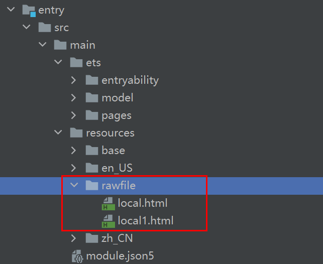

# Loading Web Pages


Page loading is a basic capability of the **Web** component. Depending on the data source, page loading falls into three types: loading of network pages, loading of local pages, and loading of HTML rich text data.


If you need to obtain online resources when loading a page, declare the network access permission in the **module.json5** file. For details, see [Declaring Permissions](../security/AccessToken/declare-permissions.md).

  ```
  "requestPermissions":[
      {
        "name" : "ohos.permission.INTERNET"
      }
    ]
  ```

## Loading Network Pages

You can specify the default network page to be loaded when creating a **Web** component. After the default network page is loaded, call [loadUrl()](../reference/apis-arkweb/js-apis-webview.md#loadurl) if you want to change the network page displayed by the **Web** component. The value of the first parameter **src** of the **Web** component cannot be dynamically changed through a state variable (for example, @State). To change the value, call [loadUrl()](../reference/apis-arkweb/js-apis-webview.md#loadurl).


In the following example, after the **www.\example.com** page is loaded by the **Web** component, **loadUrl** is called to change the displayed page to **www\.example1.com**.


```ts
// xxx.ets
import { webview } from '@kit.ArkWeb';
import { BusinessError } from '@kit.BasicServicesKit';

@Entry
@Component
struct WebComponent {
  controller: webview.WebviewController = new webview.WebviewController();

  build() {
    Column() {
      Button('loadUrl')
        .onClick(() => {
          try {
            // Upon button clicking, call loadUrl to redirect to www.example1.com.
            this.controller.loadUrl('www.example1.com');
          } catch (error) {
            console.error(`ErrorCode: ${(error as BusinessError).code},  Message: ${(error as BusinessError).message}`);
          }
        })
      // When creating a Web component, set the default network page to be loaded to www.example.com.
      Web({ src: 'www.example.com', controller: this.controller })
    }
  }
}
```


## Loading Local Pages

The following example shows how to load a local page file.

Local page files are stored in the application's **rawfile** directory. You can specify the local page to be loaded by default when creating a **Web** component. After page loading is complete, you can call [loadUrl()](../reference/apis-arkweb/js-apis-webview.md#loadurl) to change the displayed page of the **Web** component.

To reference a local CSS file when loading a local HTML file, perform the following steps:

```html
<link rel="stylesheet" href="resource://rawfile/xxx.css">
<link rel="stylesheet" href="file:// /data/storage/el2/base/haps/entry/cache/xxx.css">// Load the local CSS file in the sandbox path.
```

- Local page file in the application's resources/rawfile directory:

    **Figure 1** Path of local page files 

    


- Application code:

  ```ts
  // xxx.ets
  import { webview } from '@kit.ArkWeb';
  import { BusinessError } from '@kit.BasicServicesKit';

  @Entry
  @Component
  struct WebComponent {
    controller: webview.WebviewController = new webview.WebviewController();

    build() {
      Column() {
        Button('loadUrl')
          .onClick(() => {
            try {
              // Upon button clicking, call loadUrl to redirect to local1.html.
              this.controller.loadUrl($rawfile("local1.html"));
            } catch (error) {
              console.error(`ErrorCode: ${(error as BusinessError).code},  Message: ${(error as BusinessError).message}`);
            }
          })
        // When creating a Web component, load the local.html file through $rawfile.
        Web({ src: $rawfile("local.html"), controller: this.controller })
      }
    }
  }
  ```


- Code of the **local.html** page:

  ```html
  <!-- local.html -->
  <!DOCTYPE html>
  <html>
    <body>
      <p>Hello World</p>
    </body>
  </html>
  ```

- Code of the **local1.html** page:

  ```html
  <!-- local1.html -->
  <!DOCTYPE html>
  <html>
    <body>
      <p>This is local1 page</p>
    </body>
  </html>
  ```

Example of loading local page files in the sandbox:

1. Obtain the sandbox path through the constructed singleton object **GlobalContext**.

   ```ts
   // GlobalContext.ets
   export class GlobalContext {
     private constructor() {}
     private static instance: GlobalContext;
     private _objects = new Map<string, Object>();

     public static getContext(): GlobalContext {
       if (!GlobalContext.instance) {
         GlobalContext.instance = new GlobalContext();
       }
       return GlobalContext.instance;
     }

     getObject(value: string): Object | undefined {
       return this._objects.get(value);
     }

     setObject(key: string, objectClass: Object): void {
       this._objects.set(key, objectClass);
     }
   }
   ```

   ```ts
   // xxx.ets
   import { webview } from '@kit.ArkWeb';
   import { GlobalContext } from '../GlobalContext';

   let url = 'file://' + GlobalContext.getContext().getObject("filesDir") + '/index.html';

   @Entry
   @Component
   struct WebComponent {
     controller: webview.WebviewController = new webview.WebviewController();

     build() {
       Column() {
         // Load the files in the sandbox.
         Web({ src: url, controller: this.controller })
       }
     }
   }
   ```

2. Modify the **EntryAbility.ets** file.

   The following uses **filesDir** as an example to describe how to obtain the path of the sandbox. For details about how to obtain other paths, see [Obtaining Application File Paths](../application-models/application-context-stage.md#obtaining-application-file-paths).

   ```ts
   // xxx.ets
   import { AbilityConstant, UIAbility, Want } from '@kit.AbilityKit';
   import { webview } from '@kit.ArkWeb';
   import { GlobalContext } from '../GlobalContext';

   export default class EntryAbility extends UIAbility {
     onCreate(want: Want, launchParam: AbilityConstant.LaunchParam) {
       // Data synchronization between the UIAbility component and UI can be implemented by binding filesDir to the GlobalContext object.
       GlobalContext.getContext().setObject("filesDir", this.context.filesDir);
       console.log("Sandbox path is " + GlobalContext.getContext().getObject("filesDir"));
     }
   }
   ```

   HTML file to be loaded:

   ```html
   <!-- index.html -->
   <!DOCTYPE html>
   <html>
       <body>
           <p>Hello World</p>
       </body>
   </html>
   ```


## Loading HTML Rich Text Data

The **Web** component provides the [loadData()](../reference/apis-arkweb/js-apis-webview.md#loaddata) API for you to load HTML rich text data. This API is applicable if you want to display some page sections instead of the entire page. To load a large number of HTML files, set **baseUrl** to data.

```ts
// xxx.ets
import { webview } from '@kit.ArkWeb';
import { BusinessError } from '@kit.BasicServicesKit';

@Entry
@Component
struct WebComponent {
  controller: webview.WebviewController = new webview.WebviewController();

  build() {
    Column() {
      Button('loadData')
        .onClick(() => {
          try {
            // Upon button clicking, call loadData to load HTML rich text data.
            this.controller.loadData(
              "<html><body bgcolor=\"white\">Source:<pre>source</pre></body></html>",
              "text/html",
              "UTF-8"
            );
          } catch (error) {
            console.error(`ErrorCode: ${(error as BusinessError).code},  Message: ${(error as BusinessError).message}`);
          }
        })
      // When creating a Web component, set the default network page to be loaded to www.example.com.
      Web({ src: 'www.example.com', controller: this.controller })
    }
  }
}
```

The **Web** component can load HTML strings using data urls.

```ts
// xxx.ets
import { webview } from '@kit.ArkWeb';
import { BusinessError } from '@kit.BasicServicesKit';

@Entry
@Component
struct WebComponent {
  controller: webview.WebviewController = new webview.WebviewController();
  htmlStr: string = "data:text/html, <html><body bgcolor=\"white\">Source:<pre>source</pre></body></html>";

  build() {
    Column() {
      // When creating a Web component, set the default network page to be loaded to htmlStr.
      Web({ src: this.htmlStr, controller: this.controller })
    }
  }
}
```

## Dynamically Creating a Web Component
**Web** components can be created with commands. Components created in this mode are not immediately mounted to the component tree, that is, they are not presented to users (their state is **Hidden** or **InActive**). You can dynamically mount the components as required in subsequent use. It is recommended that the number of **Web** instances started in the background be less than or equal to 200. 

```ts
// Carrier ability
// EntryAbility.ets
import { createNWeb } from "../pages/common"
onWindowStageCreate(windowStage: window.WindowStage): void {
  windowStage.loadContent('pages/Index', (err, data) => {
    // Dynamically create a Web component (UIContext needs to be passed in). The component can be created at any time after loadContent() is called.
    createNWeb("https://www.example.com", windowStage.getMainWindowSync().getUIContext());
    if (err.code) {
      return;
    }
  });
}
```
```ts
// Create a NodeController instance.
// common.ets
import { UIContext, NodeController, BuilderNode, Size, FrameNode } from '@kit.ArkUI';
import { webview } from '@kit.ArkWeb';

// @Builder contains the specific content of the dynamically created component.
// Data is an input parameter of encapsulation class.
class Data{
  url: string = "https://www.example.com";
  controller: WebviewController = new webview.WebviewController();
}

@Builder
function WebBuilder(data:Data) {
  Column() {
    Web({ src: data.url, controller: data.controller })
      .width("100%")
      .height("100%")
  }
}

let wrap = wrapBuilder<Data[]>(WebBuilder);

// NodeController is used to control and report the behavior of the node on the NodeContainer. This function must be used together with NodeContainer.
export class myNodeController extends NodeController {
  private rootnode: BuilderNode<Data[]> | null = null;
  // This function must be overridden. It is used to build the number of nodes and return the number of nodes mounted to the corresponding NodeContainer.
  // Call it when the NodeContainer is created or call rebuild() to refresh.
  makeNode(uiContext: UIContext): FrameNode | null {
    console.log(" uicontext is undefined : "+ (uiContext === undefined));
    if (this.rootnode != null) {
      // Return the FrameNode.
      return this.rootnode.getFrameNode();
    }
    // Return null to detach the dynamic component from the bound node.
    return null;
  }
  // Called when the layout size changes.
  aboutToResize(size: Size) {
    console.log("aboutToResize width : " + size.width  +  " height : " + size.height );
  }

  // Called when the NodeContainer bound to the controller is about to appear.
  aboutToAppear() {
    console.log("aboutToAppear");
  }

  // Called when the NodeContainer bound to the controller is about to disappear.
  aboutToDisappear() {
    console.log("aboutToDisappear");
  }

  // This function is a custom function and can be used as an initialization function.
  // Initialize BuilderNode through UIContext, and then initialize the content in @Builder through the build API in BuilderNode.
  initWeb(url:string, uiContext:UIContext, control:WebviewController) {
    if(this.rootnode != null)
    {
      return;
    }
    // Create a node. UIContext is required.
    this.rootnode = new BuilderNode(uiContext);
    // Create a dynamic Web component.
    this.rootnode.build(wrap, { url:url, controller:control });
  }
}
// Create a map to save the required NodeController.
let NodeMap:Map<string, myNodeController | undefined> = new Map();
// Create a map to save the required WebViewController.
let controllerMap:Map<string, WebviewController | undefined> = new Map();

// UIContext is required for initialization and needs to be obtained from the ability.
export const createNWeb = (url: string, uiContext: UIContext) => {
  // Create a NodeController instance.
  let baseNode = new myNodeController();
  let controller = new webview.WebviewController() ;
  // Initialize the custom Web component.
  baseNode.initWeb(url, uiContext, controller);
  controllerMap.set(url, controller)
  NodeMap.set(url, baseNode);
}
// Customize the API for obtaining the NodeController.
export const getNWeb = (url : string) : myNodeController | undefined => {
  return NodeMap.get(url);
}
```
```ts
// Use the Page page of the NodeController.
// Index.ets
import { getNWeb } from "./common"
@Entry
@Component
struct Index {
  build() {
    Row() {
      Column() {
        // NodeContainer is used to bind to the NodeController. A rebuild call triggers makeNode.
        // The Page page is bound to the NodeController through the NodeContainer API to display the dynamic component.
        NodeContainer(getNWeb("https://www.example.com"))
          .height("90%")
          .width("100%")
      }
      .width('100%')
    }
    .height('100%')
  }
}

```
**Common troubleshooting procedure**
1. Check the network permission configuration of the application.

   Check whether the network permission has been added to the **module.json5** file. For details, see [Declaring Permissions in the Configuration File](../security/AccessToken/declare-permissions.md).
   ```ts
   "requestPermissions":[
       {
         "name" : "ohos.permission.INTERNET"
       }
     ]
   ```
2. Check the logic for binding **NodeContainer** to nodes.

   Check whether the node is added to the component tree. You are advised to add **Text** above the existing **Web** component (see the following example). If **Text** is not displayed when a white screen is displayed, check the binding between **NodeContainer** and the node.
   ```ts
   @Builder
   function WebBuilder(data:Data) {
     Column() {
       Text('test')
       Web({ src: data.url, controller: data.controller })
         .width("100%")
         .height("100%")
     }
   }
   ```
3. Check the visibility of the **Web** component.

   If the entire node has been added to the tree, you can view the [WebPattern::OnVisibleAreaChange](../reference/apis-arkui/arkui-ts/ts-universal-component-visible-area-change-event.md#onvisibleareachange) log to check whether the **Web** component is visible. Invisible **Web** components may cause a white screen.
## Samples

The following samples are provided to help you better understand how to develop the **Web** component:

- [Browser (ArkTS) (Full SDK) (API9)](https://gitee.com/openharmony/applications_app_samples/tree/master/code/BasicFeature/Web/Browser)
