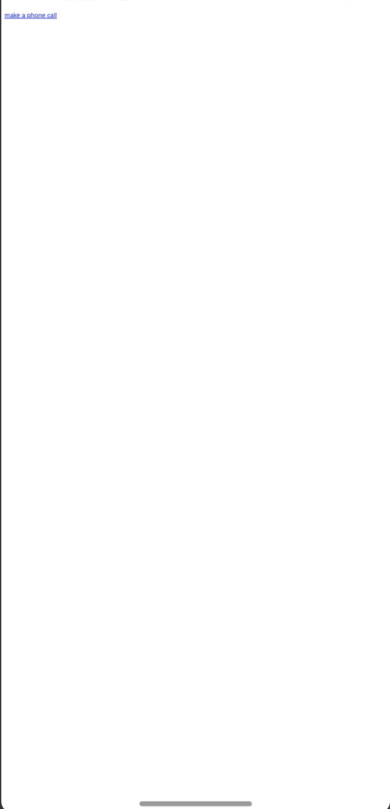

# Managing Page Redirection and Browsing History Navigation
<!--Kit: ArkWeb-->
<!--Subsystem: Web-->
<!--Owner: @aohui-->
<!--Designer: @yaomingliu-->
<!--Tester: @ghiker-->
<!--Adviser: @HelloCrease-->

To speed up page access, browsing history navigation allows users to switch between history pages with the forward and back buttons. The **Web** component supports redirection to other pages within the application and across different applications.

## History Navigation

When a user clicks a web page link on the frontend page, the **Web** component automatically opens and loads the target website by default. When the current page is assigned a new loading link, the address of the accessed web page is automatically recorded. You can call [forward()](../reference/apis-arkweb/arkts-apis-webview-WebviewController.md#forward) and [backward()](../reference/apis-arkweb/arkts-apis-webview-WebviewController.md#backward) to browse the previous or next history record.

To obtain network resources during page loading, configure the network access permission in the **module.json5** file. For details, see [Declaring Permissions in the Configuration File](../security/AccessToken/declare-permissions.md#declaring-permissions-in-the-configuration-file).

  ```
  "requestPermissions":[
      {
        "name" : "ohos.permission.INTERNET"
      }
    ]
  ```

In the following example, when a user clicks the button, **backward()** is called to go back to the previous page.

```ts
// xxx.ets
import { webview } from '@kit.ArkWeb';

@Entry
@Component
struct WebComponent {
  webviewController: webview.WebviewController = new webview.WebviewController();
  
  build() {
    Column() {
      Button('loadData')
        .onClick(() => {
          if (this.webviewController.accessBackward()) {
            this.webviewController.backward();
          }
        })
      Web({ src: 'https://www.example.com/cn/', controller: this.webviewController })
    }
  }
}
```


If a historical record exists, [accessBackward()](../reference/apis-arkweb/arkts-apis-webview-WebviewController.md#accessbackward) will return **true**. Similarly, you can call [accessForward()](../reference/apis-arkweb/arkts-apis-webview-WebviewController.md#accessforward) to check whether a next record exists. If you skip the check, [forward()](../reference/apis-arkweb/arkts-apis-webview-WebviewController.md#forward) and [backward()](../reference/apis-arkweb/arkts-apis-webview-WebviewController.md#backward) will not trigger any action if the user has navigated to the end of history records.


## Page Redirection

The **Web** component provides the [onLoadIntercept()](../reference/apis-arkweb/arkts-basic-components-web-events.md#onloadintercept10) API to redirect you from one page to another.

In the following example, the frontend page **route.html** is loaded on to the application home page **Index.ets**, and the user is redirected to the application page **ProfilePage.ets** when clicking the **Me** link on the **route.html** page.

- Code of the **Index.ets** page:
  
  ```ts
  // index.ets
  import { webview } from '@kit.ArkWeb';

  @Entry
  @Component
  struct WebComponent {
    webviewController: webview.WebviewController = new webview.WebviewController();

    build() {
      Column() {
        // Path for storing the route.html resource file: src/main/resources/rawfile
        Web({ src: $rawfile('route.html'), controller: this.webviewController })
          .onLoadIntercept((event) => {
            if (event) {
              let url: string = event.data.getRequestUrl();
              if (url.indexOf('native://') === 0) {
                // Redirect to another page.
                this.getUIContext().getRouter().pushUrl({ url: url.substring(9) });
                return true;
              }
            }
            return false;
          })
      }
    }
  }
  ```

- Code of the **route.html** page:
  
  ```html
  <!-- route.html -->
  <!DOCTYPE html>
  <html>
  <body>
    <div>
        <a href="native://pages/ProfilePage">My Profile</a>
     </div>
  </body>
  </html>
  ```

- Code of the **ProfilePage.ets** page:
  
  ```ts
  @Entry
  @Component
  struct ProfilePage {
    @State message: string = 'Hello World';
  
    build() {
      Column() {
        Text(this.message)
          .fontSize(20)
      }
    }
  }
  ```


## Cross-Application Redirection

The **Web** component supports redirection from one application to another.

In the following example, when a user clicks the link on the frontend page **call.html**, the user will be redirected to the dial screen of the phone app.

- Application code:
  
  ```ts
  // xxx.ets
  import { webview } from '@kit.ArkWeb';
  import { call } from '@kit.TelephonyKit';

  @Entry
  @Component
  struct WebComponent {
    webviewController: webview.WebviewController = new webview.WebviewController();

    build() {
      Column() {
        Web({ src: $rawfile('call.html'), controller: this.webviewController })
          .onLoadIntercept((event) => {
            if (event) {
              let url: string = event.data.getRequestUrl();
              // Check whether the link is redirecting to the dial screen of the phone app.
              if (url.indexOf('tel://') === 0) {
                // Redirect to the dial screen.
                call.makeCall(url.substring(6), (err) => {
                  if (!err) {
                    console.info('make call succeeded.');
                  } else {
                    console.info('make call fail, err is:' + JSON.stringify(err));
                  }
                });
                return true;
              }
            }
            return false;
          })
      }
    }
  }
  ```

- Code of the **call.html** page:
  
  ```html
  <!-- call.html -->
  <!DOCTYPE html>
  <html>
  <body>
    <div>
      <a href="tel://***********">Make a call</a>
    </div>
  </body>
  </html>
  ```

