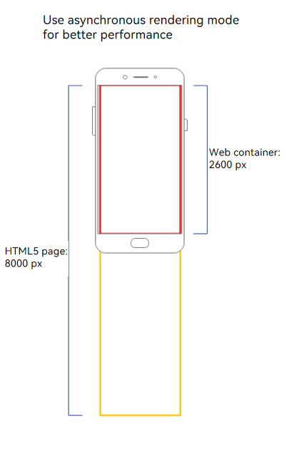
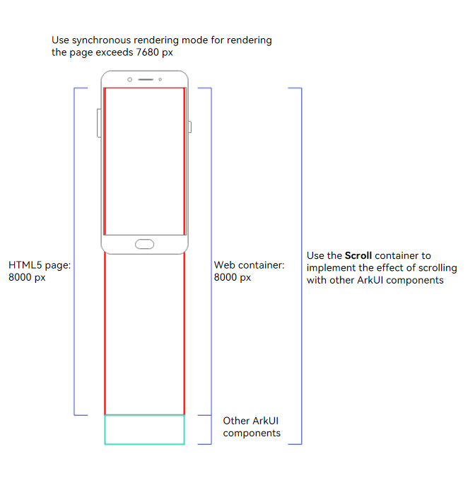

# Rendering Modes of the Web Component

The **Web** component provides two rendering modes, which can be adapted to different container sizes as required.

## Asynchronous Rendering Mode (Default)

In asynchronous rendering mode (renderMode: [RenderMode](../reference/apis-arkweb/arkts-basic-components-web-e.md#rendermode12).ASYNC_RENDER), the **Web** component is treated as a graphics surface node and is displayed independently. You are advised to use this mode on application pages that consist of only **Web** components to improve performance and reduce power consumption.

- The width and height of a **Web** component cannot exceed 7,680 pixels (physical pixels). Otherwise, a white screen is displayed.
- Dynamic mode switching is not supported.

The **Web** component is expected to display the application page as the main body, as shown in Figure 1. In this scenario, the height of the **Web** component is the same as or close to the height of a screen (embedded in the navigation). The height of the HTML 5 page to be loaded is greater than the height of the **Web** component, and a scroll bar is generated inside the **Web** component. Users can scroll the scroll bar to view information on the HTML 5 page. Only **Web** components are required to implement the main content of application services. The asynchronous rendering mode is recommended to improve performance.

**Figure 1 Asynchronous rendering mode**



## Synchronous Rendering Mode

In synchronous rendering mode (renderMode: [RenderMode](../reference/apis-arkweb/arkts-basic-components-web-e.md#rendermode12).SYNC_RENDER), the Web component is treated as the graphics canvas node and is displayed together with the system component. In this case, longer **Web** component content can be rendered, but the performance consumption increases.

- The width and height of a **Web** component cannot exceed 500,000 px (physical pixels). Otherwise, a white screen is displayed.
- Direct Digital Synthesis (DSS) is not supported.
- Dynamic mode switching is not supported.

The **Web** component is expected to be a part of the application page as the carrier of rich text display and interact with other ArkUI components. As shown in Figure 2, the height of the HTML5 page is the same as that of the **Web** component. No scroll bar is generated in the **Web** component and the **Web** component is displayed as an ultra-long component. The **Scroll** component is used to implement internal scrolling of the application, ensuring that users can smoothly browse the web content and other ArkUI component content. To implement this page layout, you are advised to use the synchronous rendering mode.

**Figure 2 Synchronous rendering mode**



## Sample Code

```typescript
// renderMode.ets
import { webview } from '@kit.ArkWeb';

@Entry
@Component
struct WebHeightPage {
  private webviewController: WebviewController = new webview.WebviewController()

  build() {
     Column() {
         Web({
             src: "https://www.example.com/",
             controller: this.webviewController,
             renderMode: RenderMode.ASYNC_RENDER // Set the rendering mode.
         })
     }
  }
}
```
