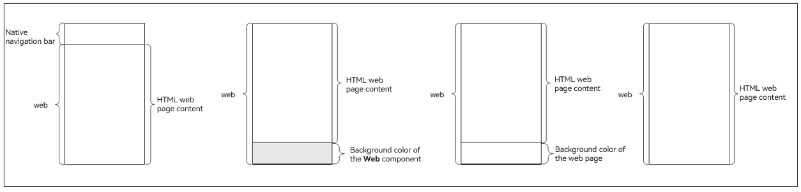

# Optimizing the Page Flash During the Redirection

<!--Kit: ArkWeb-->
<!--Subsystem: Web-->
<!--Owner: @wangxinbao01-->
<!--Designer: @defeng20201-->
<!--Tester: @ghiker-->
<!--Adviser: @HelloShuo-->
<!-- md-trans-meta sourceCommit=3c5650cff0dc64efaab27ca2186a757c6e64624b translatedAt=2026-08-14T03:50:00.633Z pushedAt=2026-08-14T09:34:13.043Z -->

When an app uses a router such as [Navigation](../reference/apis-arkui/arkui-ts/ts-basic-components-navigation.md) to navigate to a **Web** component page, flickering may occur at the bottom of the page during web page loading, which affects user experience.

## Causes

When a router such as the **Navigation** component is used to navigate to a **Web** component page, the application determines whether to hide the system navigation bar based on the callback notification of the web page. If it decides to hide the system navigation bar, the layout of the **Web** component is adjusted accordingly. The layout adjustment process can be simplified into the following four phases:



Description of the four states in the figure (from left to right):

1. The application is routed to the web page. The top of the page is the system navigation bar, and the bottom is the **Web** component. In this case, the web page can be loaded properly.

2. During web page loading, the system invokes a callback to notify the application to hide the system navigation bar and switch to the navigation bar on the web page. In this case, the system navigation bar is hidden, the layout of the **Web** component is adjusted accordingly, and the background color (for example, gray) of the **Web** component is initially displayed at the bottom of the page.

3. The web page continues to be loaded and displayed based on the new size. The background color (for example, white) of the HTML page is displayed first.

4. Finally, the web page content is completely loaded, and the complete HTML web page content is displayed.

In the preceding process, if the background color of the **Web** component is different from that of the web page, flashes may occur during the navigation. The flash probability depends on the complexity of the web page and network conditions.

## Optimization

To avoid visual flashes and improve user experience, you can set the background color of the **Web** component to the same as that of the web page. For example, when the background color of a **Web** component is set to white

and the background color of the web page is gray, white flashes may occur when a user navigates to a new web page. In this case, you can set the background color of the **Web** component to gray.

Example of setting the background color of the **Web** component to gray (the default background color is white):

  <!-- @[FixingPageFlickeringButton](https://gitcode.com/openharmony/applications_app_samples/blob/master/code/DocsSample/ArkWeb/ProcessWeb/entry/src/main/ets/pages/FixingPageFlickering.ets) -->

  ``` TypeScript
  Web({ src: $rawfile('xxx.html'),  controller: this.webController})
    .backgroundColor(Color.Gray)
  ```