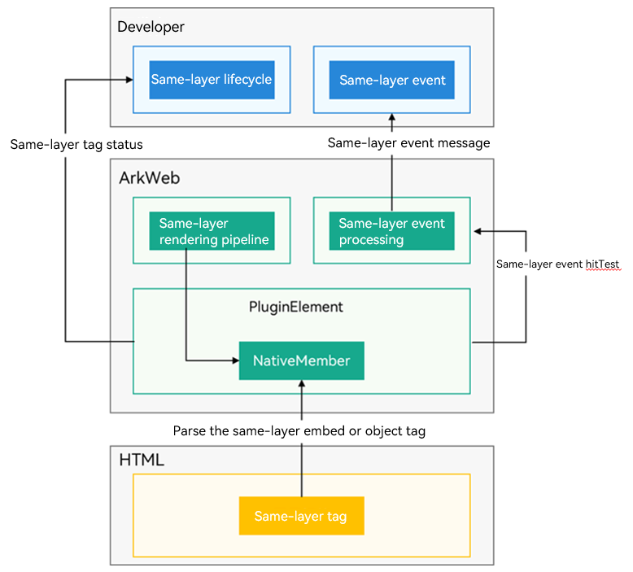
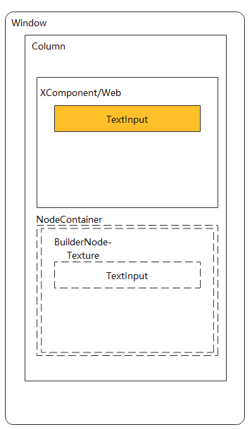
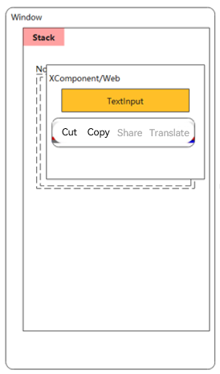
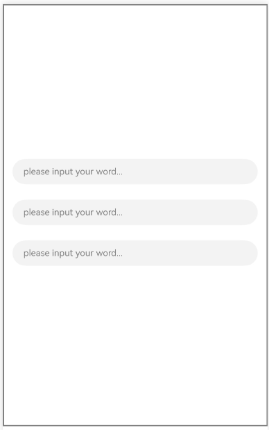
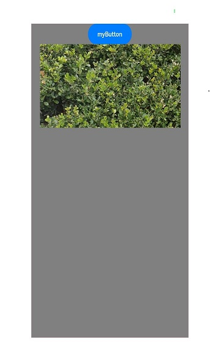
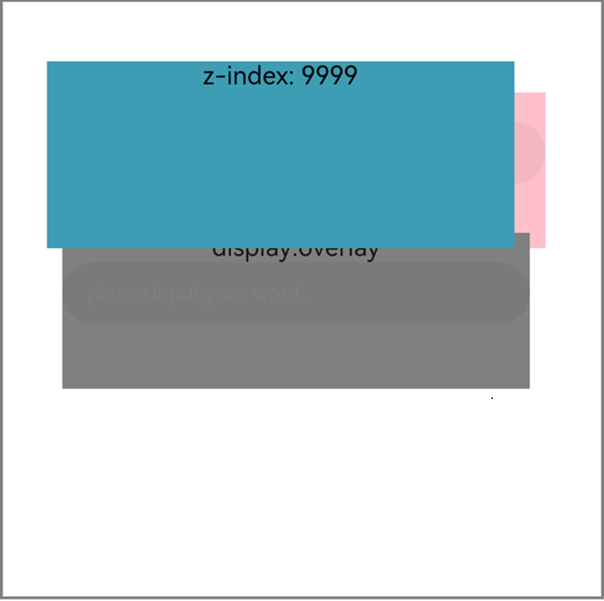
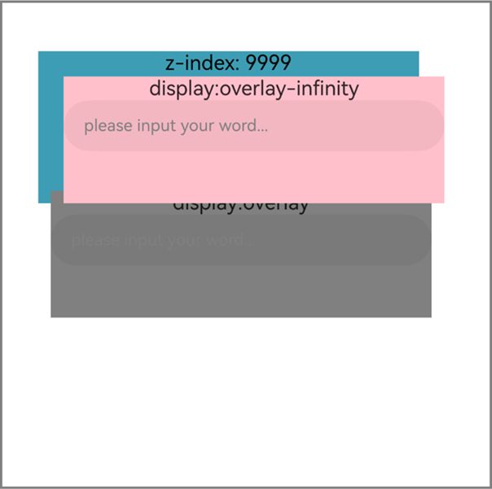

# Using Same-Layer Rendering

<!--Kit: ArkWeb-->
<!--Subsystem: Web-->
<!--Owner: @zhanghaozhi1-->
<!--Designer: @dzichou-->
<!--Tester: @ghiker-->
<!--Adviser: @HelloShuo-->
<!-- md-trans-meta sourceCommit=f0524ade16836279b29e1c928b6b7514bb1a1dfd translatedAt=2026-08-14T03:52:56.323Z pushedAt=2026-08-14T09:40:24.771Z -->

In the system, applications can use the **Web** component to load web pages. If the capability or performance of non-system UI components is inferior to that of system components, you can use the ArkUI component to render these components (same-layer components).

## When to Use

### On the Web Page

To improve the performance of an applet, you can use the ArkUI **XComponent** component to render the map component, and use the ArkUI **TextInput** component to render the input box component.

- On the web page, you can render the UI components (same-layer tags) such as **\<embed>** and **\<object>** at the same layer based on certain rules. For details, see [Specifications and Constraints](#specifications-and-constraints).

- On the application, you can use the same-layer rendering event reporting API of the **Web** component to detect the lifecycle and input event of the HTML5 same-layer tags, and process the service logic of the same-layer rendered components.

- In addition, you can use ArkUI APIs such as **NodeContainer** to construct same-layer rendered components corresponding to HTML5 same-layer tags. Common ArkUI components that support same-layer rendering: [TextInput](../reference/apis-arkui/arkui-ts/ts-basic-components-textinput.md), [XComponent](../reference/apis-arkui/arkui-ts/ts-basic-components-xcomponent.md), [Canvas](../reference/apis-arkui/arkui-ts/ts-components-canvas-canvas.md), [Video](../reference/apis-arkui/arkui-ts/ts-media-components-video.md), [Web](../reference/apis-arkweb/arkts-basic-components-web.md). For details, see [Specifications and Constraints](#specifications-and-constraints).

### On the Third-Party UI Framework

Flutter provides the **PlatformView** and **Texture** abstract components that can be rendered using system components, which complete the functionalities of the Flutter components. In the Weex 2.0 framework, the **Camera**, **Video**, and **Canvas** components can be rendered using system components to enhance functionality and performance.

- Since third-party frameworks such as Flutter and Weex are not operated in the OS, the available third-party framework UI components that can be rendered at the same layer are not listed in the following.

- On the application, you can use ArkUI APIs such as **NodeContainer** to construct same-layer rendered components corresponding to third-party framework same-layer tags. Common ArkUI components that support same-layer rendering: [TextInput](../reference/apis-arkui/arkui-ts/ts-basic-components-textinput.md), [XComponent](../reference/apis-arkui/arkui-ts/ts-basic-components-xcomponent.md), [Canvas](../reference/apis-arkui/arkui-ts/ts-components-canvas-canvas.md), [Video](../reference/apis-arkui/arkui-ts/ts-media-components-video.md), [Web](../reference/apis-arkweb/arkts-basic-components-web.md). For details, see [Specifications and Constraints](#specifications-and-constraints).

## Overall Architecture

The ArkWeb same-layer rendering feature supports same-layer tag lifecycle and event hit forwarding.

The lifecycle of same-layer tags is associated with front-end tags (\<embed>/\<object>). Events that hit the same-layer tags are reported to you, and you should distribute them to the corresponding component tree. The following figure shows the overall framework.

**Figure 1** Overall architecture of same-layer rendering



## Specifications and Constraints

### ArkUI Components That Can Be Rendered at the Same Layer

The following specifications take effect in both web pages and third-party frameworks.

**Supported Components**:

- Basic components: [AlphabetIndexer](../reference/apis-arkui/arkui-ts/ts-container-alphabet-indexer.md), [Blank](../reference/apis-arkui/arkui-ts/ts-basic-components-blank.md), [Button](../reference/apis-arkui/arkui-ts/ts-basic-components-button.md), [CalendarPicker](../reference/apis-arkui/arkui-ts/ts-basic-components-calendarpicker.md), [Checkbox](../reference/apis-arkui/arkui-ts/ts-basic-components-checkbox.md), [CheckboxGroup](../reference/apis-arkui/arkui-ts/ts-basic-components-checkboxgroup.md), [ContainerSpan](../reference/apis-arkui/arkui-ts/ts-basic-components-containerspan.md), [DataPanel](../reference/apis-arkui/arkui-ts/ts-basic-components-datapanel.md), [DatePicker](../reference/apis-arkui/arkui-ts/ts-basic-components-datepicker.md), [Divider](../reference/apis-arkui/arkui-ts/ts-basic-components-divider.md), [Gauge](../reference/apis-arkui/arkui-ts/ts-basic-components-gauge.md), [Hyperlink](../reference/apis-arkui/arkui-ts/ts-container-hyperlink.md), [Image](../reference/apis-arkui/arkui-ts/ts-basic-components-image.md), [ImageAnimator](../reference/apis-arkui/arkui-ts/ts-basic-components-imageanimator.md), [ImageSpan](../reference/apis-arkui/arkui-ts/ts-basic-components-imagespan.md), [LoadingProgress](../reference/apis-arkui/arkui-ts/ts-basic-components-loadingprogress.md), [Marquee](../reference/apis-arkui/arkui-ts/ts-basic-components-marquee.md), [PatternLock](../reference/apis-arkui/arkui-ts/ts-basic-components-patternlock.md), [Progress](../reference/apis-arkui/arkui-ts/ts-basic-components-progress.md), [QRCode](../reference/apis-arkui/arkui-ts/ts-basic-components-qrcode.md), [Radio](../reference/apis-arkui/arkui-ts/ts-basic-components-radio.md), [Rating](../reference/apis-arkui/arkui-ts/ts-basic-components-rating.md), [Refresh](../reference/apis-arkui/arkui-ts/ts-container-refresh.md), [ScrollBar](../reference/apis-arkui/arkui-ts/ts-container-scroll.md), [Search](../reference/apis-arkui/arkui-ts/ts-basic-components-search.md), [Span](../reference/apis-arkui/arkui-ts/ts-basic-components-span.md), [Select](../reference/apis-arkui/arkui-ts/ts-basic-components-select.md), [Slider](../reference/apis-arkui/arkui-ts/ts-basic-components-slider.md), [Text](../reference/apis-arkui/arkui-ts/ts-basic-components-text.md), [TextArea](../reference/apis-arkui/arkui-ts/ts-basic-components-textarea.md), [TextClock](../reference/apis-arkui/arkui-ts/ts-basic-components-textclock.md), [TextInput](../reference/apis-arkui/arkui-ts/ts-basic-components-textinput.md), [TextPicker](../reference/apis-arkui/arkui-ts/ts-basic-components-textpicker.md), [TextTimer](../reference/apis-arkui/arkui-ts/ts-basic-components-texttimer.md), [TimePicker](../reference/apis-arkui/arkui-ts/ts-basic-components-timepicker.md), [Toggle](../reference/apis-arkui/arkui-ts/ts-basic-components-toggle.md)

- Container components: [Badge](../reference/apis-arkui/arkui-ts/ts-container-badge.md), [Column](../reference/apis-arkui/arkui-ts/ts-container-column.md), [ColumnSplit](../reference/apis-arkui/arkui-ts/ts-container-columnsplit.md), [Counter](../reference/apis-arkui/arkui-ts/ts-container-counter.md), [Flex](../reference/apis-arkui/arkui-ts/ts-container-flex.md), [GridCol](../reference/apis-arkui/arkui-ts/ts-container-gridcol.md), [GridRow](../reference/apis-arkui/arkui-ts/ts-container-gridrow.md), [Grid](../reference/apis-arkui/arkui-ts/ts-container-grid.md), [GridItem](../reference/apis-arkui/arkui-ts/ts-container-griditem.md), [List](../reference/apis-arkui/arkui-ts/ts-container-list.md), [ListItem](../reference/apis-arkui/arkui-ts/ts-container-listitem.md), [ListItemGroup](../reference/apis-arkui/arkui-ts/ts-container-listitemgroup.md), [RelativeContainer](../reference/apis-arkui/arkui-ts/ts-container-relativecontainer.md), [Row](../reference/apis-arkui/arkui-ts/ts-container-row.md), [RowSplit](../reference/apis-arkui/arkui-ts/ts-container-rowsplit.md), [Scroll](../reference/apis-arkui/arkui-ts/ts-container-scroll.md), [Stack](../reference/apis-arkui/arkui-ts/ts-container-stack.md), [Swiper](../reference/apis-arkui/arkui-ts/ts-container-swiper.md), [Tabs](../reference/apis-arkui/arkui-ts/ts-container-tabs.md), [TabContent](../reference/apis-arkui/arkui-ts/ts-container-tabcontent.md), [NodeContainer](../reference/apis-arkui/arkui-ts/ts-basic-components-nodecontainer.md), [SideBarContainer](../reference/apis-arkui/arkui-ts/ts-container-sidebarcontainer.md), [Stepper](../reference/apis-arkui/arkui-ts/ts-basic-components-stepper.md), [StepperItem](../reference/apis-arkui/arkui-ts/ts-basic-components-stepperitem.md), [WaterFlow](../reference/apis-arkui/arkui-ts/ts-container-waterflow.md), [FlowItem](../reference/apis-arkui/arkui-ts/ts-container-flowitem.md)

- Self-drawing components: [XComponent](../reference/apis-arkui/arkui-ts/ts-basic-components-xcomponent.md), [Canvas](../reference/apis-arkui/arkui-ts/ts-components-canvas-canvas.md), [Video](../reference/apis-arkui/arkui-ts/ts-media-components-video.md), [Web](../reference/apis-arkweb/arkts-basic-components-web.md)

- Imperative custom drawing nodes: [BuilderNode](../reference/apis-arkui/js-apis-arkui-builderNode.md), [ComponentContent](../reference/apis-arkui/js-apis-arkui-ComponentContent.md), [ContentSlot](../reference/apis-arkui/arkui-ts/ts-components-contentSlot.md), [FrameNode](../reference/apis-arkui/js-apis-arkui-frameNode.md), [Graphics](../reference/apis-arkui/js-apis-arkui-graphics.md), [NodeController](../reference/apis-arkui/js-apis-arkui-nodeController.md), [RenderNode](../reference/apis-arkui/js-apis-arkui-renderNode.md), [XComponentNode](../reference/apis-arkui/js-apis-arkui-xcomponentNode.md), [AttributeUpdater](../reference/apis-arkui/js-apis-arkui-AttributeUpdater.md), [ArkUI_NativeModule](../reference/apis-arkui/capi-arkui-nativemodule.md) (the component scope that supports same-layer rendering is the same as ArkTS)

**Supported Common Component Attributes and Events**:

- Common attributes that are not supported: [restoreId](../reference/apis-arkui/arkui-ts/ts-universal-attributes-restoreId.md) and [Special Effect Drawing Combination](../reference/apis-arkui/arkui-ts/ts-universal-attributes-use-effect.md).

- Other attributes, events, and component capabilities that are not clearly marked as not supported are supported by default.

### Same-Layer Rendering Tags of the Web Page

This specification applies only to web pages and does not apply to third-party frameworks.

If an application needs to use same-layer rendering on a web page loaded by the **Web** component, you need to specify the **\<embed>** and **\<object>** tags on the web page as the same-layer rendered components based on the following specifications.

**Supported HTML5 Tags**:

- **\<embed>**: After same-layer rendering is enabled, only tags whose type is prefixed with **native** can be identified as same-layer components. Attributes cannot be customized.

- **\<object>**: After same-layer rendering is enabled, the **\<object>** tag of the non-standard **MIME** type can be identified as a same-layer component and parsed based on the custom **param**/**value** attribute.

- W3C standard tags (such as **\<input>** and **\<video>**) cannot be defined as same-layer tags.

- The **\<object>** and **\<embed>** tags cannot be configured as the same-layer tags at the same time. 

- The tag types contain only English characters and are case insensitive.

**Supported CSS Attributes**:

**display**, **position**, **z-index**, **visibility**, **opacity**, **background-color**, **background-image**, **width**, **height**, **padding**, **padding-left**, **padding-top**, **padding-right**, **padding-bottom**, **margin**, **margin-left**, **margin-top**, **margin-right**, **margin-bottom**, **border-width**, **border-style**, **border-color**, **border-left-width**, **border-left-style**, **border-left-color**, **border-top-width**, **border-top-style**, **border-top-color**, **border-right-width**, **border-right-style**, **border-right-color**, **border-bottom-width**, **border-bottom-style**, **border-bottom-color**, **border-left**, **border-right**, **border-top**, **border-bottom**, **border**, **border-top-left-radius**, **border-top-right-radius**, **border-bottom-left-radius**, **border-bottom-right-radius**, **border-radius**, **transition**, and **transform** (Only **translate** and **scale** are supported. The value of **scale** must be greater than or equal to 0.)

 Other CSS attributes, such as **rotate** and **skew** in the **transform** attribute, may not meet the expectation.

**Lifecycle Management**:
When the lifecycle of a tag at the same layer changes, the [onNativeEmbedLifecycleChange()](../reference/apis-arkweb/arkts-basic-components-web-events.md#onnativeembedlifecyclechange11) callback is triggered.

- Creation, destruction, and position width and height change are supported. 

- Web pages containing same-layer components support back-forward cache.

**Distribution and Processing of the Input Events**:

- Supports the DOWN/UP/MOVE/CANCEL events of the touch event TouchEvent. Supports [onNativeEmbedGestureEvent](../reference/apis-arkweb/arkts-basic-components-web-events.md#onnativeembedgestureevent11) (configures the touch event consumption result), which is consumed on the application side by default.

- Application pages with same-layer tags cannot be scaled, and scaling APIs such as [initialScale](../reference/apis-arkweb/arkts-basic-components-web-attributes.md#initialscale9), [zoom](../reference/apis-arkweb/arkts-apis-webview-WebviewController.md#zoom), [zoomIn](../reference/apis-arkweb/arkts-apis-webview-WebviewController.md#zoomin) and [zoomOut](../reference/apis-arkweb/arkts-apis-webview-WebviewController.md#zoomout) are not supported.

- Mouse, keyboard, and touchpad events are not supported.

- By default, the mouse and touchpad left button events (**MousePress**/**MouseRelease**/**MouseMOVE**) can be converted into touch events (**TouchDOWN**/**TouchUP**/**TouchMOVE**) for reporting.

**Visibility Changes**:
The [onNativeEmbedVisibilityChange](../reference/apis-arkweb/arkts-basic-components-web-events.md#onnativeembedvisibilitychange12) callback is triggered when the visibility of the same-layer tag changes.

- The visibility of the same-layer tag relative to the viewport can be reported.

- By default, visibility changes caused by the CSS style or size change of the same-layer tag are not reported. For details, see [onNativeEmbedVisibilityChange](../reference/apis-arkweb/arkts-basic-components-web-events.md#onnativeembedvisibilitychange12).

Status change of the **param** element embedded in the same-layer rendering tag **\<object>**:
The [onNativeEmbedObjectParamChange()](../reference/apis-arkweb/arkts-basic-components-web-events.md#onnativeembedobjectparamchange21) callback is triggered when the param element of the same-layer rendering tag **\<object>** changes.

- The addition, modification, and deletion of the **param** element can be reported.

- A maximum of 500 **param** element changes can be reported at a time. More changes will be reported subsequently.

- For details about the report, see [NativeEmbedParamDataInfo](../reference/apis-arkweb/arkts-basic-components-web-i.md#nativeembedparamdatainfo21).

**Constraints**:

- A maximum of five same-layer tags can be displayed on a web page. Otherwise, the rendering performance deteriorates.

- Due to GPU restrictions, the maximum height and texture size of a same-layer tag are 8000 px.

- After same-layer rendering is enabled, all web pages opened by the **Web** component do not support the synchronous [rendering mode](../reference/apis-arkweb/arkts-basic-components-web-e.md#rendermode12).

- When the non-full-screen mode is changed to the full-screen mode, the **Video** component is exported through non-texture mode and the video playback status remains unchanged. When the non-full-screen mode is restored, the **Video** component is exported through texture mode and the video playback status remains unchanged.

- The **Web** component supports only same-layer rendering nesting at one layer. Input events such as swiping, tapping, and touching and holding are supported. Dragging, rotating, and zooming are not supported.

- In the page layout of ArkUI components (such as **TextInput**), you are advised to use a **Stack** component to wrap the same-layer **NodeContainer** and **BuilderNode** and ensure that they are in the same position. In addition, the **NodeContainer** must be aligned with the **\<embed>**/**\<object>** tag to ensure proper component interaction. If the positions of the two components are different, the following problems may occur: The position of the text selection box attached to the **TextInput**/**TextArea** component is incorrect (as shown in the following figure). The animation start and stop of the **LoadingProgress**/**Marquee** component do not match the visibility status of the component.

  **Figure 2** Misplaced **TextInput** without **Stack**

  

  **Figure 3** Proper **TextInput** with **Stack**

  

## Rendering Text Boxes at the Same Layer on Web Pages

On web pages, you can render the system ArkUI **TextInput** components at the same layer. The following figure shows the effect of three text boxes that are rendered at the same layer.

**Figure 4** Same-layer rendering text boxes

  

1. Mark the HTML tags that need to be rendered at the same layer on the web page.

   The **\<embed>** and **\<object>** tags support same-layer rendering, and the **type** can be specified randomly. They are case insensitive and will be converted to lowercase letters by the ArkWeb kernel. The **tag** string is matched using the entire string, and the **type** string is matched using the prefix.

   If you do not use this API, or if the API receives an invalid string (an empty string), the ArkWeb kernel uses the default settings, that is, the "embed" + "native/" prefix pattern. If the specified type overlaps with the standard types of the &lt;embed&gt; or &lt;object&gt; tags defined by W3C, for example, registerNativeEmbedRule("object", "application/pdf"), ArkWeb follows the W3C standard behavior and does not recognize it as a same-layer tag. 

   - Use the \<embed> tags.

     ```html
     <!--HAP's src/main/resources/rawfile/text.html-->
     <!DOCTYPE html>
     <html>
     <head>
         <title>Same-layer Rendering HTML</title>
         <meta name="viewport">
     </head>

     <body style="background:white">

     <embed id = "input1" type="native/view" style="width: 100%; height: 100px; margin: 30px; margin-top: 600px"/>

     <embed id = "input2" type="native/view2" style="width: 100%; height: 100px; margin: 30px; margin-top: 50px"/>

     <embed id = "input3" type="native/view3" style="width: 100%; height: 100px; margin: 30px; margin-top: 50px"/>

     </body>
     </html>
     ```

   - Use the \<object> tags.

     Call **registerNativeEmbedRule** to register a **\<object>** tag.

     <!-- @[register_object_label](https://gitcode.com/openharmony/applications_app_samples/blob/master/code/DocsSample/ArkWeb/UseSameLayerRender/entry/src/main/ets/pages/RenderTxtBoxSameLayer_two.ets) --> 

     ``` TypeScript
     Web({src: $rawfile('test2.html'), controller: this.browserTabController})
       // Register the same-layer tag as 'object' with the 'test' prefix.
       .registerNativeEmbedRule('object', 'test')
     ```

     Example of using **registerNativeEmbedRule** on the frontend page, with the tag of "object" and type of "test":

      ```html
      <!--HAP's src/main/resources/rawfile/test2.html-->
      <!DOCTYPE html>
      <html>
      <head>
          <title>Same-layer Rendering HTML</title>
          <meta name="viewport">
      </head>

      <body style="background:white">

      <object id = "input1" type="test/input" style="width: 100%; height: 100px; margin: 30px; margin-top: 600px"></object>

      <object id = "input2" type="test/input" style="width: 100%; height: 100px; margin: 30px; margin-top: 50px"></object>

      <object id = "input3" type="test/input" style="width: 100%; height: 100px; margin: 30px; margin-top: 50px"></object>

      </body>
      </html>
      ```

2. Use **enableNativeEmbedMode** to enable same-layer rendering on the application.

   The same-layer rendering feature is disabled by default. To enable this feature, set [enableNativeEmbedMode](../reference/apis-arkweb/arkts-basic-components-web-attributes.md#enablenativeembedmode11).

   <!-- @[enable_native_embedmode](https://gitcode.com/openharmony/applications_app_samples/blob/master/code/DocsSample/ArkWeb/UseSameLayerRender/entry/src/main/ets/pages/RenderTxtBoxSameLayer_two.ets) -->

   ``` TypeScript
   Web({src: $rawfile('test2.html'), controller: this.browserTabController})
   // ...
     // Enable the same-layer rendering switch.
     .enableNativeEmbedMode(true)
   ```

3. Create a custom component.

   The custom component is displayed as a system component in the corresponding area after same-layer rendering is enabled.

   <!-- @[text_input_component](https://gitcode.com/openharmony/applications_app_samples/blob/master/code/DocsSample/ArkWeb/UseSameLayerRender/entry/src/main/ets/pages/RenderTxtBoxSameLayer_two.ets) --> 

   ``` TypeScript
   @Component
   struct TextInputComponent {
     @Prop params: Params;
     @State bkColor: Color = Color.White;

     build() {
       Column() {
         TextInput({text: '', placeholder: 'please input your word...'})
           .placeholderColor(Color.Gray)
           .id(this.params?.elementId)
           .placeholderFont({size: 13, weight: 400})
           .caretColor(Color.Gray)
           .fontSize(14)
           .fontColor(Color.Black)
       }
       // The width and height of the outermost container component in the custom component should match those of the same-layer tag.
       .width(this.params.width)
       .height(this.params.height)
     }
   }

   // The @Builder contains the specific component content of the dynamic component.
   @Builder
   function textInputBuilder(params:Params) {
     TextInputComponent({params: params})
       .backgroundColor(Color.White)
   }
   ```

4. Create a node controller.

   The node controller is used to control and report node behaviors of the corresponding NodeContainer.

   <!-- @[create_nodecontainer](https://gitcode.com/openharmony/applications_app_samples/blob/master/code/DocsSample/ArkWeb/UseSameLayerRender/entry/src/main/ets/pages/RenderTxtBoxSameLayer_two.ets) -->

   ``` TypeScript
   // Used to control and provide feedback on the behavior of the node on the corresponding NodeContainer. It must be used together with NodeContainer.
   class MyNodeController extends NodeController {
     private rootNode: BuilderNode<[Params]> | undefined | null;
     private embedId_: string = '';
     private surfaceId_: string = '';
     private renderType_: NodeRenderType = NodeRenderType.RENDER_TYPE_DISPLAY;
     private width_: number = 0;
     private height_: number = 0;
     private type_: string = '';
     private isDestroy_: boolean = false;

     setRenderOption(params: NodeControllerParams) {
       this.surfaceId_ = params.surfaceId;
       this.renderType_ = params.renderType;
       this.embedId_ = params.embedId;
       this.width_ = params.width;
       this.height_ = params.height;
       this.type_ = params.type;
     }

     // A method that must be overridden. It is used to build the node tree and return the node tree to be mounted on the corresponding NodeContainer.
     // Called when the corresponding NodeContainer is created or called by the rebuild method.
     makeNode(uiContext: UIContext): FrameNode | null {
       if (this.isDestroy_) { // rootNode is null.
         return null;
       }
       if (!this.rootNode) { // When rootNode is undefined.
         this.rootNode = new BuilderNode(uiContext, { surfaceId: this.surfaceId_, type: this.renderType_ });
         if (this.rootNode) {
           this.rootNode.build(
             wrapBuilder(textInputBuilder), {  textOne: 'myTextInput', width: this.width_, height: this.height_  });
           return this.rootNode.getFrameNode();
         }else{
           return null;
         }
       }
       // Return the FrameNode object.
       return this.rootNode.getFrameNode();
     }

     updateNode(arg: Object): void {
       this.rootNode?.update(arg);
     }

     getEmbedId(): string {
       return this.embedId_;
     }
     
     setDestroy(isDestroy: boolean): void {
       this.isDestroy_ = isDestroy;
       if (this.isDestroy_) {
         this.rootNode = null;
       }
     }
    
     postEvent(event: TouchEvent | undefined): boolean {
       return this.rootNode?.postTouchEvent(event) as boolean;
     }
   
     postInputEvent(event: MouseEvent | undefined): boolean {
       return this.rootNode?.postInputEvent(event) as boolean;
     }
   }
   ```

5. Listen for the lifecycle changes of the same-layer rendered tags.

   After this feature is enabled, the ArkWeb kernel triggers the callback registered by [onNativeEmbedLifecycleChange](../reference/apis-arkweb/arkts-basic-components-web-events.md#onnativeembedlifecyclechange11) each time a same-layer rendered tag is used on the web page.

   Call [onNativeEmbedLifecycleChange](../reference/apis-arkweb/arkts-basic-components-web-events.md#onnativeembedlifecyclechange11) to listen for the lifecycle changes of the same-layer rendered tags.

   <!-- @[native_embed_lifecycle_change](https://gitcode.com/openharmony/applications_app_samples/blob/master/code/DocsSample/ArkWeb/UseSameLayerRender/entry/src/main/ets/pages/RenderTxtBoxSameLayer_two.ets) --> 

   ``` TypeScript
   // Obtain the lifecycle change data of the embed tag.
   .onNativeEmbedLifecycleChange((embed) => {
     console.info('NativeEmbed surfaceId' + embed.surfaceId);
     // If embed.info.id is used as the key for mapping nodeController, explicitly specify the id on the H5 page.
     const componentId = embed.info?.id?.toString() as string;
     if (embed.status === NativeEmbedStatus.CREATE) {
       console.info('NativeEmbed create' + JSON.stringify(embed.info));
       // Create the node controller and set parameters.
       let nodeController = new MyNodeController();
       // embed.info.width and embed.info.height are in px and need to be converted to vp, the default unit on the ets side.
       nodeController.setRenderOption({surfaceId : embed.surfaceId as string,
         type : embed.info?.type as string,
         renderType : NodeRenderType.RENDER_TYPE_TEXTURE,
         embedId : embed.embedId as string,
         width : this.uiContext.px2vp(embed.info?.width),
         height : this.uiContext.px2vp(embed.info?.height)});
       this.edges = {
         left: `${embed.info?.position?.x as number}px`,
         top: `${embed.info?.position?.y as number}px`
       };
       nodeController.setDestroy(false);
       // Use the id attribute of the embed passed by Web as the key to store nodeController in the Map.
       this.nodeControllerMap.set(componentId, nodeController);
       this.widthMap.set(componentId, this.uiContext.px2vp(embed.info?.width));
       this.heightMap.set(componentId, this.uiContext.px2vp(embed.info?.height));
       this.positionMap.set(componentId, this.edges);
       // Store the id attribute of the embed passed by Web in the @State state array variable for dynamically creating the nodeContainer node container. The push action must be placed after set.
       this.componentIdArr.push(componentId);
     } else if (embed.status === NativeEmbedStatus.UPDATE) {
       let nodeController = this.nodeControllerMap.get(componentId);
       console.info('NativeEmbed update' + JSON.stringify(embed));
       this.edges = {left: `${embed.info?.position?.x as number}px`, top: `${embed.info?.position?.y as number}px`};
       this.positionMap.set(componentId, this.edges);
       this.widthMap.set(componentId, this.uiContext.px2vp(embed.info?.width));
       this.heightMap.set(componentId, this.uiContext.px2vp(embed.info?.height));
       interface UpdateNodeParams {
         textOne: string;
         width: number;
         height: number;
       }
       const updateParams: UpdateNodeParams = {
         textOne: 'update',
         width: this.uiContext.px2vp(embed.info?.width),
         height: this.uiContext.px2vp(embed.info?.height)
       }
       nodeController?.updateNode(updateParams);
     } else if (embed.status === NativeEmbedStatus.DESTROY) {
       console.info('NativeEmbed destroy' + JSON.stringify(embed));
       let nodeController = this.nodeControllerMap.get(componentId);
       nodeController?.setDestroy(true);
       this.nodeControllerMap.delete(componentId);
       this.positionMap.delete(componentId);
       this.widthMap.delete(componentId);
       this.heightMap.delete(componentId);
       this.componentIdArr = this.componentIdArr.filter((value: string) => value != componentId);
     } else {
       console.info('NativeEmbed status' + embed.status);
     }
   })
   ```

6. Listen for gesture events of same-layer rendered region.

   When this feature is enabled, the ArkWeb kernel triggers the callback registered by [onNativeEmbedGestureEvent](../reference/apis-arkweb/arkts-basic-components-web-events.md#onnativeembedgestureevent11) each time a touch operation is performed in the same-layer rendered region.

   Call [onNativeEmbedGestureEvent](../reference/apis-arkweb/arkts-basic-components-web-events.md#onnativeembedgestureevent11) to listen for gesture events of the same-layer rendered region.

   <!-- @[native_embed_gesture](https://gitcode.com/openharmony/applications_app_samples/blob/master/code/DocsSample/ArkWeb/UseSameLayerRender/entry/src/main/ets/pages/RenderTxtBoxSameLayer_two.ets) --> 

   ``` TypeScript
   // Obtain the touch event information of the same-layer rendering component.
   .onNativeEmbedGestureEvent((touch) => {
     console.info('NativeEmbed onNativeEmbedGestureEvent' + JSON.stringify(touch.touchEvent));
     this.componentIdArr.forEach((componentId: string) => {
       let nodeController = this.nodeControllerMap.get(componentId);
       // Send the obtained same-layer area event to the nodeController corresponding to the embedId of the area.
       if (nodeController?.getEmbedId() === touch.embedId) {
         let ret = nodeController?.postEvent(touch.touchEvent);
         if (ret) {
           console.info('onNativeEmbedGestureEvent success ' + componentId);
         } else {
           console.info('onNativeEmbedGestureEvent fail ' + componentId);
         }
         if (touch.result) {
           // Notify the Web component of the gesture event consumption result.
           touch.result.setGestureEventResult(ret);
         }
       }
     })
   })
   ```

7. Listen for mouse events of the same-layer rendered region.

   After this feature is enabled, the ArkWeb kernel triggers the callback registered by [onNativeEmbedMouseEvent](../reference/apis-arkweb/arkts-basic-components-web-events.md#onnativeembedmouseevent20) when the following operations are performed in the same-layer rendered area:

   - Tapping or holding with the left, middle, or right mouse button.

   - Tapping or holding the left, middle, or right mouse button using the touchpad.

   Call [onNativeEmbedMouseEvent](../reference/apis-arkweb/arkts-basic-components-web-events.md#onnativeembedmouseevent20) to listen for the mouse events in the same-layer rendering region.

   <!-- @[native_embed_mouse](https://gitcode.com/openharmony/applications_app_samples/blob/master/code/DocsSample/ArkWeb/UseSameLayerRender/entry/src/main/ets/pages/RenderTxtBoxSameLayer_two.ets) --> 

   ``` TypeScript
   .onNativeEmbedMouseEvent((mouse) => {
     console.info('NativeEmbed onNativeEmbedMouseEvent' + JSON.stringify(mouse.mouseEvent));
     this.componentIdArr.forEach((componentId: string) => {
       let nodeController = this.nodeControllerMap.get(componentId);
       // Send the obtained same-layer area event to the nodeController corresponding to the embedId of the area.
       if (nodeController?.getEmbedId() === mouse.embedId) {
         let ret = nodeController?.postInputEvent(mouse.mouseEvent);
         if (ret) {
           console.info('onNativeEmbedMouseEvent success ' + componentId);
         } else {
           console.info('onNativeEmbedMouseEvent fail ' + componentId);
         }
         if (mouse.result) {
           // Notify the Web component of the mouse event consumption result.
           mouse.result.setMouseEventResult(ret);
         }
       }
     })
   })
   ```

**Sample Code**

To start with, add network permissions to **module.json5**. For details, see [Declaring Permissions in the Configuration File](../security/AccessToken/declare-permissions.md).

<!-- @[request_permissions](https://gitcode.com/openharmony/applications_app_samples/blob/master/code/DocsSample/ArkWeb/UseSameLayerRender/entry/src/main/module.json5) --> 

``` JSON5
"requestPermissions":[
  {
    "name" : "ohos.permission.INTERNET"
  }
],
```

Code on the application side:

  <!-- @[set_web_peer_render](https://gitcode.com/openharmony/applications_app_samples/blob/master/code/DocsSample/ArkWeb/UseSameLayerRender/entry/src/main/ets/pages/RenderTxtBoxSameLayer_two.ets) -->

  ``` TypeScript
  import { webview } from '@kit.ArkWeb';
  import { UIContext } from '@kit.ArkUI';
  import { NodeController, BuilderNode, NodeRenderType, FrameNode } from '@kit.ArkUI';

  @Observed
  declare class Params{
    public elementId: string
    public textOne: string
    public textTwo: string
    public width: number
    public height: number
  }

  declare class NodeControllerParams {
    public surfaceId: string
    public type: string
    public renderType: NodeRenderType
    public embedId: string
    public width: number
    public height: number
  }

  // The NodeController instance must be used with a NodeContainer for controlling and feeding back the behavior of the nodes in the container.
  class MyNodeController extends NodeController {
    private rootNode: BuilderNode<[Params]> | undefined | null;
    private embedId_: string = '';
    private surfaceId_: string = '';
    private renderType_: NodeRenderType = NodeRenderType.RENDER_TYPE_DISPLAY;
    private width_: number = 0;
    private height_: number = 0;
    private type_: string = '';
    private isDestroy_: boolean = false;

    setRenderOption(params: NodeControllerParams) {
      this.surfaceId_ = params.surfaceId;
      this.renderType_ = params.renderType;
      this.embedId_ = params.embedId;
      this.width_ = params.width;
      this.height_ = params.height;
      this.type_ = params.type;
    }

    // A method that must be overridden. It builds the node tree and returns the node tree to be mounted in the corresponding NodeContainer.
    // Called when the corresponding NodeContainer is created or called by the rebuild method.
    makeNode(uiContext: UIContext): FrameNode | null {
      if (this.isDestroy_) { // rootNode is null.
        return null;
      }
      if (!this.rootNode) { // When rootNode is undefined.
        this.rootNode = new BuilderNode(uiContext, { surfaceId: this.surfaceId_, type: this.renderType_ });
        if (this.rootNode) {
          this.rootNode.build(
            wrapBuilder(textInputBuilder), {  textOne: 'myTextInput', width: this.width_, height: this.height_  });
          return this.rootNode.getFrameNode();
        }else{
          return null;
        }
      }
      // Return the FrameNode object.
      return this.rootNode.getFrameNode();
    }

    updateNode(arg: Object): void {
      this.rootNode?.update(arg);
    }

    getEmbedId(): string {
      return this.embedId_;
    }

    setDestroy(isDestroy: boolean): void {
      this.isDestroy_ = isDestroy;
      if (this.isDestroy_) {
        this.rootNode = null;
      }
    }

    postEvent(event: TouchEvent | undefined): boolean {
      return this.rootNode?.postTouchEvent(event) as boolean;
    }

    postInputEvent(event: MouseEvent | undefined): boolean {
      return this.rootNode?.postInputEvent(event) as boolean;
    }
  }

  @Component
  struct TextInputComponent {
    @Prop params: Params;
    @State bkColor: Color = Color.White;

    build() {
      Column() {
        TextInput({text: '', placeholder: 'please input your word...'})
          .placeholderColor(Color.Gray)
          .id(this.params?.elementId)
          .placeholderFont({size: 13, weight: 400})
          .caretColor(Color.Gray)
          .fontSize(14)
          .fontColor(Color.Black)
      }
      // The width and height of the outermost container component in the custom component should match those of the same-layer tag.
      .width(this.params.width)
      .height(this.params.height)
    }
  }

  // In @Builder, add the specific dynamic component content.
  @Builder
  function textInputBuilder(params:Params) {
    TextInputComponent({params: params})
      .backgroundColor(Color.White)
  }

  @Entry
  @Component
  struct Page{
    browserTabController: WebviewController = new webview.WebviewController()
    private nodeControllerMap: Map<string, MyNodeController> = new Map();
    @State componentIdArr: Array<string> = [];
    @State widthMap: Map<string, number> = new Map();
    @State heightMap: Map<string, number> = new Map();
    @State positionMap: Map<string, Edges> = new Map();
    @State edges: Edges = {};
    uiContext: UIContext = this.getUIContext();

    build() {
      Row() {
        Column() {
          Stack() {
            ForEach(this.componentIdArr, (componentId: string) => {
              NodeContainer(this.nodeControllerMap.get(componentId))
                .position(this.positionMap.get(componentId))
                .width(this.widthMap.get(componentId))
                .height(this.heightMap.get(componentId))
            }, (embedId: string) => embedId)
            // The Web component loads the local test2.html page.
            Web({src: $rawfile('test2.html'), controller: this.browserTabController})
              // Register the same-layer tag as 'object' with the 'test' type prefix.
              .registerNativeEmbedRule('object', 'test')
              // Enable same-layer rendering.
              .enableNativeEmbedMode(true)
              // Obtain the lifecycle change data of the embed tag.
              .onNativeEmbedLifecycleChange((embed) => {
                console.info('NativeEmbed surfaceId' + embed.surfaceId);
                // If embed.info.id is used as the key for mapping nodeController, explicitly specify the id in the H5 page.
                const componentId = embed.info?.id?.toString() as string;
                if (embed.status === NativeEmbedStatus.CREATE) {
                  console.info('NativeEmbed create' + JSON.stringify(embed.info));
                  // Create the node controller and set parameters.
                  let nodeController = new MyNodeController();
                  // embed.info.width and embed.info.height are in px and need to be converted to vp, the default unit on the ets side.
                  nodeController.setRenderOption({surfaceId : embed.surfaceId as string,
                    type : embed.info?.type as string,
                    renderType : NodeRenderType.RENDER_TYPE_TEXTURE,
                    embedId : embed.embedId as string,
                    width : this.uiContext.px2vp(embed.info?.width),
                    height : this.uiContext.px2vp(embed.info?.height)});
                  this.edges = {
                    left: `${embed.info?.position?.x as number}px`,
                    top: `${embed.info?.position?.y as number}px`
                  };
                  nodeController.setDestroy(false);
                  // Use the id attribute of the embed passed by Web as the key to store nodeController in the Map.
                  this.nodeControllerMap.set(componentId, nodeController);
                  this.widthMap.set(componentId, this.uiContext.px2vp(embed.info?.width));
                  this.heightMap.set(componentId, this.uiContext.px2vp(embed.info?.height));
                  this.positionMap.set(componentId, this.edges);
                  // Store the id attribute of the embed passed by Web in the @State array variable for dynamically creating the nodeContainer node container. The push action must be placed after set.
                  this.componentIdArr.push(componentId);
                } else if (embed.status === NativeEmbedStatus.UPDATE) {
                  let nodeController = this.nodeControllerMap.get(componentId);
                  console.info('NativeEmbed update' + JSON.stringify(embed));
                  this.edges = {left: `${embed.info?.position?.x as number}px`, top: `${embed.info?.position?.y as number}px`};
                  this.positionMap.set(componentId, this.edges);
                  this.widthMap.set(componentId, this.uiContext.px2vp(embed.info?.width));
                  this.heightMap.set(componentId, this.uiContext.px2vp(embed.info?.height));
                  interface UpdateNodeParams {
                    textOne: string;
                    width: number;
                    height: number;
                  }
                  const updateParams: UpdateNodeParams = {
                    textOne: 'update',
                    width: this.uiContext.px2vp(embed.info?.width),
                    height: this.uiContext.px2vp(embed.info?.height)
                  }
                  nodeController?.updateNode(updateParams);
                } else if (embed.status === NativeEmbedStatus.DESTROY) {
                  console.info('NativeEmbed destroy' + JSON.stringify(embed));
                  let nodeController = this.nodeControllerMap.get(componentId);
                  nodeController?.setDestroy(true);
                  this.nodeControllerMap.delete(componentId);
                  this.positionMap.delete(componentId);
                  this.widthMap.delete(componentId);
                  this.heightMap.delete(componentId);
                  this.componentIdArr = this.componentIdArr.filter((value: string) => value != componentId);
                } else {
                  console.info('NativeEmbed status' + embed.status);
                }
              })
              // Obtain the touch event information of the same-layer rendering component.
              .onNativeEmbedGestureEvent((touch) => {
                console.info('NativeEmbed onNativeEmbedGestureEvent' + JSON.stringify(touch.touchEvent));
                this.componentIdArr.forEach((componentId: string) => {
                  let nodeController = this.nodeControllerMap.get(componentId);
                  // Send the obtained event of the region at the same layer to the nodeController corresponding to embedId of the region.
                  if (nodeController?.getEmbedId() === touch.embedId) {
                    let ret = nodeController?.postEvent(touch.touchEvent);
                    if (ret) {
                      console.info('onNativeEmbedGestureEvent success ' + componentId);
                    } else {
                      console.info('onNativeEmbedGestureEvent fail ' + componentId);
                    }
                    if (touch.result) {
                      // Notify the Web component of the consumption result of the gesture event.
                      touch.result.setGestureEventResult(ret);
                    }
                  }
                })
              })
              .onNativeEmbedMouseEvent((mouse) => {
                console.info('NativeEmbed onNativeEmbedMouseEvent' + JSON.stringify(mouse.mouseEvent));
                this.componentIdArr.forEach((componentId: string) => {
                  let nodeController = this.nodeControllerMap.get(componentId);
                  // Send the obtained event of the region at the same layer to the nodeController corresponding to embedId of the region.
                  if (nodeController?.getEmbedId() === mouse.embedId) {
                    let ret = nodeController?.postInputEvent(mouse.mouseEvent);
                    if (ret) {
                      console.info('onNativeEmbedMouseEvent success ' + componentId);
                    } else {
                      console.info('onNativeEmbedMouseEvent fail ' + componentId);
                    }
                    if (mouse.result) {
                      // Notify the Web component of the consumption result of the mouse event.
                      mouse.result.setMouseEventResult(ret);
                    }
                  }
                })
              })
          }
        }
      }
    }
  }
  ```

## Drawing the XComponent+AVPlayer and Button Components

- Example of using same-layer rendering on the application side:

  <!-- @[draw_x_component_av_player_button](https://gitcode.com/openharmony/applications_app_samples/blob/master/code/DocsSample/ArkWeb/UseSameLayerRender/entry/src/main/ets/pages/DrawXCompAVPBtn.ets) -->

  ``` TypeScript
  // Create a NodeController instance.
  import { webview } from '@kit.ArkWeb';
  import { UIContext, NodeController, BuilderNode, NodeRenderType, FrameNode } from '@kit.ArkUI';
  import { AVPlayerDemo } from './PlayerDemo';

  @Observed
  declare class Params {
    public textOne : string
    public textTwo : string
    public width : number
    public height : number
  }

  declare class NodeControllerParams {
    public surfaceId : string
    public type : string
    public renderType : NodeRenderType
    public embedId : string
    public width : number
    public height : number
  }

  // The NodeController instance must be used with a NodeContainer for controlling and feeding back the behavior of the nodes in the container.
  class MyNodeController extends NodeController {
    private rootNode: BuilderNode<[Params]> | undefined | null;
    private embedId_ : string = '';
    private surfaceId_ : string = '';
    private renderType_ :NodeRenderType = NodeRenderType.RENDER_TYPE_DISPLAY;
    private width_ : number = 0;
    private height_ : number = 0;
    private type_ : string = '';
    private isDestroy_ : boolean = false;

    setRenderOption(params : NodeControllerParams) {
      this.surfaceId_ = params.surfaceId;
      this.renderType_ = params.renderType;
      this.embedId_ = params.embedId;
      this.width_ = params.width;
      this.height_ = params.height;
      this.type_ = params.type;
    }
    // A method that must be overridden. It builds the node tree and mounts the returned node tree to the corresponding NodeContainer.
    // Called when the corresponding NodeContainer is created or called by the rebuild method.
    makeNode(uiContext: UIContext): FrameNode | null{
      if (this.isDestroy_) { // rootNode is null.
        return null;
      }
      if (!this.rootNode) { // rootNode is set to undefined.
        this.rootNode = new BuilderNode(uiContext, { surfaceId: this.surfaceId_, type: this.renderType_});
        if (this.type_ === 'native/video') {
          this.rootNode.build(
            wrapBuilder(videoBuilder), {textOne: 'myButton', width : this.width_, height : this.height_});
        } else {
          return null;
        }
      }
      // Return the FrameNode object.
      return this.rootNode.getFrameNode();
    }

    updateNode(arg: Object): void {
      this.rootNode?.update(arg);
    }
    getEmbedId() : string {
      return this.embedId_;
    }

    setDestroy(isDestroy : boolean) : void {
      this.isDestroy_ = isDestroy;
      if (this.isDestroy_) {
        this.rootNode = null;
      }
    }

    postEvent(event: TouchEvent | undefined) : boolean {
      return this.rootNode?.postTouchEvent(event) as boolean;
    }

    postInputEvent(event: MouseEvent | undefined): boolean {
      return this.rootNode?.postInputEvent(event) as boolean;
    }
  }

  @Component
  struct VideoComponent {
    @ObjectLink params: Params;
    @State bkColor: Color = Color.Red;
    mXComponentController: XComponentController = new XComponentController();
    @State playerChanged: boolean = false;
    player?: AVPlayerDemo;

    build() {
      Column() {
        Button(this.params.textOne);

        XComponent({ id: 'video_player_id', type: XComponentType.SURFACE, controller: this.mXComponentController})
          .border({width: 1, color: Color.Red})
          .onLoad(() => {
            this.player = new AVPlayerDemo();
            this.player.setSurfaceID(this.mXComponentController.getXComponentSurfaceId());
            this.playerChanged = !this.playerChanged;
            this.player.avPlayerLiveDemo();
          })
          .width(300)
          .height(200)
      }
      // The width and height of the outermost container component in the custom component should be the same as those of the same-layer tag.
      .width(this.params.width)
      .height(this.params.height)
    }
  }
  // In @Builder, add the specific dynamic component content.
  @Builder
  function videoBuilder(params: Params) {
    VideoComponent({ params: params })
      .backgroundColor(Color.Gray)
  }

  @Entry
  @Component
  struct WebIndex {
    browserTabController: WebviewController = new webview.WebviewController();
    private nodeControllerMap: Map<string, MyNodeController> = new Map();
    @State componentIdArr: Array<string> = [];
    @State widthMap: Map<string, number> = new Map();
    @State heightMap: Map<string, number> = new Map();
    @State positionMap: Map<string, Edges> = new Map();
    @State edges: Edges = {};
    uiContext: UIContext = this.getUIContext();

    aboutToAppear() {
      // Configure Web to enable debug mode.
      webview.WebviewController.setWebDebuggingAccess(true);
    }

    build(){
      Row() {
        Column() {
          Stack() {
            ForEach(this.componentIdArr, (componentId: string) => {
              NodeContainer(this.nodeControllerMap.get(componentId))
                .position(this.positionMap.get(componentId))
                .width(this.widthMap.get(componentId))
                .height(this.heightMap.get(componentId))
            }, (embedId: string) => embedId)
            // The Web component loads the local test3.html page.
            Web({ src: $rawfile('test3.html'), controller: this.browserTabController })
              // Enable same-layer rendering.
              .enableNativeEmbedMode(true)
                // Obtain the lifecycle change data of the <embed> tag.
              .onNativeEmbedLifecycleChange((embed) => {
                console.info('NativeEmbed surfaceId' + embed.surfaceId);
                // 1. If embed.info.id is used as the key for mapping nodeController, explicitly specify the id in the H5 page.
                const componentId = embed.info?.id?.toString() as string;
                if (embed.status === NativeEmbedStatus.CREATE) {
                  console.info('NativeEmbed create' + JSON.stringify(embed.info));
                  // Create a node controller and set parameters.
                  let nodeController = new MyNodeController();
                  // 1. The unit of embed.info.width and embed.info.height is px, which needs to be converted to the default unit vp on the eTS side.
                  nodeController.setRenderOption({
                    surfaceId : embed.surfaceId as string, type : embed.info?.type as string,
                    renderType : NodeRenderType.RENDER_TYPE_TEXTURE, embedId : embed.embedId as string,
                    width : this.uiContext.px2vp(embed.info?.width), height : this.uiContext.px2vp(embed.info?.height)});
                  this.edges = {left: `${embed.info?.position?.x as number}px`, top: `${embed.info?.position?.y as number}px`};
                  nodeController.setDestroy(false);
                  // Use the id attribute of the embed passed by Web as the key to store nodeController in the map.
                  this.nodeControllerMap.set(componentId, nodeController);
                  this.widthMap.set(componentId,  this.uiContext.px2vp(embed.info?.width));
                  this.heightMap.set(componentId,  this.uiContext.px2vp(embed.info?.height));
                  this.positionMap.set(componentId, this.edges);
                  // Store the id attribute of the embed passed by Web in the @State state array variable to dynamically create the NodeContainer node container. The push action must be placed after set.
                  this.componentIdArr.push(componentId);
                } else if (embed.status === NativeEmbedStatus.UPDATE) {
                  let nodeController = this.nodeControllerMap.get(componentId);
                  this.edges = {left: `${embed.info?.position?.x as number}px`, top: `${embed.info?.position?.y as number}px`};
                  this.positionMap.set(componentId, this.edges);
                  this.widthMap.set(componentId,  this.uiContext.px2vp(embed.info?.width));
                  this.heightMap.set(componentId,  this.uiContext.px2vp(embed.info?.height));
                  interface UpdateNodeParams {
                       textOne: string;
                       width: number;
                       height: number;
                     }
                     const updateParams: UpdateNodeParams = {
                       textOne: 'update',
                       width: this.uiContext.px2vp(embed.info?.width),
                       height: this.uiContext.px2vp(embed.info?.height)
                     }
                     nodeController?.updateNode(updateParams);
                } else if (embed.status === NativeEmbedStatus.DESTROY) {
                  let nodeController = this.nodeControllerMap.get(componentId);
                  nodeController?.setDestroy(true);
                  this.nodeControllerMap.delete(componentId);
                  this.positionMap.delete(componentId);
                  this.widthMap.delete(componentId);
                  this.heightMap.delete(componentId);
                  this.componentIdArr = this.componentIdArr.filter((value: string) => value != componentId);
                } else {
                  console.info('NativeEmbed status' + embed.status);
                }
              })// Obtain the touch event information of components for same-layer rendering.
              .onNativeEmbedGestureEvent((touch) => {
                console.info('NativeEmbed onNativeEmbedGestureEvent' + JSON.stringify(touch.touchEvent));
                this.componentIdArr.forEach((componentId: string) => {
                  let nodeController = this.nodeControllerMap.get(componentId);
                  // Send the obtained event of the region at the same layer to the nodeController corresponding to embedId of the region.
                  if (nodeController?.getEmbedId() === touch.embedId) {
                    let ret = nodeController?.postEvent(touch.touchEvent);
                    if (ret) {
                      console.info('onNativeEmbedGestureEvent success ' + componentId);
                    } else {
                      console.info('onNativeEmbedGestureEvent fail ' + componentId);
                    }
                    if (touch.result) {
                      // Notify the Web component of the consumption result of the gesture event.
                      touch.result.setGestureEventResult(ret);
                    }
                  }
                })
              })
              .onNativeEmbedMouseEvent((mouse) => {
                console.info('NativeEmbed onNativeEmbedMouseEvent' + JSON.stringify(mouse.mouseEvent));
                this.componentIdArr.forEach((componentId: string) => {
                  let nodeController = this.nodeControllerMap.get(componentId);
                  // Send the obtained event of the region at the same layer to the nodeController corresponding to embedId of the region.
                  if(nodeController?.getEmbedId() === mouse.embedId) {
                    let ret = nodeController?.postInputEvent(mouse.mouseEvent);
                    if(ret) {
                      console.info('onNativeEmbedMouseEvent success ' + componentId);
                    } else {
                      console.info('onNativeEmbedMouseEvent fail ' + componentId);
                    }
                    if(mouse.result) {
                      // Notify the Web component of the consumption result of the mouse event.
                      mouse.result.setMouseEventResult(ret);
                    }
                  }
                })
              })
          }
        }
      }
    }
  }
  ```

- Code example of video playback on the application side. Replace the URL with the correct video URL in practice.

  <!-- @[mp4_player_example](https://gitcode.com/openharmony/applications_app_samples/blob/master/code/DocsSample/ArkWeb/UseSameLayerRender/entry/src/main/ets/pages/PlayerDemo.ets) -->

  ``` TypeScript
  import { media } from '@kit.MediaKit';
  import { BusinessError } from '@kit.BasicServicesKit';

  export class AVPlayerDemo {
    private count: number = 0;
    private surfaceId: string = ''; // surfaceId is used to display the playback image. Its value must be obtained through the XComponent API. For details, see the XComponent creation method above.
    private isSeek: boolean = true; // Specify whether the seek operation is supported.

    setSurfaceID(id: string){
      console.info('setSurfaceID : ' + id);
      this.surfaceId = id;
    }
    // Set AVPlayer callback functions.
    setAVPlayerCallback(avPlayer: media.AVPlayer) {
      // Callback function for the seek operation.
      avPlayer.on('seekDone', (seekDoneTime: number) => {
        console.info(`AVPlayer seek succeeded, seek time is ${seekDoneTime}`);
      })
      // Callback function for errors. If an error occurs during the operation on the AVPlayer, reset() is called to reset the AVPlayer.
      avPlayer.on('error', (err: BusinessError) => {
        console.error(`Invoke avPlayer failed, code is ${err.code}, message is ${err.message}`);
        avPlayer.reset();
      })
      // Callback for state changes.
      avPlayer.on('stateChange', async (state: string, reason: media.StateChangeReason) => {
        switch (state) {
          case 'idle': // This state is reported upon a successful callback of reset().
            console.info('AVPlayer state idle called.');
            avPlayer.release(); // Call release() to release the instance.
            break;
          case 'initialized': // This state is reported when the AVPlayer sets the playback source.
            console.info('AVPlayer state initialized called.');
            avPlayer.surfaceId = this.surfaceId; // Set the display image. This is not required when the resource to play is pure audio.
            avPlayer.prepare();
            break;
          case 'prepared': // This state is reported upon a successful callback of prepare().
            console.info('AVPlayer state prepared called.');
            avPlayer.play(); // Call play() to start playback.
            break;
          case 'playing': // This state is reported upon a successful callback of play().
            console.info('AVPlayer state playing called.');
            if(this.count !== 0) {
              if (this.isSeek) {
                console.info('AVPlayer start to seek.');
                avPlayer.seek(avPlayer.duration); // Call seek() to seek to the end of the video clip.
              } else {
                // When the seek operation is not supported, the playback continues until it reaches the end.
                console.info('AVPlayer wait to play end.');
              }
            } else {
              avPlayer.pause(); // Call pause() to pause the playback.
            }
            this.count++;
            break;
          case 'paused': // This state is reported upon a successful callback of pause().
            console.info('AVPlayer state paused called.');
            avPlayer.play(); // Call play() again to start playback.
            break;
          case 'completed': // This state machine report is triggered after the playback API is called.
            console.info('AVPlayer state completed called.');
            avPlayer.stop(); // Call the API to stop playback.
            break;
          case 'stopped': // This state is reported upon a successful callback of stop().
            console.info('AVPlayer state stopped called.');
            avPlayer.reset(); // Call reset() to reset the AVPlayer.
            break;
          case 'released': // This state machine report is triggered after exit.
            console.info('AVPlayer state released called.');
            break;
          default:
            break;
        }
      })
    }

    // Set the live stream source through the URL.
    async avPlayerLiveDemo(){
      try {
        // Create an avPlayer instance.
        let avPlayer: media.AVPlayer = await media.createAVPlayer();
        // Create the state machine change callback function.
        this.setAVPlayerCallback(avPlayer);
        this.isSeek = false; // The seek operation is not supported.
        // Replace the video link with your own when using it.
        avPlayer.url = 'xxx/demo.mp4';
      } catch (error) {
        console.error('Failed to create or play video: ', error);
      }
    }
  }
  ```

- Example of the frontend page:

  ```html
  <!--HAP's src/main/resources/rawfile/test3.html-->
  <!DOCTYPE html>
  <html>
  <head>
      <title>同层渲染测试HTML</title>
      <meta name="viewport">
  </head>
  <body>
  <div>
      <div id="bodyId">
          <embed id="nativeVideo" type = "native/video" width="1000" height="1500" src="test" style = "background-color:red"/>
      </div>
  </div>
  </body>
  </html>
  ```

- Demo

  

## Setting the Same-Layer Tag to the Highest Level

The same-layer rendering supports the private attribute **arkwebnativestyle**, which takes effect only in **\<embed>** and **\<object>** after same-layer rendering is enabled. The **display** attribute of **arkwebnativestyle** is used to set the level of the same-layer tag to be above other web elements. When multiple same-layer tags have the same **display** value in **arkwebnativestyle**, their stacking order follows the W3C standard: first by **z-index**, then by their order in the DOM if **z-index** values are the same. The values of the **display** attribute are listed in the following table.

| Value| Description|
| - | - |
| overlay | Sets the level of the same-layer tag to be higher than that of other web elements.|
| overlay-infinity | Sets the level of the same-layer tag to be higher than that of other web elements and the same-layer tag with the **overlay** value.|

- Code on the application side:

<!-- @[native_embed_overlay](https://gitcode.com/openharmony/applications_app_samples/blob/master/code/DocsSample/ArkWeb/UseSameLayerRender/entry/src/main/ets/pages/NativeEmbedOverlay.ets) -->

``` TypeScript
import { webview } from '@kit.ArkWeb';
import { UIContext } from '@kit.ArkUI';
import { NodeController, BuilderNode, NodeRenderType, FrameNode } from '@kit.ArkUI';

@Observed
declare class Params{
  public elementId: string
  public textOne: string
  public textTwo: string
  public width: number
  public height: number
}

declare class NodeControllerParams {
  public surfaceId: string
  public type: string
  public renderType: NodeRenderType
  public embedId: string
  public width: number
  public height: number
}

// Used to control and report the behavior of the node on the corresponding NodeContainer. It must be used together with NodeContainer.
class MyNodeController extends NodeController {
  private rootNode: BuilderNode<[Params]> | undefined | null;
  private embedId_: string = '';
  private surfaceId_: string = '';
  private renderType_: NodeRenderType = NodeRenderType.RENDER_TYPE_DISPLAY;
  private width_: number = 0;
  private height_: number = 0;
  private type_: string = '';
  private isDestroy_: boolean = false;

  setRenderOption(params: NodeControllerParams) {
    this.surfaceId_ = params.surfaceId;
    this.renderType_ = params.renderType;
    this.embedId_ = params.embedId;
    this.width_ = params.width;
    this.height_ = params.height;
    this.type_ = params.type;
  }

  // A method that must be overridden. It is used to build the node tree and return the node tree to be mounted in the corresponding NodeContainer.
  // Called when the corresponding NodeContainer is created, or refreshed by calling the rebuild method.
  makeNode(uiContext: UIContext): FrameNode | null {
    if (this.isDestroy_) { // rootNode is null.
      return null;
    }
    if (!this.rootNode) {// When rootNode is undefined.
      this.rootNode = new BuilderNode(uiContext, { surfaceId: this.surfaceId_, type: this.renderType_ });
      if (this.type_ === 'native/view1') {
        this.rootNode.build(
          wrapBuilder(textInputBuilder1), {  textOne: 'myTextInput', width: this.width_, height: this.height_  });
        return this.rootNode.getFrameNode();
      } else if (this.type_ === 'native/view2') {
        this.rootNode.build(
          wrapBuilder(textInputBuilder2), {  textOne: 'myTextInput', width: this.width_, height: this.height_  });
        return this.rootNode.getFrameNode();
      } else{
        return null;
      }
    }
    // Return the FrameNode node.
    return this.rootNode.getFrameNode();
  }

  updateNode(arg: Object): void {
    this.rootNode?.update(arg);
  }

  getEmbedId(): string {
    return this.embedId_;
  }

  setDestroy(isDestroy: boolean): void {
    this.isDestroy_ = isDestroy;
    if (this.isDestroy_) {
      this.rootNode = null;
    }
  }

  postEvent(event: TouchEvent | undefined): boolean {
    return this.rootNode?.postTouchEvent(event) as boolean;
  }
}

@Component
struct TextInputComponent1 {
  @Prop params: Params;
  @State bkColor: Color = Color.White;

  build() {
    Column() {
      Text('display:overlay-infinity')
      TextInput({text: '', placeholder: 'please input your word...'})
        .placeholderColor(Color.Gray)
        .id(this.params?.elementId)
        .placeholderFont({size: 13, weight: 400})
        .caretColor(Color.Gray)
        .fontSize(14)
        .fontColor(Color.Black)
    }
    // The width and height of the outermost container component in the custom component should be the width and height of the same-layer tag.
    .width(this.params.width)
    .height(this.params.height)
  }
}

// The specific component content of the dynamic component in @Builder.
@Builder
function textInputBuilder1(params:Params) {
  TextInputComponent1({params: params})
    .backgroundColor(Color.Pink)
}

@Component
struct TextInputComponent2 {
  @Prop params: Params;
  @State bkColor: Color = Color.White;

  build() {
    Column() {
      Text('display:overlay')
      TextInput({text: '', placeholder: 'please input your word...'})
        .placeholderColor(Color.Gray)
        .id(this.params?.elementId)
        .placeholderFont({size: 13, weight: 400})
        .caretColor(Color.Gray)
        .fontSize(14)
        .fontColor(Color.Black)
    }
    // The width and height of the outermost container component in the custom component should be the width and height of the same-layer tag.
    .width(this.params.width)
    .height(this.params.height)
  }
}


// The specific component content of the dynamic component in @Builder.
@Builder
function textInputBuilder2(params:Params) {
  TextInputComponent2({params: params})
    .backgroundColor(Color.Gray)
}

@Entry
@Component
struct Page{
  browserTabController: webview.WebviewController = new webview.WebviewController();
  private nodeControllerMap: Map<string, MyNodeController> = new Map();
  @State componentIdArr: Array<string> = [];
  @State widthMap: Map<string, number> = new Map();
  @State heightMap: Map<string, number> = new Map();
  @State positionMap: Map<string, Edges> = new Map();
  @State edges: Edges = {};
  uiContext: UIContext = this.getUIContext();

  build() {
    Row() {
      Column() {
        Stack() {
          ForEach(this.componentIdArr, (componentId: string) => {
            NodeContainer(this.nodeControllerMap.get(componentId))
              .position(this.positionMap.get(componentId))
              .width(this.widthMap.get(componentId))
              .height(this.heightMap.get(componentId))
          }, (embedId: string) => embedId)
          // The Web component loads the local test4.html page.
          Web({src: $rawfile('test4.html'), controller: this.browserTabController})
          // Enable the same-layer rendering switch.
            .enableNativeEmbedMode(true)
            // Obtain the lifecycle change data of the <embed> tag.
            .onNativeEmbedLifecycleChange((embed) => {
              console.info('NativeEmbed surfaceId' + embed.surfaceId);
              // If embed.info.id is used as the key for mapping nodeController, explicitly specify the id in the H5 page.
              const componentId = embed.info?.id?.toString() as string
              if (embed.status === NativeEmbedStatus.CREATE) {
                console.info('NativeEmbed create' + JSON.stringify(embed.info));
                // Create the node controller and set parameters.
                let nodeController = new MyNodeController();
                // The units of embed.info.width and embed.info.height are px, which need to be converted to vp, the default unit on the ets side.
                nodeController.setRenderOption({surfaceId : embed.surfaceId as string,
                  type : embed.info?.type as string,
                  renderType : NodeRenderType.RENDER_TYPE_TEXTURE,
                  embedId : embed.embedId as string,
                  width : this.uiContext.px2vp(embed.info?.width),
                  height : this.uiContext.px2vp(embed.info?.height)});
                this.edges = {left: `${embed.info?.position?.x as number}px`, top: `${embed.info?.position?.y as number}px`};
                nodeController.setDestroy(false);
                // Use the id attribute of the embed passed in by Web as the key to store nodeController in the Map.
                this.nodeControllerMap.set(componentId, nodeController);
                this.widthMap.set(componentId, this.uiContext.px2vp(embed.info?.width));
                this.heightMap.set(componentId, this.uiContext.px2vp(embed.info?.height));
                this.positionMap.set(componentId, this.edges);
                // Store the id attribute of the embed passed in by Web in the @State state array variable for dynamically creating the nodeContainer node container. The push action must be placed after set.
                this.componentIdArr.push(componentId);
              } else if (embed.status === NativeEmbedStatus.UPDATE) {
                let nodeController = this.nodeControllerMap.get(componentId);
                console.info('NativeEmbed update' + JSON.stringify(embed));
                this.edges = {left: `${embed.info?.position?.x as number}px`, top: `${embed.info?.position?.y as number}px`};
                this.positionMap.set(componentId, this.edges);
                this.widthMap.set(componentId, this.uiContext.px2vp(embed.info?.width));
                this.heightMap.set(componentId, this.uiContext.px2vp(embed.info?.height));
                interface UpdateNodeParams {
                  textOne: string;
                  width: number;
                  height: number;
                }
                const updateParams: UpdateNodeParams = {
                  textOne: 'update',
                  width: this.uiContext.px2vp(embed.info?.width),
                  height: this.uiContext.px2vp(embed.info?.height)
                }
                nodeController?.updateNode(updateParams);
              } else if (embed.status === NativeEmbedStatus.DESTROY) {
                console.info('NativeEmbed destroy' + JSON.stringify(embed));
                let nodeController = this.nodeControllerMap.get(componentId);
                nodeController?.setDestroy(true);
                this.nodeControllerMap.delete(componentId);
                this.positionMap.delete(componentId);
                this.widthMap.delete(componentId);
                this.heightMap.delete(componentId);
                this.componentIdArr = this.componentIdArr.filter((value: string) => value != componentId);
              } else {
                console.info('NativeEmbed status' + embed.status);
              }
            })// Obtain the touch event information of the same-layer rendering component.
            .onNativeEmbedGestureEvent((touch) => {
              console.info('NativeEmbed onNativeEmbedGestureEvent' + JSON.stringify(touch.touchEvent));
              this.componentIdArr.forEach((componentId: string) => {
                let nodeController = this.nodeControllerMap.get(componentId);
                // Send the obtained event of the same-layer area to the nodeController corresponding to the embedId of that area.
                if (nodeController?.getEmbedId() === touch.embedId) {
                  let ret = nodeController?.postEvent(touch.touchEvent);
                  if (ret) {
                    console.info('onNativeEmbedGestureEvent success ' + componentId);
                  } else {
                    console.info('onNativeEmbedGestureEvent fail ' + componentId);
                  }
                  if (touch.result) {
                    // Notify the Web component of the gesture event consumption result.
                    touch.result.setGestureEventResult(ret);
                  }
                }
              })
            })
            .border({width: 2, color: Color.Gray})
            .height('50%')
        }
      }
    }
  }
}
```

- Example of a frontend page:

  The sample code uses the **\<embed>** tag. To use the **\<object>** tag, register it and **\<type>** on the eTS side.

  ```html
  <!--HAP's src/main/resources/rawfile/test4.html-->
  <!DOCTYPE html>
  <html>
  <head>
      <title>同层渲染HTML</title>
      <meta name="viewport" content="initial-scale=1.0">
  </head>
  <body>
  <div>
      <div id = "test" style = "position: absolute; z-index: 9999; text-align: center; background-color: rgb(61, 157, 180); top: 40px; left: 30px; width: 300px; height: 120px">
          z-index: 9999
      </div>

      <embed id = "input1" type = "native/view1" arkwebnativestyle = "display:overlay-infinity" style = "position: absolute; top: 60px; left: 50px; width: 300px; height: 100px">

      <embed id = "input2" type = "native/view2" arkwebnativestyle = "display:overlay" style = "position: absolute; top: 150px; left: 40px; width: 300px; height: 100px">
  </div>
  </body>
  </html>
  ```

- Demo

  The **display** attribute of **arkwebnativestyle** is not set.

  

  The **display** attribute of **arkwebnativestyle** is set.

  

## Aligning the Same-layer Rendered Texture Map

The private attribute** arkwebnativestyle** for ArkWeb same-layer rendering scenarios only takes effect on the **</embed>** and **</object>** tags after same-layer rendering is enabled. Since API version 23, two configurations are added: **object-fit: stretch** (the default value, where the texture is stretched and aligned according to the **bounds** size of the same-layer tag) and **object-fit: none** (where the texture is not stretched and aligned with the top-left corner). These configurations are used to control the texture alignment mode of a single same-layer tag for flexible display effects. They can solve the texture stretching issue that occurs in scenarios where the width and height of the same-layer tag change dynamically.

The values of the attribute are listed in the following table.

| Value| Description|
| - | - |
| object-fit:stretch | Default value. The texture is stretched and aligned based on the **bounds** of the same-layer tag.|
| object-fit:none | The texture is not stretched and aligned with the left top corner.|

- Code on the application side:

  <!-- @[texture_map_alignment](https://gitcode.com/openharmony/applications_app_samples/blob/master/code/DocsSample/ArkWeb/UseSameLayerRender/entry/src/main/ets/pages/TextureMapAlignment.ets) --> 

  ``` TypeScript
  import { webview } from '@kit.ArkWeb';
  import { UIContext } from '@kit.ArkUI';
  import { NodeController, BuilderNode, NodeRenderType, FrameNode } from '@kit.ArkUI';
  @Observed
  declare class Params{
    elementId: string
    textOne: string
    textTwo: string
    width: number
    height: number
  }
  declare class NodeControllerParams {
    public surfaceId: string
    public type: string
    public renderType: NodeRenderType
    public embedId: string
    public width: number
    public height: number
  }
  // Used to control and provide feedback on the behavior of the node on the corresponding NodeContainer. Must be used together with NodeContainer.
  class MyNodeController extends NodeController {
    private rootNode: BuilderNode<[Params]> | undefined | null;
    private embedId_: string = '';
    private surfaceId_: string = '';
    private renderType_: NodeRenderType = NodeRenderType.RENDER_TYPE_DISPLAY;
    private width_: number = 0;
    private height_: number = 0;
    private type_: string = '';
    private isDestroy_: boolean = false;
    setRenderOption(params: NodeControllerParams) {
      this.surfaceId_ = params.surfaceId;
      this.renderType_ = params.renderType;
      this.embedId_ = params.embedId;
      this.width_ = params.width;
      this.height_ = params.height;
      this.type_ = params.type;
    }
    // A method that must be overridden. Used to build the node tree and mount the returned node tree in the corresponding NodeContainer.
    // Called when the corresponding NodeContainer is created, or refreshed by calling the rebuild method.
    makeNode(uiContext: UIContext): FrameNode | null {
      if (this.isDestroy_) { // rootNode is null.
        return null;
      }
      if (!this.rootNode) {// When rootNode is undefined.
        this.rootNode = new BuilderNode(uiContext, { surfaceId: this.surfaceId_, type: this.renderType_ });
        if(this.rootNode) {
          this.rootNode.build(wrapBuilder(imageBuilder), {  textOne: 'myImage', width: this.width_, height: this.height_  })
          return this.rootNode.getFrameNode();
        }else{
          return null;
        }
      }
      // Return the FrameNode node.
      return this.rootNode.getFrameNode();
    }
    updateNode(arg: Object): void {
      this.rootNode?.update(arg);
    }
    getEmbedId(): string {
      return this.embedId_;
    }
    setDestroy(isDestroy: boolean): void {
      this.isDestroy_ = isDestroy;
      if (this.isDestroy_) {
        this.rootNode = null;
      }
    }
    postEvent(event: TouchEvent | undefined): boolean {
      return this.rootNode?.postTouchEvent(event) as boolean
    }
    postInputEvent(event: MouseEvent | undefined): boolean {
      return this.rootNode?.postInputEvent(event) as boolean
    }
  }
  @Component
  struct ImageComponent {
    @Prop params: Params
    private imageOne: Resource = $rawfile('demo.PNG');
    @State src: Resource = this.imageOne
    build() {
      Column(){
        Image(this.src)
      }
      .width(this.params.width)
      .height(this.params.height)
    }
  }
  // The specific component content of the dynamic component in @Builder.
  @Builder
  function imageBuilder(params:Params) {
    ImageComponent({params: params})
  }
  @Entry
  @Component
  struct Page{
    browserTabController: WebviewController = new webview.WebviewController()
    private nodeControllerMap: Map<string, MyNodeController> = new Map();
    @State componentIdArr: Array<string> = [];
    @State widthMap: Map<string, number> = new Map();
    @State heightMap: Map<string, number> = new Map();
    @State positionMap: Map<string, Edges> = new Map();
    @State edges: Edges = {};
    uiContext: UIContext = this.getUIContext();
    build() {
      Row() {
        Column() {
          Stack() {
            ForEach(this.componentIdArr, (componentId: string) => {
              NodeContainer(this.nodeControllerMap.get(componentId))
                .position(this.positionMap.get(componentId))
                .width(this.widthMap.get(componentId))
                .height(this.heightMap.get(componentId))
            }, (embedId: string) => embedId)
            // The Web component loads the local text.html page.
            Web({src: $rawfile('test.html'), controller: this.browserTabController})
              // Enable the same-layer rendering switch.
              .enableNativeEmbedMode(true)
                // Obtain the lifecycle change data of the <embed> tag.
              .onNativeEmbedLifecycleChange((embed) => {
                console.info('NativeEmbed surfaceId' + embed.surfaceId);
                // If embed.info.id is used as the key for mapping nodeController, explicitly specify the id in the H5 page.
                const componentId = embed.info?.id?.toString() as string
                if (embed.status == NativeEmbedStatus.CREATE) {
                  console.info('NativeEmbed create' + JSON.stringify(embed.info));
                  // Create the node controller and set parameters.
                  let nodeController = new MyNodeController()
                  // The units of embed.info.width and embed.info.height are px, which need to be converted to vp, the default unit on the ets side.
                  nodeController.setRenderOption({surfaceId : embed.surfaceId as string,
                    type : embed.info?.type as string,
                    renderType : NodeRenderType.RENDER_TYPE_TEXTURE,
                    embedId : embed.embedId as string,
                    width : this.uiContext.px2vp(embed.info?.width),
                    height : this.uiContext.px2vp(embed.info?.height)})
                  this.edges = {left: `${embed.info?.position?.x as number}px`, top: `${embed.info?.position?.y as number}px`}
                  nodeController.setDestroy(false);
                  // Use the id attribute of embed passed by Web as the key to store nodeController in the Map.
                  this.nodeControllerMap.set(componentId, nodeController);
                  this.widthMap.set(componentId, this.uiContext.px2vp(embed.info?.width));
                  this.heightMap.set(componentId, this.uiContext.px2vp(embed.info?.height));
                  this.positionMap.set(componentId, this.edges);
                  // Store the id attribute of embed passed by Web in the @State array variable for dynamically creating the nodeContainer node container. The push action must be placed after set.
                  this.componentIdArr.push(componentId)
                } else if (embed.status == NativeEmbedStatus.UPDATE) {
                  let nodeController = this.nodeControllerMap.get(componentId);
                  console.info('NativeEmbed update' + JSON.stringify(embed));
                  this.edges = {left: `${embed.info?.position?.x as number}px`, top: `${embed.info?.position?.y as number}px`}
                  this.positionMap.set(componentId, this.edges);
                  this.widthMap.set(componentId, this.uiContext.px2vp(embed.info?.width));
                  this.heightMap.set(componentId, this.uiContext.px2vp(embed.info?.height));
                  interface UpdateNodeParams {
                    textOne: string;
                    width: number;
                    height: number;
                  }
                  const updateParams: UpdateNodeParams = {
                    textOne: 'update',
                    width: this.uiContext.px2vp(embed.info?.width),
                    height: this.uiContext.px2vp(embed.info?.height)
                  }
                  nodeController?.updateNode(updateParams);
                } else if (embed.status == NativeEmbedStatus.DESTROY) {
                  console.info('NativeEmbed destroy' + JSON.stringify(embed));
                  let nodeController = this.nodeControllerMap.get(componentId);
                  nodeController?.setDestroy(true);
                  this.nodeControllerMap.delete(componentId);
                  this.positionMap.delete(componentId);
                  this.widthMap.delete(componentId);
                  this.heightMap.delete(componentId);
                  this.componentIdArr = this.componentIdArr.filter((value: string) => value !== componentId);
                } else {
                  console.info('NativeEmbed status' + embed.status);
                }
              })
          }
        }
      }
    }
  }
  ```

- Example of a frontend page:

  The sample code uses the **\<embed>** tag. To use the **\<object>** tag, register it and **\<type>** on the eTS side.

  ```html
    <!--HAP's src/main/resources/rawfile/test.html-->
    <!DOCTYPE html>
    <html>
    <head>
        <title>Same-layer Rendering Test HTML</title>
    </head>
    <body>
    <div>
        <!-- The attribute is set to object-fit:none. The texture is not stretched and aligned with the left top corner. -->
        <embed id="nativeVideo"
               type="native/camera"
               arkwebnativestyle="object-fit:none"/>
    </div>
    </body>
    </html>
  ```

## FAQs

### What should I do if the same-layer rendered components are stretched?

- The component height is too high.

  Due to GPU limitations, a same-layer tag has a height limit of 8000px. If the height of a same-layer tag in H5 is too large, the component may be stretched. In this case, set the height of the same-layer tag to below 8000px.

- The width and height of the custom component do not match those of the same-layer rendered tag.

  The width and height of the custom same-layer rendered component must be the same as those of the same-layer tag. The following is an example:

  ```ts
    @Component
    struct TextInputComponent {
      @Prop params: Params
      @State bkColor: Color = Color.White

      build() {
        Column() {
          TextInput({text: '', placeholder: 'please input your word...'})
            .fontColor(Color.Black)
        }
        // The width and height of the outermost custom container component must be the same as those of the same-layer tag.
        .width(this.params.width)
        .height(this.params.height)
      }
    }
  ```

### How to Pass Events Captured by Same-Layer Rendering Components to the Web Frontend?

For gesture events of the same-layer rendered tag, you can set the gesture event consumption result through [setGestureEventResult()](../reference/apis-arkweb/arkts-basic-components-web-EventResult.md#setgestureeventresult14). The gesture events can be consumed on the system component side or ArkWeb side. To consume gesture events on the system component side and ArkWeb side at the same time, set **stopPropagation** to **false** in [setGestureEventResult()](../reference/apis-arkweb/arkts-basic-components-web-EventResult.md#setgestureeventresult14). In this way, gesture events are propagated to ArkWeb when being consumed on the system component side.

### What should I do if plug-ins cannot be displayed on the same-layer rendered page?

- The same-layer rendering [enableNativeEmbedMode](../reference/apis-arkweb/arkts-basic-components-web-attributes.md#enablenativeembedmode11) is not enabled.

  Explicitly enable same-layer rendering.

  ```ts
  Web({ src: $rawfile("text.html"), controller: this.controller })
    // Enable same-layer rendering.
    .enableNativeEmbedMode(true)
  ```

- The same-layer tag is incorrectly used.

  To use the **\<embed>** tag, you need to explicitly write "embed" and use the **type** starting with "native/". To use the **\<object>** tag, you need to register it and **type**.

### What should I do if the cursor and text box of the ArkUI component (such as TextInput) that involves UI interaction are misplaced?

You need to use a **Stack** to wrap the same-layer component container and **BuilderNode**. Then you need to bind **NodeContainer** to the position of the same-layer tag. The following is an example:

```ts
ForEach(this.componentIdArr, (componentId: string) => {
  NodeContainer(this.nodeControllerMap.get(componentId))
    // The same-layer component container should be bound to the width, height, and position of the same-layer tag.
    .position(this.positionMap.get(componentId))
    .width(this.widthMap.get(componentId))
    .height(this.heightMap.get(componentId))
}, (embedId: string) => embedId)
```