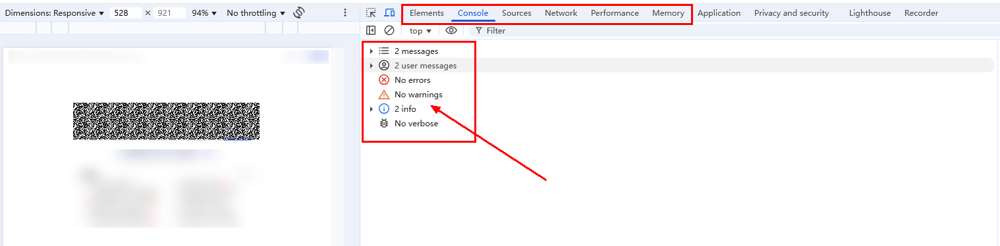

# Troubleshooting White Screen Issues on Web Pages
<!--Kit: ArkWeb-->
<!--Subsystem: Web-->
<!--Owner: @yp99ustc-->
<!--Designer: @LongLie-->
<!--Tester: @ghiker-->
<!--Adviser: @HelloCrease-->

There are many reasons for white screen issues on web pages. This topic describes how to troubleshoot common white screen issues.

1. Check the permissions and network status.
2. Locate the error type (cross-origin issues, 404 errors, or JS exceptions) by referring to [Debugging Frontend Pages by Using DevTools](web-debugging-with-devtools.md).
3. In complex layout scenarios, check the rendering mode and component constraints.
4. Handle the compatibility problem of the HTML5 code.
5. Check the keywords related to the lifecycle and network loading in the log.

## Checking Permissions and Network Status
If the network or file access permission is not added for the application, or the network status of the device is poor, the **Web** component will fail to be loaded or page elements will be missing, resulting in a white screen.
* Check the network status of the device, including whether the device is connected to the network and whether the built-in browser of the device can access web pages.
* Ensure that the network permission **ohos.permission.INTERNET** is added to the application (mandatory for accessing online pages).
  ```
  // Add the required permission in module.json5.
  "requestPermissions":[
     {
        "name" : "ohos.permission.INTERNET"
     }
  ]
  ```
* The following table lists attributes used to enable related permissions.
    | Name  | Description |                       
    | ----   | -------------------------------- |
    | [domStorageAccess](../reference/apis-arkweb/arkts-basic-components-web-attributes.md#domstorageaccess) | Sets whether to enable the local storage. If this permission is not enabled, local storage cannot be used to store data, any code that calls local storage will become invalid, and functionalities that depend on local storage will be abnormal.|
    | [fileAccess](../reference/apis-arkweb/arkts-basic-components-web-attributes.md#fileaccess) | Sets whether to enable the file read/write functionality. If the file read/write functionality is not enabled, the file-dependent modules will crash.| 
    | [imageAccess](../reference/apis-arkweb/arkts-basic-components-web-attributes.md#imageaccess) | Sets whether to enable automatic image loading.| 
    | [onlineImageAccess](../reference/apis-arkweb/arkts-basic-components-web-attributes.md#onlineimageaccess) | Sets whether to enable online image loading (through HTTP and HTTPS).|
    | [javaScriptAccess](../reference/apis-arkweb/arkts-basic-components-web-attributes.md#javascriptaccess) | Sets whether to enable JavaScript script execution.| 


  ```ts
  // xxx.ets
  import { webview } from '@kit.ArkWeb';

  @Entry
  @Component
  struct WebComponent {
    controller: webview.WebviewController = new webview.WebviewController();

    build() {
      Column() {
        Web({ src: 'www.example.com', controller: this.controller })
          .domStorageAccess(true)
          .fileAccess(true)
          .imageAccess(true)
          .onlineImageAccess(true)
          .javaScriptAccess(true)
      }
    }
  }
  ```
* Modify the [UserAgent](../reference/apis-arkweb/arkts-apis-webview-WebviewController.md#setcustomuseragent10) and check whether the page is restored.

  ```ts
  // xxx.ets
  import { webview } from '@kit.ArkWeb';
  import { BusinessError } from '@kit.BasicServicesKit';

  @Entry
  @Component
  struct WebComponent {
    controller: webview.WebviewController = new webview.WebviewController();
    @State customUserAgent: string = ' DemoApp';

    build() {
      Column() {
        Web({ src: 'www.example.com', controller: this.controller })
        .onControllerAttached(() => {
          console.info("onControllerAttached");
          try {
            let userAgent = this.controller.getUserAgent() + this.customUserAgent;
            this.controller.setCustomUserAgent(userAgent);
          } catch (error) {
            console.error(`ErrorCode: ${(error as BusinessError).code},  Message: ${(error as BusinessError).message}`);
          }
        })
      }
    }
  }
  ```
## Debugging Pages by Using DevTools
If a white screen issue persists after the network and permission configurations are correctly configured, use DevTools to debug the frontend page and listen for the web-related error reporting APIs to locate the error type.

1. Check the error information on the console to locate the resource loading failure. If resource loading fails, page elements may be missing, the layout may be disordered, and images and animations may become invalid. In severe cases, the rendering process may break down and the white screen issue may occur. As shown in the figure, check the following items in sequence:<br>
  (1) Whether the elements are complete and whether the HTML elements and structure are correct.<br> (2) Whether there are errors reported on the console.<br>(3) Whether the resource loading time is long.<br>
   

2. Check the console to see if there are any exceptions caused by the Mixed Content policy or CORS policy, or JS errors. For details, see [Resolving Cross-Origin Resource Access](web-cross-origin.md). For security purposes, the ArkWeb kernel does not allow the file and resource protocols to access cross-origin requests. As such, the **Web** component blocks such accesses when loading local offline resources. When **Web** components cannot access local cross-origin resources, the DevTools console displays the following error message:
    ```
    Access to script at 'xxx' from origin 'xxx' has been blocked by CORS policy: Cross origin requests are only supported for protocol schemes:   http, arkweb, data, chrome-extension, chrome, https, chrome-untrusted.
    ```
    You can use either of the following methods to solve the problem:
  
    Method 1

      Use HTTP or HTTPS instead of the file or resource protocol to ensure that **Web** components can successfully access cross-origin resources. Customize URL domain names for individuals or organizations to prevent conflicts with actual domain names on the Internet. In addition, use the [onInterceptRequest](../reference/apis-arkweb/arkts-basic-components-web-events.md#oninterceptrequest9) method of the **Web** component to intercept and replace local resources.

      The following uses an example to describe how to use HTTP or HTTPS to access local cross-origin resources. The **index.html** and **js/script.js** files are stored in the **rawfile** directory of the project. When the resource protocol is used to access the **index.html** file, the **js/script.js** file is intercepted due to cross-origin access and cannot be loaded. In the example, the domain name **https:\//www\.example.com/** is used to replace the original resource protocol, and the **onInterceptRequest** API is used to replace the resource to ensure that the **js/script.js** file can be successfully loaded. In this way, the cross-origin interception problem is solved.
    ```ts
    // main/ets/pages/Index.ets
    import { webview } from '@kit.ArkWeb';

    @Entry
    @Component
    struct Index {
      @State message: string = 'Hello World';
      webviewController: webview.WebviewController = new webview.WebviewController();
      // Construct a mapping table between domain names and local files.
      schemeMap = new Map([
        ["https://www.example.com/index.html", "index.html"],
        ["https://www.example.com/js/script.js", "js/script.js"],
      ])
      // Construct the local file and the return value format mimeType.
      mimeTypeMap = new Map([
        ["index.html", 'text/html'],
        ["js/script.js", "text/javascript"]
      ])

      build() {
        Row() {
          Column() {
            // For the local index.html file, use HTTP or HTTPS in place of file or resource as the protocol and construct a custom domain name.
            // In this example, www.example.com is constructed.
            Web({ src: "https://www.example.com/index.html", controller: this.webviewController })
              .javaScriptAccess(true)
              .fileAccess(true)
              .domStorageAccess(true)
              .geolocationAccess(true)
              .width("100%")
              .height("100%")
              .onInterceptRequest((event) => {
                if (!event) {
                  return;
                }
                // Search for the local offline resource to be loaded, and then intercept and replace the resource.
                if (this.schemeMap.has(event.request.getRequestUrl())) {
                  let rawfileName: string = this.schemeMap.get(event.request.getRequestUrl())!;
                  let mimeType = this.mimeTypeMap.get(rawfileName);
                  if (typeof mimeType === 'string') {
                    let response = new WebResourceResponse();
                    // Construct the response data. If the local file is in rawfile, you can set the response data as follows:
                    response.setResponseData($rawfile(rawfileName));
                    response.setResponseEncoding('utf-8');
                    response.setResponseMimeType(mimeType);
                    response.setResponseCode(200);
                    response.setReasonMessage('OK');
                    response.setResponseIsReady(true);
                    return response;
                  }
                }
                return null;
              })
          }
          .width('100%')
        }
        .height('100%')
      }
    }
    ```

    ```html
    <!-- main/resources/rawfile/index.html -->
    <html>
    <head>
  	  <meta name="viewport" content="width=device-width,initial-scale=1">
    </head>
    <body>
    <script crossorigin src="./js/script.js"></script>
    </body>
    </html>
    ```

    ```js
    // main/resources/rawfile/js/script.js
    const body = document.body;
    const element = document.createElement('div');
    element.textContent = 'success';
    body.appendChild(element);
    ```

    Method 2

    Use [setPathAllowingUniversalAccess](../reference/apis-arkweb/arkts-apis-webview-WebviewController.md#setpathallowinguniversalaccess12) to set a path list for allowing cross-origin access to local files using the file protocol. Note that only the resources in the path list can be accessed by the file protocol when this method is used. In this case, the behavior of [fileAccess](../reference/apis-arkweb/arkts-basic-components-web-attributes.md#fileaccess) is overwritten. The paths in the list should be any of the following directories:

    1. The application file directory and its subdirectories, which can be obtained through [Context.filesDir](../reference/apis-ability-kit/js-apis-inner-application-context.md#context), such as:

    * /data/storage/el2/base/files/example
    * /data/storage/el2/base/haps/entry/files/example

    2. The application resource directory and its subdirectories, which can be obtained through [Context.resourceDir](../reference/apis-ability-kit/js-apis-inner-application-context.md#context), such as:

    * /data/storage/el1/bundle/entry/resource/resfile
    * /data/storage/el1/bundle/entry/resource/resfile/example

    3. Since API version 21, the application cache directory is obtained through [Context.cacheDir](../reference/apis-ability-kit/js-apis-inner-application-context.md#context). Example subdirectories are as follows:

    * /data/storage/el2/base/cache
    * /data/storage/el2/base/haps/entry/cache/example
    * The **cache/web** directory is not allowed. If it is included, an exception with the code **401** will be thrown. If the **cache** directory is set, **cache/web** cannot be accessed.

    4. Since API version 21, the application temporary directory is obtained through [Context.tempDir](../reference/apis-ability-kit/js-apis-inner-application-context.md#context). Example subdirectories are as follows:

    * /data/storage/el2/base/temp
    * /data/storage/el2/base/haps/entry/temp/example

    If a path is not any of the preceding paths, an error code 401 is reported and the path list fails to be set. If the path list is empty, the access scope of the file protocol complies with the [fileAccess](../reference/apis-arkweb/arkts-basic-components-web-attributes.md#fileaccess) rule. The following is an example:

    ```ts
    // main/ets/pages/Index.ets
    import { webview } from '@kit.ArkWeb';
    import { BusinessError } from '@kit.BasicServicesKit';

    @Entry
    @Component
    struct WebComponent {
      controller: WebviewController = new webview.WebviewController();
      uiContext: UIContext = this.getUIContext();

      build() {
        Row() {
          Web({ src: "", controller: this.controller })
            .onControllerAttached(() => {
              try {
                // Set the list of paths that allow cross-origin access.
                this.controller.setPathAllowingUniversalAccess([
                  this.uiContext.getHostContext()!.resourceDir,
                  this.uiContext.getHostContext()!.filesDir + "/example"
                ])
                this.controller.loadUrl("file://" + this.uiContext.getHostContext()!.resourceDir + "/index.html")
              } catch (error) {
                console.error(`ErrorCode: ${(error as BusinessError).code}, Message: ${(error as BusinessError).message}`);
              }
            })
            .javaScriptAccess(true)
            .fileAccess(true)
            .domStorageAccess(true)
        }
      }
    }
    ```

    ```html
    <!-- main/resources/resfile/index.html -->
    <!DOCTYPE html>
    <html lang="en">

    <head>
        <meta charset="utf-8">
        <title>Demo</title>
        <meta name="viewport" content="width=device-width, initial-scale=1, user-scalable=no,   viewport-fit=cover">
        <script>
  		  function getFile() {
  			  var file = "file:///data/storage/el1/bundle/entry/resources/resfile/js/script.js";
          // Use the file protocol to access the local JS file through XMLHttpRequest.
  			  var xmlHttpReq = new XMLHttpRequest();
  			  xmlHttpReq.onreadystatechange = function(){
  			      console.info("readyState:" + xmlHttpReq.readyState);
  			      console.info("status:" + xmlHttpReq.status);
  				  if(xmlHttpReq.readyState == 4){
  				      if (xmlHttpReq.status == 200) {
                    // If the path list is set on eTS, resources can be obtained.
  				          const element = document.getElementById('text');
                            element.textContent = "load " + file + " success";
  				      } else {
                    // If the path list is not set on eTS, a CORS error is triggered.
  				          const element = document.getElementById('text');
                            element.textContent = "load " + file + " failed";
  				      }
  				  }
  			  }
  			  xmlHttpReq.open("GET", file);
  			  xmlHttpReq.send(null);
  		  }
        </script>
    </head>

    <body>
    <div class="page">
        <button id="example" onclick="getFile()">loadFile</button>
    </div>
    <div id="text"></div>
    </body>

    </html>
    ```

    ```javascript
    // main/resources/resfile/js/script.js
    const body = document.body;
    const element = document.createElement('div');
    element.textContent = 'success';
    body.appendChild(element);
    ```

3. Check whether error reporting APIs, such as **onErrorReceive**, **onHttpErrorReceive**, **onSslErrorEvent**, **onHttpAuthRequest**, and **onClientAuthenticationRequest**, are called. Rectify the fault based on the returned error code and [The List of ArkWeb Network Protocol Stack Errors](../reference/apis-arkweb/arkts-apis-netErrorList.md).

    | Name  | Description |                       
    | ----   | -------------------------------- |
    | [onErrorReceive](../reference/apis-arkweb/arkts-basic-components-web-events.md#onerrorreceive) | Called when resources fail to be loaded. For example, 302 (**UNKNOWN_URL_SCHEME**) is reported when a scheme that is not supported by the kernel is accessed.|
    | [onHttpErrorReceive](../reference/apis-arkweb/arkts-basic-components-web-events.md#onhttperrorreceive) | Called when the server returns an HTTP error code, which requires joint commissioning with the server.| 
    | [onHttpAuthRequest](../reference/apis-arkweb/arkts-basic-components-web-events.md#onhttpauthrequest9) | Called when the server returns 407, indicating that the device needs to provide the user name and password for authentication. If the processing is incorrect, the loading may be abnormal and a white screen may occur.| 
    | [onClientAuthenticationRequest](../reference/apis-arkweb/arkts-basic-components-web-events.md#onclientauthenticationrequest9) | Called when the server requests a certificate from the device. If the request is not processed correctly, the page loading will be abnormal.| 
    | [onSslErrorEvent](../reference/apis-arkweb/arkts-basic-components-web-events.md#onsslerrorevent12) | Called when the certificate is incorrect. The application needs to locate the fault based on the certificate error information.  | 


## Resolving White Screen Issues Caused by Complex Layout and Rendering Modes
If a page uses a complex layout or rendering mode, pay attention to its application scenarios and constraints. Improper use of the layout or rendering mode may cause layout disorder or white screen.
The **Web** component provides two rendering modes, which can be adapted to different container sizes as required. For details, see [Rendering Modes of the Web Component](web-render-mode.md). Pay attention to the following points:
- In asynchronous rendering mode (renderMode: [RenderMode](../reference/apis-arkweb/arkts-basic-components-web-e.md#rendermode12).ASYNC_RENDER), the width and height of a **Web** component cannot exceed 7,680 px (physical pixels). Otherwise, a white screen is displayed.

The **Web** component provides the capability of adapting to the page layout. For details, see [Fitting In the Page Content Layout](web-fit-content.md). Pay attention to the following restrictions when using the capability:
- Set the synchronous rendering mode through **webSetting({renderingMode: WebRenderingMode.SYNCHRONOUS})**.
- Disable the scrolling effect through **webSetting({overScrollMode: OverScrollMode.NEVER})**.
- Do not dynamically adjust the component height in this mode to ensure that the page height is fixed.
- Do not enable the **RESIZE_CONTENT** attribute in **FIT_CONTENT** mode to avoid layout invalidation.
- If the CSS **height: <number& > vh** is conflict with the **Web** component size adaptation page layout, check whether **height: vh** is the first CSS height style from the body node. As shown in the following example. The height of the DOM node whose ID is 2 is 0, causing a white screen.

  ```
  <body>
    <div id = "1">
      <div id = "2" style = "height: 100vh">Child DOM</div>
      <div id = "3" style = "height: 20px">Child DOM</div>
    </div>
  </body>
  ```
  The reference solution to the white screen problem is as follows:
  - Use a specific height style for the child DOM to extend the parent element.
    ```
    <body>
      <div id = "1">
        <div id = "2"><div style = "height: 20px"><div/></div>
        <div id = "3" style = "height: 20px">Child DOM</div>
      </div>
    </body>
    ```
  - Use the actual height style for the parent element.
    ```
    <body>
      <div id = "1">
        <div id = "2" style = "height: 20px">Child DOM</div>
        <div id = "3" style = "height: 20px">Child DOM</div>
      </div>
    </body>
    ```

## Handling the Compatibility of HTML5 Code
To avoid white screen issues, you can handle the compatibility issue as follows:
* Intercept special protocols.
* If a white screen is displayed due to the **tel:** or **mailto:** protocol invoked by the HTML5 page, intercept the protocol and invoke the system dialing capability through **onInterceptRequest**.
   ```c
   .onInterceptRequest((event) => {
       if (event.request.url.startsWith('tel:')) {
           // Invoke the system dialing capability.
           call.makeCall({ phoneNumber: '123456' });
           return { responseCode: 404 }; // Prevent the default behavior.
       }
       return null;  
   })
   ```
## Monitoring Memory and Lifecycle
If the memory usage reaches the threshold, the rendering process will be terminated, causing a white screen. Similarly, a white screen will occur if the rendering process fails to start or is abnormally terminated. You can check the cause in logs. For example, check whether the **Web** component is correctly bound to the **WebController** or whether the white screen occurs because the **Web** component is released too early. Check the information related to the render process in the log, for example, whether a memory leak causes insufficient rendering memory. The keyword **MEMORY_PRESSURE_LEVEL_CRITICAL** indicates that the memory usage has reached the threshold. In this case, the web page may encounter exceptions such as black screen, artifacts, or flicker. You need to check whether a memory leak occurs, and whether the render process starts successfully or exits abnormally.

The following table lists log keywords and the corresponding descriptions.

| Keyword  | Description |                       
| ----   | -------------------------------- |
| StartRenderProcess failed | The rendering process fails to be started.|
| MEMORY_PRESSURE_LEVEL_CRITICAL | The device memory pressure reaches the threshold. If the device continues to be used, a black screen, screen flickering, or white screen may occur.|
| crashpad SandboxedHandler::HandlerCrash, received signo = xxx | The render process crashes, causing problems such as white screen and **Web** component suspension.|
| SharedContextState context lost via Skia OOM | The shared memory is insufficient, which may cause the application to crash, produce artifacts, or become suspended.
| CreateNativeViewGLSurfaceEGLOhos::normal surface | The EGL surface is successfully created. If this log is not displayed, a white screen occurs.|
| INFO: request had no response within 5 seconds | Network timeout.|
| final url: ***, error_code xxx(net::ERR_XXX) | An error is reported during the main resource loading.|

The following figure shows the key points contained during the **Web** component loading process. The following table lists the log keywords during the **Web** component loading process.


| Keyword  | Description |                       
| ----   | -------------------------------- |
| NWebRenderMain start  | The child process starts.|
| RendererMain startup,<br> render thread init | The child process initialization starts.|
| event_message: WillProcessNavigationResponse source_id xxx navigation_handle id: xxx| The response of the main resource is received.|
| event_message: commit navigation in main frame, routing_id: 4, url: *** | The navigation is committed to the child process.
| RenderFrameImpl::CommitNavigation,<br> event_message: page load start | The child process receives the commit message.|
| NWebHandlerDelegate::OnNavigationEntryCommitted,<br> event_message: Commit source_id xxx | The main process receives **DidCommitNavigation**.|
| event_message: load_timing_info errpr_code:0,...| The main resource loading is complete, and the time required for each phase is displayed.|
| event_message: MarkFirstContentfulPaint| The tag identifies an element with displayable content.|
| NWebHandlerDelegate::OnPageVisible| The first frame is displayed.|
| NWebHandlerDelegate::OnFirstContentfulPaint| The first frame content is displayed.|
| event_message: content load finished | The page content parsing is complete.|
| event_message: page load finished,<br> NWebHandlerDelegate::OnLoadEnd,<br> NWebHandlerDelegate::MainFrame OnLoadEnd,<br> NWebHandlerDelegate::OnFirstMeaningfulPaint | The page and sub-resources are loaded.|
