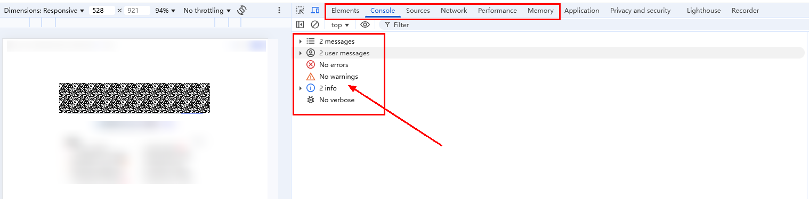
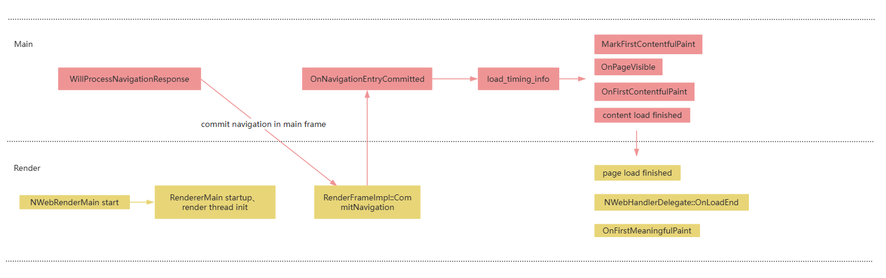

# Troubleshooting White Screen Issues on Web Pages

<!--Kit: ArkWeb-->
<!--Subsystem: Web-->
<!--Owner: @pxlstrong-->
<!--Designer: @dzichou-->
<!--Tester: @ghiker-->
<!--Adviser: @HelloShuo-->
<!-- md-trans-meta sourceCommit=72ccdda7a546195e184c31b0386f3d1471ff4b28 translatedAt=2026-08-14T03:52:29.676Z pushedAt=2026-08-14T10:18:10.396Z -->

There are many reasons for white screen issues on web pages. This topic describes how to troubleshoot common white screen issues.

1. Check the permissions and network status.

2. Locate the error type (cross-origin issues, 404 errors, or JS exceptions) by referring to [Debugging Frontend Pages by Using DevTools](web-debugging-with-devtools.md).

3. In complex layout scenarios, check the rendering mode and component constraints.

4. Handle the compatibility problem of the HTML5 code.

5. Check the keywords related to the lifecycle and network loading in the log.

6. Check whether the [Secure Shield mode](./web-secure-shield-mode.md) is enabled. For details about the restrictions after the Secure Shield mode is enabled, see [HTML5 Features Restricted by ArkWeb](./web-secure-shield-mode.md#html5-features-restricted-by-arkweb)

7. Check for white screen caused by inconsistent WebView cache negotiation. For details, see [White Screen Caused by Inconsistent Cache Negotiation and Server-Side Resource Update in WebView Default Cache Mode](#white-screen-caused-by-inconsistent-cache-negotiation-and-server-side-resource-update-in-webview-default-cache-mode).

## Checking Permissions and Network Status

If the network or file access permission is not added for the application, or the network status of the device is poor, the **Web** component will fail to be loaded or page elements will be missing, resulting in a white screen.

* Check the network status of the device, including whether the device is connected to the network and whether the built-in browser of the device can access web pages.

* Ensure that the network permission **ohos.permission.INTERNET** is added to the application (mandatory for accessing online pages).

    <!-- @[INTERNET](https://gitcode.com/openharmony/applications_app_samples/blob/master/code/DocsSample/ArkWeb/WebWriteScreenIssue/entry/src/main/module.json5) -->

    ``` JSON5
    "requestPermissions":[
      {
        "name" : "ohos.permission.INTERNET"
      }
    ],
    ```

* The following table lists attributes used to enable related permissions.

    | Name  | Description |
    | ----   | -------------------------------- |
    | [domStorageAccess](../reference/apis-arkweb/arkts-basic-components-web-attributes.md#domstorageaccess) | Sets whether to enable the permission for the Document Object Model Storage API (DOM Storage API). If it is disabled, data cannot be stored using localStorage, any code that calls localStorage becomes invalid, and features that depend on local storage will behave abnormally. |
    | [fileAccess](../reference/apis-arkweb/arkts-basic-components-web-attributes.md#fileaccess) | Sets whether to enable access to the file system in the app. If it is disabled, file read and write operations are completely blocked, and modules that depend on files will crash. |
    | [imageAccess](../reference/apis-arkweb/arkts-basic-components-web-attributes.md#imageaccess) | Sets whether to enable automatic image loading.|
    | [onlineImageAccess](../reference/apis-arkweb/arkts-basic-components-web-attributes.md#onlineimageaccess) | Sets whether to enable online image loading (through HTTP and HTTPS).|
    | [javaScriptAccess](../reference/apis-arkweb/arkts-basic-components-web-attributes.md#javascriptaccess) | Sets whether to enable JavaScript script execution.|

    <!-- @[OpenPermissions](https://gitcode.com/openharmony/applications_app_samples/blob/master/code/DocsSample/ArkWeb/WebWriteScreenIssue/entry/src/main/ets/pages/OpenPermissions.ets) -->

    ``` TypeScript
    import { webview } from '@kit.ArkWeb';
    
    @Entry
    @Component
    struct WebComponent {
      controller: webview.WebviewController = new webview.WebviewController();
    
      build() {
        Column() {
          Web({ src: 'www.example.com', controller: this.controller })
            .domStorageAccess(true)
            .fileAccess(true)
            .imageAccess(true)
            .onlineImageAccess(true)
            .javaScriptAccess(true)
        }
      }
    }
    ```

* Modify the [UserAgent](../reference/apis-arkweb/arkts-apis-webview-WebviewController.md#setcustomuseragent10) and check whether the page is restored.

    <!-- @[ChangeUserAgent](https://gitcode.com/openharmony/applications_app_samples/blob/master/code/DocsSample/ArkWeb/WebWriteScreenIssue/entry/src/main/ets/pages/ChangeUserAgent.ets) -->

    ``` TypeScript
    import { webview } from '@kit.ArkWeb';
    import { BusinessError } from '@kit.BasicServicesKit';
    
    @Entry
    @Component
    struct WebComponent {
      controller: webview.WebviewController = new webview.WebviewController();
      @State customUserAgent: string = ' DemoApp';
    
      build() {
        Column() {
          Web({ src: 'www.example.com', controller: this.controller })
            .onControllerAttached(() => {
              console.info('onControllerAttached');
              try {
                let userAgent = this.controller.getUserAgent() + this.customUserAgent;
                this.controller.setCustomUserAgent(userAgent);
              } catch (error) {
                console.error(`ErrorCode: ${(error as BusinessError).code},  Message: ${(error as BusinessError).message}`);
              }
            })
        }
      }
    }
    ```

## Debugging Pages by Using DevTools

If a white screen issue persists after the network and permission configurations are correctly configured, use DevTools to debug the frontend page and listen for the web-related error reporting APIs to locate the error type.

1. Check the error information on the console to locate the resource loading failure. If resource loading fails, page elements may be missing, the layout may be disordered, and images and animations may become invalid. In severe cases, the rendering process may break down and the white screen issue may occur. As shown in the figure, check the following items in sequence:<br>

  (1) Whether the elements are complete and whether the HTML elements and structure are correct.<br> (2) Whether there are errors reported on the console.<br>(3) Whether the resource loading time is long.<br>
   

2. Check the console to see if there are any exceptions caused by the Mixed Content policy or CORS policy, or JS errors. For details, see [Resolving Cross-Origin Resource Access](web-cross-origin.md). For security purposes, the ArkWeb kernel does not allow the file and resource protocols to access cross-origin requests. As such, the **Web** component blocks such accesses when loading local offline resources. When **Web** components cannot access local cross-origin resources, the DevTools console displays the following error message:

    ```txt
    Access to script at 'xxx' from origin 'xxx' has been blocked by CORS policy: Cross origin requests are only supported for protocol schemes:   http, arkweb, data, chrome-extension, chrome, https, chrome-untrusted.
    ```

    You can use either of the following methods to solve the problem:

    Method 1

      Use HTTP or HTTPS instead of the file or resource protocol to ensure that **Web** components can successfully access cross-origin resources. The replacement URL domain name must be custom-built and used only by individuals or organizations to prevent conflicts with actual domain names on the internet. In addition, use the [onInterceptRequest](../reference/apis-arkweb/arkts-basic-components-web-events.md#oninterceptrequest9) method of the **Web** component to intercept and replace local resources accordingly.

      The following uses an example to describe how to use protocols such as HTTP or HTTPS to resolve the failure to access local cross-origin resources. The **index.html** and **js/script.js** files are stored in the **rawfile** directory of the project. When **index.html** is accessed via the resource protocol, the **js/script.js** file is blocked due to cross-origin access and cannot be loaded. In the example, the original resource protocol is replaced with the https:\//www\.example.com/ domain name, and the onInterceptRequest API is used to replace resources, ensuring that the **js/script.js** file can be loaded successfully and thereby resolving the cross-origin blocking issue.

    ```ts
    // main/ets/pages/Index.ets
    import { webview } from '@kit.ArkWeb';

    @Entry
    @Component
    struct Index {
      @State message: string = 'Hello World';
      webviewController: webview.WebviewController = new webview.WebviewController();
      // Construct a mapping table between domain names and local files.
      schemeMap = new Map([
        ["https://www.example.com/index.html", "index.html"],
        ["https://www.example.com/js/script.js", "js/script.js"],
      ])
      // Construct the local file and the return value format mimeType.
      mimeTypeMap = new Map([
        ["index.html", 'text/html'],
        ["js/script.js", "text/javascript"]
      ])

      build() {
        Row() {
          Column() {
            // For the local index.html, use the HTTP or HTTPS protocol instead of the file or resource protocol, and construct a domain name of your own.
            // In this example, www.example.com is constructed.
            Web({ src: "https://www.example.com/index.html", controller: this.webviewController })
              .javaScriptAccess(true)
              .fileAccess(true)
              .domStorageAccess(true)
              .geolocationAccess(true)
              .width("100%")
              .height("100%")
              .onInterceptRequest((event) => {
                if (!event) {
                  return;
                }
                // Search for the local offline resource to be loaded, and then intercept and replace the resource.
                if (this.schemeMap.has(event.request.getRequestUrl())) {
                  let rawfileName: string = this.schemeMap.get(event.request.getRequestUrl())!;
                  let mimeType = this.mimeTypeMap.get(rawfileName);
                  if (typeof mimeType === 'string') {
                    let response = new WebResourceResponse();
                    // Construct the response data. If the local file is in rawfile, you can set the response data as follows:
                    response.setResponseData($rawfile(rawfileName));
                    response.setResponseEncoding('utf-8');
                    response.setResponseMimeType(mimeType);
                    response.setResponseCode(200);
                    response.setReasonMessage('OK');
                    response.setResponseIsReady(true);
                    return response;
                  }
                }
                return null;
              })
          }
          .width('100%')
        }
        .height('100%')
      }
    }
    ```

    ```html
    <!-- main/resources/rawfile/index.html -->
    <!DOCTYPE html>
    <html>
    <head>
      <meta name="viewport" content="width=device-width,initial-scale=1">
    </head>
    <body>
      <script crossorigin src="./js/script.js"></script>
    </body>
    </html>
    ```

    ```js
    // main/resources/rawfile/js/script.js
    const body = document.body;
    const element = document.createElement('div');
    element.textContent = 'success';
    body.appendChild(element);
    ```

    Method 2

    Use [setPathAllowingUniversalAccess](../reference/apis-arkweb/arkts-apis-webview-WebviewController.md#setpathallowinguniversalaccess12) to set a path list. When resources in the list are accessed via the file protocol, cross-origin access to local files is allowed. In addition, once the path list is set, the file protocol can access only the resources in the list (in this case, the behavior of [fileAccess](../reference/apis-arkweb/arkts-basic-components-web-attributes.md#fileaccess) is overridden by the behavior of this API).

    Using setPathAllowingUniversalAccess to open cross-origin access restrictions for directories is a high-risk operation. Based on the principle of least privilege, the paths opened for el1 and el2 are fixed, and the paths in the path list must conform to one of the following path formats:

    1. The application file directory is obtained through [Context.filesDir](../reference/apis-ability-kit/js-apis-inner-application-context.md#properties). Example subdirectories are as follows:

       * /data/storage/el2/base/files/example

       * /data/storage/el2/base/haps/entry/files/example

    2. The application resource directory is obtained through [Context.resourceDir](../reference/apis-ability-kit/js-apis-inner-application-context.md#properties). Example subdirectories are as follows:

       * /data/storage/el1/bundle/entry/resources/resfile

       * /data/storage/el1/bundle/entry/resources/resfile/example

    3. Since API version 21, the application cache directory is obtained through [Context.cacheDir](../reference/apis-ability-kit/js-apis-inner-application-context.md#properties). Example subdirectories are as follows:

       * /data/storage/el2/base/cache

       * /data/storage/el2/base/haps/entry/cache/example

       * The **cache/web** directory is not allowed in the set directory path. Otherwise, an exception with the code **401** is thrown. If the set directory path is **cache**, **cache/web** is also not allowed to be accessed.

    4. Since API version 21, the application temporary directory is obtained through [Context.tempDir](../reference/apis-ability-kit/js-apis-inner-application-context.md#properties). Example subdirectories are as follows:

       * /data/storage/el2/base/temp

       * /data/storage/el2/base/haps/entry/temp/example

    If a path is not any of the preceding paths, an error code 401 is reported and the path list fails to be set. If the path list is empty, the access scope of the file protocol complies with the [fileAccess](../reference/apis-arkweb/arkts-basic-components-web-attributes.md#fileaccess) rule. The following is an example:

    <!-- @[SetPath](https://gitcode.com/openharmony/applications_app_samples/blob/master/code/DocsSample/ArkWeb/WebWriteScreenIssue/entry2/src/main/ets/pages/SetPath.ets) -->

    ``` TypeScript
    import { webview } from '@kit.ArkWeb';
    import { BusinessError } from '@kit.BasicServicesKit';
    
    @Entry
    @Component
    struct WebComponent {
      controller: WebviewController = new webview.WebviewController();
      uiContext: UIContext = this.getUIContext();
    
      build() {
        Row() {
          Web({ src: '', controller: this.controller })
            .onControllerAttached(() => {
              try {
                // Set the list of paths that allow cross-origin access.
                this.controller.setPathAllowingUniversalAccess([
                  this.uiContext.getHostContext()!.resourceDir,
                  this.uiContext.getHostContext()!.filesDir + '/example'
                ])
                this.controller.loadUrl('file://' + this.uiContext.getHostContext()!.resourceDir + '/index.html')
              } catch (error) {
                console.error(`ErrorCode: ${(error as BusinessError).code}, Message: ${(error as BusinessError).message}`);
              }
            })
            .javaScriptAccess(true)
            .fileAccess(true)
            .domStorageAccess(true)
        }
      }
    }
    ```

    HTML sample code:

    ```html
    <!-- main/resources/resfile/index.html -->
    <!DOCTYPE html>
    <html lang="en">

    <head>
        <meta charset="utf-8">
        <title>Demo</title>
        <meta name="viewport" content="width=device-width, initial-scale=1, user-scalable=no, viewport-fit=cover">
        <script>
            function getFile() {
              var file = "file:///data/storage/el1/bundle/entry/resources/resfile/js/script.js";
              // Use the file protocol to access the local JS file through XMLHttpRequest.
              var xmlHttpReq = new XMLHttpRequest();
              xmlHttpReq.onreadystatechange = function(){
              console.info("readyState:" + xmlHttpReq.readyState);
              console.info("status:" + xmlHttpReq.status);
              if(xmlHttpReq.readyState == 4){
                if (xmlHttpReq.status == 200) {
                   // If the path list is set on eTS, resources can be obtained.
                  const element = document.getElementById('text');
                  element.textContent = "load " + file + " success";
                } else {
                    // If the path list is not set on eTS, a CORS error is triggered.
                    const element = document.getElementById('text');
                    element.textContent = "load " + file + " failed";
                  }
              }
            }
            xmlHttpReq.open("GET", file);
            xmlHttpReq.send(null);
          }
        </script>
    </head>

    <body>
      <div class="page">
          <button id="example" onclick="getFile()">loadFile</button>
      </div>
    <div id="text"></div>
    </body>

    </html>
    ```

    ```javascript
    // main/resources/resfile/js/script.js
    const body = document.body;
    const element = document.createElement('div');
    element.textContent = 'success';
    body.appendChild(element);
    ```

3. Check whether error reporting APIs, such as **onErrorReceive**, **onHttpErrorReceive**, **onSslErrorEvent**, **onHttpAuthRequest**, and **onClientAuthenticationRequest**, are called. Rectify the fault based on the returned error code and [The List of ArkWeb Network Protocol Stack Errors](../reference/apis-arkweb/arkts-apis-netErrorList.md).

    | Name  | Description |                       
    | ----   | -------------------------------- |
    | [onErrorReceive](../reference/apis-arkweb/arkts-basic-components-web-events.md#onerrorreceive) | Called when resources fail to be loaded. For example, 302 (**UNKNOWN_URL_SCHEME**) is reported when a scheme that is not supported by the kernel is accessed.|
    | [onHttpErrorReceive](../reference/apis-arkweb/arkts-basic-components-web-events.md#onhttperrorreceive) | Called when the server returns an HTTP error code, which requires joint commissioning with the server.| 
    | [onHttpAuthRequest](../reference/apis-arkweb/arkts-basic-components-web-events.md#onhttpauthrequest9) | Called when the server returns 407, indicating that the device needs to provide the user name and password for authentication. If the processing is incorrect, the loading may be abnormal and a white screen may occur.| 
    | [onClientAuthenticationRequest](../reference/apis-arkweb/arkts-basic-components-web-events.md#onclientauthenticationrequest9) | Called when the server requests a certificate from the device. If the request is not processed correctly, the page loading will be abnormal.| 
    | [onSslErrorEvent](../reference/apis-arkweb/arkts-basic-components-web-events.md#onsslerrorevent12) | Called when the certificate is incorrect. The application needs to locate the fault based on the certificate error information.  | 

## Resolving White Screen Issues Caused by Complex Layout and Rendering Modes

If a page uses a complex layout or rendering mode, pay attention to its application scenarios and constraints. Improper use of the layout or rendering mode may cause layout disorder or white screen.

The **Web** component provides two rendering modes, which can be adapted to different container sizes as required. For details, see [Rendering Modes of the Web Component](web-render-mode.md). Pay attention to the following points:

- In asynchronous rendering mode (renderMode: [RenderMode](../reference/apis-arkweb/arkts-basic-components-web-e.md#rendermode12).ASYNC_RENDER), the width and height of a **Web** component cannot exceed 7,680 px (physical pixels). Otherwise, a white screen is displayed.

The **Web** component provides the capability of adapting to the page layout. For details, see [Fitting In the Page Content Layout](web-fit-content.md). Pay attention to the following restrictions when using the capability:

- Set the synchronous rendering mode through **webSetting({renderingMode: WebRenderingMode.SYNCHRONOUS})**.

- Disable the scrolling effect through **webSetting({overScrollMode: OverScrollMode.NEVER})**.

- Do not dynamically adjust the component height in this mode to ensure that the page height is fixed.

- Do not enable the **RESIZE_CONTENT** attribute in **FIT_CONTENT** mode to avoid layout invalidation.

- There is a calculation conflict between the CSS style `height: <number> vh` and the adaptive page layout of the **Web** component size. Check whether `height: <number> vh` is the first height CSS style within the body node. In the following structure, the height of the DOM node with the ID 2 will be 0, causing a white screen.

  ```html
  <body>
    <div id = "1">
      <div id = "2" style = "height: 100vh">Child DOM</div>
      <div id = "3" style = "height: 20px">Child DOM</div>
    </div>
  </body>
  ```

  The reference solution to the white screen problem is as follows:

  - Use a specific height style for the child DOM to extend the parent element.

    ```html
    <body>
      <div id = "1">
        <div id = "2"><div style = "height: 20px"><div/></div>
        <div id = "3" style = "height: 20px">Child DOM</div>
      </div>
    </body>
    ```

  - Use the actual height style for the parent element.

    ```html
    <body>
      <div id = "1">
        <div id = "2" style = "height: 20px">Child DOM</div>
        <div id = "3" style = "height: 20px">Child DOM</div>
      </div>
    </body>
    ```

## Handling the Compatibility of HTML5 Code

To avoid white screen issues, you can handle the compatibility issue as follows:

* Intercept special protocols.

* If a white screen is displayed due to the **tel:** or **mailto:** protocol invoked by the HTML5 page, intercept the protocol and invoke the system dialing capability through **onInterceptRequest**.

   ```ts
   .onInterceptRequest((event) => {
       if (event.request.getRequestUrl().startsWith('tel:')) {
           // Invoke the system dialing capability.
           call.makeCall('123456');
           let response = new WebResourceResponse();
           response.setResponseCode(404);
           return response; // Prevent the default behavior.
       }
       return null;  
   })
   ```

## Monitoring Memory and Lifecycle

When the memory reaches the threshold, the render process is terminated, causing a white screen. Similarly, a failure to create the render process or its abnormal destruction also causes a white screen. You can identify the cause from logs. Check whether the **Web** component is correctly bound to the WebviewController, or whether the white screen is caused by the premature release of the WebviewController. Pay attention to the information related to the render process in the logs: check whether there is a memory leak that causes insufficient render memory. The keyword "MEMORY_PRESSURE_LEVEL_CRITICAL" indicates that the memory has reached the threshold. In this case, the Web may encounter abnormal conditions such as a black screen, a blurred screen, or a flickering screen, and you need to check whether there is a memory leak. Check whether the render process is started successfully or exits abnormally.

The following table lists log keywords and the corresponding descriptions.

| Keyword  | Description |                       
| ----   | -------------------------------- |
| StartRenderProcess failed | The rendering process fails to be started.|
| MEMORY_PRESSURE_LEVEL_CRITICAL | The device memory pressure reaches the threshold. If the device continues to be used, a black screen, screen flickering, or white screen may occur.|
| crashpad SandboxedHandler::HandlerCrash, received signo = xxx | The render process crashes, causing problems such as white screen and **Web** component suspension.|
| SharedContextState context lost via Skia OOM | The shared memory is insufficient, which may cause the application to crash, produce artifacts, or become suspended.|
| CreateNativeViewGLSurfaceEGLOhos::normal surface | The EGL surface is successfully created. If this log is not displayed, a white screen occurs.|
| INFO: request had no response within 5 seconds | Network timeout.|
| final url: ***, error_code xxx(net::ERR_XXX) | An error is reported during the main resource loading.|

The following describes the key logs during the network loading process of the **Web** component. Under normal circumstances, the loading process of a **Web** component should contain these key nodes:



| Keyword  | Description |                       
| ----   | -------------------------------- |
| NWebRenderMain start  | The child process starts.|
| RendererMain startup,<br> render thread init | The child process initialization starts.|
| event_message: WillProcessNavigationResponse source_id xxx navigation_handle id: xxx| The response of the main resource is received.|
| event_message: commit navigation in main frame, routing_id: 4, url: *** | The navigation is committed to the child process.|
| RenderFrameImpl::CommitNavigation,<br> event_message: page load start | The child process receives the commit message.|
| NWebHandlerDelegate::OnNavigationEntryCommitted,<br> event_message: Commit source_id xxx | The main process receives **DidCommitNavigation**.|
| event_message: load_timing_info error_code:0,...| The main resource loading is complete, and the time required for each phase is displayed.|
| event_message: MarkFirstContentfulPaint| The tag identifies an element with displayable content.|
| NWebHandlerDelegate::OnPageVisible| The first frame is displayed.|
| NWebHandlerDelegate::OnFirstContentfulPaint| The first frame content is displayed.|
| event_message: content load finished | The page content parsing is complete.|
| event_message: page load finished,<br> NWebHandlerDelegate::OnLoadEnd,<br> NWebHandlerDelegate::MainFrame OnLoadEnd,<br> NWebHandlerDelegate::OnFirstMeaningfulPaint | The page and sub-resources are loaded.|

## White Screen During HTML5 Page Loading Due to Inconsistent Default WebView Loading Processes

**Symptom**

Loading H5 with WebView works normally on a phone, but a white screen occurs on a tablet, PC, or 2-in-1 device.

**Possible Causes**

The WebView on a tablet, PC, or 2-in-1 device uses multi-process loading by default, and iframe uses sub-process loading by default. After the main process is loaded, if the sub-process has not finished loading, a white screen occurs.

**Solution**

Use [setRenderProcessMode](../reference/apis-arkweb/arkts-apis-webview-WebviewController.md#setrenderprocessmode12) to set the WebView rendering mode to single-process loading.

   ```ts
   webview.WebviewController.setRenderProcessMode(webview.RenderProcessMode.SINGLE);
   ```

## White Screen Caused by Inconsistent Cache Negotiation and Server-Side Resource Update in WebView Default Cache Mode

**Symptom**

The web page is displayed normally in the system browser, but a white screen occurs when the page is loaded in the WebView of the app.

**Possible Causes**

The default cache mode `CacheMode.Default` of WebView prioritizes the use of the cache. When a resource exists in the cache, WebView automatically attaches the conditional request header `If-None-Match` (carrying the cached ETag value) based on the cached content in subsequent requests to perform cache negotiation validation with the server. When the server-side resource update causes the ETag to change, the conditional match fails and the server returns 412. After receiving 412, WebView does not automatically degrade and retry, but directly determines that the main resource loading has failed, resulting in a white screen.

**Solution**

Set the [cacheMode](../reference/apis-arkweb/arkts-basic-components-web-attributes.md#cachemode) attribute on the **Web** component to `CacheMode.Online` (that is, `.cacheMode(CacheMode.Online)`). In this mode, WebView sends an unconditional request to the server without carrying conditional headers based on the old cache (such as `If-None-Match`), forcibly fetches the latest resource from the network without using any cache, thereby bypassing the cache negotiation validation and preventing the main resource from failing to load due to negotiation failure, which would cause a white screen.