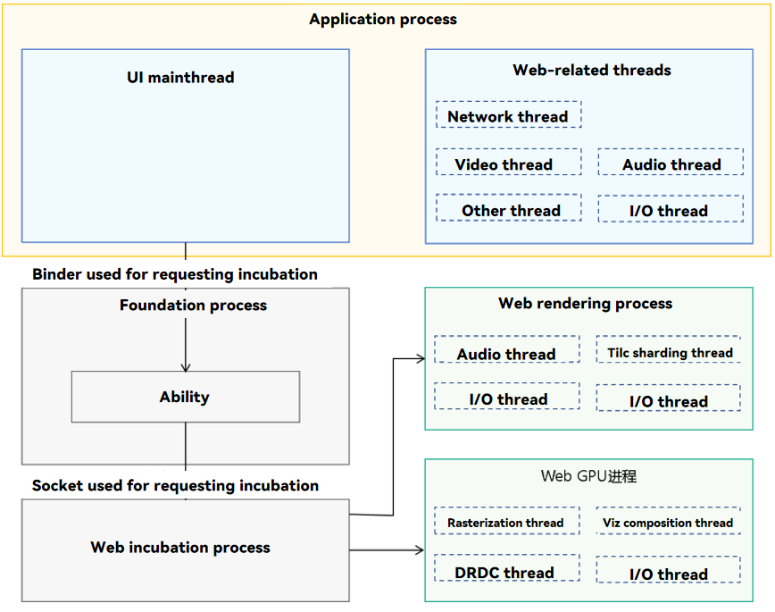

# ArkWeb Process

ArkWeb is a multi-process model, which consists of the application process, Web rendering process, Web GPU process, Web incubation process, and Foundation process.

> **NOTE**
>
> The Web kernel does not limit the allocated memory size. Theoretically, the memory size can be infinite until it is released by the resource management module.

**Figure 1** ArkWeb process model



- Web-related threads in the application process (unique for the application)

  - The application process is the main process, which includes the network thread, video thread, audio thread, and I/O thread.

  - Processes application APIs and callbacks of the **Web** component, and provides functionalities that require interaction with other system services, such as network requests and media services.

- Foundation process (unique in the system)

  Receives requests from the application process to incubate processes and manages the binding relationship between the application process and Web rendering process.

- Web incubation process (unique in the system)

  - Receives requests from the Foundation process and incubates the Web rendering and Web GPU processes.

  - Processes privilege dropping using security sandbox and pre-loads dynamic libraries after incubation to improve performance.

- Web rendering process (shared or independent processes can be specified for multiple **Web** instances)

  - Runs the Web rendering process engine, which implements HTML parsing, typesetting, drawing, and rendering.

  - Runs the ArkWeb execution engine, which executes JavaScript and Web Assembly.

  - Provides APIs for applications to choose whether to share rendering processes among multiple **Web** instances, meeting requirements on security, stability, and memory usage in different scenarios.

  - Default policy: Share rendering processes on mobile devices to save memory, and use independent rendering processes on 2-in-1 devices to improve security and stability.

- Web GPU process (unique for an application)

  Responsible for interaction with GPU and RenderService, such as rasterization and composition for display. Improves the stability and security of the application process.

1. You can use [setRenderProcessMode](../reference/apis-arkweb/js-apis-webview.md#setrenderprocessmode12) to set the rendering process mode to single-process or multi-process.

   By default, a mobile device uses single-process rendering, and a 2-in-1 device uses multi-process rendering. You can call [getRenderProcessMode](../reference/apis-arkweb/js-apis-webview.md#getrenderprocessmode12) to obtain the current rendering process mode. The value **0** means the single-process rendering, and the value **1** means the multi-process rendering. If the obtained value is not included in the enumerated values of [RenderProcessMode](../reference/apis-arkweb/js-apis-webview.md#renderprocessmode12), the multi-process rendering mode is used by default.

   ```ts
   // xxx.ets
   import { webview } from '@kit.ArkWeb';
   import { BusinessError } from '@kit.BasicServicesKit';

   @Entry
   @Component
   struct WebComponent {
     controller: webview.WebviewController = new webview.WebviewController();

     build() {
       Column() {
         Button('getRenderProcessMode')
           .onClick(() => {
             let mode = webview.WebviewController.getRenderProcessMode();
             console.log("getRenderProcessMode: " + mode);
           })
         Button('setRenderProcessMode')
           .onClick(() => {
             try {
               webview.WebviewController.setRenderProcessMode(webview.RenderProcessMode.MULTIPLE);
             } catch (error) {
               console.error(`ErrorCode: ${(error as BusinessError).code},  Message: ${(error as     BusinessError).message}`);
             }
           })
         Web({ src: 'www.example.com', controller: this.controller })
       }
     }
   }
   ```

2. You can use [terminateRenderProcess](../reference/apis-arkweb/js-apis-webview.md#terminaterenderprocess12) to stop the rendering process. If a rendering process is not started or has been destroyed, this operation does not have any impact. However, destroying a rendering process affects all other instances associated with it.

   ```ts
   // xxx.ets
   import { webview } from '@kit.ArkWeb';
   import { BusinessError } from '@kit.BasicServicesKit';
   
   @Entry
   @Component
   struct WebComponent {
     controller: webview.WebviewController = new webview.WebviewController();
   
     build() {
       Column() {
         Button('terminateRenderProcess')
         .onClick(() => {
           let result = this.controller.terminateRenderProcess();
           console.log("terminateRenderProcess result: " + result);
         })
         Web({ src: 'www.example.com', controller: this.controller })
       }
     }
   }
   ```

3. You can use [onRenderExited](../reference/apis-arkweb/ts-basic-components-web.md#onrenderexited9) to listen for the exit event of the rendering process to obtain the specific exit cause (such as OOM, crash, or normal exit). Multiple **Web** components may share the same rendering process. Therefore, each time the rendering process exits, each affected **Web** component triggers a corresponding callback.

   ```ts
   // xxx.ets
   import { webview } from '@kit.ArkWeb';
   
   @Entry
   @Component
   struct WebComponent {
     controller: webview.WebviewController = new webview.WebviewController();
   
     build() {
       Column() {
         Web({ src: 'chrome://crash/', controller: this.controller })
           .onRenderExited((event) => {
             if (event) {
               console.log('reason:' + event.renderExitReason);
             }
           })
       }
     }
   }
   ```

4. You can use [onRenderProcessNotResponding](../reference/apis-arkweb/ts-basic-components-web.md#onrenderprocessnotresponding12) and [onRenderProcessResponding](../reference/apis-arkweb/ts-basic-components-web.md#onrenderprocessresponding12) to listen for the unresponsive state of a rendering process.

   When a **Web** component cannot process an input event or fails to navigate to a new URL within the expected time, the system determines that the web page process does not respond and triggers the **onRenderProcessNotResponding** callback. When a web page process does not respond for a long time, this callback may be triggered repeatedly until the process is restored to the normal running state. In this case, the **onRenderProcessResponding** callback is triggered.

   ```ts
   // xxx.ets
   import { webview } from '@kit.ArkWeb';
   
   @Entry
   @Component
   struct WebComponent {
     controller: webview.WebviewController = new webview.WebviewController();
   
     build() {
       Column() {
         Web({ src: 'www.example.com', controller: this.controller })
           .onRenderProcessNotResponding((data) => {
             console.log("onRenderProcessNotResponding: [jsStack]= " + data.jsStack +
               ", [process]=" + data.pid + ", [reason]=" + data.reason);
           })
       }
     }
   }
   ```

   ```ts
   // xxx.ets
   import { webview } from '@kit.ArkWeb';
   
   @Entry
   @Component
   struct WebComponent {
     controller: webview.WebviewController = new webview.WebviewController();
   
     build() {
       Column() {
         Web({ src: 'www.example.com', controller: this.controller })
           .onRenderProcessResponding(() => {
             console.log("onRenderProcessResponding again");
           })
       }
     }
   }
   ```

5. Parameters of the [Web component](../reference/apis-arkweb/ts-basic-components-web.md#web) cover the use of the multi-process model. **sharedRenderProcessToken** identifies the token of a shared rendering process specified by the current **Web** component. In multi-rendering process mode, **Web** components with the same token preferentially attempt to reuse the rendering process bound to the token. The token and the rendering process are bound in the initialization phase of the rendering process. Once a rendering process is no longer associated with any **Web** component, its binding to the token is removed.

   ```ts
   // xxx.ets
   import { webview } from '@kit.ArkWeb';
   
   @Entry
   @Component
   struct WebComponent {
     controller: webview.WebviewController = new webview.WebviewController();
   
     build() {
       Column() {
         Web({ src: 'www.example.com', controller: this.controller, sharedRenderProcessToken: "111" })
         Web({ src: 'www.w3.org', controller: this.controller, sharedRenderProcessToken: "111" })
       }
     }
   }
   ```
