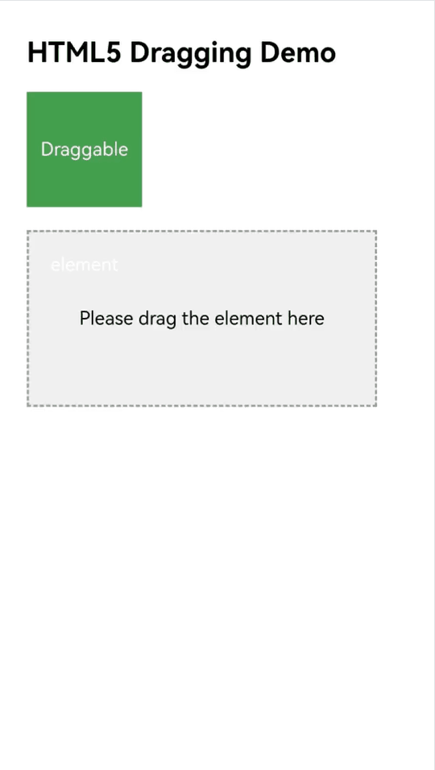
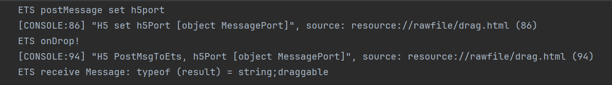

# Implementing the Drag Functionality
<!--Kit: ArkWeb-->
<!--Subsystem: Web-->
<!--Owner: @zourongchun-->
<!--Designer: @zhufenghao-->
<!--Tester: @ghiker-->
<!--Adviser: @HelloCrease-->

ArkWeb provides the functionality of dragging elements on web pages. Users can place an element by holding down the element and dragging it to another element. This functionality meets the HTML5 standard.

## Dragging Web Page Content to Other Applications

The following table lists the data formats supported by ArkWeb. You set data in these formats based on the HTML5 standard to drag content to other applications.

| Data Format     | Description    |
| ------------- | -------- |
| text/plain    | Text    |
| text/uri-list | Link    |
| text/html     | HTML|
| Files         | File    |

## Listening for Drag Events

The drag functionality of ArkWeb is different from that of ArkUI. ArkWeb is mainly used to drag web page content. Therefore, only some drag events can be listened for.

| Method   | Description                                                 |
| ----------- | ----------------------------------------------------- |
| [onDragStart](../reference/apis-arkui/arkui-ts/ts-universal-events-drag-drop.md#ondragstart)  | This method is not recommended. Calling it will affect the dragging behavior of **Web** components, resulting in unexpected dragging logic. For example, HTML dragging event listening cannot be triggered, preview images cannot be created, preview images are incorrect, or dragging data cannot be preset.|
|  [onDragEnter](../reference/apis-arkui/arkui-ts/ts-universal-events-drag-drop.md#ondragenter) | Called when an element is dragged to the web area.|
| [onDragMove](../reference/apis-arkui/arkui-ts/ts-universal-events-drag-drop.md#ondragmove)  | Called when an element is moved in the web area. |
| [onDragLeave](../reference/apis-arkui/arkui-ts/ts-universal-events-drag-drop.md#ondragleave) | Called when the dragged element leaves the web area.         |
| [onDragEnd](../reference/apis-arkui/arkui-ts/ts-universal-events-drag-drop.md#ondragend10) | Called when the dragging of an element ends.        |

## Implementing the Drag Logic on ArkTS

In most cases, the drag functionality implemented in HTML5 can meet the requirements of an application. If necessary, refer to the following examples to read drag data on ArkTS.
1. [Establishing a data channel between the application and the frontend Page](web-app-page-data-channel.md).
2. In the **onDrop** method, implement simple logic, for example, temporarily storing some key data.
3. To implement time-consuming tasks, add the application processing logic to the message receiving method on ArkTS.

The **onDrop** method on ArkTS is executed earlier than the event processing method ( **droppable.addEventListener('drop')** in the HTML example) in HTML. If page redirection is performed in the **onDrop** method, the **drop** method in HTML5 cannot be executed correctly, and the unexpected result is generated. Therefore, a bidirectional communication mechanism must be established to notify ArkTS to execute the corresponding service logic after the **drop** method in HTML5 is executed.

```ts
import { webview } from '@kit.ArkWeb'
import { unifiedDataChannel, uniformTypeDescriptor } from '@kit.ArkData';

@Entry
@Component
struct DragDrop {
  private controller: webview.WebviewController = new webview.WebviewController()
  @State ports: Array<webview.WebMessagePort> = []
  @State dragData: Array<unifiedDataChannel.UnifiedRecord> = []

  build() {
    Column() {
      Web({
        src: $rawfile("drag.html"),
        controller: this.controller,
      }).onPageEnd((event) => {
        //Register the message port.
        this.ports = this.controller.createWebMessagePorts();
        this.ports[1].onMessageEvent((result: webview.WebMessage) => {
          //Process the data received from HTML. You can record logs to confirm the message. The message format can be customized as long as it can be uniquely identified.
          console.info("ETS receive Message: typeof (result) = " + typeof (result) + ";" + result);
          // Process the message after the message is received in result. You can perform time-consuming tasks.
        });
        console.info("ETS postMessage set h5port ");
        //After the message port is registered, the front end sends a registration completion message to complete bidirectional port binding.
        this.controller.postMessage('__init_port__', [this.ports[0]], '*');
      })// Implement simple logic in onDrop, for example, temporarily storing some key data.
        .onDrop((DragEvent: DragEvent) => {
          console.info("ETS onDrop!")
          let data: UnifiedData = DragEvent.getData();
          if(!data) {
            return false;
          }
          let uriArr: Array<unifiedDataChannel.UnifiedRecord> = data.getRecords();
          if (!uriArr || uriArr.length <= 0) {
            return false;
          }
          // Traverse records to obtain data for temporary storage or use other methods to temporarily store data.
          for (let i = 0; i < uriArr.length; ++i) {
            if (uriArr[i].getType() === uniformTypeDescriptor.UniformDataType.PLAIN_TEXT) {
              let plainText = uriArr[i] as unifiedDataChannel.PlainText;
              if (plainText.textContent) {
                console.info("plainText.textContent: ", plainText.textContent);
              }
            }
          }
          return true
        })
    }

  }
}
```

HTML example:

```html
<html lang="zh-CN">
<head>
    <meta charset="UTF-8">
    <meta name="viewport" content="width=device-width, initial-scale=1.0, user-scalable=no">
    <title>HTML5 Dragging Demo</title>
</head>
<style>
    body {
      font-family: Arial, sans-serif;
      padding: 20px;
    }

    .draggable {
      width: 100px;
      height: 100px;
      background-color: #4CAF50;
      color: white;
      text-align: center;
      line-height: 100px;
      margin-bottom: 20px;
      cursor: grab;
    }

    .droppable {
      width: 300px;
      height: 150px;
      border: 2px dashed #999;
      background-color: #f0f0f0;
      text-align: center;
      line-height: 150px;
      font-size: 16px;
    }

    .success {
      background-color: #4CAF50;
      color: white;
    }
</style>
<body>

<h2>HTML5 Dragging Demo</h2>

<div id="draggable" class="draggable" draggable="true">Draggable element</div>

<div id="droppable" class="droppable">Please drag the element here</div>

<script>
    const draggable = document.getElementById('draggable');
    const droppable = document.getElementById('droppable');

    // Listen for the drag start event.
    draggable.addEventListener('dragstart', function (e) {
      e.dataTransfer.setData('text/plain', this.id);
      this.style.opacity = '0.4';
    });

    // Listen for the drag end event.
    draggable.addEventListener('dragend', function (e) {
      this.style.opacity = '1';
    });

    // Listen for the event triggered when the element is dragged to the target area.
    droppable.addEventListener('dragover', function (e) {
      e.preventDefault(); // This method must be invoked. Otherwise, the drop event cannot be triggered.
    });

    // Listen for the drop event.
    droppable.addEventListener('drop', function (e) {
      e.preventDefault();
      const data = e.dataTransfer.getData('text/plain');
      // Transfer the element to ArkTS.
      PostMsgToArkTS(data);
      const draggableEl = document.getElementById(data);
      this.appendChild(draggableEl);
      this.classList.add('success');
      this.textContent = "Dropped successfully!";
    });

    // Set the scriptproxy port on JavaScript.
    var h5Port;
    window.addEventListener('message', function (event) {
    console.info("H5 receive settingPort message");
        if (event.data == '__init_port__') {
            if (event.ports[0] != null) {
                console.info("H5 set h5Port " + event.ports[0]);
                h5Port = event.ports[0];
            }
        }
    });

    // Send data to ArkTS using scriptproxy.
    function PostMsgToArkTS(data) {
        console.info("H5 PostMsgToArkTS, h5Port " + h5Port);
        if (h5Port) {
          h5Port.postMessage(data);
        } else {
          console.error("h5Port is null, Please initialize first");
        }
    }
</script>

</body>
</html>
```

Log output:


## FAQs

### Why is the drag event set in HTML5 not triggered?
Check whether the CSS resources are properly set. Some web pages set the CSS style only for devices with specific UAs. You can set a custom UA in the **Web** component to solve this problem. For example:

```ts
import { webview } from '@kit.ArkWeb'

@Entry
@Component
struct Index {
    private webController: webview.WebviewController = new webview.WebviewController()
    build(){
      Column() {
        Web({
          src: "example.com",
          controller: this.webController,
        }).onControllerAttached(() => {
          // Set a custom UA.
          let customUA = 'android'
          this.webController.setCustomUserAgent(this.webController.getUserAgent() + customUA)
        })
      }
    }
}
```
