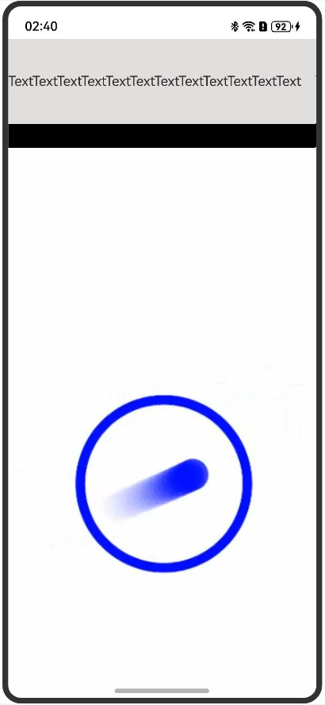
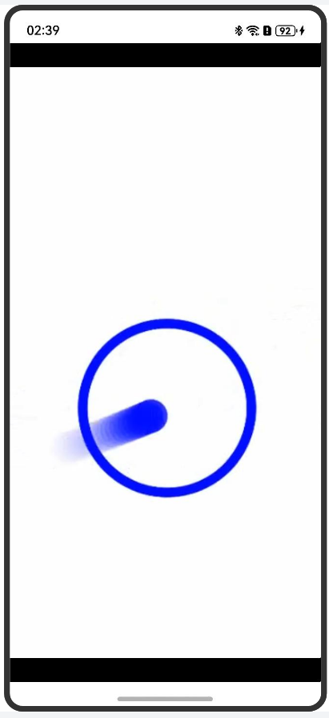

# Enabling Immersive Full-Screen Video Playback

<!--Kit: ArkWeb-->
<!--Subsystem: Web-->
<!--Owner: @zhangyao75477-->
<!--Designer: @gzweioh-->
<!--Tester: @ghiker-->
<!--Adviser: @HelloShuo-->
<!-- md-trans-meta sourceCommit=baf066dab25cecde4d53c0b569148bddf562228e translatedAt=2026-08-14T03:42:07.306Z pushedAt=2026-08-14T07:13:28.872Z -->

ArkWeb provides events for entering and exiting the full-screen mode. An application can listen for these events to enter and exit the immersive full-screen mode.

When a video loaded from a third-party H5 page in the **Web** component is played in full screen, the video expands only to the entire **Web** component area and cannot be displayed in system full screen (as shown in Figure 2). To achieve the immersive full-screen video playback effect at the system level (as shown in Figure 3), the app must listen for the event of entering the full-screen mode and adjust the attributes of other components on the UI.

| Figure 1 Exiting the full-screen mode| Figure 2 Non-immersive full-screen mode| Figure 3 Immersive full-screen mode|
| :--------------------------------------------: | :---------------------------------------------: | :---------------------------------------------: |
| |  |  |

The **Web** component can listen for the click event of the full-screen button through the [onFullScreenEnter](../reference/apis-arkweb/arkts-basic-components-web-events.md#onfullscreenenter9) and [onFullScreenExit](../reference/apis-arkweb/arkts-basic-components-web-events.md#onfullscreenexit9) callbacks. Specifically, onFullScreenEnter indicates that the **Web** component enters the full-screen mode, and onFullScreenExit indicates that the **Web** component exits the full-screen mode. In these two listening events, you can adjust certain global variables based on the specific service scenario, such as the visibility state of components and the margin attribute of components, to achieve the UI effect of exiting and entering the immersive full-screen mode, as shown in Figure 1 and Figure 3.

The [visibility](../reference/apis-arkui/arkui-ts/ts-universal-attributes-visibility.md#visibility) attribute is a common component attribute provided by ArkUI. You can control the visibility state of a component by setting different values of the component attribute visibility.

<!-- @[web_full_screen](https://gitcode.com/openharmony/applications_app_samples/blob/master/code/DocsSample/ArkWeb/ArkWebPictureInPicture/entry1/src/main/ets/pages/Index.ets) -->

``` TypeScript
import { webview } from '@kit.ArkWeb';

@Entry
@Component
struct ShortWebPage {
  controller: webview.WebviewController = new webview.WebviewController();
  CONSTANT_HEIGHT = 100;
  @State isVisible: boolean = true; // Customize the isVisible flag to determine whether to display the component.

  build() {
    Column() {
      Text('TextTextTextText')
        .width('100%')
        .height(this.CONSTANT_HEIGHT)
        .backgroundColor('#e1dede')
        .visibility(this.isVisible ? Visibility.Visible :
          Visibility.None) // When the isVisible flag is true, the component is visible; otherwise, the component is invisible and does not participate in layout or occupy space.
      Web({
        src: $rawfile('FullScreen.html'), // Example website.
        controller: this.controller
      })
        .onFullScreenEnter((event) => {
          console.info('onFullScreenEnter...');
          // When the full screen is displayed, the isVisible flag is false, the component is invisible, not involved in layout, and no placeholder is used for it.
          this.isVisible = false;
        })
        .onFullScreenExit(() => {
          console.info('onFullScreenExit...');
          // When the full screen is exited, the isVisible flag is true, and the component is visible.
          this.isVisible = true;
        })
        .width('100%')
        .height('100%')
        .zIndex(10)
        .zoomAccess(true)
    }.width('100%').height('100%')
  }
}
```