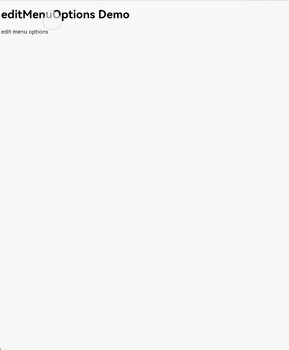
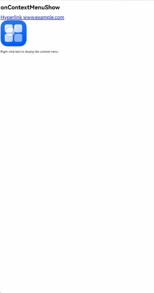
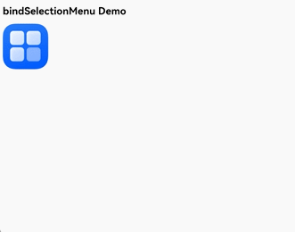
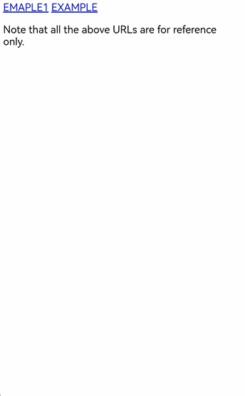
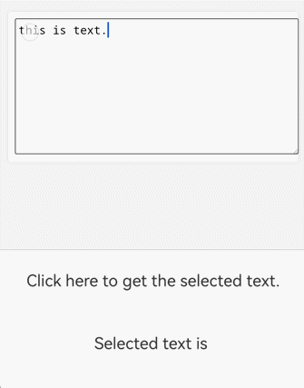
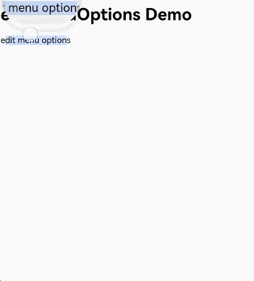

# Using Web Menus
<!--Kit: ArkWeb-->
<!--Subsystem: Web-->
<!--Owner: @zourongchun-->
<!--Designer: @zhufenghao-->
<!--Tester: @ghiker-->
<!--Adviser: @HelloCrease-->
Menus are key components for user interaction. They help build a clear navigation system and display feature entries in a structured layout, enabling users to quickly find target content or perform operations. As an important hub for human-machine interaction, menus significantly improve the accessibility and user experience of **Web** components and are an indispensable part of application design. The following table lists the menu types of **Web** components. You can select a menu type for your application as required.
|Menu Type|Target Element|Response Conditions|Customization Support|
|----|----|----|----|
|[Text Selection Menu](./web_menu.md#text-selection-menu)|Text|Long press|The menu items can be added or deleted while the menu style cannot be customized.|
|[Context Menu](./web_menu.md#context-menu)|Hyperlink, image, and text|Long press and right-click|Customization can be implemented using menu components.|
|[Custom Menu](./web_menu.md#custom-menu)|Image|Long press|Customization can be implemented using menu components.|
## Text Selection Menu
The text selection menu of the **Web** component is a context interaction component implemented by custom elements. It is dynamically displayed when a user selects text and provides operations such as copy, share, and mark. It has standard features and scalability and is the core feature of text operations on mobile devices. The text selection menu is displayed when a user long-presses the selected text or long-presses the single handle in the editing state. The menu items are horizontally arranged. The system provides the default menu implementation. You can use the [editMenuOptions](../reference/apis-arkweb/arkts-basic-components-web-attributes.md#editmenuoptions12) API to customize the text selection menu.
1. Use the **onCreateMenu** method to customize menu items. Operate Array<[TextMenuItem](../reference/apis-arkui/arkui-ts/ts-text-common.md#textmenuitem12)> to add or delete menu items. Define the menu item name, icon, and ID in [TextMenuItem](../reference/apis-arkui/arkui-ts/ts-text-common.md#textmenuitem12).
2. Use the **onMenuItemClick** method to process the menu item click event. When false is returned, the default system logic is executed.
3. Create an [EditMenuOptions](../reference/apis-arkui/arkui-ts/ts-text-common.md#editmenuoptions) object, which contains the **onCreateMenu** and **onMenuItemClick** methods, and bind the object to the **Web** component using the [editMenuOptions](../reference/apis-arkweb/arkts-basic-components-web-attributes.md#editmenuoptions12) method of the **Web** component.

  ```ts
  // xxx.ets
  import { webview } from '@kit.ArkWeb';
  @Entry
  @Component
  struct WebComponent {
    controller: webview.WebviewController = new webview.WebviewController();

    onCreateMenu(menuItems: Array<TextMenuItem>): Array<TextMenuItem> {
      let items = menuItems.filter((menuItem) => {
        // Filter the menu items as required.
        return (
          menuItem.id.equals(TextMenuItemId.CUT) ||
          menuItem.id.equals(TextMenuItemId.COPY) ||
          menuItem.id.equals(TextMenuItemId.PASTE)
        );
      });
      let customItem1: TextMenuItem = {
        content: 'customItem1',
        id: TextMenuItemId.of('customItem1'),
        icon: $r('app.media.startIcon')
      };
      let customItem2: TextMenuItem = {
        content: $r('app.string.EntryAbility_label'),
        id: TextMenuItemId.of('customItem2'),
        icon: $r('app.media.startIcon')
      };
      items.push(customItem1);// Add an item to the end of the item list.
      items.unshift(customItem2);// Add an item to the beginning of the item list.
      items.push(customItem1);
      items.push(customItem1);
      items.push(customItem1);
      items.push(customItem1);
      items.push(customItem1);
      return items;
    }

    onMenuItemClick(menuItem: TextMenuItem, textRange: TextRange): boolean {
      if (menuItem.id.equals(TextMenuItemId.CUT)) {
        // Custom behavior
        console.log("Intercept ID: CUT")
        return true; // Return true to not execute the system callback.
      } else if (menuItem.id.equals(TextMenuItemId.COPY)) {
        // Custom behavior
        console.log("Not intercept ID: COPY")
        return false; // Return false to execute the system callback.
      } else if (menuItem.id.equals(TextMenuItemId.of('customItem1'))) {
        // Custom behavior
        console.log("Intercept ID: customItem1")
        return true;// Custom menu item. If true is returned, the menu is not closed after being clicked. If false is returned, the menu is closed.
      } else if (menuItem.id.equals(TextMenuItemId.of('customItem2'))){
        // Custom behavior
        console.log("Intercept ID: customItem2")
        return true;
      }
      return false;// Return the default value false.
    }

    @State EditMenuOptions: EditMenuOptions = { onCreateMenu: this.onCreateMenu, onMenuItemClick: this.onMenuItemClick }

    build() {
      Column() {
        Web({ src: $rawfile("index.html"), controller: this.controller })
          .editMenuOptions(this.EditMenuOptions)
      }
    }
  }
  ```
  
  ```html
  <!--index.html-->
  <!DOCTYPE html>
  <html>
    <head>
        <title>Test Web Page</title>
    </head>
    <body>
      <h1>editMenuOptions Demo</h1>
      <span>edit menu options</span>
    </body>
  </html>
  ```
  
## Context Menu
A context menu is a shortcut menu triggered by a specific operation (such as right-clicking or holding down the rich text) to provide feature items related to the current operation object or UI element. Items in a context menu are arranged vertically. This menu is not provided by default. If it is not implemented in the application, the context menu is not displayed. To implement a context menu, the application needs to create a [Menu](../reference/apis-arkui/arkui-ts/ts-basic-components-menu.md) component and bind it to the **Web** component. When the menu is displayed, use the [onContextMenuShow](../reference/apis-arkweb/arkts-basic-components-web-events.md#oncontextmenushow9) API to obtain the context menu details, including the click location and HTML element information.

1. The [Menu](../reference/apis-arkui/arkui-ts/ts-basic-components-menu.md) component contains the behaviors and styles of all menu items.
2. Use the **bindPopup** method to bind the **Menu** component to the **Web** component. When the context menu is displayed, the created **Menu** component is displayed.
3. Obtain the context menu event information [onContextMenuShowEvent](../reference/apis-arkweb/arkts-basic-components-web-i.md#oncontextmenushowevent12) in the **onContextMenuShow** callback. The **param** parameter is of the [WebContextMenuParam](../reference/apis-arkweb/arkts-basic-components-web-WebContextMenuParam.md) type, which contains the HTML element information and location information corresponding to the click position. The **result** parameter is of the [WebContextMenuResult](../reference/apis-arkweb/arkts-basic-components-web-WebContextMenuResult.md) type, which provides common menu capabilities.

```ts
// xxx.ets
import { webview } from '@kit.ArkWeb';
import { pasteboard } from '@kit.BasicServicesKit';

const TAG = 'ContextMenu';

@Entry
@Component
struct WebComponent {
  controller: webview.WebviewController = new webview.WebviewController();
  private result: WebContextMenuResult | undefined = undefined;
  @State linkUrl: string = '';
  @State offsetX: number = 0;
  @State offsetY: number = 0;
  @State showMenu: boolean = false;
  uiContext: UIContext = this.getUIContext();

  @Builder
  // Build and trigger a custom menu.
  MenuBuilder() {
    // A component that is used to present a vertical list of items to the user.
    Menu() {
      // A component that is used to represent an item in a menu.
      MenuItem({
        content: 'Copy Image',
      })
        .width(100)
        .height(50)
        .onClick(() => {
          this.result?.copyImage();
          this.showMenu = false;
        })
      MenuItem({
        content: 'Cut',
      })
        .width(100)
        .height(50)
        .onClick(() => {
          this.result?.cut();
          this.showMenu = false;
        })
      MenuItem({
        content: 'Copy',
      })
        .width(100)
        .height(50)
        .onClick(() => {
          this.result?.copy();
          this.showMenu = false;
        })
      MenuItem({
        content: 'Paste',
      })
        .width(100)
        .height(50)
        .onClick(() => {
          this.result?.paste();
          this.showMenu = false;
        })
      MenuItem({
        content: 'Copy Link',
      })
        .width(100)
        .height(50)
        .onClick(() => {
          let pasteData = pasteboard.createData('text/plain', this.linkUrl);
          pasteboard.getSystemPasteboard().setData(pasteData, (error) => {
            if (error) {
              return;
            }
          })
          this.showMenu = false;
        })
      MenuItem({
        content: 'Select All',
      })
        .width(100)
        .height(50)
        .onClick(() => {
          this.result?.selectAll();
          this.showMenu = false;
        })
    }
    .width(150)
    .height(300)
  }

  build() {
    Column() {
      Web({ src: $rawfile("index.html"), controller: this.controller })
        // Trigger a custom dialog box.
        .onContextMenuShow((event) => {
          if (event) {
            this.result = event.result
            console.info("x coord = " + event.param.x());
            console.info("link url = " + event.param.getLinkUrl());
            this.linkUrl = event.param.getLinkUrl();
          }
          console.info(TAG, `x: ${this.offsetX}, y: ${this.offsetY}`);
          this.showMenu = true;
          this.offsetX = 0;
          this.offsetY = Math.max(this.uiContext!.px2vp(event?.param.y() ?? 0) - 0, 0);
          return true;
        })
        .bindPopup(this.showMenu,
          {
            builder: this.MenuBuilder(),
            enableArrow: false,
            placement: Placement.LeftTop,
            offset: { x: this.offsetX, y: this.offsetY },
            mask: false,
            onStateChange: (e) => {
              if (!e.isVisible) {
                this.showMenu = false;
                this.result!.closeContextMenu();
              }
            }
          })
    }
  }
}
```
```html
<!-- index.html -->
<!DOCTYPE html>
<html lang="en">
<body>
  <h1>onContextMenuShow</h1>
  <a href="http://www.example.com" style="font-size:27px">Hyperlink www.example.com</a>
  <!--example.png is an image in the same directory as the html file-->
  <div></div>
  <p>Right-click text to display the context menu</p>
</body>
</html>
```

## Custom Menu
Custom menus enable you to adjust menu triggering timing and visual display, so that your application can dynamically match feature entries based on user operation scenarios. This simplifies UI adaptation in the development process and makes application interaction more intuitive. Applications can use the [bindSelectionMenu](../reference/apis-arkweb/arkts-basic-components-web-attributes.md#bindselectionmenu13) API to customize menus. Currently, custom menus can respond to operations such as long-pressing images or links.
1. Create a [Menu](../reference/apis-arkui/arkui-ts/ts-basic-components-menu.md) component as the menu pop-up window.
2. Use the [bindSelectionMenu](../reference/apis-arkweb/arkts-basic-components-web-attributes.md#bindselectionmenu13) method of the **Web** component to bind the **MenuBuilder** pop-up window. Set [WebElementType](../reference/apis-arkweb/arkts-basic-components-web-e.md#webelementtype13) to **WebElementType.IMAGE** and [responseType](../reference/apis-arkweb/arkts-basic-components-web-e.md#webresponsetype13) to **WebResponseType.LONG_PRESS**, so that the menu is displayed when the image is pressed for a long time. Define **onAppear**, **onDisappear**, **preview**, and **menuType** in [options](../reference/apis-arkweb/arkts-basic-components-web-i.md#selectionmenuoptionsext13).
```ts
// xxx.ets
import { webview } from '@kit.ArkWeb';

interface PreviewBuilderParam {
  previewImage: Resource | string | undefined;
  width: number;
  height: number;
}

@Builder function PreviewBuilderGlobal($$: PreviewBuilderParam) {
  Column() {
    Image($$.previewImage)
      .objectFit(ImageFit.Fill)
      .autoResize(true)
  }.width($$.width).height($$.height)
}

@Entry
@Component
struct WebComponent {
  controller: webview.WebviewController = new webview.WebviewController();

  private result: WebContextMenuResult | undefined = undefined;
  @State previewImage: Resource | string | undefined = undefined;
  @State previewWidth: number = 0;
  @State previewHeight: number = 0;
  uiContext: UIContext = this.getUIContext();

  @Builder
  MenuBuilder() {
    Menu() {
      MenuItem({content:'Copy',})
        .onClick(() => {
          this.result?.copy();
          this.result?.closeContextMenu();
        })
      MenuItem({content:'Select All',})
        .onClick(() => {
          this.result?.selectAll();
          this.result?.closeContextMenu();
        })
    }
  }
  build() {
    Column() {
      Web({ src: $rawfile("index.html"), controller: this.controller })
        .bindSelectionMenu(WebElementType.IMAGE, this.MenuBuilder, WebResponseType.LONG_PRESS,
          {
            onAppear: () => {},
            onDisappear: () => {
              this.result?.closeContextMenu();
            },
            preview: PreviewBuilderGlobal({
              previewImage: this.previewImage,
              width: this.previewWidth,
              height: this.previewHeight
            }),
            menuType: MenuType.PREVIEW_MENU
          })
        .onContextMenuShow((event) => {
            if (event) {
              this.result = event.result;
              if (event.param.getLinkUrl()) {
                return false;
              }
              this.previewWidth = this.uiContext!.px2vp(event.param.getPreviewWidth());
              this.previewHeight = this.uiContext!.px2vp(event.param.getPreviewHeight());
              if (event.param.getSourceUrl().indexOf("resource://rawfile/") == 0) {
                this.previewImage = $rawfile(event.param.getSourceUrl().substr(19));
              } else {
                this.previewImage = event.param.getSourceUrl();
              }
              return true;
            }
            return false;
          })
    }
  }
}
```
```html
<!--index.html-->
<!DOCTYPE html>
<html>
  <head>
      <title>Test Web Page</title>
  </head>
  <body>
    <h1>bindSelectionMenu Demo</h1>
    <!--img.png is an image in the same directory as the html file-->
    
  </body>
</html>
```


Since API version 20, the hyperlink menu triggered by long-pressing can be bound. You can bind different custom menus to images and links.

The following example uses **PreviewBuilder** to define the content of the pop-up menu corresponding to the hyperlink, loads the hyperlink content using the **Web** component, and displays the loading progress using [the Progress component](../ui/arkts-common-components-progress-indicator.md).

```ts
import { webview } from '@kit.ArkWeb';
import { pasteboard } from '@kit.BasicServicesKit';

interface PreviewBuilderParam {
  width: number;
  height: number;
  url:Resource | string | undefined;
}

interface PreviewBuilderParamForImage {
  previewImage: Resource | string | undefined;
  width: number;
  height: number;
}


@Builder function PreviewBuilderGlobalForImage($$: PreviewBuilderParamForImage) {
  Column() {
    Image($$.previewImage)
      .objectFit(ImageFit.Fill)
      .autoResize(true)
  }.width($$.width).height($$.height)
}

@Entry
@Component
struct SelectionMenuLongPress {
  controller: webview.WebviewController = new webview.WebviewController();
  previewController: webview.WebviewController = new webview.WebviewController();
  @Builder PreviewBuilder($$: PreviewBuilderParam){
    Column() {
      Stack(){
        Text("") // Select whether to display the URL.
          .padding(5)
          .width('100%')
          .textAlign(TextAlign.Start)
          .backgroundColor(Color.White)
          .copyOption(CopyOptions.LocalDevice)
          .maxLines(1)
          .textOverflow({overflow:TextOverflow.Ellipsis})
        Progress({ value: this.progressValue, total: 100, type: ProgressType.Linear }) // Display the progress bar.
          .style({ strokeWidth: 3, enableSmoothEffect: true })
          .backgroundColor(Color.White)
          .opacity(this.progressVisible?1:0)
          .backgroundColor(Color.White)
      }.alignContent(Alignment.Bottom)
      Web({src:$$.url,controller: new webview.WebviewController()})
        .javaScriptAccess(true)
        .fileAccess(true)
        .onlineImageAccess(true)
        .imageAccess(true)
        .domStorageAccess(true)
        .onPageBegin(()=>{
          this.progressValue = 0;
          this.progressVisible = true;
        })
        .onProgressChange((event)=>{
          this.progressValue = event.newProgress;
        })
        .onPageEnd(()=>{
          this.progressVisible = false;
        })
        .hitTestBehavior(HitTestMode.None) // Disable the gesture response during web page preview.
    }.width($$.width).height ($$.height) // Set the preview width and height.
  }

  private result: WebContextMenuResult | undefined = undefined;
  @State previewImage: Resource | string | undefined = undefined;
  @State previewWidth: number = 1;
  @State previewHeight: number = 1;
  @State previewWidthImage: number = 1;
  @State previewHeightImage: number = 1;
  @State linkURL:string = "";
  @State progressValue:number = 0;
  @State progressVisible:boolean = true;
  uiContext: UIContext = this.getUIContext();

  @Builder
  LinkMenuBuilder() {
    Menu() {
      MenuItem({ content: 'Copy Link', })
        .onClick(() => {
          const pasteboardData = pasteboard.createData(pasteboard.MIMETYPE_TEXT_PLAIN, this.linkURL);
          const systemPasteboard = pasteboard.getSystemPasteboard();
          systemPasteboard.setData(pasteboardData);
        })
      MenuItem({content:'Open Link'})
        .onClick(()=>{
          this.controller.loadUrl(this.linkURL);
        })
    }
  }
  @Builder
  ImageMenuBuilder() {
    Menu() {
      MenuItem({ content: 'Copy Image', })
        .onClick(() => {
          this.result?.copyImage();
          this.result?.closeContextMenu();
        })
    }
  }
  build() {
    Column() {
      Web({ src: $rawfile("index.html"), controller: this.controller })
        .javaScriptAccess(true)
        .fileAccess(true)
        .onlineImageAccess(true)
        .imageAccess(true)
        .domStorageAccess(true)
        .bindSelectionMenu(WebElementType.LINK, this.LinkMenuBuilder, WebResponseType.LONG_PRESS,
          {
            onAppear: () => {},
            onDisappear: () => {
              this.result?.closeContextMenu();
            },
            preview: this.PreviewBuilder({
              width: 500,
              height: 400,
              url:this.linkURL
            }),
            menuType: MenuType.PREVIEW_MENU,
          })
        .bindSelectionMenu(WebElementType.IMAGE, this.ImageMenuBuilder, WebResponseType.LONG_PRESS,
          {
            onAppear: () => {},
            onDisappear: () => {
              this.result?.closeContextMenu();
            },
            preview: PreviewBuilderGlobalForImage({
              previewImage: this.previewImage,
              width: this.previewWidthImage,
              height: this.previewHeightImage,
            }),
            menuType: MenuType.PREVIEW_MENU,
          })
        .zoomAccess(true)
        .onContextMenuShow((event) => {
          if (event) {
            this.result = event.result;
            this.previewWidthImage = this.uiContext!.px2vp(event.param.getPreviewWidth());
            this.previewHeightImage = this.uiContext!.px2vp(event.param.getPreviewHeight());
            if (event.param.getSourceUrl().indexOf("resource://rawfile/") == 0) {
              this.previewImage = $rawfile(event.param.getSourceUrl().substring(19));
            } else {
              this.previewImage = event.param.getSourceUrl();
            }
            this.linkURL = event.param.getLinkUrl()
            return true;
          }
          return false;
        })
    }

  }
  // Swipe back
  onBackPress(): boolean | void {
    if (this.controller.accessStep(-1)) {
      this.controller.backward();
      return true;
    } else {
      return false;
    }
  }
}
```
HTML example:
```html
<html lang="zh-CN"><head>
    <meta charset="UTF-8">
    <meta name="viewport" content="width=device-width, initial-scale=1.0">
    <title>Information Page</title>
</head>
<body>
<div>
    <h1>Comprehensive information and contact details</h1>
    <section>
        <a href="https://www.example.com">EXAMPLE</a>
        <br>
        <a href="https://www.example1.com/">EXAMPLE1</a>
    </section>
</div>
<footer>
    <p>Note that all the above URLs are for reference only.</p>
</footer>
</body>
</html>
```


## Saving Images
1. Create the **MenuBuilder** component as the menu pop-up window, use the [SaveButton](../reference/apis-arkui/arkui-ts/ts-security-components-savebutton.md) component to save images, and bind **MenuBuilder** to the **Web** component using **bindContextMenu**.
2. Obtain the image URL in **onContextMenuShow** and save the image to the application sandbox by calling **copyLocalPicToDir** or **copyUrlPicToDir**.
3. Save images in the application sandbox to the gallery by using **photoAccessHelper**.

  ```ts
import { webview } from '@kit.ArkWeb';
import { common } from '@kit.AbilityKit';
import { fileIo as fs} from '@kit.CoreFileKit';
import { systemDateTime } from '@kit.BasicServicesKit';
import { http } from '@kit.NetworkKit';
import { photoAccessHelper } from '@kit.MediaLibraryKit';

@Entry
@Component
struct WebComponent {
  saveButtonOptions: SaveButtonOptions = {
    icon: SaveIconStyle.FULL_FILLED,
    text: SaveDescription.SAVE_IMAGE,
    buttonType: ButtonType.Capsule
  }
  controller: webview.WebviewController = new webview.WebviewController();
  @State showMenu: boolean = false;
  @State imgUrl: string = '';
  context = this.getUIContext().getHostContext() as common.UIAbilityContext;

  copyLocalPicToDir(rawfilePath: string, newFileName: string): string {
    let srcFileDes = this.context.resourceManager.getRawFdSync(rawfilePath);
    let dstPath = this.context.filesDir + "/" +newFileName;
    let dest: fs.File = fs.openSync(dstPath, fs.OpenMode.CREATE | fs.OpenMode.READ_WRITE);
    let bufsize = 4096;
    let buf = new ArrayBuffer(bufsize);
    let off = 0, len = 0, readedLen = 0;
    while (len = fs.readSync(srcFileDes.fd, buf, { offset: srcFileDes.offset + off, length: bufsize })) {
      readedLen += len;
      fs.writeSync(dest.fd, buf, { offset: off, length: len });
      off = off + len;
      if ((srcFileDes.length - readedLen) < bufsize) {
        bufsize = srcFileDes.length - readedLen;
      }
    }
    fs.close(dest.fd);
    return dest.path;
  }

  async copyUrlPicToDir(picUrl: string, newFileName: string): Promise<string> {
    let uri = '';
    let httpRequest = http.createHttp();
    let data: http.HttpResponse = await(httpRequest.request(picUrl) as Promise<http.HttpResponse>);
    if (data?.responseCode == http.ResponseCode.OK) {
      let dstPath = this.context.filesDir + "/" + newFileName;
      let dest: fs.File = fs.openSync(dstPath, fs.OpenMode.CREATE | fs.OpenMode.READ_WRITE);
      let writeLen: number = fs.writeSync(dest.fd, data.result as ArrayBuffer);
      uri = dest.path;
    }
    return uri;
  }

  @Builder
  MenuBuilder() {
    Column() {
      Row() {
        SaveButton(this.saveButtonOptions)
          .onClick(async (event, result: SaveButtonOnClickResult) => {
            if (result == SaveButtonOnClickResult.SUCCESS) {
              try {
                let context = this.context;
                let phAccessHelper = photoAccessHelper.getPhotoAccessHelper(context);
                let uri = '';
                if (this.imgUrl?.includes('rawfile')) {
                  let rawFileName: string = this.imgUrl.substring(this.imgUrl.lastIndexOf('/') + 1);
                  uri = this.copyLocalPicToDir(rawFileName, 'copyFile.png');
                } else if (this.imgUrl?.includes('http') || this.imgUrl?.includes('https')) {
                  uri = await this.copyUrlPicToDir(this.imgUrl, `onlinePic${systemDateTime.getTime()}.png`);
                }
                let assetChangeRequest: photoAccessHelper.MediaAssetChangeRequest = photoAccessHelper.MediaAssetChangeRequest.createImageAssetRequest(context, uri);
                await phAccessHelper.applyChanges(assetChangeRequest);
              }
              catch (err) {
                console.error(`create asset failed with error: ${err.code}, ${err.message}`);
              }
            } else {
              console.error(`SaveButtonOnClickResult create asset failed`);
            }
            this.showMenu = false;
          })
      }
      .margin({ top: 20, bottom: 20 })
      .justifyContent(FlexAlign.Center)
    }
    .width('80')
    .backgroundColor(Color.White)
    .borderRadius(10)
  }

  build() {
    Column() {
      Web({src: $rawfile("index.html"), controller: this.controller})
        .onContextMenuShow((event) => {
          if (event) {
            let hitValue = this.controller.getLastHitTest();
            this.imgUrl = hitValue.extra;
          }
          this.showMenu = true;
          return true;
        })
        .bindContextMenu(this.MenuBuilder, ResponseType.LongPress)
        .fileAccess(true)
        .javaScriptAccess(true)
        .domStorageAccess(true)
    }
  }
}
  ```
  ```html
<!--index.html-->
<!DOCTYPE html>
<html>
<head>
    <title>SavePicture</title>
</head>
<body>
<h1>SavePicture</h1>
<br>
<br>
<br>
<br>
<br>
<!--startIcon.png is an image in the same directory as the html file-->

</body>
</html>
  ```


## Obtaining Selected Text
The [editMenuOptions](../reference/apis-arkweb/arkts-basic-components-web-attributes.md#editmenuoptions12) API of the **Web** component cannot obtain the selected text. You can obtain the selected text in JavaScript through [javaScriptProxy](../reference/apis-arkweb/arkts-basic-components-web-attributes.md#javascriptproxy) to implement the logic of custom menus.
1. Create a **SelectClass** class and use [javaScriptProxy](../reference/apis-arkweb/arkts-basic-components-web-attributes.md#javascriptproxy) to register the **SelectClass** object with the **Web** component.
2. Register a selection change listener on the HTML side. When the selection changes, use the **SelectClass** object to set the selection to the ArkTS side.
  ```ts
import { webview } from '@kit.ArkWeb';
let selectText = '';

class SelectClass {
  constructor() {
  }

  setSelectText(param: String) {
    selectText = param.toString();
  }
}

@Entry
@Component
struct WebComponent {
  webController: webview.WebviewController = new webview.WebviewController();
  @State selectObj: SelectClass = new SelectClass();
  @State textStr: string = '';

  build() {
    Column() {
      Web({ src: $rawfile('index.html'), controller: this.webController})
        .javaScriptProxy({
          object: this.selectObj,
          name: 'selectObjName',
          methodList: ['setSelectText'],
          controller: this.webController
        })
        .height('40%')
      Text('Click here to get the selected text.')
        .fontSize(20)
        .onClick(() => {
          this.textStr = selectText;
        })
        .height('10%')
      Text('Selected text is ' + this.textStr)
        .fontSize(20)
        .height('10%')
    }
  }
}
  ```
  ```html
<!DOCTYPE html>
<html>
<head>
    <title>Test Get Select</title>
    <style>
        body {
          margin: 40px;
          background-color: #f4f4f4;
        }
        .edit-container {
          padding: 20px;
          background-color: #fff;
          border-radius: 8px;
          box-shadow: 0 0 10px rgba(0,0,0,0.1);
          margin: auto;
        }
        textarea {
          width: 100%;
          height: 400px;
          font-size: 16px;
          padding: 10px;
          border: 1px solid #ccc;
          border-radius: 4px;
        }
    </style>
</head>
<body>
<div class="edit-container">
    <textarea placeholder="Enter the text here and select it by long pressing."></textarea>
</div>
<script>
    document.addEventListener('selectionchange', () => {
      var selection = window.getSelection();
      if(selection.rangeCount > 0) {
        var selectedText = selection.toString();
        selectObjName.setSelectText(selectedText);
      }
    })
</script>
</body>
</html>
  ```


## Identifying QR Codes
In QR code redirection or payment scenarios, you can implement the context menu to obtain QR code image information from the [onContextMenuShow](../reference/apis-arkweb/arkts-basic-components-web-events.md#oncontextmenushow9) API for processing and provide a QR code scanning entry for users.
1. Create a **MenuBuilder** component as the menu pop-up window and bind it to the **Web** component through **bindContextMenu**.
2. Obtain the image URL in **onContextMenuShow** and save the image to the application sandbox by calling **copyLocalPicToDir** or **copyUrlPicToDir**.
3. Use **detectBarcode.decode** to parse the image stored in the sandbox and obtain the result.
  ```ts
import { webview } from '@kit.ArkWeb';
import { common } from '@kit.AbilityKit';
import { fileIo as fs } from '@kit.CoreFileKit';
import { systemDateTime } from '@kit.BasicServicesKit';
import { http } from '@kit.NetworkKit';
import { scanCore, scanBarcode, detectBarcode } from '@kit.ScanKit';
import { BusinessError } from '@kit.BasicServicesKit';

@Entry
@Component
struct WebComponent {
  saveButtonOptions: SaveButtonOptions = {
    icon: SaveIconStyle.FULL_FILLED,
    text: SaveDescription.SAVE_IMAGE,
    buttonType: ButtonType.Capsule
  }
  controller: webview.WebviewController = new webview.WebviewController();
  private result: WebContextMenuResult | undefined = undefined;
  @State showMenu: boolean = false;
  @State imgUrl: string = '';
  @State decodeResult: string = '';
  context = this.getUIContext().getHostContext() as common.UIAbilityContext;

  copyLocalPicToDir(rawfilePath: string, newFileName: string): string {
    let srcFileDes = this.context.resourceManager.getRawFdSync(rawfilePath);
    let dstPath = this.context.filesDir + "/" +newFileName;
    let dest: fs.File = fs.openSync(dstPath, fs.OpenMode.CREATE | fs.OpenMode.READ_WRITE);
    let bufsize = 4096;
    let buf = new ArrayBuffer(bufsize);
    let off = 0, len = 0, readedLen = 0;
    while (len = fs.readSync(srcFileDes.fd, buf, { offset: srcFileDes.offset + off, length: bufsize })) {
      readedLen += len;
      fs.writeSync(dest.fd, buf, { offset: off, length: len });
      off = off + len;
      if ((srcFileDes.length - readedLen) < bufsize) {
        bufsize = srcFileDes.length - readedLen;
      }
    }
    fs.close(dest.fd);
    return dest.path;
  }

  async copyUrlPicToDir(picUrl: string, newFileName: string): Promise<string> {
    let uri = '';
    let httpRequest = http.createHttp();
    let data: http.HttpResponse = await(httpRequest.request(picUrl) as Promise<http.HttpResponse>);
    if (data?.responseCode == http.ResponseCode.OK) {
      let dstPath = this.context.filesDir + "/" + newFileName;
      let dest: fs.File = fs.openSync(dstPath, fs.OpenMode.CREATE | fs.OpenMode.READ_WRITE);
      let writeLen: number = fs.writeSync(dest.fd, data.result as ArrayBuffer);
      uri = dest.path;
    }
    return uri;
  }

  @Builder
  MenuBuilder() {
    Menu() {
      MenuItem({
        content: "Scan QR Code",
      })
        .width(200)
        .height(50)
        .onClick(async () => {
          try {
            let uri = '';
            if (this.imgUrl?.includes('rawfile')) {
              let rawFileName: string = this.imgUrl.substring(this.imgUrl.lastIndexOf('/') + 1);
              uri = this.copyLocalPicToDir(rawFileName, 'copyFile.png');
            } else if (this.imgUrl?.includes('http') || this.imgUrl?.includes('https')) {
              uri = await this.copyUrlPicToDir(this.imgUrl, `onlinePic${systemDateTime.getTime()}.png`);
            }
            let options: scanBarcode.ScanOptions = { scanTypes: [scanCore.ScanType.ALL], enableMultiMode: true, enableAlbum: true }
            let inputImage: detectBarcode.InputImage = { uri: uri };
            try {
              // Call the image recognition API.
              detectBarcode.decode(inputImage, options, (error: BusinessError, result: Array<scanBarcode.ScanResult>) => {
                if (error && error.code) {
                  console.error(`create asset failed with error: ${error.code}, ${error.message}`);
                  return;
                }
              this.decodeResult = JSON.stringify(result);
              });
            } catch (err) {
              console.error(`Failed to detect Barcode. Code: ${err.code}, ${err.message}`);
            }
          }
          catch (err) {
            console.error(`create asset failed with error: ${err.code}, ${err.message}`);
          }
        })
    }
  }

  build() {
    Column() {
      Web({src: $rawfile("index.html"), controller: this.controller})
        .onContextMenuShow((event) => {
          if (event) {
            let hitValue = this.controller.getLastHitTest();
            this.imgUrl = hitValue.extra;
          }
          this.showMenu = true;
          return true;
        })
        .bindContextMenu(this.MenuBuilder, ResponseType.LongPress)
        .fileAccess(true)
        .javaScriptAccess(true)
        .domStorageAccess(true)
        .height('40%')
      Text('Decode result is ' + this.decodeResult)
        .fontSize(20)
        .height('10%')
    }
  }
}
  ```
  ```html
<!--index.html-->
<!DOCTYPE html>
<html>
<head>
    <title>test QR code</title>
</head>
<body>
<h1>Long press and click to scan the QR code</h1>
<!--img.png is a QR code image-->

</body>
</html>
  ```


## FAQs
### How do I disable the menu triggered by a long press?
You can use the [editMenuOptions](../reference/apis-arkweb/arkts-basic-components-web-attributes.md#editmenuoptions12) API to filter out all default menus. Then, default menus are not displayed if there is no menu item.
  ```ts
// xxx.ets
import { webview } from '@kit.ArkWeb';
@Entry
@Component
struct WebComponent {
  controller: webview.WebviewController = new webview.WebviewController();

  onCreateMenu(menuItems: Array<TextMenuItem>): Array<TextMenuItem> {
    let items = menuItems.filter((menuItem) => {
      // Filter the menu items as required.
      return false;
    });
    return items;
  }

  onMenuItemClick(menuItem: TextMenuItem, textRange: TextRange): boolean {
    return false;// Return the default value false.
  }

  @State EditMenuOptions: EditMenuOptions = { onCreateMenu: this.onCreateMenu, onMenuItemClick: this.onMenuItemClick }

  build() {
    Column() {
      Web({ src: $rawfile("index.html"), controller: this.controller })
        .editMenuOptions(this.EditMenuOptions)
    }
  }
}
  ```
  ```html
<!--index.html-->
<!DOCTYPE html>
<html>
  <head>
      <title>Test Web Page</title>
  </head>
  <body>
    <h1>editMenuOptions Demo</h1>
    <span>edit menu options</span>
  </body>
</html>
  ```


### What should I do if the menu with a selection handle is not displayed when the selection area is displayed?
Check whether the selection area is operated using the [selection API](https://www.w3.org/TR/selection-api/) of the JavaScript. If yes, the menu with a selection handle is not displayed.

### How do I modify the style of the text selection menu?
Currently, the style of the text selection menu cannot be modified.
