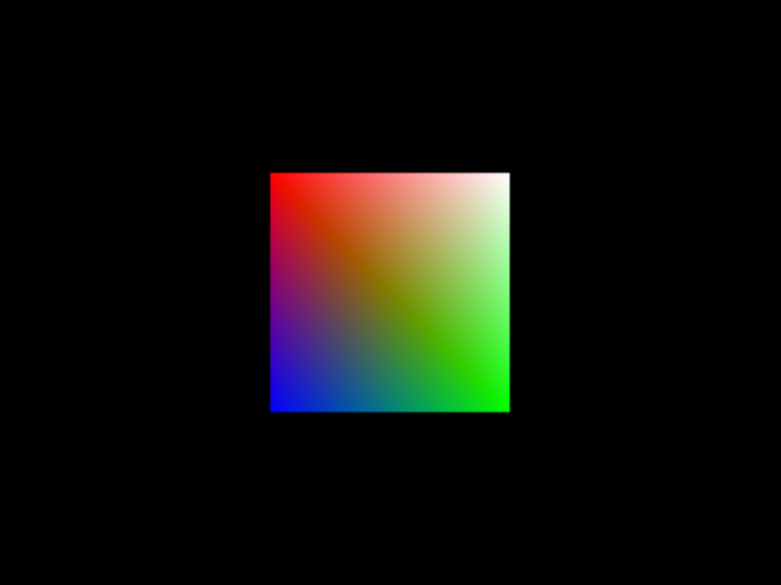

#  Using WebGL to Draw Graphics
<!--Kit: ArkGraphics 2D-->
<!--Subsystem: Graphics-->
<!--Owner: @samhu1989-->
<!--Designer: @shi-yang-2012-->
<!--Tester: @zhaoxiaoguang2-->
<!--Adviser: @ge-yafang-->
## When to Use

Web Graphics Library (WebGL) is used for rendering interactive 2D graphics. WebGL used in OpenHarmony is based on OpenGL for Embedded Systems (OpenGL ES). It can be used in the HTML5 **\<canvas>** element without using plug-ins and supports cross-platform. WebGL is programmed by JavaScript code. Its APIs can implement graphics rendering and acceleration by using GPU hardware provided by the user equipment. For more information, see [WebGL™](https://www.khronos.org/registry/webgl/specs/latest/1.0/).

> **NOTE**
>
> WebGL can be used only in the JavaScript-compatible web-like development paradigm.

## Basic Concepts

### Shader program

The shader program, also known as WebGL program, is a JavaScript object responsible for associating the shader with the buffer. A WebGLProgram object consists of two compiled WebGL shaders: a vertex shader and a fragment shader.

###  Shader

Shaders are instructions and data that run in a graphics card. In WebGL, shaders are written in the OpenGL Shading Language (GLSL).

There are vertex shaders and fragment shaders. The interaction between vertex shaders and fragment shaders involves rasterization.

- The vertex shader is mainly used to receive the coordinates of a point in a 3D space, convert the coordinates into coordinates in a 2D space, and output the coordinates.

- The fragment shader is mainly used to output a color value for each pixel being processed.

###  Rasterization

Rasterization is the process of converting the coordinates in a 2D space output by the vertex shader into pixels to be processed and passing the pixels to the fragment shader.

### Frame Buffer

The frame buffer provides an alternative rendering target for the drawing buffer. They are a collection of colors, depths, and template buffers and are usually used to render images.

###  Texture

A texture is an image that can be applied to the surface of a 3D model. Textures in WebGL have many properties, including width, height, format, and type. When using a texture, load it into WebGL and bind it to a texture unit.


## Variables and APIs

### Variables

| Type        | Web IDL Type        | Description                                                        |
| ------------ | -------------------- | ------------------------------------------------------------ |
| GLenum     | unsigned long     | Enum.       |
| GLboolean  | boolean            | Boolean, either **true** or **false**.|
| GLbitfield | unsigned long      | Unsigned integer. Multiple bit flags can be contained, and each bit flag represents a specific option.|
| GLbyte     | byte               | Signed integer represented by 2's complement of 8 bits (one byte).               |
| GLshort    | short              | Signed integer represented by 2's complement of 16 bits.                            |
| GLint      | long               | Signed integer represented by 2's complement of 32 bits.                          |
| GLsizei    | long               | Size, for example, the width and height of the drawing buffer.     |
| GLintptr   | long long          | A special type used to represent a pointer. It is usually used to specify the offset of a buffer object.      |
| GLsizeiptr | long long          | A special type used to represent a pointer. It is usually used to specify the size of a buffer object.        |
| GLubyte    | octet              | Unsigned integer represented by 2's complement of 8 bits (one byte).                |
| GLushort   | unsigned short     | Unsigned integer represented by 2's complement of 16 bits.                         |
| GLuint    | unsigned short     | Signed integer represented by 2's complement of 32 bits.                       |
| GLfloat   | unrestricted float | 32-bit IEEE floating-point number.                            |
| GLclampf   | unrestricted float | 32-bit IEEE floating-point number.                                     |

### Available APIs

| API                                                      | Description                                                  |
| ------------------------------------------------------------ | ------------------------------------------------------ |
| canvas.getContext                                            | Obtains the canvas context.                                |
| webgl.createBuffer(): WebGLBuffer \| null                    | Creates and initializes a WebGL buffer.                         |
| webgl.bindBuffer(target: GLenum, buffer: WebGLBuffer \| null): void | Binds a WebGL buffer to the target.                     |
| webgl.bufferData(target: GLenum, srcData: ArrayBufferView, usage: GLenum, srcOffset: GLuint, length?: GLuint): void | Creates and initializes the WebGL buffer's data store.                       |
| webgl.getAttribLocation(program: WebGLProgram, name: string): GLint | Obtains the address of the **attribute** variable in the shader from the given WebGL program.|
| webgl.vertexAttribPointer(index GLuint, size: GLint, type: GLenum, normalized: GLboolean, stride: GLsizei, offset: GLintptr): void | Assigns a Buffer object to a variable.                              |
| webgl.enableVertexAttribArray(index: GLuint): void           | Connects a variable to the Buffer object allocated to it.                      |
| webgl.clearColor(red: GLclampf, green:GLclampf, blue: GLclampf, alpha: GLclampf): void | Clears the specified color on the canvas.                        |
| webgl.clear(mask: GLbitfield): void                          | Clears the canvas.                                  |
| webgl.drawArrays(mode: GLenum, first:;GLint, count: GLsizei): void | Draws data.                                        |
| webgl.flush(): void                                          | Flushes data to the GPU and clears the buffer.                           |
| webgl.createProgram(): WebGLProgram \| null                  | Creates a WebGLProgram object.                                  |

## How to Develop

 The following uses a color square as an example to describe how to draw a 2D graphic using WebGL.
 
1. Before using WebGL for 3D rendering, create a **\<canvas>** element. The following code snippet creates a **\<canvas>** element and sets an onclick event handler to initialize the WebGL context.
 
   ```hml
    <div class="container">
        <canvas ref="canvas1" style="width : 400px; height : 400px; background-color : lightyellow;"></canvas>
        <button class="btn-button" onclick="BtnColorTriangle">BtnColorTriangle</button>
    </div>
   ```

2. Set the WebGL context.

   - Call the **main()** function in the JavaScript code after loading to set the WebGL context and start rendering.

   - Call the **getContext** function, with the **webgl** parameter passed in, to obtain the WebGL rendering context. If the browser does not support WebGL, **null** is returned. If the WebGL context is initialized, the variable **'gl'** is used to reference the context.

   ```js
   function main() {
     const canvas = document.querySelector("#glcanvas");
     // Initialize the WebGL context.
     const gl = canvas.getContext("webgl");

     // Check the support for WebGL.
     if (!gl) {
       alert("Your browser, operating system, or hardware may not support WebGL.");
       return;
     }
     // Use completely opaque black to clear all images.
     gl.clearColor(0.0, 0.0, 0.0, 1.0);
     // Clear the buffer with the color specified above.
     gl.clear(gl.COLOR_BUFFER_BIT);
   }
   ```
3. Define the vertex shader.

   The vertex shader needs to perform the necessary transformation (for example, adjustment or calculation) on the vertex coordinates, saves the new vertices in a special variable provided by GLSL, and returns the variable.

   Before performing matrix calculations, you need to import the open-source library gl-matrix. You can download it from the [gl-matrix official website](https://glmatrix.net/) or install it using the following npm command:
   `npm install gl-matrix`
   ```js
   // Import mat4.
   import { mat4 } from 'gl-matrix'
   const vsSource = `
       attribute vec4 aVertexPosition;
       uniform mat4 uModelViewMatrix;
       uniform mat4 uProjectionMatrix;
       void main() {
         gl_Position = uProjectionMatrix * uModelViewMatrix * aVertexPosition;
       }
     `;
   ```

4. Define the fragment shader.

   After the vertex shader processes the vertices, the fragment shader is called once by each pixel to be drawn.

   ```js
   const fsSource = `
       void main() {
         gl_FragColor = vec4(1.0, 1.0, 1.0, 1.0);
       }
    `;
   ```
5. Pass the shader to WebGL.

   Pass the vertex shader and fragment shader defined to WebGL and compile them together.

   The following code uses **loadShader()** to transfer the type and source for the shader. In this example, two shaders are created and attached to a shader program. If the compilation or linking fails, an alert is displayed.

   ```js
   // Initialize the shader program so that WebGL knows how to draw data.
   function initShaderProgram(gl, vsSource, fsSource) {
     const vertexShader = loadShader(gl, gl.VERTEX_SHADER, vsSource);
     const fragmentShader = loadShader(gl, gl.FRAGMENT_SHADER, fsSource);
     // Create a shader program.
     const shaderProgram = gl.createProgram();
     gl.attachShader(shaderProgram, vertexShader);
     gl.attachShader(shaderProgram, fragmentShader);
     gl.linkProgram(shaderProgram);
     // An alert is displayed if the creation fails.
     if (!gl.getProgramParameter(shaderProgram, gl.LINK_STATUS)) {
       alert(
         "Unable to initialize the shader program: "+
        gl.getProgramInfoLog(shaderProgram),
       );
       return null;
     }
     return shaderProgram;
   }
   // Create a shader of the specified type, upload the source code, and compile the source code.
   function loadShader(gl, type, source) {
     const shader = gl.createShader(type);
     // Send the resource to the shader object.
     gl.shaderSource(shader, source);
     // Compile the shader program.
     gl.compileShader(shader);
     // Check whether the compilation is successful.
     if (!gl.getShaderParameter(shader, gl.COMPILE_STATUS)) {
       alert(
      "Error occurred when compiling the shader: "+ gl.getShaderInfoLog (shader),
       );
       gl.deleteShader(shader);
       return null;
     }
     return shader;
   }
   ```
6. Find the input location assigned by WebGL.

   - After creating the shader program, find the input location allocated by WebGL. There is one property and two Uniforms.

   - The property value is assigned by the buffer. For each iteration of the vertex shader, a new value is assigned.

   - Uniforms are similar to JavaScript global variables. They use the same value in all iterations of the shader. Because the property location is specific to a shader program, they can be stored together for easy delivery.

   ```js
   const programInfo = {
     program: shaderProgram,
     attribLocations: {
       vertexPosition: gl.getAttribLocation(shaderProgram, "aVertexPosition"),
     },
     uniformLocations: {
       projectionMatrix: gl.getUniformLocation(shaderProgram, "uProjectionMatrix"),
       modelViewMatrix: gl.getUniformLocation(shaderProgram, "uModelViewMatrix"),
     },
   };
   ```

7. Create a buffer object.

   - Before drawing the square, create a buffer to store its vertices.

   - Call the **createBuffer()** function of **gl** to obtain a buffer object and store it in the vertex buffer. Then call the **bindBuffer()** function to bind the context.

   - Create a JavaScript array to record each vertex of the square, convert the JavaScript array into an array of the WebGL floating-point type, and pass the latter to the **bufferData()** function of **gl** to establish the vertices of the object.

   ```js
   function initBuffers(gl) {
     const positionBuffer = initPositionBuffer(gl);
     return {
       position: positionBuffer,
     };
   }
   function initPositionBuffer(gl) {
     // Create a position buffer for the square.
     const positionBuffer = gl.createBuffer();
     // Bind the position buffer to the application buffer.
     gl.bindBuffer(gl.ARRAY_BUFFER, positionBuffer);
     // Create an array to hold the vertices of the square.
     const positions = [1.0, 1.0, -1.0, 1.0, 1.0, -1.0, -1.0, -1.0];
     // Pass the position array to WebGL.
     gl.bufferData(gl.ARRAY_BUFFER, new Float32Array(positions), gl.STATIC_DRAW);
     return positionBuffer;
   }
   export { initBuffers };
   ```

8. Start render.

   - Erase the canvas with the background color, and then build a camera perspective projection matrix. Set the view angle to 45 degrees and set an aspect ratio suitable for the actual image. Specify that objects within the range of 0.1 to 100 units from the camera are visible.

   - Load a specific position and place the square in a position six units away from the camera. Then, bind the square's vertex buffer to the context, configure the buffer, and call the **drawArrays()** method to draw the square.

   ```js
   function drawScene(gl, programInfo, buffers) {
     gl.clearColor(0.0, 0.0, 0.0, 1.0); 
     gl.clearDepth(1.0); // Clear all content.
     gl.depthFunc(gl.LEQUAL); 
     // Clear the canvas.
      gl.clear(gl.COLOR_BUFFER_BIT | gl.DEPTH_BUFFER_BIT);
     // Create a perspective projection matrix to simulate perspective deformation in the camera.
     const fieldOfView = (45 * Math.PI) / 180; 
     const aspect = gl.canvas.clientWidth / gl.canvas.clientHeight;
     const zNear = 0.1;
     const zFar = 100.0;
     const projectionMatrix = mat4.create();
     mat4.perspective(projectionMatrix, fieldOfView, aspect, zNear, zFar);
     // Set the drawing position to the center of the scene.
     const modelViewMatrix = mat4.create();
     // Start to draw the square.
     mat4.translate(
       modelViewMatrix, // Target matrix.
       modelViewMatrix, // Matrix to be converted.
       [-0.0, 0.0, -6.0],
     ); 
     {
       const numComponents = 2; 
       const type = gl.FLOAT; 
       const normalize = false; 
       const stride = 0; // Number of bytes required from a group of values to the next group of values.
       const offset = 0; 
       gl.bindBuffer(gl.ARRAY_BUFFER, buffers.position);
       gl.vertexAttribPointer(
         programInfo.attribLocations.vertexPosition,
         numComponents,
         type,
         normalize,
         stride,
         offset,
       );
       gl.enableVertexAttribArray(programInfo.attribLocations.vertexPosition);
     }
     gl.useProgram(programInfo.program);
     gl.uniformMatrix4fv(
       programInfo.uniformLocations.projectionMatrix,
       false,
       projectionMatrix,
     );
     gl.uniformMatrix4fv(
       programInfo.uniformLocations.modelViewMatrix,
       false,
       modelViewMatrix,
     );
     {
       const offset = 0;
       const vertexCount = 4;
       gl.drawArrays(gl.TRIANGLE_STRIP, offset, vertexCount);
     }
   }
   // Tell WebGL how to pull the position buffer to the vertexPosition attribute.
   function setPositionAttribute(gl, buffers, programInfo) {
     const numComponents = 2; 
     const type = gl.FLOAT; 
     const normalize = false;  
     const stride = 0; // Number of bytes required from a group of values to the next group of values.
     const offset = 0;
     gl.bindBuffer(gl.ARRAY_BUFFER, buffers.position);
     gl.vertexAttribPointer(
       programInfo.attribLocations.vertexPosition,
       numComponents,
       type,
       normalize,
       stride,
       offset,
     );
     gl.enableVertexAttribArray(programInfo.attribLocations.vertexPosition);
   }
   export { drawScene };
   ```

The following figure shows the implementation effect.


