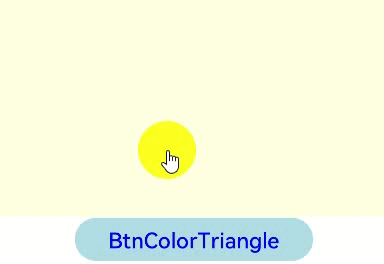

# WebGL Development

## When to Use

WebGL helps you process graphics at the frontend, for example, drawing color graphics.

> **NOTE**
>
> WebGL can be used only in the JavaScript-compatible web-like development paradigm.


## Available APIs

**Table 1** WebGL APIs

| API| Description|
| -------- | -------- |
| canvas.getContext | Obtains the canvas context.|
| webgl.createBuffer(): WebGLBuffer \| null | Creates and initializes a WebGL buffer.|
| webgl.bindBuffer(target: GLenum, buffer: WebGLBuffer \| null): void | Binds the WebGL buffer to the target.|
| webgl.bufferData(target: GLenum, srcData: ArrayBufferView, usage: GLenum, srcOffset: GLuint, length?: GLuint): void | Creates and initializes the WebGL buffer object's data store.|
| webgl.getAttribLocation(program: WebGLProgram, name: string): GLint | Obtains the address of the **attribute** variable in the shader from the given WebGLProgram.|
| webgl.vertexAttribPointer(index GLuint, size: GLint, type: GLenum, normalized: GLboolean, stride: GLsizei, offset: GLintptr): void | Assigns a **Buffer** object to a variable.|
| webgl.enableVertexAttribArray(index: GLuint): void | Connects a variable to the **Buffer** object allocated to it.|
| webgl.clearColor(red: GLclampf, green:GLclampf, blue: GLclampf, alpha: GLclampf): void | Clears the specified color on the **\<canvas>** component.|
| webgl.clear(mask: GLbitfield): void | Clears the **\<canvas>** component.|
| webgl.drawArrays(mode: GLenum, first:;GLint, count: GLsizei): void | Draws data.|
| webgl.flush(): void | Flushes data to the GPU and clears the buffer.|
| webgl.createProgram(): WebGLProgram \| null | Creates a **WebGLProgram** object.|


## How to Develop

The following describes how to draw a 2D image without using shaders and how to draw a color triangle using shaders.

> **NOTE**
>
> When using WebGL for development, use a real device to ensure the GUI display effect.


### Drawing a 2D Image Without Using Shaders

To draw a 2D image without using WebGL, that is, to implement CPU rather than GPU drawing, perform the following steps:

1. Create a page layout in the **index.hml** file. The following is an example of the file content:
   ```
   <div class="container">
       <canvas ref="canvas1" style="width : 400px; height : 200px; background-color : lightyellow;"></canvas>
       <button class="btn-button" onclick="BtnDraw2D">BtnDraw2D</button>
   </div>
   ```

2. Set the page style in the **index.css** file. The following is an example of the file content:
   ```
   .container {
       flex-direction: column;
       justify-content: center;
       align-items: center;
   }
   .btn-button {
       margin: 1px;
       height: 40px;
       width: 220px;
       background-color: lightblue;
       font-size: 20px;
       text-color: blue;
   }
   ```

3. Edit the **index.js** file to add the 2D drawing logic code. The following is an example of the file content:
   ```
   // index.js
   export default { // Native API interaction code
       data: {
           title: "DEMO BY TEAMOL",
           fit:"cover",
           fits: ["cover", "contain", "fill", "none", "scale-down"]
       },
       onInit() {
           this.title = this.$t('strings.world');
       },
       BtnDraw2D(){
           // Obtain the <canvas> component.
           const canvas = this.$refs.canvas1;
           // Obtain the 2D context.
           const ctx = canvas.getContext('2d');
   
           // Execute the CPU drawing function.
           // Set the line width.
           ctx.lineWidth = 10;
           // Wall
           ctx.strokeRect(75, 140, 150, 110);
           // Door
           ctx.fillRect(130, 190, 40, 60);
           // Roof
           ctx.beginPath();
           ctx.moveTo(50, 140);
           ctx.lineTo(150, 60);
           ctx.lineTo(250, 140);
           ctx.closePath();
           ctx.stroke();
       }
   }
   ```

**Figure 1** Effect of clicking the button to draw a 2D image


### Drawing a Color Triangle Using Shaders

To use WebGL to draw a color triangle (GPU drawing), perform the following steps:


1. Create a page layout in the **index.hml** file. The following is an example of the file content:
   ```
   <div class="container">
   <canvas ref="canvas1" style="width : 400px; height : 200px; background-color : lightyellow;"></canvas>
   <button class="btn-button" onclick="BtnColorTriangle">BtnColorTriangle</button>
   </div>
   ```

2. Set the page style in the **index.css** file. The following is an example of the file content:
   ```
   .container {
       flex-direction: column;
       justify-content: center;
       align-items: center;
   }
   .btn-button {
       margin: 1px;
       height: 40px;
       width: 220px;
       background-color: lightblue;
       font-size: 20px;
       text-color: blue;
   }
   ```

3. Edit the JavaScript code file to add the logic code for drawing a color triangle. The following is an example of the file content:
   ```
   // index.js
   
   // WebGL-related predefinition
   var gl = {
       DEPTH_BUFFER_BIT: 0x00000100,
       STENCIL_BUFFER_BIT: 0x00000400,
       COLOR_BUFFER_BIT: 0x00004000,
       POINTS: 0x0000,
       LINES: 0x0001,
       LINE_LOOP: 0x0002,
       LINE_STRIP: 0x0003,
       TRIANGLES: 0x0004,
       TRIANGLE_STRIP: 0x0005,
       TRIANGLE_FAN: 0x0006,
       ZERO: 0,
       ONE: 1,
       SRC_COLOR: 0x0300,
       ONE_MINUS_SRC_COLOR: 0x0301,
       SRC_ALPHA: 0x0302,
       ONE_MINUS_SRC_ALPHA: 0x0303,
       DST_ALPHA: 0x0304,
       ONE_MINUS_DST_ALPHA: 0x0305,
       DST_COLOR: 0x0306,
       ONE_MINUS_DST_COLOR: 0x0307,
       SRC_ALPHA_SATURATE: 0x0308,
       FUNC_ADD: 0x8006,
       BLEND_EQUATION: 0x8009,
       BLEND_EQUATION_RGB: 0x8009,
       BLEND_EQUATION_ALPHA: 0x883D,
       FUNC_SUBTRACT: 0x800A,
       FUNC_REVERSE_SUBTRACT: 0x800B,
       BLEND_DST_RGB: 0x80C8,
       BLEND_SRC_RGB: 0x80C9,
       BLEND_DST_ALPHA: 0x80CA,
       BLEND_SRC_ALPHA: 0x80CB,
       CONSTANT_COLOR: 0x8001,
       ONE_MINUS_CONSTANT_COLOR: 0x8002,
       CONSTANT_ALPHA: 0x8003,
       ONE_MINUS_CONSTANT_ALPHA: 0x8004,
       BLEND_COLOR: 0x8005,
       ARRAY_BUFFER: 0x8892,
       ELEMENT_ARRAY_BUFFER: 0x8893,
       ARRAY_BUFFER_BINDING: 0x8894,
       ELEMENT_ARRAY_BUFFER_BINDING: 0x8895,
       STREAM_DRAW: 0x88E0,
       STATIC_DRAW: 0x88E4,
       DYNAMIC_DRAW: 0x88E8,
       BUFFER_SIZE: 0x8764,
       BUFFER_USAGE: 0x8765,
       CURRENT_VERTEX_ATTRIB: 0x8626,
       FRONT: 0x0404,
       BACK: 0x0405,
       FRONT_AND_BACK: 0x0408,
       CULL_FACE: 0x0B44,
       BLEND: 0x0BE2,
       DITHER: 0x0BD0,
       STENCIL_TEST: 0x0B90,
       DEPTH_TEST: 0x0B71,
       SCISSOR_TEST: 0x0C11,
       POLYGON_OFFSET_FILL: 0x8037,
       SAMPLE_ALPHA_TO_COVERAGE: 0x809E,
       SAMPLE_COVERAGE: 0x80A0,
       NO_ERROR: 0,
       INVALID_ENUM: 0x0500,
       INVALID_VALUE: 0x0501,
       INVALID_OPERATION: 0x0502,
       OUT_OF_MEMORY: 0x0505,
       CW: 0x0900,
       CCW: 0x0901,
       LINE_WIDTH: 0x0B21,
       ALIASED_POINT_SIZE_RANGE: 0x846D,
       ALIASED_LINE_WIDTH_RANGE: 0x846E,
       CULL_FACE_MODE: 0x0B45,
       FRONT_FACE: 0x0B46,
       DEPTH_RANGE: 0x0B70,
       DEPTH_WRITEMASK: 0x0B72,
       DEPTH_CLEAR_VALUE: 0x0B73,
       DEPTH_FUNC: 0x0B74,
       STENCIL_CLEAR_VALUE: 0x0B91,
       STENCIL_FUNC: 0x0B92,
       STENCIL_FAIL: 0x0B94,
       STENCIL_PASS_DEPTH_FAIL: 0x0B95,
       STENCIL_PASS_DEPTH_PASS: 0x0B96,
       STENCIL_REF: 0x0B97,
       STENCIL_VALUE_MASK: 0x0B93,
       STENCIL_WRITEMASK: 0x0B98,
       STENCIL_BACK_FUNC: 0x8800,
       STENCIL_BACK_FAIL: 0x8801,
       STENCIL_BACK_PASS_DEPTH_FAIL: 0x8802,
       STENCIL_BACK_PASS_DEPTH_PASS: 0x8803,
       STENCIL_BACK_REF: 0x8CA3,
       STENCIL_BACK_VALUE_MASK: 0x8CA4,
       STENCIL_BACK_WRITEMASK: 0x8CA5,
       VIEWPORT: 0x0BA2,
       SCISSOR_BOX: 0x0C10,
       COLOR_CLEAR_VALUE: 0x0C22,
       COLOR_WRITEMASK: 0x0C23,
       UNPACK_ALIGNMENT: 0x0CF5,
       PACK_ALIGNMENT: 0x0D05,
       MAX_TEXTURE_SIZE: 0x0D33,
       MAX_VIEWPORT_DIMS: 0x0D3A,
       SUBPIXEL_BITS: 0x0D50,
       RED_BITS: 0x0D52,
       GREEN_BITS: 0x0D53,
       BLUE_BITS: 0x0D54,
       ALPHA_BITS: 0x0D55,
       DEPTH_BITS: 0x0D56,
       STENCIL_BITS: 0x0D57,
       POLYGON_OFFSET_UNITS: 0x2A00,
       POLYGON_OFFSET_FACTOR: 0x8038,
       TEXTURE_BINDING_2D: 0x8069,
       SAMPLE_BUFFERS: 0x80A8,
       SAMPLES: 0x80A9,
       RGBA8: 0x8058,
       SAMPLE_COVERAGE_VALUE: 0x80AA,
       SAMPLE_COVERAGE_INVERT: 0x80AB,
       COMPRESSED_TEXTURE_FORMATS: 0x86A3,
       DONT_CARE: 0x1100,
       FASTEST: 0x1101,
       NICEST: 0x1102,
       GENERATE_MIPMAP_HINT: 0x8192,
       BYTE: 0x1400,
       UNSIGNED_BYTE: 0x1401,
       SHORT: 0x1402,
       UNSIGNED_SHORT: 0x1403,
       INT: 0x1404,
       UNSIGNED_INT: 0x1405,
       FLOAT: 0x1406,
       DEPTH_COMPONENT: 0x1902,
       ALPHA: 0x1906,
       RGB: 0x1907,
       RGBA: 0x1908,
       LUMINANCE: 0x1909,
       LUMINANCE_ALPHA: 0x190A,
       UNSIGNED_SHORT_4_4_4_4: 0x8033,
       UNSIGNED_SHORT_5_5_5_1: 0x8034,
       UNSIGNED_SHORT_5_6_5: 0x8363,
       FRAGMENT_SHADER: 0x8B30,
       VERTEX_SHADER: 0x8B31,
       MAX_VERTEX_ATTRIBS: 0x8869,
       MAX_VERTEX_UNIFORM_VECTORS: 0x8DFB,
       MAX_VARYING_VECTORS: 0x8DFC,
       MAX_COMBINED_TEXTURE_IMAGE_UNITS: 0x8B4D,
       MAX_VERTEX_TEXTURE_IMAGE_UNITS: 0x8B4C,
       MAX_TEXTURE_IMAGE_UNITS: 0x8872,
       MAX_FRAGMENT_UNIFORM_VECTORS: 0x8DFD,
       SHADER_TYPE: 0x8B4F,
       DELETE_STATUS: 0x8B80,
       LINK_STATUS: 0x8B82,
       VALIDATE_STATUS: 0x8B83,
       ATTACHED_SHADERS: 0x8B85,
       ACTIVE_UNIFORMS: 0x8B86,
       ACTIVE_ATTRIBUTES: 0x8B89,
       SHADING_LANGUAGE_VERSION: 0x8B8C,
       CURRENT_PROGRAM: 0x8B8D,
       NEVER: 0x0200,
       LESS: 0x0201,
       EQUAL: 0x0202,
       LEQUAL: 0x0203,
       GREATER: 0x0204,
       NOTEQUAL: 0x0205,
       GEQUAL: 0x0206,
       ALWAYS: 0x0207,
       KEEP: 0x1E00,
       REPLACE: 0x1E01,
       INCR: 0x1E02,
       DECR: 0x1E03,
       INVERT: 0x150A,
       INCR_WRAP: 0x8507,
       DECR_WRAP: 0x8508,
       VENDOR: 0x1F00,
       RENDERER: 0x1F01,
       VERSION: 0x1F02,
       NEAREST: 0x2600,
       LINEAR: 0x2601,
       NEAREST_MIPMAP_NEAREST: 0x2700,
       LINEAR_MIPMAP_NEAREST: 0x2701,
       NEAREST_MIPMAP_LINEAR: 0x2702,
       LINEAR_MIPMAP_LINEAR: 0x2703,
       TEXTURE_MAG_FILTER: 0x2800,
       TEXTURE_MIN_FILTER: 0x2801,
       TEXTURE_WRAP_S: 0x2802,
       TEXTURE_WRAP_T: 0x2803,
       TEXTURE_2D: 0x0DE1,
       TEXTURE: 0x1702,
       TEXTURE_CUBE_MAP: 0x8513,
       TEXTURE_BINDING_CUBE_MAP: 0x8514,
       TEXTURE_CUBE_MAP_POSITIVE_X: 0x8515,
       TEXTURE_CUBE_MAP_NEGATIVE_X: 0x8516,
       TEXTURE_CUBE_MAP_POSITIVE_Y: 0x8517,
       TEXTURE_CUBE_MAP_NEGATIVE_Y: 0x8518,
       TEXTURE_CUBE_MAP_POSITIVE_Z: 0x8519,
       TEXTURE_CUBE_MAP_NEGATIVE_Z: 0x851A,
       MAX_CUBE_MAP_TEXTURE_SIZE: 0x851C,
       TEXTURE0: 0x84C0,
       TEXTURE1: 0x84C1,
       TEXTURE2: 0x84C2,
       TEXTURE3: 0x84C3,
       TEXTURE4: 0x84C4,
       TEXTURE5: 0x84C5,
       TEXTURE6: 0x84C6,
       TEXTURE7: 0x84C7,
       TEXTURE8: 0x84C8,
       TEXTURE9: 0x84C9,
       TEXTURE10: 0x84CA,
       TEXTURE11: 0x84CB,
       TEXTURE12: 0x84CC,
       TEXTURE13: 0x84CD,
       TEXTURE14: 0x84CE,
       TEXTURE15: 0x84CF,
       TEXTURE16: 0x84D0,
       TEXTURE17: 0x84D1,
       TEXTURE18: 0x84D2,
       TEXTURE19: 0x84D3,
       TEXTURE20: 0x84D4,
       TEXTURE21: 0x84D5,
       TEXTURE22: 0x84D6,
       TEXTURE23: 0x84D7,
       TEXTURE24: 0x84D8,
       TEXTURE25: 0x84D9,
       TEXTURE26: 0x84DA,
       TEXTURE27: 0x84DB,
       TEXTURE28: 0x84DC,
       TEXTURE29: 0x84DD,
       TEXTURE30: 0x84DE,
       TEXTURE31: 0x84DF,
       ACTIVE_TEXTURE: 0x84E0,
       REPEAT: 0x2901,
       CLAMP_TO_EDGE: 0x812F,
       MIRRORED_REPEAT: 0x8370,
       FLOAT_VEC2: 0x8B50,
       FLOAT_VEC3: 0x8B51,
       FLOAT_VEC4: 0x8B52,
       INT_VEC2: 0x8B53,
       INT_VEC3: 0x8B54,
       INT_VEC4: 0x8B55,
       BOOL: 0x8B56,
       BOOL_VEC2: 0x8B57,
       BOOL_VEC3: 0x8B58,
       BOOL_VEC4: 0x8B59,
       FLOAT_MAT2: 0x8B5A,
       FLOAT_MAT3: 0x8B5B,
       FLOAT_MAT4: 0x8B5C,
       SAMPLER_2D: 0x8B5E,
       SAMPLER_CUBE: 0x8B60,
       VERTEX_ATTRIB_ARRAY_ENABLED: 0x8622,
       VERTEX_ATTRIB_ARRAY_SIZE: 0x8623,
       VERTEX_ATTRIB_ARRAY_STRIDE: 0x8624,
       VERTEX_ATTRIB_ARRAY_TYPE: 0x8625,
       VERTEX_ATTRIB_ARRAY_NORMALIZED: 0x886A,
       VERTEX_ATTRIB_ARRAY_POINTER: 0x8645,
       VERTEX_ATTRIB_ARRAY_BUFFER_BINDING: 0x889F,
       IMPLEMENTATION_COLOR_READ_TYPE: 0x8B9A,
       IMPLEMENTATION_COLOR_READ_FORMAT: 0x8B9B,
       COMPILE_STATUS: 0x8B81,
       LOW_FLOAT: 0x8DF0,
       MEDIUM_FLOAT: 0x8DF1,
       HIGH_FLOAT: 0x8DF2,
       LOW_INT: 0x8DF3,
       MEDIUM_INT: 0x8DF4,
       HIGH_INT: 0x8DF5,
       FRAMEBUFFER: 0x8D40,
       RENDERBUFFER: 0x8D41,
       RGBA4: 0x8056,
       RGB5_A1: 0x8057,
       RGB565: 0x8D62,
       DEPTH_COMPONENT16: 0x81A5,
       STENCIL_INDEX8: 0x8D48,
       DEPTH_STENCIL: 0x84F9,
       RENDERBUFFER_WIDTH: 0x8D42,
       RENDERBUFFER_HEIGHT: 0x8D43,
       RENDERBUFFER_INTERNAL_FORMAT: 0x8D44,
       RENDERBUFFER_RED_SIZE: 0x8D50,
       RENDERBUFFER_GREEN_SIZE: 0x8D51,
       RENDERBUFFER_BLUE_SIZE: 0x8D52,
       RENDERBUFFER_ALPHA_SIZE: 0x8D53,
       RENDERBUFFER_DEPTH_SIZE: 0x8D54,
       RENDERBUFFER_STENCIL_SIZE: 0x8D55,
       FRAMEBUFFER_ATTACHMENT_OBJECT_TYPE: 0x8CD0,
       FRAMEBUFFER_ATTACHMENT_OBJECT_NAME: 0x8CD1,
       FRAMEBUFFER_ATTACHMENT_TEXTURE_LEVEL: 0x8CD2,
       FRAMEBUFFER_ATTACHMENT_TEXTURE_CUBE_MAP_FACE: 0x8CD3,
       COLOR_ATTACHMENT0: 0x8CE0,
       DEPTH_ATTACHMENT: 0x8D00,
       STENCIL_ATTACHMENT: 0x8D20,
       DEPTH_STENCIL_ATTACHMENT: 0x821A,
       NONE: 0,
       FRAMEBUFFER_COMPLETE: 0x8CD5,
       FRAMEBUFFER_INCOMPLETE_ATTACHMENT: 0x8CD6,
       FRAMEBUFFER_INCOMPLETE_MISSING_ATTACHMENT: 0x8CD7,
       FRAMEBUFFER_INCOMPLETE_DIMENSIONS: 0x8CD9,
       FRAMEBUFFER_UNSUPPORTED: 0x8CDD,
       FRAMEBUFFER_BINDING: 0x8CA6,
       RENDERBUFFER_BINDING: 0x8CA7,
       MAX_RENDERBUFFER_SIZE: 0x84E8,
       INVALID_FRAMEBUFFER_OPERATION: 0x0506,
       UNPACK_FLIP_Y_WEBGL: 0x9240,
       UNPACK_PREMULTIPLY_ALPHA_WEBGL: 0x9241,
       CONTEXT_LOST_WEBGL: 0x9242,
       UNPACK_COLORSPACE_CONVERSION_WEBGL: 0x9243,
       BROWSER_DEFAULT_WEBGL: 0x9244,
       TEXTURE_MAX_LOD: 0x813B,
       TEXTURE_BASE_LEVEL: 0x813C,
       TEXTURE_IMMUTABLE_FORMAT: 0x912F,
       UNIFORM_BLOCK_BINDING: 0x8A3F,
       UNIFORM_BLOCK_DATA_SIZE: 0x8A40,
       UNIFORM_BLOCK_ACTIVE_UNIFORMS: 0x8A42,
       UNIFORM_BLOCK_ACTIVE_UNIFORM_INDICES: 0x8A43,
       UNIFORM_BLOCK_REFERENCED_BY_VERTEX_SHADER: 0x8A44,
       UNIFORM_BLOCK_REFERENCED_BY_FRAGMENT_SHADER: 0x8A46,
       RED: 0x1903,
       PIXEL_UNPACK_BUFFER: 0x88EC,
       RGB8: 0x8051,
       R16F: 0x822D,
       COPY_WRITE_BUFFER: 0x8F37,
       TEXTURE_3D: 0x806F,
       COMPRESSED_R11_EAC: 0x9270,
       COPY_READ_BUFFER: 0x8F36,
       TRANSFORM_FEEDBACK_BUFFER: 0x8C8E,
       TRANSFORM_FEEDBACK_BUFFER_BINDING: 0x8C8F,
       TRANSFORM_FEEDBACK_BUFFER_SIZE: 0x8C85,
       TRANSFORM_FEEDBACK_BUFFER_START: 0x8C84,
       UNIFORM_BUFFER_BINDING: 0x8A28,
       UNIFORM_BUFFER_SIZE: 0x8A2A,
       UNIFORM_BUFFER_START: 0x8A29,
       DYNAMIC_READ: 0x88E9,
       READ_FRAMEBUFFER: 0x8CA8,
       COLOR_ATTACHMENT1: 0x8CE1,
       INTERLEAVED_ATTRIBS: 0x8C8C,
       UNIFORM_OFFSET: 0x8A3B,
       UNIFORM_TYPE: 0x8A37,
       UNIFORM_SIZE: 0x8A38,
       UNIFORM_BLOCK_INDEX: 0x8A3A,
       UNIFORM_ARRAY_STRIDE: 0x8A3C,
       UNIFORM_MATRIX_STRIDE: 0x8A3D,
       UNIFORM_IS_ROW_MAJOR: 0x8A3E,
       TEXTURE_MAX_ANISOTROPY_EXT: 0x84FE
   }
   
   // Vertex shader
   var VSHADER_SOURCE =
       'attribute vec4 a_Position;\n' + // Attribute variable
       'attribute vec4 a_Color;\n' +
       'varying vec4 v_Color;\n' +
       'void main() {\n' +
       '  gl_Position = a_Position;\n' + // Set the vertex coordinates of the point.
       '  v_Color = a_Color;\n' +
       '}\n';
   
   // Fragment shader
   var FSHADER_SOURCE =
       'precision mediump float;\n' +
       'varying vec4 v_Color;\n' +
       'void main() {\n' +
       '  gl_FragColor = v_Color;\n' +
       '}\n';
   
   function initVertexBuffers(gl) {
       // Vertex coordinates and colors
       var verticesColors = new Float32Array([
           0.0, -0.5, 1.0, 0.0, 0.0,
           -0.5, -0.8, 0.0, 1.0, 0.0,
           0.5, -0.8, 0.0, 0.0, 1.0,
       ]);
   
       var n = 3; // Number of vertices
       var FSIZE = verticesColors.BYTES_PER_ELEMENT; // Number of bytes of each element in the array
   
       // Create a Buffer object.
       var vertexBuffer = gl.createBuffer();
       if (!vertexBuffer) {
           console.log('Failed to create the buffer object');
           return -1;
       }
   
       // Bind the Buffer object to the target.
       gl.bindBuffer(gl.ARRAY_BUFFER, vertexBuffer);
       // Write data to the Buffer object.
       gl.bufferData(gl.ARRAY_BUFFER, verticesColors.buffer, gl.STATIC_DRAW);
   
       // Obtain the address of the attribute variable a_Position in the shader.
       var a_Position = gl.getAttribLocation(gl.program, 'a_Position');
       if (a_Position < 0) {
           console.log('Failed to get the storage location of a_Position');
           return -1;
       }
       // Allocate the Buffer object to the a_Position variable.
       gl.vertexAttribPointer(a_Position, 2, gl.FLOAT, false, 5 * FSIZE, 0);
   
       // Connect the a_Position variable to the Buffer object allocated to it.
       gl.enableVertexAttribArray(a_Position);
   
       // Obtain the address of the attribute variable a_Color in the shader.
       var a_Color = gl.getAttribLocation(gl.program, 'a_Color');
       if (a_Color < 0) {
           console.log('Failed to get the storage location of a_Color');
           return -1;
       }
       // Allocate the Buffer object to the a_Color variable.
       gl.vertexAttribPointer(a_Color, 3, gl.FLOAT, false, FSIZE * 5, FSIZE * 2);
   
       // Connect the a_Color variable to the Buffer object allocated to it.
       gl.enableVertexAttribArray(a_Color);
   
       // Unbind the Buffer object.
       gl.bindBuffer(gl.ARRAY_BUFFER, null);
   
       return n;
   }
   
   /**
    * Creates a program object and makes it as the current object.
    * @param gl Indicates the WebGL context.
    * @param vshader Indicates a vertex shader program (string).
    * @param fshader Indicates a fragment shader program (string).
    * @return Returns true if the WebGLProgram object was created and successfully made as the current object; returns false otherwise. 
    */
   function initShaders(gl, vshader, fshader) {
       var program = createProgram(gl, vshader, fshader);
       console.log("======createProgram program: " + program);
   
       if (!program) {
           console.log('Failed to create program');
           return false;
       }
       gl.useProgram(program);
       gl.program = program;
   
       return true;
   }
   
   /**
    * Creates a linked program object.
    * @param gl Indicates the WebGL context.
    * @param vshader Indicates a vertex shader program (string).
    * @param fshader Indicates a fragment shader program (string).
    * @return Returns the created program object if the operation is successful; returns null otherwise. 
    */
   function createProgram(gl, vshader, fshader) {
       console.log("======createProgram start======");
       // Create shader object
       var vertexShader = loadShader(gl, gl.VERTEX_SHADER, vshader);
       console.log("======vertexShader: " + vertexShader);
       var fragmentShader = loadShader(gl, gl.FRAGMENT_SHADER, fshader);
       if (!vertexShader || !fragmentShader) {
           return null;
       }
   
       // Create a program object.
       var program = gl.createProgram();
       console.log("======createProgram program: " + program);
   
       if (!program) {
           return null;
       }
   
       // Attach the shader objects.
       gl.attachShader(program, vertexShader);
       gl.attachShader(program, fragmentShader);
   
       // Link the program object.
       gl.linkProgram(program);
   
       // Check the result of linking.
       var linked = gl.getProgramParameter(program, 0x8B82);
       console.log("======getProgramParameter linked: " + linked);
   
       if (!linked) {
           var error = gl.getProgramInfoLog(program);
           console.log('Failed to link the program: ' + error);
           gl.deleteProgram(program);
           gl.deleteShader(fragmentShader);
           gl.deleteShader(vertexShader);
           return null;
       }
       return program;
   }
   
   /**
     * Creates a shader object.
     * @param gl Indicates the WebGL context.
     * @param type Indicates the type of the shader object to be created.
     * @param source Indicates the shader program (string). 
     * @return Returns the created shader object if the operation is successful; returns false otherwise. 
     */ 
   function loadShader(gl, type, source) {
       console.log("======into loadShader====");
       // Create shader object
       var shader = gl.createShader(type);
       if (shader == null) {
           console.log('Failed to create the shader.');
           return null;
       }
   
       // Set the shader program.
       gl.shaderSource(shader, source);
   
       // Compile the shader.
       gl.compileShader(shader);
   
       // Check the result of compilation.
       var compiled = gl.getShaderParameter(shader, gl.COMPILE_STATUS);
       if (!compiled) {
           var error = gl.getShaderInfoLog(shader);
           console.log('Failed to compile the shader: ' + error);
           gl.deleteShader(shader);
           return null;
       }
   
       return shader;
   }
   
   export default {
       data: {
           title: "DEMO BY TEAMOL",
           fit:"cover",
           fits: ["cover", "contain", "fill", "none", "scale-down"]
       }
       ,onInit() {
           this.title = this.$t('strings.world');
       }
       ,BtnColorTriangle() {
           // Obtain the <canvas> component.
           const el = this.$refs.canvas1;
           // Obtain the WebGL context.
           var gl = el.getContext('webgl');
   
           if (!gl) {
               console.log('Failed to get the rendering context for WebGL');
               return;
           }
   
           // Initialize the shader.
           if (!initShaders(gl, VSHADER_SOURCE, FSHADER_SOURCE)) {
               console.log('Failed to initialize shaders.');
               return;
           }
   
           // Set the vertex position.
           var n = initVertexBuffers(gl);
           if (n < 0) {
               console.log('Failed to set the positions of the vertices');
               return;
           }
   
           // Specify the color of <canvas> to be cleared.
           gl.clearColor(0.0, 0.0, 0.0, 1.0);
   
           // Clear <canvas>.
           gl.clear(gl.COLOR_BUFFER_BIT);
   
           // Draw a triangle.
           gl.drawArrays(gl.TRIANGLES, 0, n);
   
           // Clear the buffer.
           gl.flush();
       }
   }
   ```


**Figure 2** Effect of clicking the button to draw a color triangle


