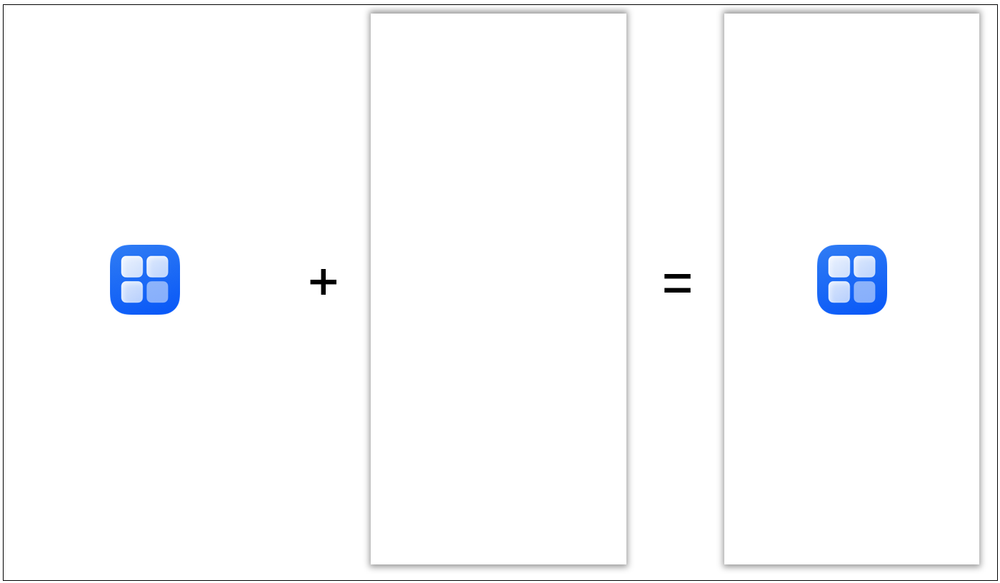
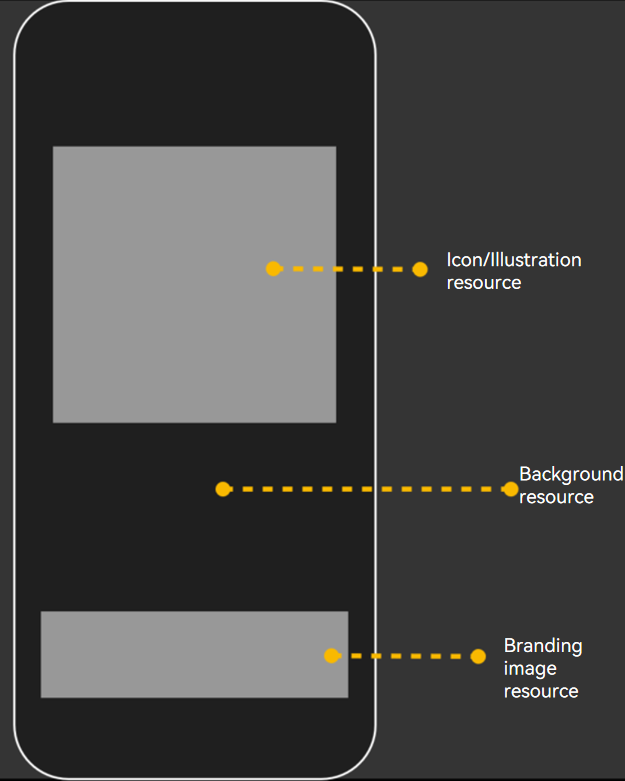

# Configuring the Application Starting Window
<!--Kit: ArkUI-->
<!--Subsystem: Window-->
<!--Owner: @waterwin-->
<!--Designer: @nyankomiya-->
<!--Tester: @qinliwen0417-->
<!--Adviser: @ge-yafang-->

## Classification and Implementation of Starting Windows

Starting windows are divided into two categories: simple starting windows and enhanced starting windows. You can configure starting window resources through the [abilities tag](../quick-start/module-configuration-file.md#abilities) in the **module.json5** file. The following table describes the involved fields.

| Field| Type| Optional| Description|
| -------- | -------- | -------- | -------- |
| startWindowIcon | string | No| Index of the icon resource file for the simple starting window of the current UIAbility. The value is a string with a maximum of 255 bytes.<br>This icon is displayed at its actual size at the center of the starting window.<br>This field is invalid when **startWindow** is configured.|
| startWindowBackground | string | No| Index of the background color resource file for the simple starting window of the current UIAbility. The value is a string with a maximum of 255 bytes.<br>Considering the display effects of the starting window in various scenarios and the continuity of system animations, a transparent color is not recommended.<br>This field is invalid when **startWindow** is configured.|
| startWindow | string | Yes| Index of the JSON file for the enhanced starting window of the current UIAbility. The value is a string with a maximum of 255 bytes.<br>This field points to a level-2 JSON file. When your application needs to configure an enhanced starting window, set this field to provide more resource configurations.<br><!--RP1-->Starting from API version 20, this field can be used to configure enhanced starting windows.<!--RP1End--> |

## Configuring a Simple Starting Window

A simple starting window is mandatory for every UIAbility. You can set the **startWindowIcon** and **startWindowBackground** fields in the [abilities tag](../quick-start/module-configuration-file.md#abilities) of the **module.json5** file to configure a simple starting window.

> **NOTE**
>
> - **startWindowIcon** is used to display the application icon, which is not scaled with the window size. You should avoid configuring **startWindowIcon** tailored to the full-screen size of a single device, as this can lead to improper display on devices of other sizes.
>
> - For details about full-screen resource display, see [Configuring an Enhanced Starting Window](#configuring-an-enhanced-starting-window).

In the created UIAbility template, the default configuration for the simple starting window fields is as follows:

```json
"startWindowIcon": "$media:startIcon",
"startWindowBackground": "$color:start_window_background",
```

The following figure shows the default starting window.

**Figure 1** Default starting window



You can customize the icon and color resources as required.

## Configuring an Enhanced Starting Window

<!--RP1-->Starting from API version 20, the **startWindow** field can be used to configure enhanced starting windows.<!--RP1End-->

The **startWindow** field provides enhanced capabilities for configuring starting windows with more complex elements. In addition, the corresponding resources can be scaled based on the window size, which facilitates multi-device deployment with a set of code.

> **NOTE**
>
> - The creation of the application process includes decoding of the starting window image resources. Therefore, using images with appropriate resolution is key to reduce the application startup latency. If you have high requirements on the startup experience, you are advised to use image resources with a resolution of no more than 256\*256.
> 
> - The image resources on the starting window support the same file formats as the [Image](../reference/apis-arkui/arkui-ts/ts-basic-components-image.md) component. To ensure decoding performance and display quality, you are advised to use JPG or PNG images.

1. In the created UIAbility template, add the **startWindow** field to point to a level-2 JSON file to enable enhanced configuration for the starting window.

   You are advised to create a JSON file named **start_window.json** and place it in the **resources/base/profile** directory. In this case, configure the following field in the **abilities** tag of the **module.json5** file:

   ```json
   "startWindow": "$profile:start_window"
   ```

2. Configure the fields in the level-2 JSON file. The starting window resources are mainly displayed in the upper and lower areas on the screen. If the resources for the corresponding areas are not configured, they will be left blank, and the positions and sizes of other areas will not be affected.

   The following describes the fields that can be configured and shows the final effect of the enhanced starting window.

   | Field| Type| Optional| Description|
   | -------- | -------- | -------- | -------- |
    | startWindowType | string | Yes| Whether the current UIAbility component hides the starting window.<br>This field is supported only on 2-in-1 devices or tablets in free windows mode.<br>The options are as follows:<br>\- **REQUIRED_SHOW**: The starting window is always displayed. This setting is not affected by the setting of the **hideStartWindow** field in [StartOptions](../reference/apis-ability-kit/js-apis-app-ability-startOptions.md#startoptions).<br>\- **REQUIRED_HIDE**: The starting window is always hidden. This setting is not affected by the setting of the **hideStartWindow** field in [StartOptions](../reference/apis-ability-kit/js-apis-app-ability-startOptions.md#startoptions).<br>\- **OPTIONAL_SHOW**: The starting window is displayed by default, but it can be hidden if the **hideStartWindow** field in [StartOptions](../reference/apis-ability-kit/js-apis-app-ability-startOptions.md#startoptions) is set to hide it.<br>\- The default value is **REQUIRED_SHOW**.<br>This field is supported since API version 20.|
   | startWindowAppIcon | string | Yes| Index of the icon resource file for the enhanced starting window of the current UIAbility. The value is a string with a maximum of 255 bytes.<br>The icon is displayed in the upper part of the window and is scaled by the system to fit the display area while maintaining its aspect ratio.<br>The size of the display area for the icon is determined by the system based on the window size. The value can be 128vp\*128vp, 192vp\*192vp, or 256vp\*256vp.<br>When this field and **startWindowIllustration** are both configured, only the icon is displayed.<br><!--RP2-->This field is supported since API version 20.<!--RP2End--> |
   | startWindowIllustration | string | Yes| Index of the illustration resource file for the enhanced starting window of the current UIAbility. The value is a string with a maximum of 255 bytes.<br>The illustration is displayed in the upper part of the window. If the resource size exceeds the display area, the illustration is scaled down by the system while maintaining its aspect ratio to fit the display area; otherwise, its size remains unchanged.<br>The aspect ratio of the display area for the illustration is 1:1.<br>When this field and **startWindowAppIcon** are both configured, only the icon is displayed.<br><!--RP2-->This field is supported since API version 20.<!--RP2End--> |
   | startWindowBrandingImage | string | Yes| Index of the branding image file for the enhanced starting window of the current UIAbility. The value is a string with a maximum of 255 bytes.<br>The branding image is displayed in the lower part of the window. If the resource size exceeds the display area, the branding image is scaled down by the system while maintaining its aspect ratio to fit the display area; otherwise, its size remains unchanged.<br>If the window height is less than 300 vp, this resource will be hidden.<br><!--RP2-->This field is supported since API version 20.<!--RP2End--> |
   | startWindowBackgroundColor | string | No| Index of the background color resource file for the enhanced starting window of the current UIAbility. The value is a string with a maximum of 255 bytes.<br>The background color fills the entire window and is displayed at the lowest layer. Therefore, you are not advised to use a transparent color.<br>If this field is not set, the configuration file of the enhanced starting window does not take effect, and the simple starting window is used.<br><!--RP2-->This field is supported since API version 20.<!--RP2End--> |
   | startWindowBackgroundImage | string | Yes| Index of the background image resource file for the enhanced starting window of the current UIAbility. The value is a string with a maximum of 255 bytes.<br>The background image fills the entire window, and the fill mode is specified by **startWindowBackgroundImageFit**.<br><!--RP2-->This field is supported since API version 20.<!--RP2End--> |
   | startWindowBackgroundImageFit | string | Yes| Filling mode of the background image used in the enhanced starting window of the current UIAbility. The options are as follows:<br>- **Contain**: maintains the aspect ratio and scales down or up the image to fit within the display boundaries.<br>- **Cover**: maintains the aspect ratio and scales down or up the image so that both sides are greater than or equal to the display boundaries.<br>- **Auto**: scales down or up the image based on its own size and fills the display boundaries while maintaining the aspect ratio.<br>- **Fill**: scales down or up the image to fill the display boundaries without maintaining the aspect ratio.<br>- **ScaleDown**: displays the image with its aspect ratio retained, in a size smaller than or equal to the original size.<br>- **None**: displays the image in its original size.<br>The default value is **Cover**.<br><!--RP2-->This field is supported since API version 20.<!--RP2End--> |
   <!--RP3--><!--RP3End-->
   
**Figure 2** Enhanced starting window
   

   
Example:
   
   <!--RP4-->
   ```json
   {
     "startWindowType": "REQUIRED_SHOW",
     "startWindowAppIcon": "$media:icon",
     "startWindowIllustration": "$media:illustration",
     "startWindowBrandingImage": "$media:brand",
     "startWindowBackgroundColor": "$color:start_window_background",
     "startWindowBackgroundImage": "$media:bgImage",
     "startWindowBackgroundImageFit": "Contain"
   }
   ```
   <!--RP4End-->
