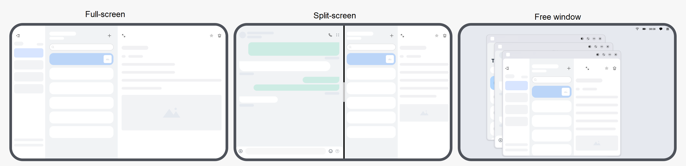
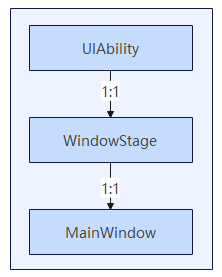
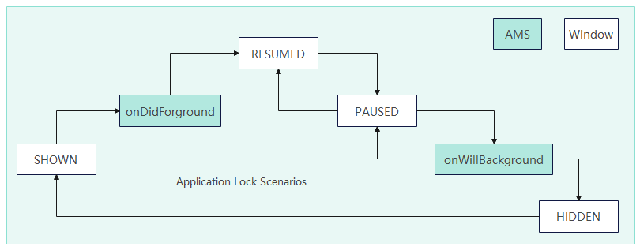

# Window Overview

<!--Kit: ArkUI-->
<!--Subsystem: Window-->
<!--Owner: @Pakoo007-->
<!--Designer: @ki_ja-->
<!--Tester: @qinliwen0417-->
<!--Adviser: @ge-yafang-->

## Introduction

The Window module provides a mechanism for displaying multiple application UIs and allowing the end user to interact with them on the same physical screen.

- For application developers, the Window module provides APIs for UI display and user interaction.

- For end users, the Window module provides a way to control application UIs.

- For the entire operating system, the Window module provides logic for application UI management.

## Features

The Window module has the following features:

-  **Provides a Window object to hold application and system UIs.** You can load your application UIs through the window to display them to the end user.

-  **Maintains the window relationship (overlay layers and positions).** Different types of application and system windows have different default positions and overlay layers (z-index). End users can adjust the position and overlay layer of a window within a certain range.

-  **Provides window decoration.** Window decoration refers to the title bar and border of a window. The title bar usually provides the Maximize, Minimize, and Close buttons and has the default click behavior. The border can be dragged to relocate or resize the window. Window decoration is a system-level default behavior. You can enable or disable window decoration without paying attention to the implementation at the UI code layer.

-  **Provides window animations.** When a window is displayed, hidden, or switched, an animation is usually used to smooth the interaction process. This is the default behavior for application windows. You do not need to set or modify the code.

-  **Provides guidance for input event distribution.** Events are distributed based on the window status and focus. Touch and mouse events are distributed based on the window position and size, and keyboard events are distributed to the focused window. You can call APIs provided by the Window module to set whether a window is touchable and can gain focus.

## Basic Concepts

### Window Type

The Window module provides system windows and application windows.
- A **system window** implements specific functionalities of the system. Examples include the volume bar, wallpaper, notification panel, status bar, and navigation bar.
- An **application window** is related to the application display. Based on the displayed content, application windows are further classified into main windows and child windows.
  - A main window shows the application UI and appears on the task management page.
  - A child window is an auxiliary window of an application, such as a dialog box and floating window. It is not displayed on the task management page. Its lifecycle follows that of the main window.

### Application Window Mode

The application window mode refers to the display mode of the main window when it is started. Currently, there are three application window modes: full-screen, split-screen, and freeform window. This support for multiple window modes is known as the multi-window capability.

-  In **full-screen** mode, the main window is displayed on the entire screen when it is started.
-  In **split-screen** mode, the main window occupies part of the screen when it is started, and the other part of the screen is occupied by another window. You can resize the two windows by dragging the split line between them.
-  In **freeform window** mode, the main window may come in any size or position as needed. Multiple freeform windows can be simultaneously displayed on the screen. These freeform windows are arranged on the z-axis in the sequence that they are opened or gain the focus. When a freeform window is clicked or touched, its z-index is incremented and it gains the focus.

## Working Principles

The window implementation and development vary according to the application development model, which can be FA model or stage model.

For details about the overall architecture and design ideas of the two models, see [Application Models](../application-models/application-models.md).

You are advised to use the stage model for window development.

## Main Window Lifecycle

### Lifecycle Overview

In the stage model, each UIAbility corresponds to a WindowStage, and each WindowStage corresponds to an application's main window. The relationship between the UIAbility, the WindowStage, and the application's main window is shown in the figure below.

Each UIAbility instance is bound to an instance of the WindowStage class, which functions as the window manager within the application process. It contains a main window, meaning that the UIAbility instance holds a main window through the WindowStage. This main window provides a drawing area for ArkUI and can load different ArkUI pages.

In the stage model, the main window is managed and its lifecycle is maintained by the UIAbility through WindowStage. Notifications for the creation and destruction of the main window can be received via [onWindowStageCreate](../reference/apis-ability-kit/js-apis-app-ability-uiAbility.md#onwindowstagecreate) and [onWindowStageDestroy](../reference/apis-ability-kit/js-apis-app-ability-uiAbility.md#onwindowstagedestroy). For details, see [UIAbility Lifecycle](../application-models/uiability-lifecycle.md).

### Lifecycle States

The lifecycle state of a window changes when it enters the foreground, switches between the foreground and background, or moves to the background.

In the stage model, the lifecycle states of the main window include:
- **SHOWN**: The window enters the foreground. The SHOWN event is triggered when an application switches from the background to the foreground.

- **RESUMED**: The window becomes interactive. The RESUMED event is triggered when the window moves to the foreground. It is also triggered when the window is restored.

- **PAUSED**: The window becomes non-interactive. The PAUSED event is triggered when the window is visible in the foreground but not interactive. The window remains in this state until it is restored or moves to the background. If the window is restored, the RESUMED event is triggered, and the window becomes interactive again.

- **HIDDEN**: The window moves to the background. The HIDDEN event is triggered when the application switches from the foreground to the background.

> **NOTE**
>
> The RESUMED and PAUSED events are triggered when the window switches to the foreground and background, respectively. However, in some scenarios, the triggering of these events may differ.
> - For example, in some system-controlled scenarios, such as application management, when an application window switches to the foreground and enters an authentication screen, the PAUSED event is triggered. After authentication is successful, the RESUMED event is triggered.

|**Lifecycle State**|**Example Triggers**|
|---------------|---------------|
|SHOWN          |Occurs when the application is launched in full-screen mode or a floating window opens.|
|RESUMED        |Occurs when the application is launched in full-screen mode, a floating window opens, or the application is resumed after being swiped up into hover mode.|
|PAUSED         |Occurs when the application exits to the home screen, the user swipes up in full-screen mode to enter multitasking mode, or the application is under system control in full-screen mode.|
|HIDDEN         |Occurs when an application is swiped up (in full-screen mode) and exits to the home screen, or it is moved to the background or is destroyed.|

The flow of lifecycle events for the application's main window is shown in the figure below.

**Special scenario**: If the application is system-controlled, it enters the PAUSED state and triggers a callback notification during the startup process or while in the RESUMED state.

### Listening for Lifecycle State Changes

If you need to detect changes in the lifecycle of the application's main window, you can use the following registration APIs to listen for these changes.

- Before API version 20, you can call [on('windowStageEvent')](../reference/apis-arkui/arkts-apis-window-WindowStage.md#onwindowstageevent9) to register a listener for the WindowStage lifecycle changes and call [off('windowStageEvent')](../reference/apis-arkui/arkts-apis-window-WindowStage.md#offwindowstageevent9) to unregister the listener. This registration API does not ensure the order of lifecycle state transitions and is not recommended for use when the order of states matters.
- From API version 20 onwards, you can call [on('windowStageLifecycleEvent')](../reference/apis-arkui/arkts-apis-window-WindowStage.md#onwindowstagelifecycleevent20) to register a listener for the WindowStage lifecycle changes and call [off('windowStageLifecycleEvent')](../reference/apis-arkui/arkts-apis-window-WindowStage.md#offwindowstagelifecycleevent20) to unregister the listener. This registration API does not support listening for focus gain/loss states of the WindowStage. For such requirements, use [on('windowEvent')](arkts-apis-window-Window.md#onwindowevent10). For applications requiring a specific order of lifecycle states, this API is recommended.

### Differentiated Lifecycle Behaviors Across Different Devices

In the stage model, when the main window of an application moves from the foreground to the background, it also triggers the UIAbility lifecycle transition. You need to pay special attention to the differences in behavior across different types of products.

- **On phones**: When a window moves from the foreground to the background, it triggers the UIAbility to transition to the background.

- **On tablets**:

  - For applications that do not support running on 2-in-1 devices, or that can run on both phones and 2-in-1 devices, moving a window from the foreground to the background will trigger the UIAbility to transition to the background.

  - For applications that do not support running on phones but do support running on  2-in-1 devices, moving a window from the foreground to the background will not trigger the UIAbility to transition to the background.

- **On 2-in-1 devices**:

  - For applications that support running on phones, moving a window from the foreground to the background will trigger the UIAbility to transition to the background.

  - For applications that do not support running on phones, moving a window from the foreground to the background will not trigger the UIAbility to transition to the background.

## Constraints

-  You cannot develop system windows in the FA model.

-  The application main window and child window have the following size limits: [320, 2560] in width and [240, 2560] in height, both in units of vp.

-  The system window has the following size limits: (0, 2560] in width and (0, 2560] in height, both in units of vp.
