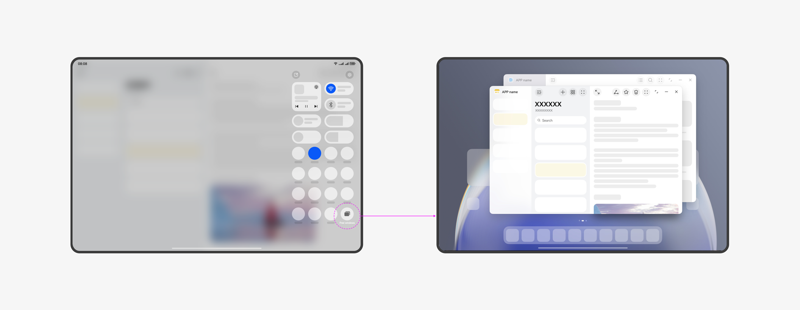

# Window Development Terminology
<!--Kit: ArkUI-->
<!--Subsystem: Window-->
<!--Owner: @waterwin-->
<!--Designer: @nyankomiya-->
<!--Tester: @qinliwen0417-->
<!--Adviser: @ge-yafang-->

## Free Windows

Free windows mode is an interaction method that enables multitasking on mobile devices. 

It allows multiple application windows to be displayed on a single screen simultaneously. These windows are known as [freeform window](#freeform-window).

On some tablets, you can enable free windows mode by pulling down Control Panel and tapping the **Free windows** button.

## Freeform Window

A freeform window is a type of window that can be displayed on the same screen with flexible size and position. These windows support multitasking features such as dragging, resizing, and split-screen combinations.

Freeform windows are stacked on the Z-axis in the order they are opened or gain focus. When a freeform window is clicked or touched, it is brought to the front and gains focus.

When a new freeform window is launched, it appears with a certain gap in the bottom-right corner of the previous window by default.

Each freeform window includes a window title bar at the top by default. The title bar displays the application icon on the left and three control buttons on the right: maximize/restore, minimize, and close. The window title bar also supports [immersive configurations](https://developer.huawei.com/consumer/en/doc/best-practices/bpta-multi-device-window-immersive#section1477255312219).

You can resize a freeform window by dragging its edges and move its position by dragging the title bar.

**Device Support**

-  **2-in-1 devices**: Windows on 2-in-1 devices are freeform window by default.
-  **Tablets**: Some tablets support enabling [free windows](#free-windows) mode by pulling down Control Panel and tapping the **Free windows** button. Once this mode is enabled, application windows default to freeform windows.
