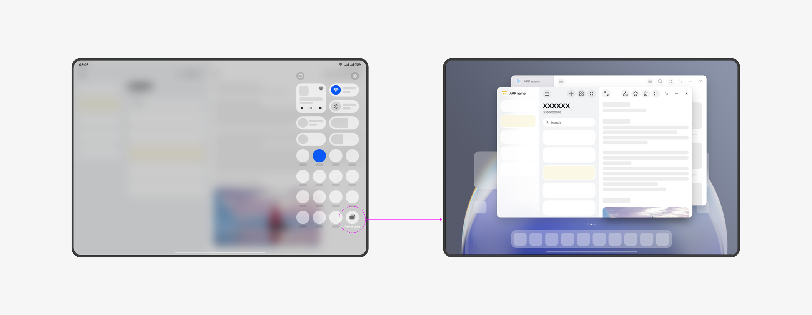
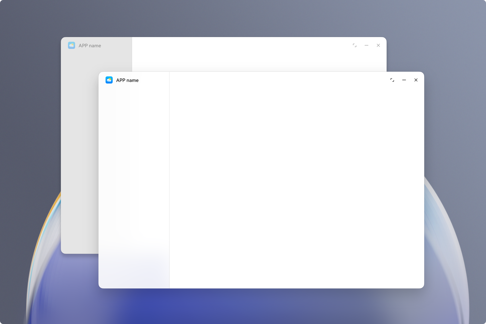
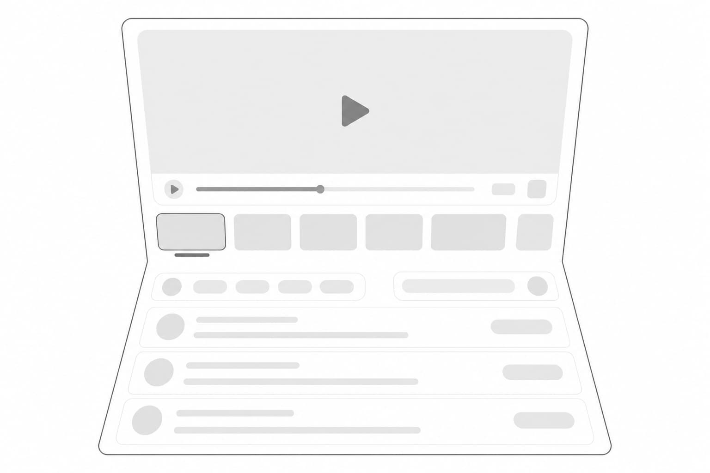

# Glossary

<!--Kit: ArkUI-->
<!--Subsystem: Window-->
<!--Owner: @fei_1007-->
<!--Designer: @gcw_sPCsris4-->
<!--Tester: @qinliwen0417-->
<!--Adviser: @ge-yafang-->
<!-- md-trans-meta sourceCommit=54dc7554dea4c1b6805cb68cfbad38cdf73c9182 translatedAt=2026-08-11T10:13:20.285Z pushedAt=2026-08-12T03:23:29.765Z -->

## F

### Floating Window

Floating windows are divided into multi-window floating windows, global floating windows, and [float views](../reference/apis-arkui/js-apis-floatView.md).

- Multi-window floating windows are non-full-screen application windows that float on the device screen.

  They are typically used to temporarily handle another task while a full-screen task is running or for short-term parallel use of multiple tasks, such as replying to messages while browsing the web.

  For details, see [Introduction to Multi-Window](https://developer.huawei.com/consumer/en/doc/harmonyos-guides/multi-window-intro) and [Multi-Window](https://developer.huawei.com/consumer/en/doc/best-practices/bpta-multi-window-practice).

- A global floating window is a special type of app auxiliary window that can remain displayed on the foreground even after the app's main window and corresponding UIAbility are moved to the background.

  Global floating windows can be used to continue displaying the UI in a small window after the app is moved to the background.

  Before creating a global floating window, the application needs to request the corresponding permission.

  For details, see [Global Floating Window Development Guide](global-floating-window-guide.md).

- A float view is a special type of app auxiliary window whose UI is managed and rendered by the system. It can remain displayed on the foreground even after the app's main window and corresponding UIAbility are moved to the background.

  The UI and animations of a float view are managed by the system. It supports binding with the [floating ball](../reference/apis-arkui/js-apis-floatingBall.md) for combined use. When the user taps the floating ball, it expands into a float view. When the user taps the minimize button in the upper-left corner of the float view, it collapses back into the floating ball, enabling seamless switching between the two window forms. Float views are suitable for scenarios where app content needs to be continuously displayed or quick actions need to be provided in a separate small window, such as monitoring real-time stock market changes in a stock tracking app or displaying a custom interactive panel and control interface in a mobile live streaming app.

  Before creating a float view, the app needs to request the corresponding permission.

  For details, see <!--RP1-->[@ohos.window.floatView (Float View)](../reference/apis-arkui/js-apis-floatView.md)<!--RP1End-->.

### Free Windows

This mode is an interaction method that supports users in performing multitasking on mobile devices.

In free windows mode, multiple app windows can be displayed simultaneously on a single screen. In this mode, app windows are [freefrom windows](#freeform-window).

On some tablets, you can pull down Control Panel and tap the free windows button to enable the free windows mode.

On some phones, you can pull down Control Panel and tap the free windows button to enable the free windows mode.

### Freeform Window

Freeform windows are a type of window that can be displayed on the same screen with flexible size and position. These windows support multitasking features such as dragging, resizing, and split-screen combinations.

Freeform windows are stacked on the Z-axis in the order they are opened or gain focus. When a freeform window is clicked or touched, it is brought to the front and gains focus.

When a new freeform window is launched, it appears with a certain gap in the bottom-right corner of the previous window by default.

Each freeform window includes a window title bar at the top by default. The title bar displays the application icon on the left and three control buttons on the right: maximize/restore, minimize, and close. The window title bar also supports [immersive configurations](https://developer.huawei.com/consumer/en/doc/best-practices/bpta-multi-device-window-immersive#section359241062916).

You can resize a freeform window by dragging its edges and move its position by dragging the title bar.

**Device Support**

-  **2-in-1 devices**: Windows on 2-in-1 devices are [freeform window](#freeform-window) by default.

-  **Tablets**: Some tablets support enabling [Free Windows](#free-windows) mode by pulling down Control Panel and tapping the **Free windows** button. Once this mode is enabled, app windows default to [freeform windows](#freeform-window).

-  **Phones**: Some phones support enabling [Free Windows](#free-windows) mode by pulling down Control Panel and tapping the **Free windows** button. Once this mode is enabled, app windows default to [freeform windows](#freeform-window).

## G

### Global Coordinate System

The global coordinate system refers to a coordinate system that uniformly describes the positions of objects such as windows and pointers in scenarios where a device is connected to an [extended screen](../displaymanager/display-terminology.md#extended-screen) (multiple physical displays). It takes the upper-left corner of the main screen as the origin (0, 0), with the right side of the screen as the positive direction of the x-axis and the bottom side of the screen as the positive direction of the y-axis.

In this coordinate system, all physical screens are mapped to the same continuous virtual coordinate space. Various window operations, coordinate conversions, and window rectangle change events are calculated and called back based on this coordinate space.

Usage scenarios:

- Cross-screen window movement: Call the API based on the global coordinate system to move a window. There is no need to pass specific screen ID parameters to move the window between multiple screens.

- Window position change monitoring: Monitor window rectangle change events based on the global coordinate system to uniformly obtain information about changes in the position and size of the window in a multi-screen environment.

## I

### Immersive Layout

A state in which the app's layout area extends to the entire window display area. In immersive layout, the available layout area within the app extends to the full window size. The app UI layout content can overlap with the system UI, but system UI elements always remain above the app content in the layer hierarchy.

## P

### Desktop Mode

An interaction method that supports multi-tasking on mobile devices. In Desktop Mode, multiple app windows can be displayed simultaneously on a single screen. In this mode, app windows are [freeform window](#freeform-window). On some tablets, you can enable Desktop Mode by pulling down Control Panel and tapping the **Desktop mode** button.

## S

### Multi-Window

A practical paradigm that combines multiple window modes, allowing multiple app windows to run simultaneously on the same screen at the same time in the form of floating windows, split-screen mode, or panoramic multi-window, thereby enabling multi-tasking. Multi-Window includes various display modes such as multi-window floating windows, split-screen mode, and panoramic multi-window.

### Starting Window

The first page displayed during a cold start of an app. The starting window is shown before the app process starts running or before the app content finishes loading. It serves the function of showcasing the app's brand identity. You can configure resources based on your app's design to display the product's unique identifier.

## L

### Level-1 Subwindow

A subwindow whose direct parent is the main window, excluding any second-level or deeper subwindows.

## W

### Window Posture Mode

Window Posture Mode (**WindowPostureMode**) refers to the layout mode of a window when the device meets specific physical form conditions. You can adjust the in-app layout based on the window posture mode to improve the interactive experience under different device physical forms.

Currently supported window posture modes:

- Desktop mode (DESKTOP_MODE):

  Desktop mode is suitable for scenarios where a foldable device is in a half-folded state, with the window covering the entire screen and adapting different layouts between the upper and lower halves, such as video playback and reading.

  

### Window Privacy Mode

A special display mode for windows. A window set to privacy mode is called a privacy window. The content of a privacy window cannot be captured by screenshot, screen recording, or screen mirroring. This is mainly used in scenarios where screenshot, screen recording, or screen mirroring is prohibited, typically for pages containing sensitive information such as passwords.