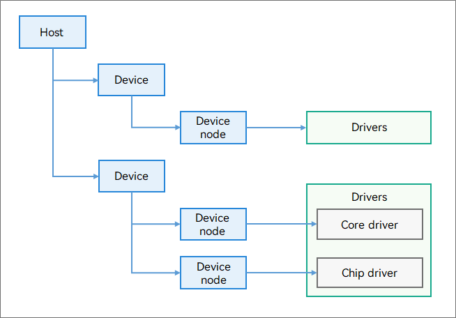

# HDF Driver Coding Guide

## About This Document

### Purpose

OpenHarmony aims to build an open, distributed OS framework for smart IoT devices in the full-scenario, full-connectivity, and full-intelligence era. It has the following technical features: hardware collaboration for resource sharing, one-time development for multi-device deployment, and a unified OS for flexible deployment.

The Hardware Driver Foundation (HDF) provides the following driver framework capabilities: driver loading, driver service management, and driver message mechanism. This unified driver architecture system is designed to provide a more precise and efficient development environment, where you can perform one-time driver development for multi-system deployment.

As such, certain coding specifications are required for the OpenHarmony driver implemented based on the HDF. This document stipulates the specifications on the driver code, helping you improve code standardization and portability.

## Coding Guide

### General Principles

#### [Rule] Use the capabilities provided by the HDF to implement drivers.

[Description] The HDF supports driver loading, driver service management, and driver message mechanism. It provides the Operating System Abstraction Layer (OSAL) and Platform Abstraction Layer (PAL) to support cross-system and cross-platform driver deployment. It also provides capabilities such as driver model abstraction, common tools, and peripheral component framework. You should develop drivers based on these capabilities to ensure that the drivers can be deployed on various devices powered by OpenHarmony.

#### [Rule] Follow this coding guide to develop drivers that can run in both the kernel space and user space.

[Description] Kernel-mode drivers are different from user-mode drivers in essence. They apply to different use cases. You must follow this guide during service design and development and use the HDF OSAL and PAL to shield the differences, so as to ensure that the drivers can run in both the kernel space and user space.

#### [Rec] Include the drivers/framework/include directory instead of a subdirectory in the build script.

[Description] The **drivers/framework/include** directory is the root directory of the header file exposed by the HDF externally. This directory contains multiple subdirectories to represent different modules such as the core framework, OSAL, and PAL. When using a header file, you are advised to include the **drivers/framework/include** directory in the build script. This avoids repeated inclusion when the script is referenced in the code.

[Example]

```gn
config("xxxx_private_config") {
  include_dirs = [
    "//drivers/framework/include",
    "//drivers/framework/include/core", # Not recommended.
  ]
}
```

```c
#include <core/hdf_device_desc.h>
#include <hdf_device_desc.h> // Not recommended.
```

### HDF Core Framework

#### [Rule] Implement the Bind, Init, and Release methods based on the responsibility definitions in the HdfDriverEntry object.

[Description] The **HdfDriverEntry** object is the entry of an HDF driver. The **Bind**, **Init**, and **Release** methods have their own responsibilities. You must implement the corresponding functions based on the responsibilities.

```c
struct HdfDriverEntry g_sampleDriverEntry = {
    .moduleVersion = 1,
    .moduleName = "sample_driver",
    .Bind = SampleDriverBind, // Responsibility: Bind the service interface provided by the driver to the HDF.
    .Init = SampleDriverInit, // Responsibility: Initialize the driver service.
    .Release = SampleDriverRelease, // Responsibility: Release driver resources. It is invoked when an exception occurs.
};

HDF_INIT(g_sampleDriverEntry);
```

#### [Rule] The first member in the driver service structure must be of the IDeviceIoService type.

[Description] The first member of the service interface defined by the driver must be of the **IDeviceIoService** type.

[Example]

```c
struct ISampleDriverService {
    struct IDeviceIoService ioService; // The first member must be of the IDeviceIoService type.
    int32_t (*FunctionA)(void); // The first service interface of the driver.
    int32_t (*FunctionB)(uint32_t inputCode); // The second service interface of the driver. More service interfaces can be added here.
};
```

[Example]

```c
struct ISampleDriverService {
    struct IDeviceIoService ioService; // The first member must be of the IDeviceIoService type.
    void *instance; // A service instance can be encapsulated here to provide service interfaces.
};
```

#### [Rule] All driver service interfaces must be bound using the Bind method of the HdfDriverEntry object. All service interfaces must be defined. They cannot be defined as null.

[Description] The service interfaces defined by the driver are exposed externally. If a service interface is not defined or is defined as null, exceptions may occur during external invocation.

[Example]

```c
int32_t SampleDriverBind(struct HdfDeviceObject *deviceObject)
{
    static struct ISampleDriverService sampleDriver = {
        .FunctionA = SampleDriverServiceA,
        .FunctionB = NULL, // The service interface cannot be defined as null.
    };
    // Bind ioService to the device object created by the HDF.
    deviceObject->service = &sampleDriver.ioService;
    return HDF_SUCCESS;
}
```

#### [Rec] Call the HdfDeviceSetClass interface in the Init method of the HdfDriverEntry object to define the driver type.

[Description] Based on the driver type, you can classify the drivers of the current device and query the driver capabilities of the current device. For better driver management, you are advised to call **HdfDeviceSetClass** to set the driver type.

[Example]

```c
int32_t SampleDriverInit(struct HdfDeviceObject *deviceObject)
{
    // Set the driver type to DISPLAY.
    if (!HdfDeviceSetClass(deviceObject, DEVICE_CLASS_DISPLAY)) {
        HDF_LOGE("HdfDeviceSetClass failed");
        return HDF_FAILURE;
    }
    return HDF_SUCCESS;
}
```

### HCS

HDF Configuration Source (HCS) describes the configuration source code of the HDF in the form of key-value pairs. It decouples configuration code from driver code, making it easy for you to manage the driver configuration.

The driver configuration consists of the driver device description defined by the HDF and the private configuration of a driver.

**Driver Device Description**

The driver loading information required by the HDF comes from the driver device description. Therefore, you must add the driver device description to the **device_info.hcs** file defined by the HDF.

#### [Rule] Before configuring a driver, determine the hardware to which the driver belongs and the deployment mode, and plan the directories and files to be configured.

[Description] In the **vendor** directory of the OpenHarmony source code, plan the directories based on the chip vendor, development board, and configuration. The HDF driver configuration is stored in the **hdf\_config** directory. According to the hardware specifications, the **hdf\_config** directory stores kernel-mode configuration information or both kernel- and user-mode configuration information. You should determine the directory where the driver is to be configured based on the driver hardware and deployment mode.

[Example]

```bash
$openharmony_src_root/vendor/hisilicon/hispark_taurus/hdf_config # Directory for storing the kernel-mode configuration file. There are no user-mode configuration files.

$openharmony_src_root/vendor/hisilicon/hispark_taurus_standard/hdf_config/khdf # Directory for storing the kernel-mode configuration file.
$openharmony_src_root/vendor/hisilicon/hispark_taurus_standard/hdf_config/uhdf # Directory for storing the user-mode configuration file.
$openharmony_src_root/vendor/hisilicon/hispark_taurus_standard/hdf_config/khdf/device_info/device_info.hcs # Device description file of the kernel-mode driver.
$openharmony_src_root/vendor/hisilicon/hispark_taurus_standard/hdf_config/khdf/lcd/lcd_config.hcs # Private configuration file of the kernel-mode driver.
```

#### [Rule] Use existing configuration information and inherit existing configuration templates during driver configuration.

[Description] The **host**, **device**, and **deviceNode** templates have been configured in the **device_info.hcs** file. When configuring a driver, make full use of the existing configuration information and inherit HCS features to minimize your configuration workload.

[Example]

```
root {
    device_info {
        match_attr = "hdf_manager";
        template host { // host template
            hostName = "";
            priority = 100; // Host startup priority. The value ranges from 0 to 200. A larger value indicates a lower priority. The default value 100 is recommended. If the priorities are the same, the host loading sequence cannot be ensured.
            template device { // device template
                template deviceNode { // deviceNode template
                    policy = 0; // Policy for publishing drive services.
                    priority = 100; // Driver startup priority. The value ranges from 0 to 200. A larger value indicates a lower priority. The default value 100 is recommended. If the priorities are the same, the device loading sequence cannot be ensured.
                    preload = 0; // The driver is loaded as required.
                    permission = 0664; // Permission for the driver to create a device node.
                    moduleName = "";
                    serviceName = "";
                    deviceMatchAttr = "";
                }
            }
        }
        // To use the default values in the template, the node fields can be not included.
        sample_host :: host { // sample_host inherits the host template.
            hostName = "host0"; // Host name. The host node is a container used to store a type of drivers.
            device_sample :: device { // device_sample inherits the device template.
                device0 :: deviceNode { // device0 inherits the deviceNode template.
                    policy = 1; // Overwrite the policy in the template.
                    moduleName = "sample_driver"; // Driver name. The value of this field must be the same as that of moduleName in the HdfDriverEntry structure.
                    serviceName = "sample_service"; // Service name of the driver, which must be unique.
                    deviceMatchAttr = "sample_config"; // Keyword for matching the private data of the driver. The value must be the same as that of match_attr in the private data configuration table of the driver.
                }
            }
        }
    }
}
```

#### [Rule] Use the defined types during driver model design and classification. Do not configure hosts and devices repeatedly.

[Description] The HDF places the same type of devices in the same host. You can develop and deploy the driver functionalities of the host by layer, so that one driver has multiple nodes. The following figure shows the HDF driver model.



Place devices of the same type in the same host. When adding a device, check whether the host of the same type already exists. If such a host already exists, configure the device in the host. Do not configure the same host again. A device belongs to only one driver. Therefore, do not configure the same device in different hosts.

#### [Rule] Set publication policies for driver services based on service rules.

[Description] The driver service is the object of capabilities provided by the driver to external systems and is managed by the HDF in a unified manner. The HDF uses the **policy** field in the configuration file to define policies for drivers to publish services externally. The values and meanings of this field are as follows:

```c
typedef enum {
    /* The driver does not provide services.*/
    SERVICE_POLICY_NONE = 0,
    /* The driver provides services for kernel-space applications. */
    SERVICE_POLICY_PUBLIC = 1,
    /* The driver provides services for both kernel- and user-space applications. */
    SERVICE_POLICY_CAPACITY = 2,
    /** Driver services are not published externally but can be subscribed to. */
    SERVICE_POLICY_FRIENDLY = 3,
    /* Driver services are not published externally and cannot be subscribed to. */
    SERVICE_POLICY_PRIVATE = 4,
    /** Invalid policy. */
    SERVICE_POLICY_INVALID
} ServicePolicy;
```

You must set the policies based on service rules. Do not set unnecessary policies, for example, setting user-mode publication policies for kernel-mode drivers.

[Example]

```
root {
    device_info {
        sample_host {
            sample_device {
                device0 {
                    policy = 1; // The driver provides services for kernel-space applications. 
                    ...
                }
            }
        }
    }
}
```

#### [Rule] The permission to create device nodes for a driver must match the publication policy of the driver.

[Description] In the **device_info.hcs** file, the **permission** field specifies the permission used by the driver to create a device node. This field is a 4-digit octal number and uses the Unix file permissions, for example, 0644. This field takes effect only when the driver provides services for user-space applications (policy = 2).

You must ensure that the publication policy of the driver service matches the device node permission. Otherwise, access to the driver service may fail or the permission of the device node may be inappropriate.

[Example]

```
root {
    device_info {
        sample_host {
            sample_device {
                device0 {
                    policy = 2; // The driver provides services for both kernel- and user-space applications.
                    permission = 0640; // Recommended value
                    ...
                }
            }
        }
    }
}
```

[Counterexample]

```
root {
    device_info {
        sample_host {
            sample_device {
                device0 {
                    policy = 2; // The driver provides services for both kernel- and user-space applications.
                    permission = 0777; // Excessive permission.
                    ...
                }
            }
        }
    }
}
```

[Counterexample]

```
root {
    device_info {
        sample_host {
            sample_device {
                device0 {
                    policy = 1; // The driver provides services for kernel-space applications but does not create a device node.
                    permission = 0640; // Redundancy configuration
                    ...
                }
            }
        }
    }
}
```

#### [Rule] Configure whether to load a driver as required based on service requirements.

[Description] In the **device_info.hcs**, **preload** specifies the driver loading mode. The values and meanings of this field are as follows:

```c
typedef enum {
    /* The driver is loaded by default during the system boot process. */
    DEVICE_PRELOAD_ENABLE = 0,
    /* The driver is loaded after a quick start is complete if the system supports quick start. If the system does not support quick start, this value has the same meaning as DEVICE\_PRELOAD\_ENABLE. */
    DEVICE_PRELOAD_ENABLE_STEP2,
    /* The driver is not loaded during the system boot process. When a user-mode process requests the driver service, the HDF attempts to dynamically load the driver if the driver service does not exist. */
    DEVICE_PRELOAD_DISABLE,
    /** Invalid value. */
    DEVICE_PRELOAD_INVALID
} DevicePreload;
```

Set the **preload** field based on the service requirements.

[Example]

```
root {
    device_info {
        sample_host {
            sample_device {
                device0 {
                    preload = 2; // The driver is loaded as required.
                    ...
                }
            }
        }
    }
}
```

#### [Rec] When the preload field is set to 0, configure the loading priority based on the service requirements.

[Description] In the **device_info.hcs** file, the **priority** field indicates the host and driver loading priority. The value of this field is an integer ranging from 0 to 200. For drivers in different hosts, a smaller priority value of the host indicates a higher driver loading priority. For drivers in the same host, a smaller priority value of the driver indicates a higher driver loading priority. The default value of the **priority** field is 100. If this field is not set or set to the same value for different drivers, the driver loading sequence cannot be ensured. You should configure the **priority** field based on the service requirements to ensure the driver loading sequence.

[Example]

```
root {
    device_info {
        sample_host0 {
        priority = 100;
            sample_device {
                device0 {
                    preload = 0; // The driver is loaded by default.
                    priority = 100; // The HDF ensures that the driver is loaded before device1.
                    ...
                }
                device1 {
                    preload = 0; // The driver is loaded by default.
                    priority = 200; // The HDF ensures that the driver is loaded after device0.
                    ...
                }
            }
        }
        sample_host1 {
            priority = 100; // The HDF does not ensure the loading sequence because this host has the same priority as sample_host0.
            ...
        }
    }
}
```

**Private Configuration Information of the Driver**

If a driver has private configurations, you can add a driver configuration file to fill in default configurations of the driver. When loading the driver, the HDF obtains the configuration information, saves it in the **property** field of **HdfDeviceObject**, and passes it to the driver through **Bind** and **Init**.

#### [Rule] Store the private configuration files of the drivers in different directories according to the component type or module.

[Description] You must properly plan the directory for storing private configuration files of drivers. Do not store them in the root directory.

[Example]

```bash
$openharmony_src_root/vendor/hisilicon/hispark_taurus_standard/hdf_config/khdf/sample/sample_config.hcs # Correct. The private configuration file is stored in the sample directory.

$openharmony_src_root/vendor/hisilicon/hispark_taurus_standard/hdf_config/khdf/sample_config.hcs # Incorrect. The private configuration file is placed in the root directory.
```

#### [Rule] Add the private configuration file of a driver to the hdf.hcs file in the hdf_config directory.

[Description] The **hdf.hcs** file summarizes the configuration information. The HDF parses the file content and loads the private configuration information of the driver to the device node during the build and runtime. Include the private configuration file of the driver in the **hdf.hcs** file to trigger driver initialization.

[Example]

```c
#include "device_info/device_info.hcs"
#include "sample/sample_config.hcs" // The file contains the private configuration file of a driver.

root {
    module = "hisilicon,hi35xx_chip";
}
```

#### [Rule] The value of the matchAttr field in the private configuration file of the driver must be the same as that of the deviceMatchAttr field in device_info.hcs.

[Description] The HDF associates with the driver device through the **match_attr** field. A mismatch causes a failure to obtain the private configuration information.

[Example]

```
root {
    sample_config {
        ...
        match_attr = "sample_config"; // The value of this field must be the same as that of deviceMatchAttr in device_info.hcs.
    }
}
```

#### [Rule] Use underscores (_) in field names in the private configuration file.

[Description] According to the naming rules in the C/C++ coding guide, use underscores (_) in field names in the private configuration file of a driver. In this way, the naming rule is satisfied during the definition of the private configuration data structure in the implementation code. It also makes unified management of the code and configuration files easier.

[Example]

```
root {
    sample_config {
        sample_version = 1; // Use an underscore (_) in the field name.
        sample_bus = "I2C_0";
        match_attr = "sample_config";
    }
}
```

### HCS Macros

The private configuration information of a driver is loaded to **property** of **HdfDeviceObject**. This occupies memory space, which should be avoided for mini- and small-system devices. To minimize the memory usage, the HDF provides HCS macros to parse the private configuration information.

#### [Rule] Use HCS macros to parse the private configuration information in memory-sensitive or cross-system scenario.

[Description] You should specify the use cases of drivers. In memory-sensitive scenarios or if a driver needs to be used in mini-, small-, and standard-system devices, use HCS macros to parse the private configuration information for higher performance and portability.

[Example]

```c
#include <utils/hcs_macro.h>

#define SAMPLE_CONFIG_NODE HCS_NODE(HCS_ROOT, sample_config)

ASSERT_EQ(HCS_PROP(SAMPLE_CONFIG_NODE, sampleVersion), 1);
ASSERT_EQ(HCS_PROP(SAMPLE_CONFIG_NODE, sample_bus), "I2C_0");
ASSERT_EQ(HCS_PROP(SAMPLE_CONFIG_NODE, match_attr), "sample_config");
```

### HDF Tools

#### [Rule] Determine the communication scenario and HdfSbuf type.

[Description] **HdfSbuf** is a data structure used for data transfer. This structure is classified into different types based on the communication scenario. These types are defined in the **hdf_sbuf.h** header file.

```c
enum HdfSbufType {
    SBUF_RAW = 0,   /* SBUF used for communication between the user space and the kernel space. */
    SBUF_IPC,      /* SBUF used for inter-process communication (IPC). */
    SBUF_IPC_HW,    /* Reserved for extension. */
    SBUF_TYPE_MAX,  /* Maximum value of the SBUF type. */
};
```

Determine whether the data transfer is IPC in the user space or between the user space and kernel space, and then create the corresponding **HdfSbuf** structure.

[Example]

```c
void SampleDispatchBetweenUserAndKernel()
{
    int32_t ret;
    /* Communication between the user space and kernel space. */
    struct HdfSBuf *data = HdfSBufTypedObtain(SBUF_RAW);
    ...
    ret = sample->dispatcher->Dispatch(&sample->object, CMD_SAMPLE_DISPATCH, data, NULL);
    ...
    HdfSBufRecycle(data);
}
```

[Example]

```c++
void SampleDispatchIpc()
{
    /* IPC */
    struct HdfSBuf *data = HdfSBufTypedObtain(SBUF_IPC);
    ...
    int ret = sample->dispatcher->Dispatch(sample, CMD_SAMPLE_DISPATCH, data, nullptr);
    ...
    HdfSBufRecycle(data);
}
```

#### [Rule] Define the HDF_LOG_TAG macro when using HDF logging.

[Description] The HDF provides the **hdf_log.h** tool ,using which you can output driver run logs. The **HDF_LOG_TAG** macro specifies the log tag. You must define this macro before printing logs.

[Example]

```c
#include <hdf_log.h>

#define HDF_LOG_TAG sample_driver // Define the log tag.

int32_t SampleDriverInit(struct HdfDeviceObject *deviceObject)
{
    HDF_LOGI("sample driver is initialized"); // Use the tool to print logs.
    return HDF_SUCCESS;
}
```

#### [Rule] Verify the return values of the HDF methods and use the error codes provided by the HDF.

[Description] The HDF methods have specific return values. You should verify them rather than ignoring them. The return values correspond to error codes in the **hdf_base.h** header file. Use the error codes provided by the HDF when using the HDF or implementing custom methods.

[Example]

```c
int32_t SampleDriverInit(struct HdfDeviceObject *deviceObject)
{
    int32_t ret;
    // Check whether the device type is successfully set.
    if (!HdfDeviceSetClass(deviceObject, DEVICE_CLASS_DISPLAY)) {
        HDF_LOGE("HdfDeviceSetClass failed");
        return HDF_FAILURE;
    }
    ret = InitDiver();
    // A custom method uses an error code provided by the HDF.
    if (ret != HDF_SUCCESS) {
        HDF_LOGE("init driver is failed");
        return ret;
    }
    return HDF_SUCCESS;
}
```

### OSAL

The HDF OSAL shields the interface differences between OpenHarmony subsystems and provides unified OS interfaces, including memory management, threads, mutexes, spin locks, semaphores, timers, files, IRQ, time, atoms, firmware, and I/O operation modules.

#### [Rule] Use OS interfaces through the OSAL for drivers used across mini-, small-, and standard-system devices.

[Description] The OSAL shields the differences between OS interfaces. You should operate these OS interfaces based on the OSAL to ensure that drivers can run on different types of systems.

[Example]

```c
#include <osal/osal_mem.h>
#include <util/hdf_log.h>

struct DevHandle *SampleInit(void)
{
    struct DevHandle *handle = (struct DevHandle *)OsalMemCalloc(sizeof(struct DevHandle));
    if (handle == NULL) {
        HDF_LOGE("OsalMemCalloc handle failed");
        return NULL;
    }
    return handle;
}
```

[Example]

```c
#include <osal/osal_time.h>

void SampleSleep(uint32_t timeMs)
{
    OsalMSleep(timeMs);
}
```

### PAL

The HDF PAL abstracts platform drivers and provides unified operation interfaces for modules such as the GPIO, I2C, SPI, UART, RTC, SDIO, eMMC, DSI, PWM, and watchdog.

#### [Rule] Use platform drivers across mini, small, and standard systems through the PAL.

[Description] The PAL masks the differences between platform driver interfaces of different system types. You should operate these interfaces based on PAL to ensure that drivers can run on different types of systems.

[Example]

```c
#include <platform/gpio_if.h>
#include <util/hdf_log.h>
#include <osal/osal_irq.h>
#include <osal/osal_time.h>

static uint32_t g_irqCnt;

/* Sample function of the GPIO IRQ service */
static int32_t SampleGpioIrqHandler(uint16_t gpio, void *data)
{
    HDF_LOGE("%s: irq triggered, on gpio:%u, data=%p", __func__, gpio, data);
    g_irqCnt++; /* If the IRQ function is triggered, the number of global counters is incremented by 1. */
    return GpioDisableIrq(gpio);
}

/* GPIO sample function */
static int32_t SampleGpioIrqEdge(void)
{
    int32_t ret;
    uint16_t valRead;
    uint16_t mode;
    uint16_t gpio = 83; // Number of the GPIO pin to test
    uint32_t timeout;

    /* Set the output direction for the pin. */
    ret = GpioSetDir(gpio, GPIO_DIR_OUT);
    ...
    /* Disable the IRP of this pin. */
    ret = GpioDisableIrq(gpio);
    ...
    /* Set the IRR function for the pin. The trigger mode is both rising edge and falling edge. */
    mode = OSAL_IRQF_TRIGGER_RISING | OSAL_IRQF_TRIGGER_FALLING;
    ret = GpioSetIrq(gpio, mode, SampleGpioIrqHandler, NULL);
    ...
    /* Enable the IRQ for this pin. */
    ret = GpioEnableIrq(gpio);
    ...
    g_irqCnt = 0; /* Reset the global counter. */
    timeout = 0;  /* Reset the waiting time. */
    /* Wait for the IRQ function of this pin to trigger. The timeout duration is 1000 ms. */
    while (g_irqCnt <= 0 && timeout < 1000) {
        ret = GpioRead(gpio, &valRead);
        ...
        ret = GpioWrite(gpio, (valRead == GPIO_VAL_LOW) ? GPIO_VAL_HIGH : GPIO_VAL_LOW);
        ...
        OsalMDelay(200); // Wait for an interrupt to be triggered.
        timeout += 200;
    }
    ret = GpioUnSetIrq(gpio);
    ...
    return (g_irqCnt > 0) ? HDF_SUCCESS : HDF_FAILURE;
}
```
