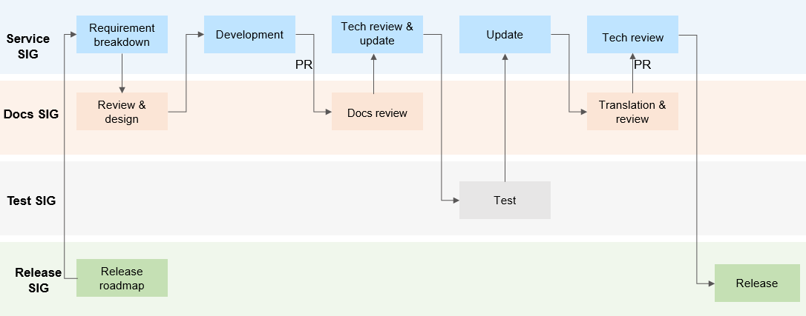

# Writing Documents for a Release

To help developers efficiently use each release, OpenHarmony provides related documents (such as the guide, API reference, development examples, release notes, API changelog, and FAQs) based on the feature requirements planned for the release. Some requirements involve new features and documents, and others require updates to the existing features and documents.

## OpenHarmony Document Development Process

When planning a feature requirement, each service Special Interest Group (SIG) should determine whether the requirement involves new documents or updates to existing documents. If new documents or updates are involved, they should break down the requirement to the Docs SIG for document requirement tracking. The Docs SIG will provide document design suggestions based on the requirement and cooperate with the service SIG in document review, translation, and release. The document development process is shown below.

## Actions for Service SIG Members or Other Developers

Members in each service SIG write basic documents for the release. Developers in the community are welcome to participate in the development of feature documents.

### Breaking Down Document Requirements

1. Provide the **Documents** breakdown in the service SIG requirement issue. If new documents or updates to the existing documents are required, this requirement issue must be liked to the Docs SIG.

2. View the feature requirements of the release in [OpenHarmony Roadmap]( https://gitee.com/openharmony/release-management/blob/master/OpenHarmony-RoadMap.md). This roadmap provides the release time plan, features to deliver, feature status, and SIG information.

   If a feature requirement involves document delivery, add **Yes** in the **Need Docs** column so that the Docs SIG can track the document delivery.

### Developing Documents

If you are a member of a service SIG and are responsible for developing a new feature, you should cooperate with the Docs SIG to ensure that feature documents are available before the release. Any feature that is not provided with related documents may be removed from the release.

If you need help in the document structure, ask questions in the `#SIG-Docs` Zulip.

1. Contact the documentation owner in the Docs SIG for suggestions on document design by referring to [Document Reviewers](docs-reviewers.md).
2. Obtain the corresponding [document template](template) and learn the document writing instructions.
3. Provide detailed documents and usage instructions for the feature as much as possible. After you finish a draft, submit a pull request (PR) and include the link to the corresponding issue in the PR description.

### Submitting Documents for Review Through PRs

To ensure the accuracy of technical description, ask technical experts in the service SIGs to review all new contents. In addition, ask documentation experts in the Docs SIG to review the standardization of the documents. For details, see [Document Reviewers](docs-reviewers.md). To assign experts for review, enter the at sign (@) followed by the experts' usernames in the PR comment area. You can also provide review requirements in the `#SIG-Docs` Zulip.

You should update the draft against all the review comments. The PR can be merged only after both of the following conditions are met:

- The technical expert completes the review and provides the comment `TechApprove`.
- The documentation expert completes the review and provides the comment `DocsApprove`.

### Submitting Documents for Test

Submit your documents for version testing. Testers in the test SIG will submit issues to the Docs repository for any document issues they find. Confirm their comments and update the documents accordingly.

### Submitting Documents for Translation

#### For Documents in the Docs Repository

The OpenHarmony community provides Chinese and English documents. After the Chinese documents are reviewed, tested, and finalized, they can be submitted for translation in the form of issues. Translators in the Docs SIG will complete the English documents.

Translators submit English documents through PRs and provide the link to the corresponding issue in the PR description. To ensure the accuracy of every English document, the translator should ask technical experts in the service SIG for technical review, by entering the at sign (@) followed by the experts' usernames in the PR comment area. The technical experts can be the author of the Chinese document or others. For details, see [Document Reviewers](docs-reviewers.md).

The translator should update the English document against all the review comments. The PR can be merged only after the following conditions are met:

- The technical expert completes the review and provides the comment `TechApprove`.
- The English documentation expert completes the review and provides the comment `DocsApprove`.

#### For Documents in Non-Docs Repositories

To provide a translation requirement for a document in a non-Docs repository (such as translation for API comments), submit a translation requirement issue in the Docs repository. Translators in the Docs SIG will complete the English document.

When submitting a translation requirement, ensure that:

1. The Chinese document meets the quality standards stipulated for deliverables.
2. The PR related to the Chinese document or the Chinese document path is provided.
3. Temporary Chinese documents can be submitted to the [Docs Repository](https://gitee.com/openharmony/community/tree/master/sig/).

## Actions for Docs SIG Members or Document Contributors

Members in the Docs SIG or document contributors should cooperate with each service SIG in reviewing and optimizing documents and translating Chinese documents into English. They should ensure that the output meets the release requirements.

### Understanding Feature Plans of Each Release

To know feature and release plans of a release, you can attend the meeting [SIG Release](https://gitee.com/openharmony/release-management/blob/master/README.md) held on Friday every two weeks. Understand the release progress, requirement delivery progress, and document delivery progress.

You can also view feature requirements of a release in [OpenHarmony Roadmap](https://gitee.com/openharmony/release-management/blob/master/OpenHarmony-RoadMap.md). You can select feature issues marked with SIG_Docs and associated document PRs.

### Reviewing Chinese Documents Submitted in PRs

When reviewing a feature document, you are advised to provide review suggestions from the following aspects:

#### Language description specifications

- The logical expression is smooth, and consistent terms are used.
- The language is official, not colloquial.
- There are no words that may infringe the intellectual property rights of third parties.

#### Easy to understand

- The content logic is clear and consistent.
- The content is easy to read and understand. There are no obscure or uncommon words.
- Clear steps are provided to guide developers to complete development tasks.

#### Chart and figures specifications

- Clear images with pictures and texts are used.
- Each table has a table header and a table title. There are no single rows or single lists.
- The hyphen (-) or the word "NA" is used if there is no content in a cell.

#### Website style

- If a PR involves the addition of a Markdown page, ensure that:
  - The correct content template is used on the page.
  - The definition of the Markdown file name complies with the specifications.
  - The page is properly displayed in the navigation of the **README** file.

- When a Markdown page is deleted or a Markdown page name is changed, ensure that:
  - The page does not affect links in other documents in the community. You are advised to check the links locally.
  - The contents in the **README** file are updated.

For more detailed specifications, see [Writing Instructions](writing-instructions.md).

### Translating Documents from Chinese to English

Translation requirement issues in the community will be translated by translators in the Docs SIG. Document contributors are also welcome to take up translation requirement tasks and submit English documents through PRs.
