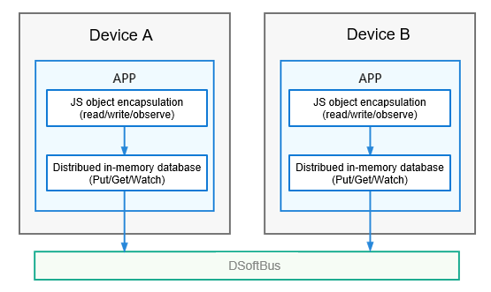

# Development Guide Writing Template

### Change History
| Change Description                                                                | Date        |
| ----------------------------------------------------------------------- | ------------ |
| The development guide is provided by kit, and therefore this template is updated accordingly.|  March 2024 |


> **NOTE**
>
> _1. This template provides the recommended development guide document framework and writing instructions for typical knowledge points. In your writing, complete the development task scenario analysis and development guide outline design based on the specific **solution/feature/function/module**, and then write the content based on this template._
>
> _2. Do not add any content between level-1 title (marked with #) and level-2 title (marked with ##)._
>
> _3. Delete all the writing instructions in italics from your formal documents._


**_[General Instructions for Writing the Development Guide]_**

_**1. Target audience**: internal and external developers (including product managers). Guidelines for UX designers are usually carried by UX design specifications and are not covered in the development guide. If UX design specifications need to be mentioned in the development guide, use hyperlinks._

_**2. Content positioning**: Introduce what the solution/feature/function/module is, why it is required, and how to design, develop, and release related applications/devices. The development guide aims to help developers learn necessary knowledge and achieve specified task objectives in actual development activities._

_**3. User-oriented**: Always provide developer-concerned, perceptible, and useful content from the perspective of developers._

_**4. Task-oriented**: Focus on actual tasks of developers, and provide complete, correct guidance that is easy to follow._

_**5. Reference purposes**: This template only provides the basic document framework. You can adjust the content based on the actual requirements._

_**6. Content that is open only to system applications**: For content that is open only to system applications, topic-level isolation is recommended in terms of concepts, principles, and development scenarios. In other words, use an independent .md file to carry the content, and append "(for System Applications Only) to the title._


## Introduction to *Example* Kit

_Mandatory. At the very beginning, describe the basic information about what the kit is, why the kit is needed, and when to use the kit, helping developers have a preliminary understanding of the kit._

_**[Developers' Concerns]**_

_What is the solution/feature/function/module (definition)?  What problems can it solve or what benefits can it bring (purpose/customer benefits - why)?_

_**[Key Writing Points]**_

- _Provide easy-to-understand and scenario-specific descriptions. Refer to the SCQA method below to introduce the scenarios and characteristics of the solution/feature/function/module._
  - _S: situation. Introduce a familiar scenario._
  - _C: complication. Describe the conflict between the situation and requirement._
  - _Q: question. Ask a question. What can I do in such a case?_
  - _A: answer. Describe the solution.

- _Visualize abstract concepts. You can provide content from the perspective of consumers for better understanding, for example, scenario effect in UX._

_**[Writing Requirements]**_

- _Provide clear content. Avoid vague, obscure, and ambiguous expressions._

- _Use only necessary terms, acronyms, abbreviations, and proper nouns, and provide explanations or links to the glossary._

- _Use consistent terms, acronyms, abbreviations, and proper nouns throughout the document._

***[Example]***

Form Kit provides an effective way of presenting information on the UI – service widget. A service widget (also called widget) is a set of UI components that display important information or operations specific to an application. It provides users with direct access to a desired application service, without the need to open the application first. A widget is usually displayed as part of the UI of another application (which can only be a system application, such as the home screen) and provides basic interactive features such as opening a UI page or sending a message.

### Available Capabilities

_Optional. Introduce the key open capabilities of the kit to support developers in model selection._

_**[Developers' Concerns]**_

_What key open capabilities does the kit provide?  _

_**[Key Writing Points]**_

- _Describe key open capabilities. There is no need to list all of them._

_**[Writing Requirements]**_

- _Provide clear content. Avoid vague, obscure, and ambiguous expressions._

- _Use only necessary terms, acronyms, abbreviations, and proper nouns, and provide explanations or links to the glossary._

- _Use consistent terms, acronyms, abbreviations, and proper nouns throughout the document._

***[Example]***

- Audio encoding: Audio applications (such as audio calling and audio recording applications) can send uncompressed audio data to the audio encoder for encoding. The applications can set parameters such as the encoding format, bit rate, and sampling rate to obtain compressed audio files in desired formats.
- Video encoding: Video applications (such as video calling and video recording applications) can send uncompressed video data to the video encoder for encoding. The applications can set parameters such as the encoding format, bit rate, and frame rate to obtain compressed video files in desired formats.

### Features

_Optional. Introduce the highlights and advantages of the kit compared with counterparts in the industry to support developers in model selection._

_**[Developers' Concerns]**_

_What are the advantages of this kit?  _

_**[Key Writing Points]**_

- _Provide attractive highlights and advantages, and avoid insubstantial advertising. If there is no obvious highlight, delete this section._

_**[Writing Requirements]**_

- _Provide clear content. Avoid vague, obscure, and ambiguous expressions._

- _Use only necessary terms, acronyms, abbreviations, and proper nouns, and provide explanations or links to the glossary._

- _Use consistent terms, acronyms, abbreviations, and proper nouns throughout the document._

***[Example]***

- Low-latency playback

  Unified low-latency and non-low-latency audio playback APIs are provided to achieve the lowest audio output latency on various hardware devices. For example, low-latency APIs can be used to implement fast and smooth audio playback in scenarios such as gaming, prompt/alarm tones, and Karaoke.

- Low-power playback

  In long-duration audio playback scenarios such as music playing and audiobook listening, a differentiated audio buffer processing mechanism is used for the screen-off scene. This helps audio playback consume less power by reducing the CPU wake-up frequency.

### Basic Concepts

_Optional. Describe the basic concepts that are common to all task scenarios._

_**[Developers' Concerns]**_

_What are the unique concepts that I need to know when using the solution/feature/function/module?_

_**[Key Writing Points]**_

- _Provide only the concepts that are mandatory in development tasks._

- _Describe here concepts used in multiple chapters such as the operation mechanism, restrictions, and development process. If a concept is used only in a chapter, describe the concept in that chapter only._

- _Do not describe common concepts in the industry. Use common terms in the industry instead of jargon._

- _If there are logical relationships between concepts, you are advised to use figures to describe the relationships._

_**[Writing Requirements]**_

- _Provide clear content. Avoid vague, obscure, and ambiguous expressions._

- _Use only necessary terms, acronyms, abbreviations, and proper nouns, and provide explanations or links to the glossary._

- _Use consistent terms, acronyms, abbreviations, and proper nouns throughout the document._

***[Example]***

Before developing relational databases, you must understand the following basic concepts:

- **RDB**
  
  A type of database based on the relational model of data. The RDB stores data in rows and columns. An RDB is also called RDB store.
  
- **Predicate**

  Property or feature of a data entity, or the relationship between data entities. It is mainly used to define operation conditions.

- **Result set**

  A set of query results used to access the data. You can access the required data in a result set in flexible modes.


### Working Principles

_Optional. Describe the working principles that are common to all task scenarios._

_**[Developers' Concerns]**_

_How does the solution/feature/function/module work? What are the API calling and triggering time of key steps? I want to understand its principles for better use and debugging._

_**[Key Writing Points]**_

- _If the principle is simple and can be understood from the content under "Basic Concepts", do not provide this section._

- _Describe only the mechanisms and principles that are visible in the development tasks (use or access). Do not provide internal implementation that is invisible to developers._

- _If necessary, use sequence diagrams and flowcharts. Ensure that the text description matches the figure description._

- _Be careful not to disclose internal information._

_**[Writing Requirements]**_

- _Provide clear content. Avoid vague, obscure, and ambiguous expressions._

- _Use only necessary terms, acronyms, abbreviations, and proper nouns, and provide explanations or links to the glossary._

- _Use consistent terms, acronyms, abbreviations, and proper nouns throughout the document._

***[Example]***

The distributed data objects are encapsulated into JS objects in distributed in-memory databases, which allows the distributed data objects to be operated in the same way as local variables. The system automatically implements cross-device data synchronization.

**Figure 1** Working mechanism



### Constraints

_Optional. Describe constraints that are common to all task scenarios._

_**[Developers' Concerns]**_

_What are the constraints for using the solution/feature/function/module? How well is the solution/feature/function/module implemented? Can it meet my requirements?_

_**[Key Writing Points]**_

- _Describe perceptible constraints that affect development activities, including but not limited to the following:_
  - _Function constraints_
     - _Application scope of the solution/feature/function/module (Specify scenarios that are not supported.)_
     - _Specification constraints_
  - _**Operation constraints**_
     - _Operations on known issues_
     - _Potentially risky operations (such as performance deterioration)_

- _Describe operations that are prone to errors in the procedure, but not in this section._

***[Example]***

- Data synchronization can be implemented across devices only for the applications with the same bundleName.

- Each distributed data object occupies 100 KB to 150 KB of memory. Therefore, you are advised not to create too many distributed data objects.

- The maximum size of a distributed data object is 500 KB.

### Relationship with Other Kits

_Optional. Some kits need to be used together with others or have similar or related scenarios. Specify the relationship between the kits here._

***[Example]***

Asset Store Kit provides secure storage of sensitive data less than 1 KB in size. To protect data greater than 1 KB, use HUKS or Crypto Framework.

### Samples

_Optional. Provide samples that are common to all task scenarios._

_**[Developers' Concerns]**_

_What sample code, codelabs, and demo projects are available?_

_**[Key Writing Points]**_

_Provide links (generally Gitee links) to the released sample code, codelabs, and demo projects. Do not include project packages into the document as an attachment._

***[Example]***

The following sample is provided to help you better understand how to develop abilities:

- [Intra-UIAbility and Inter-UIAbility Page Redirection (ArkTS)](https://gitee.com/openharmony/codelabs/tree/master/Ability/StageAbility)


## Setting Up the Environment

_Optional._

_Based on the analysis and breakdown of a specific task scenario, you can place the environment setup content under "Prerequisites" or "Preparations" and close to the "How to Develop" of the specific scenario._

_Specify how to prepare the development environment, including software and hardware configuration requirements, tool requirements, and device requirements._

_Delete this section if no special requirements are involved._


### Environment Requirements

_**[Writing Requirements]**_

_Describe the software and hardware configurations required by the development environment so that developers can prepare the environment in advance. You can use subtitles if there is a large amount of content._

***[Example]***

The following table describes the environment configuration requirements specific to the Hi3861 development board.

**Table 1** Hi3861 development environment-specific requirements

| Platform Type| Development Tool| Function| How to Obtain|
| -------- | -------- | -------- | -------- |
| Linux server| SCons3.0.4+ | Executes script compilation.| Internet|
| Linux server| build-essential | Provides a basic software package for compilation and building.| Internet|


### Setting Up the Environment

_**[Writing Requirements]**_

_Describe the procedure for setting up the development environment. If there is a large amount of content, use subtitles, for example, "Setting Up the Basic Build Environment" and "Setting Up the Compilation Tool Environment"._

***[Example]***

1. Start a Linux server.

2. Run the following command to install the tool installation package:
   
   ```
   xxxxx
   ```

3. Run the following command to check whether the tool is successfully installed.
   
   ```
   xxxxx
   ```


### Verifying the Environment

_**[Writing Requirements]**_

_Provide the criteria for checking whether the environment is set up successfully. You can also provide the criteria along with the environment setup procedure, as provided in the preceding example._


## *Example* Overview

_Optional._

- _If the task scenarios and relationships between scenarios of the kit solution/feature/function/module are not explicitly presented and it is inappropriate to provide the information in the topic "Introduce to *Example* Kit", use this topic to introduce the task scenarios (how they are divided) and describe the relationship between scenarios (when to select each scenario)._

- _If the task scenario is relatively simple, you can briefly describe it in "Introduce to *Example* Kit"._


## *Example Task Scenario* Development (Use a specific scenario name. If there is only one scenario, use the solution/feature/function/module name.)

_Mandatory._

_**[Developers' Concerns]**_

_How do I use or access the solution/feature/function/module?_

_**[Key Writing Points]**_

_Provide scenarios that are close to actual development scenarios._

- _Task scenarios are what developers need to use to achieve development objectives._

- _There can be one or more task scenarios. You can use multiple "Development Guidelines" sections. Follow the hierarchical logic when writing the guidelines, that is, a task scenario -> a subtask scenario -> task logic ("Development Process") -> operation procedure ("How to Develop")._

### *Example Task Scenario* Overview

_Optional._

_Describe the contents directly related to a task scenario. The knowledge points and key writing points are the same as those in "Introduce to *Example* Kit". In this section, you need to introduce this specific task scenario and describe basic concepts, working principles, constraints, and samples that are directly related to the task scenario. If there is nothing in common, delete it._

### Development Process

_**[Key Writing Points]**_

- _Optional. If there are many development steps (five or more core operations) or complex logical relationships between steps, provide the development process so that developers can have a panoramic view of the operations to be performed._

- _Provide flowcharts and tables if necessary._


### Available APIs

_**[Writing Requirements]**_

- _Optional. Describe the key APIs in the development steps and provide the API introduction, so that developers can have a general understanding of development._

- _If there are more than 10 APIs, provide the main APIs only._

- _Ensure that the APIs and their functions of the corresponding version are supported when the document is released._

***[Example]***

The following table lists the key notification interfaces. For details about the APIs, see the API Reference (provide the link to the corresponding API reference).

**Table 1** APIs for notification enabling

| API                                                      | Description            |
| ------------------------------------------------------------ | ---------------- |
| isNotificationEnabled(bundle: BundleOption, callback: AsyncCallback\<boolean>): void | Checks whether notification is enabled.|
| enableNotification(bundle: BundleOption, enable: boolean, callback: AsyncCallback\<void>): void | Sets whether to enable notification.    |


### How to Develop

_**[Writing Requirements]**_

_Mandatory._

- _Completeness and Correctness_
  - _Describe the complete development process (for example, steps related to the code, resources, third-party libraries, and application configuration files in the HAP) so that developers can correctly complete the development. Do not omit key configuration operations._
  - _Ensure that the code snippet provided in the document can be built with the context in DevEco Studio._
  - _Ensure that the complete sample code provided in the document can be run in DevEco Studio, and the execution result is the same as that described in the document._

- _Clarity_
  - _Provide a clear execution owner (who), operation purpose (why), operation content (what/how), and scenario (when/where) for each step. Use imperative sentence to describe steps._
  - _Clearly provide the APIs (if involved) in steps, as well as their usage description and sample code._
  - _Provide development suggestions or precautions for key steps and sample code (comments for sample code)._
       *Think about what questions may be raised when developers are performing the operations.* *These problems are obstacles to developers.* *Provide support information in the document to help them handle these obstacles.* *Examples of support information:*
     - *Branch selection principle. Provide principles or suggestions for selecting branches and parameters.*
     
     - *Necessary supplementary description. Describe possible special operations, required operation permissions, high efficiency skills, and concise and clear background knowledge.*
     
     - *Precautions. Describe operations that may adversely affect other functions or system performance and reliability, and operations that may cause data loss or security problems.* *Provide this type of information in a style different from that of the body prior to the operation procedure.*
     
     - *Error prevention/correction information. Provide guidance for preventing, locating, or rectifying typical problems that may occur in the development process.* *This type of information can be provided in "How to Develop" or "FAQs", depending on the content amount.*

- _Standardization_
  - _Provide both logically and syntactically correct sample code and write it in a standard manner. Anonymize sensitive information, such as mobile numbers, ID cards, and account names, for example, 186\*\*\*\*\*\*\*\*. Use private IP addresses or a corresponding format, for example, xx.xx.xx.xx and www.example.com, rather than real IP addresses and domain names._
  - _Provide code that complies with the code indentation requirements. Do not use the Tab key to indent code. Instead, use four spaces, to avoid incorrect display._

**[Example (Excerpt)]**

1. Import the required modules.

   ```javascript
   import formBindingData from '@ohos.application.formBindingData'
   import formInfo from '@ohos.application.formInfo'
   import formProvider from '@ohos.application.formProvider'
   ```
   
2. Implement the lifecycle callbacks of **LifecycleForm**.

   ```javascript
   export default {
       onCreate(want) {
           console.log('FormAbility onCreate');
           // Persistently store widget information for subsequent use, such as widget instance retrieval or update.
           let obj = {
               "title": "titleOnCreate",
               "detail": "detailOnCreate"
           };
           let formData = formBindingData.createFormBindingData(obj);
           return formData;
       },
       onCastToNormal(formId) {
           // Called when the widget host converts the temporary widget into a normal one. The widget provider should do something to respond to the conversion.
           console.log('FormAbility onCastToNormal');
       },
   }
   ```


### Verification

_**[Writing Requirements]**_

- _Optional. After the development is complete, provide a guide to check whether the operation is successful if there is an independent commissioning and verification operation. The operation procedure is the same as that described in "How to Develop."_

- _Provide only the final service commissioning. You are advised to verify the operation result of each subtask after the development is complete._


## FAQs

_Optional._

_**[Developers' Concerns]**_

_What are the typical problems that may occur in the development process of the solution/feature/function/module? How do I locate and solve these problems?_

_**[Key Writing Points]**_

_Describe the problems that may occur during the development and the solutions to them._

- _Delete this section if there are no common problems._

- _It is recommended that common problems in each task scenario be described in a separate chapter. Common problems related to a single task scenario be described in the corresponding chapter._


### 1. XX problem (simple problem)

XXX


### 2. XX problem (complex problem)

**Symptom**

XXX

**Possible Causes**

XXX

**Solution**

XXX
