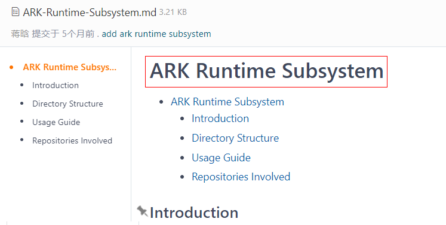
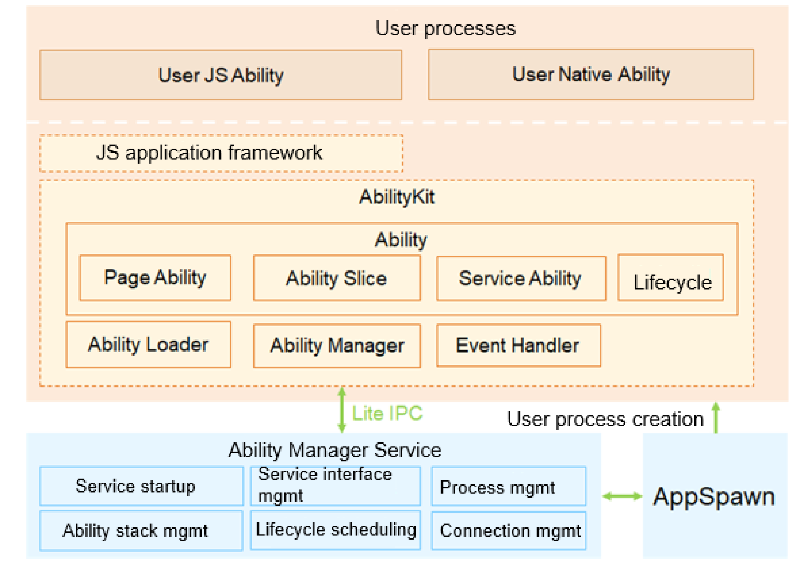

# ***ExampleName*** Subsystem/Part


[Title Description] Use **Subsystem** or **Part** based on the Readme file type.





## Introduction


[Writing Instructions] **Mandatory**. The following contents must be included:

**Overall introduction.** Describe the subsystem from the following aspects: background (role in the entire OpenHarmony architecture), functions, use cases, and supported devices.

**Architecture diagram.** Provide an architecture diagram and explain the main components in the architecture.

**If this document is about a part, which is part of a subsystem, and related concepts of the subsystem can help understand the part, you are advised to include the following information:**

**For more concepts related to the ***exampleName*** subsystem, see ***exampleName***. (Provide the link to the subsystem readme.)**


The precautions for writing are as follows:


| Item| Requirement|
| -------- | -------- |
| **A.1** | **Content**|
| A.1.1 | Style: Use formal language and avoid colloquial language.|
| A.1.2 | Compliance: Do not use terms that have compliance and legal risks, such as concepts specific to third-party intellectual property rights.|
| A.1.3 | Concise: Provide only necessary and minimum information to instruct developers to complete operations as soon as possible.|
| A.1.4 | Correct: The code and parameters in the Readme file must be consistent with the actual product information.|
| A.1.5 | Accurate: Use accurate rather than ambiguous description.|
| A.1.6 | Consistent: Words and concepts in the Readme file must be used consistently across the file and compliant with the glossary. The full name of an acronym or abbreviation must be provided when it appears for the first time in the file.|
| A.1.7 | Specific: Use specific words. For example, when indicating the quantity or degree, do not use "more" or "less". Use specific numbers instead.|
| **A.2** | **Format**|
| A.2.1 | Use punctuation correctly. End a sentence with punctuation.|
| A.2.2 | Present the content clearly, for example, by using bullets or categories. Do not include a single bullet or extra empty lines.|
| A.2.3 | Do not add a space between an English word and Chinese word.|
| A.2.4 | Use valid and specific links that provide direct redirection or download. It is recommended that relative links in Gitee instead of absolute links be used.|
| A.2.5 | For auxiliary description, use the "Note" format. For declaration in advance, use the "Notice" format.|
| **A.3** | **Tables**|
| A.3.1 | Include a caption for each table. Use nouns or noun phrases in the caption.|
| A.3.2 | Include a header for each table. Ensure that a table contains at least two rows and two columns.|
| A.3.3 | If there is no content in a table cell, use an underscore (_) in the cell, rather than leaving it blank.|
| **A.4** | **Figures**|
| A.4.1 | Do not include figures of religious beliefs.|
| A.4.2 | Include a caption for each figure. Use nouns or noun phrases in the caption.|
| A.4.3 | Figures must be clear, legible, complete, and easy to read. For example, a flowchart must contain "Start" and "End".|
| A.4.4 | Each figure must have clear logic and be provided with relevant text descriptions.|
| A.4.5 | It is recommended that each figure, in .png format, have the size less than or equal to 150 KB, the height about 640 px, and the width less than or equal to 820 px.|
| A.4.6 | Try not to include text in figures. If text is required, make sure the text language is consistent with your file's language.|


The following shows an architecture diagram. Pay attention to the **color and format requirements**.

**Figure 1** Subsystem architecture



## Directory Structure

[Writing Instructions] **Mandatory**. Describe the code directory structure of the project repository and function description of the corresponding directory.

```undefined
/foundation/ace
├── frameworks         # Framework code
│   └── lite
│       ├── examples # Sample code
│       ├── include # Exposed header files
│       ├── packages # JS implementation
│       ├── src       # Source code
│       ├── targets # Configuration file of each target device
│       └── tools # Tool code
├── interfaces         # APIs exposed externally
│   └── innerkits     # Header files for internal subsystems
│       └── builtin   # Third-party module APIs provided by the JS application framework
```


## Constraints

[Writing Instructions] **Optional**. Include the conditions for project running, for example, a specific programming language or a specific operating system with a given version.

| Item| Requirement|
| -------- | -------- |
| D.1.1 | Clearly specify the function limitations or operation restrictions.|
| D.1.2 | Describe only constraints that affect task development or user experience.|
| D.1.3 | Describe operations that are prone to errors in the procedure, but not in this section.|


## Compilation and Building

[Writing Instructions] **Optional**. This section is not required for a subsystem Readme file. Include this section in a part Readme file based on the actual conditions.


## Usage


### Available APIs

[Writing Instructions] **Optional**. Describe the APIs related to the development guide so that developers can have a general understanding of the APIs before development. **This section is not required for a subsystem Readme file.** Determine whether this section is required for a part Readme file based on the actual conditions. If the corresponding API reference is available, you do not need to include this section. The precautions for writing are as follows:

| Item| Requirement|
| -------- | -------- |
| J.1.1 | Include only APIs relevant to the development task.|
| J.1.2 | Provide only main APIs if there are too many APIs.|


### How to Use

[Writing Instructions] **Optional**. Provide a concept introduction for a subsystem Readme file and function introduction for a part Readme file. If the corresponding development guide is available, you can provide a link, rather than details here.

The table below describes the writing requirements. After finishing the writing, check your content against these requirements one by one.

| Item| Requirement|
| -------- | -------- |
| **F.1** | **Writing a Development Procedure**|
| F.1.1 | Complete: Provide all mandatory steps.|
| F.1.2 | Clear: The logic of the writing must be clear and reasonable. The overview, preparations, and operations in the document must be described by following certain logic, and the chapters should not be broken or contradictory.|
| F.1.3 | Sentence pattern for tasks: Use verbs + nouns to describe actions in titles or sentences.|
| F.1.4 | Prevention in advance: If the operation involves restrictions, errors, or potential risks, describe them in advance.|
| F.1.5 | Clear steps-1: Describe the purpose of each step, no matter whether it is simple or not.|
| F.1.6 | Clear steps-2: Specify the environment, tools, operations, and how-to.|
| F.1.7 | If an operation is optional, specify the conditions in which the operation is required.|
| F.1.8 | After the development procedure is complete, specify the expected results.|
| **F.2** | **Writing a Code Segment**|
| F.2.1 | If a code segment involves commands to be copied by developers, display the commands in editable mode, instead of using screenshots. Use code snippets to wrap the commands.|
| F.2.2 | Provide comments for key sections and key steps in the code.|
| F.2.3 | The code display meets the code indentation requirements.|
| F.2.4 | If an API call is involved in a step, provide the API and its usage description or sample code. The code should come from specific instances.|


## Repositories Involved

[Writing Instructions] **Mandatory**. List the links of all related repositories of the subsystem where the current repository is located and mark the current repository in bold.

Example:

[Kernel](../../readme/kernel.md)

[drivers\_liteos](https://gitee.com/openharmony/drivers_liteos/blob/master/README.md)

**kernel\_liteos\_a**