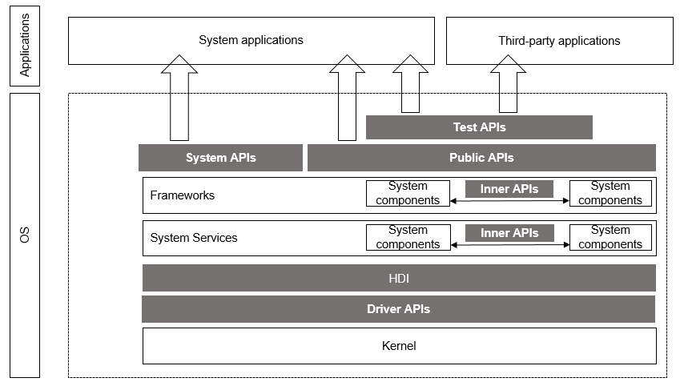
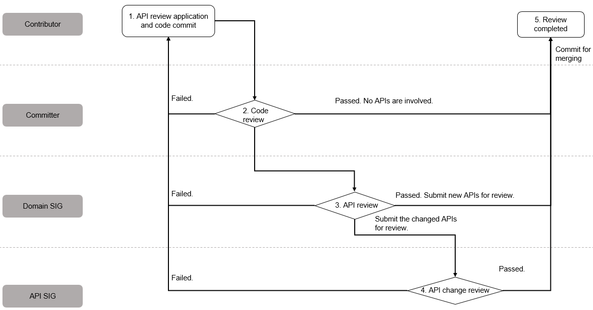
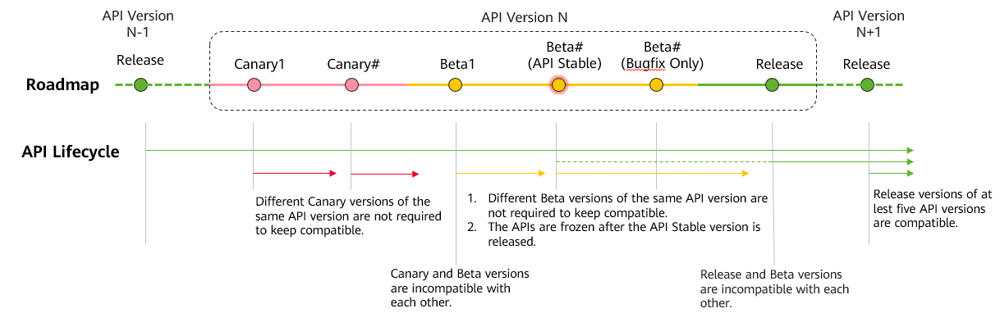

# OpenHarmony API Governance Charter

## Introduction

To help the OpenHarmony ecosystem develop and evolve in a healthy and orderly way, this Charter defines the governance process and lifecycle (create, change, deprecate, and delete) of OpenHarmony APIs. It also specifies basic design requirements of OpenHarmony APIs.

This Charter is formulated by the [API SIG](https://www.openharmony.cn/SIG/api/) and approved by the [PMC](https://www.openharmony.cn/pmc) for release. Any revision to this Charter will be released only after being reviewed by the API SIG and approved by the PMC.

## Overview

### Scope and Definition

The OpenHarmony software stack contains multiple roles. Naturally, OpenHarmony APIs have multiple types.

Different types of APIs have different compatibility requirements, as described in the table below.

| Type| Prepared By| Used By| Compatibility Requirement| Guarding Method|
|---|---|---|---|---|
| Public API | System and framework| All application developers| 5 API versions| X test suite (XTS)|
| Test API | Test framework | All application developers| 3 API versions| To be built|
| System API |  System and framework|System application developers|Not guaranteed| To be built|
| HDI | HDF| System services| 4 API versions| X test suite (XTS)|
| Driver API | HDF | Driver developers| Not guaranteed| None|
| Inner API | System parts| System parts| Not guaranteed| None|

The APIs are described as follows:

* Public API: APIs provided for all application developers.
* Test API: APIs used for testing. They can be used only in the test phase.
* System API: APIs provided for privileged system applications. Common applications cannot use these APIs.
* HDI: APIs that describe hardware capabilities.
* Driver API: APIs provided for driver developers.
* Inner API: APIs to implement mutual calling between the system service and framework. They are used only inside the system and do not guarantee compatibility.

### APIs and Programming Languages

OpenHarmony aims to build a next-generation Operating System (OS) for the Internet of Everything (IoE) era. The following programming languages and more can be used:

* C/C++
* JavaScript
* TypeScript
* ArkTS

The content described in this Charter is irrelevant to the programming language in use. Regardless of the programming language, APIs must comply with this Charter while meeting the programming language requirements.

## API Governance

### Roles and Responsibilities

|**Role**|**Responsibilities in API Governance**|
| - | - |
|Contributor|Commit API code and design documents.|
|Committer|Review the code and submit a pre-review comment on an API commit.|
|Domain SIG| Comment on the commits of new API code, so the passed commits can be merged. Provide pre-review comments on updated API code.|
|API SIG|Comment on updated API code.|
|PMC|Release API version plans. Review amendments of this Charter, revise the terms, and publish this Charter.|

### API Review Process
The API review process is as follows:

The main process is as follows:

1. Initiate API review and commit code (contributor). If any APIs are added or modified, the contributor must additionally submit an API review application to specify the API requirement source, usage scenario, permission design, and privacy protection design. For details, see "API Review Application Composites" below. To avoid rework, the contributor can send an email to submit the API design document to the committer, domain SIG, and API SIG for pre-review before the formal API review application and code commit.
1. Review code (committer). After the code review is approved, the committer should submit the APIs to the domain SIG. If the API code involves multiple domains, they should be submitted to the committers of the corresponding domains. The next review step can be performed only after all committers review and approve the code.
1. Review APIs (domain SIG). The code of new APIs can be merged only after being reviewed and approved by the domain SIG. If there are changes to existing APIs, the domain SIG should submit them to the API SIG. If the new APIs involve multiple domains, they should be submitted to the SIGs of the corresponding domains. The code can be merged after being reviewed and approved by one of the domain SIGs. If the changed APIs involve multiple domains, they should be submitted to the SIGs of the corresponding domains. The next review step can be performed only after all domain SIGs approve the APIs.
1. Review API changes (owner: API SIG): The code of changed APIs can be merged only after being reviewed and approved by the API SIG.
1. The review is complete.

### API Review Application Composites

If an API is added or changed, the corresponding API review application must be submitted. For details on the application template, see [API Review Template](API-Review-Template.md).

For new APIs, you must:
1. (Mandatory) Describe the requirement source and usage scenario.
1. (Mandatory) Analyze the API as-is and gaps, and describe the necessity of adding or changing APIs.
1. (Mandatory) Describe the API prototype design and usage. (Optional) When necessary, add use examples.
1. (Mandatory) Provide the API permission design.
1. (Mandatory) Clarify the API privacy protection solution and requirements fulfillment.
1. (Mandatory) Submit the corresponding API reference when committing the code. (Optional) When necessary, submit the corresponding developer guide.
1. (Optional) Describe the compatibility, performance, power consumption, reliability, and tests. (If "API Design Requirements" of this Charter are not met, the description must be included.)

For changed APIs, except the preceding operations, you must:
1. (Mandatory) Describe how earlier APIs are handled (deprecated, hidden, or permanently deleted) and compatibility measures for developing applications using old SDKs.
2. (Mandatory) Describe the change impact, substitute APIs, and corresponding application adaptation solution.
3. (Mandatory) Update the ChangeLog file. Update the API-diff file (Mandatory if JS or native API changes are involved.)

## API Lifecycle and Compatibility Requirements

OpenHarmony APIs will evolve in the form of API versions. Each version goes through the release period shown in the following figure,

which also demonstrates the compatibility requirements for the APIs in different periods.

   1. Canary version: API Preview version released at an earlier date, which cannot ensure API stability.
       1. Canary versions are compatible with the previous Release version.
       1. Different Canary versions of the same API version are not required to keep compatible.
   1. Beta version: publicly released beta version, which cannot ensure API stability.
       1. Canary versions are compatible with the previous Release version.
       1. Beta versions are not compatible with the early Canary versions of the same API version.
       1. Different Beta versions of the same API version are not required to keep compatible.
       1. The APIs are frozen after the API Stable version is released. API additions or changes are not allowed for later Beta versions.
   1. Release version: official API release version.
       Released APIs must comply with the contractual commitments made to developers. In principle, incompatible changes cannot be made on released APIs, and deprecation of released APIs is restricted. The basic requirements for deprecating released APIs are as follows:
       1. Add the @deprecated annotation.
       1. Provide substitute APIs.
       1. Retain the deprecated APIs in at least five API versions released since the deprecation.

### API Design Specifications

For details, see [OpenHarmony API Design Specifications](OpenHarmony-API-quality.md).
